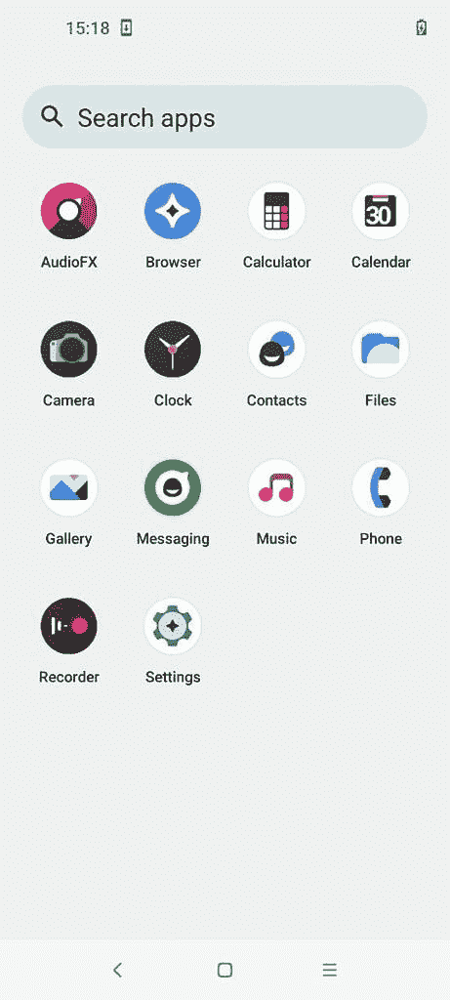

# LineageOS 在 19.1 正式发布前增加了新的壁纸和图标

> 原文：<https://www.xda-developers.com/lineageos-19-1-new-wallpapers-icons/>

LineageOS 背后的团队正在努力工作，以 Android 12L 为基础，将他们的版本提升到 19.1。虽然正式发布和宣布还有一段时间，但 ROM 团队正在准备正式发布中需要的其他东西。这些包括新的壁纸和图标，在完整版推出之前，你已经可以利用这些壁纸了。

正如在 LineageOS Gerrit 上看到的，LineageOS 19.1 将会有新的壁纸。这些壁纸是由 Asher Simonds 设计的，用于 ROM 中。你可以先睹为快，这是由 XDA 知名开发商 [npjohnson](https://forum.xda-developers.com/m/npjohnson.5848265/) 分享的。

如果你想下载任何特定的壁纸，只需点击下面的 Gerrit 链接，向下滚动到相关文件，点击打开，并保存在你的设备上。或者，你也可以安装一个新构建的非官方 LineageOS 19.1，并打开设备上的壁纸拾取器，将其设置为你的壁纸。

LineageOS 19.1 还为系统应用程序提供了新的图标，现在使用矢量绘图而不是 png。如果你安装一个新的非官方的 LineageOS 19.1 版本，你可以看到它。

 <picture></picture> 

Screenshot by XDA Recognized Contributor [AndyYan](https://forum.xda-developers.com/t/gsi-12-lineageos-19-x-gsi-a64b-64b.4358041/page-9#post-86719459)

LineageOS 是 Android 最受欢迎的定制 ROM，继承了 CyanogenMod 和之前其他产品的遗产。公开发布的最新正式版 ROM 仍然是基于 Android 11 的 LineageOS 18.1。但是随着 Android 12 和 Android 12L 的推出，ROM 将很快升级到基于 Android 12L 的 19.1。为了实现这一目标，该团队已经宣布[淘汰 LineageOS 17.1](https://www.xda-developers.com/lineageos-17-support-dropped/) 。

你问，官方 LineageOS 19.1 什么时候到？请继续关注，不要向开发者询问预计到达时间。如果你不耐烦，你总是可以安装一个非官方的版本，或者更好，为你的设备自己构建。

***来源:**linegeos Gerrit([1](https://review.lineageos.org/c/LineageOS/android_packages_apps_Backgrounds/+/328436))， [2](https://review.lineageos.org/q/topic:twelve-new-icons) ， [Asher Simonds](https://www.ashersimonds.com/)*