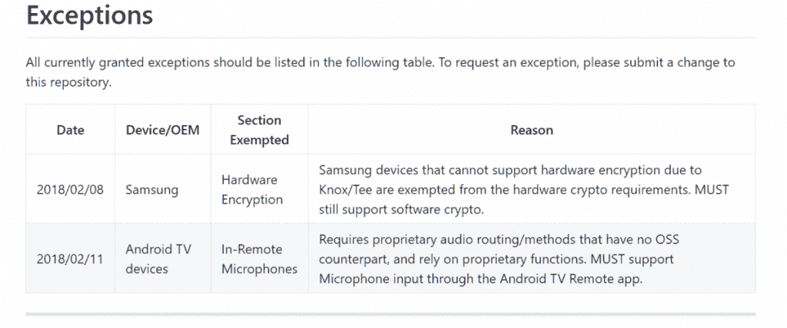
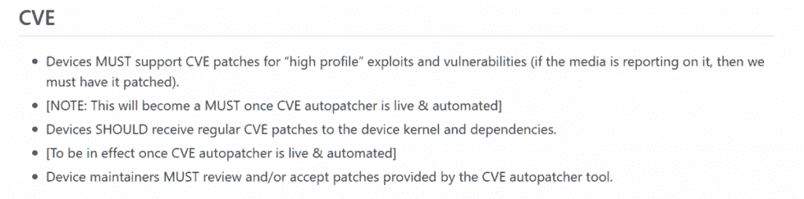

# LineageOS 正在引入“设备支持要求”章程，以使其版本标准化

> 原文：<https://www.xda-developers.com/lineageos-device-support-requirements-charter/>

自从 Cyngn 拆除了围绕 CyanogenMod 的所有基础设施(显然[将重点转向了自动驾驶汽车](https://www.xda-developers.com/cyngn-focus-self-driving-car-technology/))，社区团结在它的继任者 LineageOS 的身后。这个项目是[一岁多一点的](https://www.xda-developers.com/happy-birthday-to-lineageos/)，正在被全球超过 170 万用户使用。它从 CyanogenMod 的灰烬中成长起来，有效地取代了社区心中的旧项目。随着团队[越来越接近](https://www.xda-developers.com/lineageos-changelog-december-news/)正式发布其基于 Android Oreo 的 ROM，他们似乎一直在幕后工作:一个**设备支持需求宪章**。

从 Android Oreo 开始，**列举了设备必须满足的要求，才能被视为 LineageOS 版本的出货准备就绪为了建造线性地质 15。为了被认为是“正式的”，维护者必须确保他们的构建满足**设备支持需求章程中列出的所有**需求。**

该章程相当冗长，包括了从确保基本硬件功能(如 Wi-Fi、蓝牙、GPS、摄像头、NFC 等)的要求。)操作以枚举特定的软件需求(例如确保 SELinux 被设置为 Enforcing，rom 在默认情况下不应该与 su 一起提供，等等)。)文件中列出了一些例外，随着章程的敲定，可能会有更多例外。

 <picture></picture> 

Current List of Exceptions

甚至有一部分是针对生活质量需求的，比如要求维护一个设备 wiki 页面，指导用户如何安装 ROM，使用哪个自定义恢复，以及要求维护人员使用 JIRA 进行错误跟踪和跨团队协作。

最重要的是，章程规定官方 LineageOS 构建必须包括所有“高调”利用和漏洞的补丁。这包括像[蓝魔](https://www.xda-developers.com/bluetooth-vulnerability-blueborne-impacts-android-ios-windows-and-linux-devices/)、[克拉克](https://www.xda-developers.com/wpa2-wifi-protocol-vulnerability-krack/)和[幽灵/熔毁](https://www.xda-developers.com/android-security-bulletin-january-2018-ota-factory-images/)这样的东西的补丁。众所周知，LOS 不会延迟发布这类漏洞的补丁，但很高兴看到用户安全是团队的重中之重。

 <picture></picture> 

Current Requirements for Patching Exploits and Vulnerabilities

本文档将是确保 LineageOS 体验在所有官方支持的设备上保持一致的绝佳方式。如果你看到 LineageOS 15 的建造。x 在我们的论坛上标有“官方”字样，那么您可以放心，它符合章程中规定的所有要求。

[**查看 LineageOS 设备支持需求章程**](https://github.com/LineageOS/charter/blob/master/device-support-requirements.md)

我们不能不注意到这个章程和谷歌兼容性定义文件(CDD)之间的相似性，至少在精神上是如此。谷歌的 CDD 概述了设备制造商的软件必须遵守的要求，以便他们的设备通过兼容性测试套件(CTS)，从而被允许与 Google Play 应用和服务一起发布。虽然这个宪章不像 CDD 那样广阔，但这个想法仍然存在。

现在，请记住，这份文件刚刚公开，所以将来可能会有进一步的修改。当 LineageOS 正式宣布该章程时，我们肯定会了解更多信息，因此我们建议您通过其所有官方渠道关注该项目。

最后，如果你是 LineageOS 及其志愿者维护人员在业余时间所做的所有工作的忠实粉丝，那么考虑向该项目捐款。