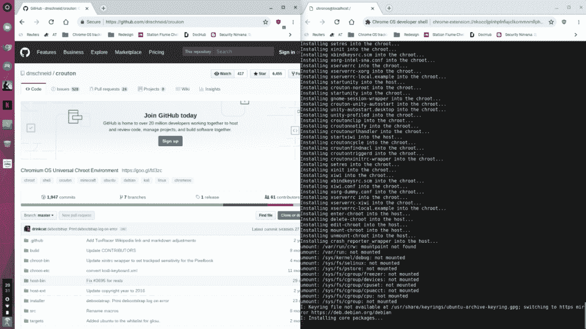
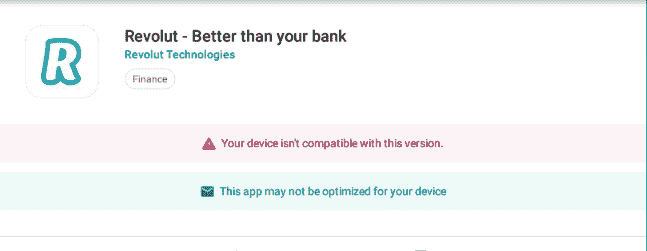
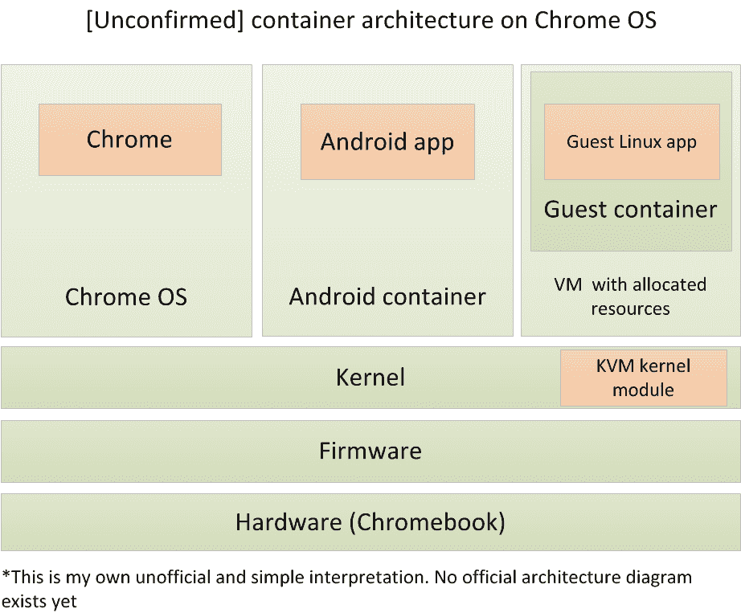

# Chrome 操作系统上的 Linux 应用程序——自 Android 应用程序以来最大的功能概述

> 原文：<https://www.xda-developers.com/linux-apps-chrome-os-overview-crostini/>

以下是你需要知道的关于谷歌在 Chrome OS 中秘密开发 Linux 应用功能长达一年的所有信息，也被称为 Crostini 项目。

简而言之，这是一种在 Chrome OS 上运行常规 Linux 应用程序的方式，而不会损害安全性或启用开发人员模式。(尚不可用)[官方设置声明](https://chromium-review.googlesource.com/c/chromium/src/+/1013957)它是为了“在你的 Chromebook 上运行 Linux 工具、编辑器和 ide。”

Crostini 是数年开发的高潮，它使功能运行足够安全，以满足 Chrome OS 的高安全性标准。要理解为什么它只是刚刚出现，最好看看之前发生了什么。

## 将克罗斯蒂尼放在背景中 Chrome 操作系统的黑暗时代

在 Android 应用出现之前，离线功能并不多，更不用说 Chrome 操作系统中有用的生产力应用了。为什么正常人会买 Chromebook？“这只是一个网络浏览器，”这是每篇 Chromebook 评论的结束语。Chrome 网络商店是你能得到的最多的，但是应用程序的选择非常少，而且很少更新。喜欢冒险的人可以尝试使用名为[弧焊机](https://www.xda-developers.com/new-app-runs-android-apps-in-chrome/)的工具来运行 Android 应用程序，但这是漫无目的的，性能也很差。

为了绕过离线限制，沮丧的用户要么删除 Chrome 操作系统并安装 Linux，要么使用开源工具 [Crouton](https://github.com/dnschneid/crouton) 在 Chrome 操作系统内核上建立一个同步桌面环境(例如 Ubuntu Unity)。

 <picture></picture> 

Installing Crouton, an open-source toolkit, previously the de-facto way to access Linux apps on Chrome OS, soon to be deprecated

运行一个替代的 GNU/Linux 发行版或 Crouton 需要相当多的专业知识，而且经常漏洞百出——而且这两个选项都不是特别用户友好或安全。按下错误的键，你将擦除你的设备或砖它，如果你离开你的油炸面包丁环境未加密，任何客人用户可以访问它。

## 安卓应用集成，开创先例

Android 应用于 2016 年登陆 Chrome OS，是离线功能的一次巨大飞跃，但实现这一功能不仅仅是即插即用。它能在重视安全性的操作系统上工作的唯一方式是有效地沙箱化。

Chrome OS 开发人员选择的新颖解决方案是[容器化](https://en.wikipedia.org/wiki/Operating-system-level_virtualization)，这是一种将应用程序捆绑成独立的可执行包的方式。通过使用一个容器和一些调整，他们设法让完整的 Android 环境及其所有依赖项在一个容器中运行，与 Chrome OS 的其余部分分离，但运行在同一个内核上。

但 Android 应用程序通常不会考虑台式机/笔记本电脑的外形。再加上 Chrome 操作系统上糟糕的触摸体验，如果应用程序还能工作的话，你会感到沮丧。

 <picture></picture> 

Headaches with compatibility—Android apps on Chrome OS

虽然 Android 应用程序帮助弥合了迄今为止的生产力差距，但人们仍然渴望完整的桌面应用程序的庞大库。与最初的 Android 问题一样，简单地开放运行 Linux 应用程序的能力会增加 Chrome OS 的攻击面，因为恶意应用程序可以访问主机 OS 上的所有内容。所以这一次，开发人员在他们已经从 Android 中学到的基础上，设计了尽可能孤立的 Linux 应用功能。

## 纵深防御

顾名思义，Crostini 就像油炸面包丁，但它不是在 Chrome OS 旁边有一个不安全的用户空间，而是在它们之间有两堵墙。第一堵墙是 Termina VM，一个 Chrome OS KVM(基于内核的虚拟机)实现。一旦虚拟机启动，它就会竖起第二堵墙——一个容器——里面有你真正想要运行的应用程序。因此，当你想运行你的全面的 Klondike 桌面应用程序时，它运行在一个虚拟机内部的容器中。

开发者并没有从非技术的角度把面向公众的文档做得特别容易消化，但是从我非官方的外行人的阅读来看，现在 Chrome OS 的软件架构大概是这样的[注:全部是我自己的作品，肯定不是 Chrome OS 团队的官方文档，大概完全不真实，请不要伤害我]:

 <picture></picture> 

What we think Crostini architecture looks like. Not an official document.

简而言之，VM 组件拥有独立的用户空间和虚拟设备(vCPU、IP、MAC 等。)，容器是利用这些资源的打包应用程序。在这一点上，我应该添加一个警告，VM 组件**实际上并不模拟任何硬件**。

## 仅限富人……目前

一些社区，比如 Reddit 的 [/r/Crostini](https://www.reddit.com/r/crostini) 社区，已经开始在他们的 [Google Pixelbooks](https://www.xda-developers.com/high-end-google-pixelbook-launch/) 上修补 Crostini。不幸的是， **Pixelbook 是目前为止唯一具有 Crostini 功能的设备**，但迹象表明其他设备，甚至是具有 ARM 片上系统的设备，在未来都将获得支持。但是也许对于 32 位机器来说[还不是时候](https://chromium.googlesource.com/chromiumos/platform/crosvm/+/2ffa0cbe5bb41beea81fd2d14a7f781747bb955e)。也有迹象表明，运行 Crostini [所需的 VM 功能的某些部分对于使用旧内核版本](https://www.reddit.com/r/chromeos/comments/86d3ap/judging_from_a_commit_from_last_september_only/)的设备是不可用的。

如果您已经走了这么远，您可能想知道:我能运行什么？成功是有限的。Chrome 开发者暗示他们有 Visual Studio 运行。Reddit 用户已经让 WINE 和 Android Studio 正常工作，ChromeUnboxed 做了一个方便的视频演示。但在谷歌真正展示某些东西之前，我们可能不会知道全部的功能和局限性。我们所知道的是**应用是持久的**，这意味着你可以从你停止的地方继续，开发者正在努力让它们出现在你最近的应用列表中。

## 接下来呢？有几点需要考虑

如果你在 Chromebook 而不是 Pixelbook 上的开发者频道，终端应用可能已经到了你的 Chromebook 上。您可能会看到“未能启动礼宾”错误。这是因为除了 Pixelbook 之外，虚拟机功能尚未在其他设备上启用。

我们还不知道资源是如何分配的，以及这些嵌套的应用程序会产生什么样的开销。在兼容 Linux 的 Steam 游戏上玩游戏的想法很吸引人，但如果 GPU 加速不可用，就目前而言，这是行不通的。

我们不知道主机/集装箱气隙会产生什么限制(如果有的话)。容器和 Chrome OS 之间的通信是受控的，那么这会引入延迟甚至禁用一些外设吗？

我们有许多没有答案的问题，这只是一个时间问题，直到全部被揭露。许多人相信几周后的 Google I/O 2018 将会是一次大的展示——这是一次开发者大会。同时，请继续关注我们对克罗斯蒂尼的追踪。

* * *

来源:

[林——Chrome 操作系统容器](https://youtu.be/aPDchQdhdTs)

铬 Git - [弧形容器束](https://chromium.googlesource.com/chromiumos/platform2/+/master/arc/container-bundle/)、 [vm_tools](https://chromium.googlesource.com/chromiumos/platform2/+/HEAD/vm_tools) 、 [project-termina](https://chromium.googlesource.com/chromiumos/overlays/board-overlays/+/master/project-termina/) 、 [crosvm](https://chromium.googlesource.com/chromiumos/platform/crosvm/)