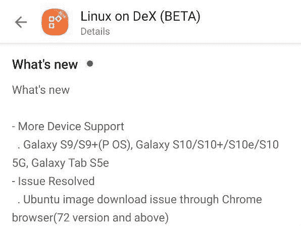

# DeX 上的 Linux 现在支持 Galaxy S9、Galaxy Tab S5e 和 Galaxy Note 8，并暗示即将支持 Galaxy Tab S5

> 原文：<https://www.xda-developers.com/linux-on-dex-galaxy-s9-galaxy-tab-s5e-galaxy-note-8-galaxy-tab-s5/>

三星 DeX 将旗舰三星 Galaxy 智能手机和平板电脑转变为便携式电脑。在其第一次迭代中，[与 Galaxy S8 一起发布了](https://www.xda-developers.com/a-look-at-galaxy-s8-and-s8-software/)，DeX 需要 DeX 站形式的专用硬件。有了 Galaxy Note 9 和 Galaxy Tab S4，DeX 不再需要特殊的坞站，而是使用支持的 USB Type-C 到 HDMI 加密狗。([无坞 DeX](https://www.xda-developers.com/samsung-galaxy-s9-dockless-dex-android-pie-beta/) 后来通过 [One UI/Android Pie](https://www.xda-developers.com/samsung-one-ui-review-android-pie-galaxy-s9-galaxy-note-9/) 更新进入了 Galaxy S9、Galaxy Note 8 和 Galaxy S8。)三星在支持的设备上改进 DeX 方面做得很好，但三星 DeX 最好的功能之一——DeX 上的 Linux 只在 Galaxy Note 9 和 Galaxy Tab S4 上得到官方支持。现在，最新的 Linux on DeX beta 更新正式增加了对 Galaxy S9/S9+、Galaxy S10/S10+/S10e/S10 5G、Galaxy Tab S5e 的支持。

 <picture></picture> 

Linux on DeX 1.0.51 changelog from Google Play.

虽然变更日志提到增加对三星 Galaxy S10、Galaxy S10+、Galaxy S10e 和 5G Galaxy S10 的支持，但据我所知，只要你侧加载应用程序，这些设备就可以在 DeX 上使用 Linux。Reddit 上的用户也报告说，在 Galaxy Note 8 上侧装最新版本是可行的，这在该应用的早期版本上是不可能的。

## 支持三星 Galaxy Note 8 和...Galaxy Tab S5？

为了确认 Linux on DeX 支持哪些设备，我们检查了 APK。最新版本列出了以下兼容设备:

*   “皇冠”——三星 Galaxy Note 9
*   “GTS 4”——三星 Galaxy Tab S4 和 Galaxy Tab S5e(这没有弄错，Tab S5e 的代号是“gts4lv”)
*   “gt a5”——[未发布的三星 galaxy tab s5](https://www.xda-developers.com/samsung-galaxy-tab-s5-snapdragon-855-leak/)
*   “明星”——三星 Galaxy S9 和 Galaxy S9+
*   “超越”——三星 Galaxy S10、Galaxy S10e、Galaxy S10+和 5G Galaxy S10
*   “赢家”——三星 Galaxy Fold
*   “太棒了”——三星 Galaxy Note 8

请注意，该方法只检查设备的代码名称以什么开头，这意味着 Exynos 和骁龙型号都包括在内。遗憾的是，三星 Galaxy S8 不在这个名单上。由于 Galaxy Note 8 包含在这里，这意味着它得到了官方支持，尽管它没有被列入白名单，无法从 Google Play 下载该应用程序。如果你有一台 Galaxy Note 8，并且想在 DeX 上使用 Linux，你需要从 [APKMirror](https://www.apkmirror.com/apk/samsung-electronics-co-ltd/linux-on-dex-beta/linux-on-dex-beta-1-0-51-release/linux-on-dex-beta-1-0-51-android-apk-download/) 下载 1.0.51 版本。

DeX 上的 Linux 是一个很好的特性，让三星在竞争中占了上风。尽管三星尚未像华为在 Easy Projection 上那样实现无线 DeX，但 DeX 上的 Linux 提供的功能远远超过 Easy Projection。Linux on DeX 可以让你在运行 Android 的同时运行一个完整的 GNU/Linux 发行版(一个为 ARM64 编译的修改版 Ubuntu 16.04)。必须编译包，ARM64 才能工作。不过，它是面向开发人员而不是普通消费者的，所以这些限制是可以接受的。

三星表示，你需要至少 15GB 的存储空间和 4GB 的内存才能在 DeX 上运行 Linux，但鉴于 Galaxy Tab S4 支持它，你还需要一台至少装有高通骁龙 835 或同等产品的设备。根据我们在 Galaxy Note 9 上使用 Linux 的经验，DeX 上的 Linux 工作得相当好，尽管它确实将硬件推到了极限。由于有更多的内存和更好的处理器，它在最新的三星 Galaxy S10 系列上运行得更好。我们很好奇为什么 Galaxy S8 和 Galaxy S8+不受支持，因为 Galaxy Tab S4 支持带有 4GB RAM 的 DeX 和高通骁龙 835 上的 Linux，但也许三星的测试表明，DeX 上的 Linux 在 S8/S8+上的表现不够好，因此没有理由支持它。

* * *

*感谢 PNF 软件为我们提供了使用许可 [JEB Decompiler](https://www.pnfsoftware.com/?aid=xdadev) ，这是一款针对 Android 应用的专业级逆向工程工具。*