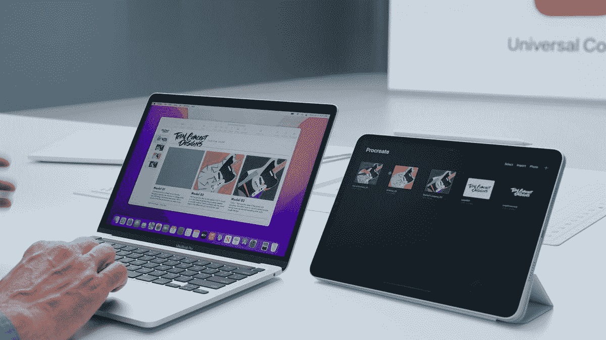

# macOS Monterey 12.3 现已提供通用控制和更多功能

> 原文：<https://www.xda-developers.com/mac-os-monterey-12-3-released/>

# macOS Monterey 12.3 现已提供通用控制和更多功能

苹果现在推出了 macOS Monterey 12.3，增加了期待已久的通用控制功能，以及其他改进。

苹果在去年 10 月发布了 macOS Monterey(也称为 macOS 12)，完成了改进的 Safari 网络浏览器，对快捷方式和 FaceTime 的改进等等。然而，最令人期待的功能之一——通用控制——被推迟到未来的版本中。苹果周一发布了 macOS 12.3 和 [iOS 15.4](https://www.xda-developers.com/ios-15-4/) ，它终于添加了期待已久的通用控件。

Universal Control 现已在部分 Mac 机型上提供，允许您在多台 Mac 和 iPads 上使用单个鼠标/触控板和键盘。一些应用程序在过去已经可以使用这一功能，包括一些可以在 Mac 和 Windows 上工作的应用程序( [Logitech Flow](https://support.logi.com/hc/en-us/articles/360023188134-Logitech-Flow) 就是一个例子)，但苹果的封闭生态系统阻止了大多数这些选项在 iPads 上工作。通用控制设置中的每台 iPad 也需要运行 iPadOS 15.4。

 <picture></picture> 

Universal Control demo from WWDC 2021

macOS Monterey 12.3 也包括了与 iOS 15.4 相同的新表情符号，并且有一些细微的变化。更新官方[不同意 Dropbox、OneDrive 和其他云同步服务](https://www.xda-developers.com/macos-12-3-beta-onedrive-dropbox/)使用的内核扩展。这些应用程序在 macOS 12.3 处于测试阶段时被破坏，但正在推出切换到苹果较新的文件提供商 API 的更新。微软在 1 月份更新了 OneDrive 以修复该问题，而 Dropbox 仍在努力修复。

### macOS Monterey 12.3 变更日志

**通用控制(beta)**

*   通用控制允许您在 iPad 和 Mac 上使用单个鼠标和键盘
*   文本可以在 Mac 或 iPad 上键入，你可以在它们之间拖放文件

**空间音频**

*   在装有 M1 芯片的 Mac 电脑上，支持 AirPods 的音乐中可以使用动态头部跟踪功能
*   关闭、固定和头部跟踪的可定制空间音频设置现在在控制中心中，支持在装有 M1 芯片的 Mac 电脑上使用 AirPods

**表情符号**

*   新的表情符号包括面部、手势和家用物品，可以在表情键盘中使用
*   握手表情可以让你为每只手选择不同的肤色

**其他增强功能**

*   Siri 现在增加了一个声音，扩大了选项的多样性
*   播客应用程序为季节、播放、未播放、保存或下载的剧集添加了剧集过滤器
*   Safari 网页翻译增加了对意大利语和中文(繁体)的支持
*   快捷方式现在支持添加、删除或查询带有提醒的标签
*   保存的密码现在可以包含您自己的笔记
*   电池容量读数的准确性有所提高

**Bug 修复**

*   点击“今日”视图中的新闻小部件时，可能无法打开文章
*   在 Apple TV 应用程序中观看视频时，音频听起来可能会失真
*   在“照片”中整理相册时，可能会无意中移动某些照片和视频

随着 12.3 版本的发布，Python 2 也从 macOS 中删除了，尽管到目前为止，大多数基于 Python 的应用程序都在使用 Python 3 或自托管的 Python 2 安装。请查看上面的变更日志，了解本版本中的所有新内容。

**来源:** [苹果](https://support.apple.com/en-us/HT212585)