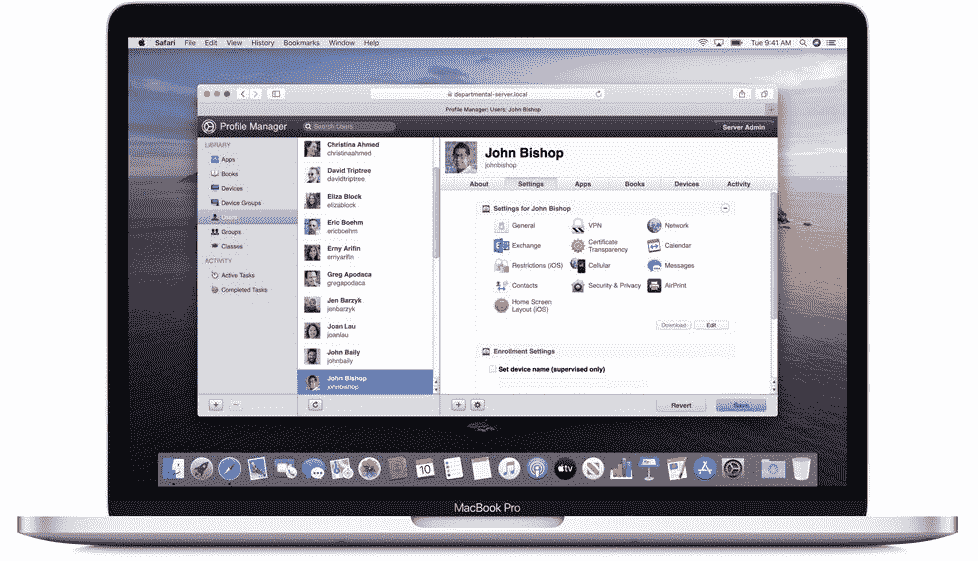

# macOS Server 在 23 年后停产，但一些功能将继续存在

> 原文：<https://www.xda-developers.com/macos-server-discontinued/>

# macOS Server 在 23 年后停产，但一些功能将继续存在

苹果公司已经停止了其用于管理远程 MAC 和 iOS 设备的长期运行的服务器应用程序，但它的一些功能仍然存在。

甚至在 macOS 10(当时的 Mac OS X 10)普及之前，就有了一个服务器版本，用于运行企业、学校和其他组织中的 Mac 电脑群。苹果在过去几年里慢慢淘汰了 macOS Server，将大部分功能转移到 Mac 操作系统的其他地方，现在正式停产。

苹果在一份支持文件中确认，macOS Server 自 2022 年 4 月 21 日起停产。目前形式的 macOS Server 只是一个运行在普通 macOS 安装之上的应用程序，该应用程序仍然可以下载，并与最新的 macOS Monterey 版本完全兼容。

 <picture></picture> 

macOS Server (Credit: Apple)

应用程序中的一些服务在系统的其他领域也可用，如文件共享、缓存服务器和 Time Machine 服务器。然而，最近版本的 macOS Server 中的其他几个功能需要切换到略有不同的解决方案或第三方软件——用于电子邮件、维基管理、FTP(非 SFTP)和 VPN 的服务器在常规 macOS 中没有直接的替代品。macOS Server 中的配置文件管理器可能是最重要的组件，苹果唯一的建议是切换到像微软 Active Directory 这样的第三方选项。

macOS Server 最初于 1999 年推出，名为 Mac OS X Server 1.0，比 Mac OS X 的第一个公开版本早了整整一年。苹果后来在 2001 年推出定制版的 Mac OS X 10.0 后将其替换，该版本内置了各种服务器应用程序和服务。从 Mac OS X 10.7 Lion 开始，[服务器变成了在普通 macOS](https://www.macworld.com/article/212775/osx_lion_server.html) 上运行的应用商店应用。多年来，除了 MAC 和跨平台服务之外，苹果还增加了管理 iOS 设备的功能。

**来源:** [苹果支持](https://support.apple.com/en-us/HT208312)

**Via:** [MacRumors](https://www.macrumors.com/2022/04/21/apple-discontinues-macos-server/)