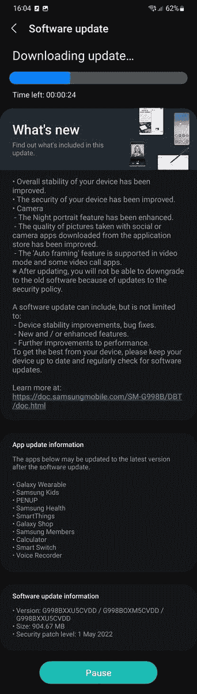

# 谷歌向 Pixel 手机推送 2022 年 5 月的 Android 安全更新

> 原文：<https://www.xda-developers.com/may-2022-android-security-update/>

这是这个月的第一个星期一，这意味着是时候进行另一次安全更新了。谷歌今天发布了 2022 年 5 月的 Android 安全公告，并随之发布了符合条件的 Pixel 智能手机的 2022 年 5 月安全更新。不过，谷歌的 Pixel 系列并不是今天唯一获得更新的设备，因为三星也紧随谷歌的脚步，向其 Galaxy S21、Galaxy Z Flip 3、Galaxy Z Fold 3 和 Galaxy Note 20 系列设备推出了新的更新。

## 2022 年 5 月 Android 安全公告

在最新的 Android 安全公告中，谷歌披露了大量影响 Android 运行时、框架、系统和媒体框架的安全漏洞。这些漏洞已经用 2022-05-01 安全补丁级别进行了修补。与此同时，谷歌还披露了闭源供应商组件和 Linux 内核中的几个漏洞。2022-05-05 安全补丁级别解决了这些漏洞。值得注意的是，这些漏洞的补丁已经工作了几个星期或几个月，直到现在才被披露。如果你有兴趣了解更多关于每月的 Android 安全更新过程，那么看看我们下面链接的解释器。

**[每月安卓安全补丁更新如何运作](https://www.xda-developers.com/how-android-security-patch-updates-work/)**

## 像素更新公告/功能更新

另外，谷歌披露了 2022 年 5 月针对其 Pixel 设备的安全更新。Pixel 更新公告强调了两个关键问题，以及一些高和中等严重性的漏洞，这些漏洞似乎会影响 Android 内核组件和高通组件。该公司还表示，它已经改善了 Pixel 6 和 Pixel 6 Pro 的触觉反馈。

### 2022 年 5 月谷歌像素更新变更日志

*   **显示/图形**
    *   修正了偶尔导致显示器在没有用户交互的情况下被唤醒的问题*[1]。
*   **传感器**
    *   在某些条件和用例下触觉反馈的改进*[2]。
*   **用户界面**
    *   修复了在某些情况下重启设备后导致启动器崩溃的问题*[1]。

**-**

**设备适用性**

*[1]包含在像素 3a、像素 3a XL、像素 4、像素 4 XL、像素 4a、像素 4a (5G)、像素 5、像素 5a (5G)、像素 6 和像素 6 Pro 上

*[2]包含在 Pixel 6 和 Pixel 6 Pro 中

更新将针对 Pixel 3a 系列、Pixel 4 系列、Pixel 4a 系列、Pixel 5、Pixel 5a 和 Pixel 6 系列推出，内部版本号为 **SP2A.220505.002** 。

如果你宁愿不等待更新(或者因为你的手机被 root 而无法更新)，可以看看我们的 [Android 12L 下载文章](https://www.xda-developers.com/how-to-download-android-12/#may2022)以了解最新的 OTA 文件和工厂图像。

## 三星 2022 年 5 月安全更新

上周，我们报道了三星已经开始为 Galaxy S22 和 Galaxy Tab S8 系列推出 2022 年 5 月安全补丁级别的新更新。现在，同样的更新也以软件版本 **G99xBXXU5CVDD** 的形式在德国和意大利推出了基于 Exynos 的 Galaxy S21 系列设备。

 <picture></picture> 

Screenshot courtesy: XDA Senior Member [MMarkkk](https://forum.xda-developers.com/m/mmarkkk.4487534/)

此外，美国运营商 Galaxy Note 20、Galaxy Z Flip 3 和 Galaxy Z Fold 3 的解锁版本也已获得 2022 年 5 月的补丁更新。新版本的 build 号分别为 **N98xU1UES2FVD6** 、 **F711U1TBS2CVD4** 和 **F926U1UES1CVD4** 。

* * *

**来源:** [安卓安全公告](https://source.android.com/security/bulletin/2022-05-01)，[像素更新公告](https://source.android.com/security/bulletin/pixel/2022-05-01)，[谷歌像素帮助社区](https://support.google.com/pixelphone/thread/162101270/)