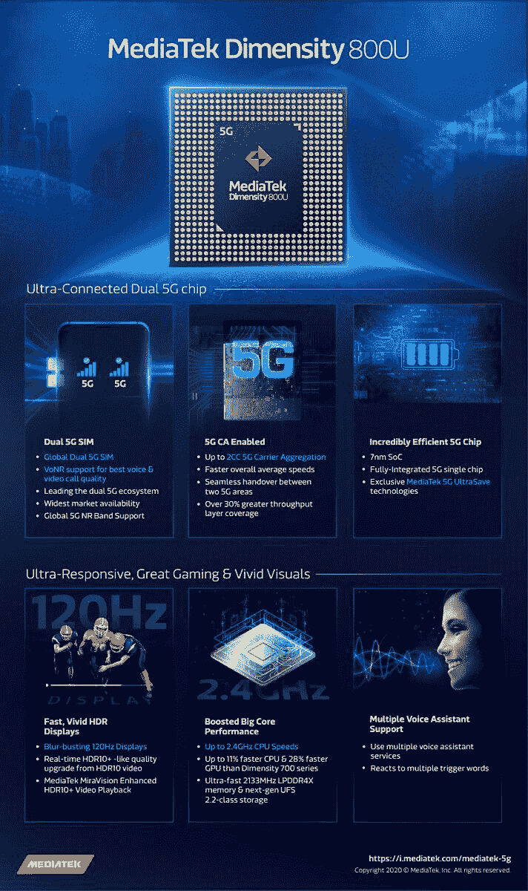

# 联发科天玑发布用于 5G 智能手机的 800U 中端芯片

> 原文：<https://www.xda-developers.com/mediatek-dimensity-800u-announced/>

# 联发科推出 Dimensity 800U，这是另一款面向智能手机的中端 5G 芯片

联发科天玑 800U 是一款新的中端芯片组，来自无晶圆厂芯片设计公司，具有集成的 5G 调制解调器。

联发科刚刚发布了 Dimensity 800U，这是该公司 Dimensity 800 系列中的一款新的中端芯片组。这是该公司第六个集成 5G 调制解调器的片上系统，也是 Dimensity 系列的第六个芯片。

Dimensity 800U 加入了联发科集成 5G 调制解调器的 Dimensity SoCs 系列中的[dimension 720](https://www.xda-developers.com/mediatek-dimensity-720-5g-soc-launch/)、[dimension 800](https://www.xda-developers.com/mediatek-dimensity-800-5g-chip-mid-range-phones/)、[dimension 820](https://www.xda-developers.com/mediatek-unveils-dimensity-820-5g-soc-upper-mid-range-smartphones/)、[dimension 1000](https://www.xda-developers.com/mediatek-dimensity-1000-7nm-soc-integrated-5g/)和[dimension 1000+](https://www.xda-developers.com/mediatek-dimensity-1000-plus-new-5g-chip-144hz-display/)。

以下是新款联发科天玑 800U 的一些主要特点:

*   它采用 7 纳米制造工艺制造(TSMC 的 7 纳米 FinFET)。
*   它有一个八核 CPU，由 2 个主频高达 2.4GHz 的 ARM Cortex-A76 CPU 内核和 6 个主频高达 2.0GHz 的 ARM Cortex-A55 CPU 内核组成。
*   它采用 ARM 的 Mali-G57 GPU，一个独立的 AI 处理单元(APU)，支持 LPDDR4X RAM(高达 2133MHz)，并支持 UFS 2.1 级存储。
*   它支持高达全高清+分辨率和 120Hz 刷新率的显示器。联发科还表示，它支持 HDR10+视频以及联发科定制的 MiraVision PQ 引擎，并为视频进行了额外的 HDR 优化。
*   其 ISP 支持高达 6400 万像素的图像传感器和四摄像头配置。
*   它支持唤醒语音(VoW)、多触发词和语音助理服务，以及双麦克风降噪技术。
*   最后，它有一个集成的 5G 调制解调器，支持 5G+5G 双 Sim 双待机(DSDS)，SA 和 n SA 网络上的 6GHz 以下 5G，新无线电上的双语音(VoNR)，5G 双载波聚合(2CC 5G-CA)，以及联发科技的 5G UltraSave 技术。

Dimensity 800 有 4 个主频高达 2.0GHz 的 ARM Cortex-A76 CPU 内核和 4 个主频高达 2.0GHz 的 ARM Cortex-A55 CPU 内核，而 Dimensity 820 有 4 个主频高达 2.6GHz 的 ARM Cortex-A76 CPU 内核和 4 个主频高达 2.0GHz 的 ARM Cortex-A55 CPU 内核。因此，新的 Dimensity 800U 的单核性能可能比 Dimensity 800 好，但比 Dimensity 820 差 Dimensity 800 和 Dimensity 820 也像新的 800U 一样有一个 ARM Mali-G57 GPU，800 的 Mali-G57 GPU 有 4 个核心，820 的 Mali-G57 GPU 有 5 个核心。根据联发科的说法，Dimensity 800U 的 CPU 性能比 [Dimensity 720](https://www.xda-developers.com/mediatek-dimensity-720-5g-soc-launch/) 快 11%，GPU 性能比后者快 28%，后者本身拥有 ARM Mali-G57MC3。

在中国以外，还没有一款智能手机采用联发科天玑芯片组，尽管该公司[最近证实](https://www.xda-developers.com/mediatek-5g-dimensity-chips-finally-start-shipping-smartphones-outside-china/)采用该芯片组的设备将于 2020 年第三季度在中国以外推出。

 <picture></picture> 

An infographic summarizing the key features of the new MediaTek Dimensity 800U. Source: MediaTek.