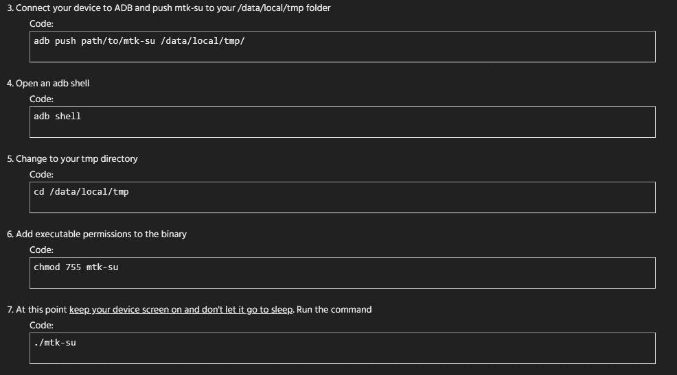
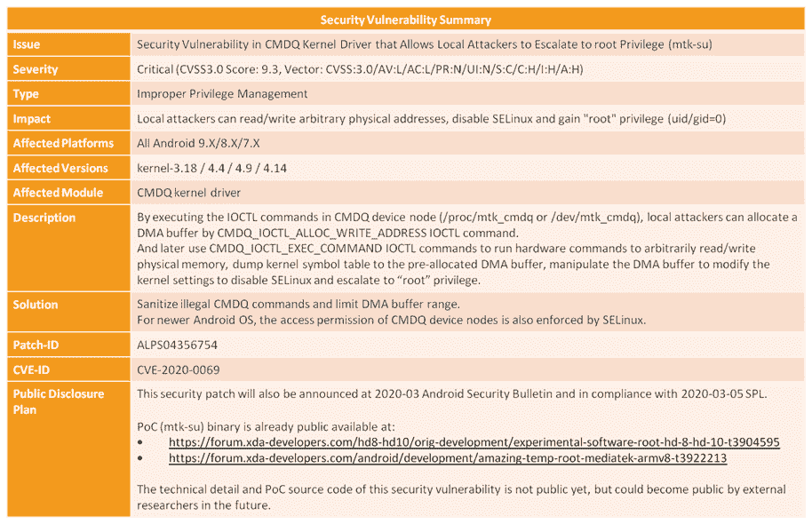
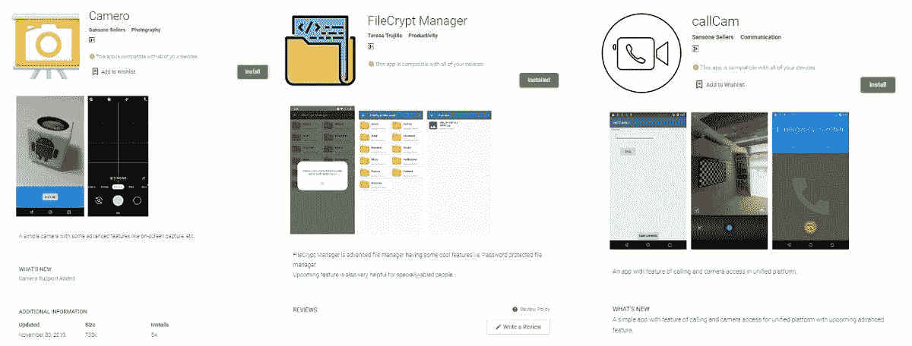

# 关键的联发科 rootkit 影响数百万 Android 设备

> 原文：<https://www.xda-developers.com/mediatek-su-rootkit-exploit/>

每个月的第一个星期一，谷歌都会发布 [Android 安全公告](https://source.android.com/security/bulletin)，该页面公开了谷歌自己或其他第三方提交的所有安全漏洞及其补丁。今天也不例外:谷歌刚刚公布了 2020 年 3 月的安卓安全公告。最新公告中记录的漏洞之一是 CVE-2020-0069，这是一个重要的安全漏洞，具体来说是一个 **rootkit** ，它影响了数百万台采用台湾大型芯片设计公司联发科芯片组的设备。尽管 2020 年 3 月的 Android 安全公告似乎是 CVE-2020-0069 第一次被公开披露，但自 2019 年 4 月以来，该漏洞的细节实际上一直公开在互联网上——更具体地说，是在 XDA 开发者论坛上。尽管联发科技在发现漏洞一个月后发布了补丁，但该漏洞仍可在数十种设备型号上被利用。**更糟糕的是，这个漏洞正被黑客积极利用。**现在，联发科已经求助于谷歌来填补这一补丁缺口，并保护数百万设备免受这一关键安全漏洞的攻击。

对于任何不熟悉 [XDA 开发者](http://forum.xda-developers.com/)的读者来说，我们是最大的安卓软件修改论坛的所在地。通常，这些修改集中在获得设备上的 root 访问权限，以便删除膨胀软件、安装定制软件或调整默认系统参数。亚马逊的 Fire 平板电脑是我们论坛上业余黑客的热门目标——它们充满了无法安装的臃肿软件，无法访问像谷歌 Play 商店这样的基本软件应用，最重要的是，非常便宜。扎根亚马逊 Fire 平板电脑的挑战在于，它们被严格锁定，以防止用户走出亚马逊的围墙花园；亚马逊没有提供官方方法来解锁 Fire 平板电脑的引导加载程序，这通常是任何给定 Android 设备的第一步。因此，找到亚马逊 Fire 平板电脑(不修改硬件)的唯一方法是在软件中找到一个漏洞，让用户绕过 Android 的安全模型。2019 年 2 月，这正是[XDA 资深会员外交官](https://forum.xda-developers.com/hd8-hd10/orig-development/experimental-software-root-hd-8-hd-10-t3904595)在我们的亚马逊 Fire 平板电脑论坛上发表帖子时所做的。他很快意识到，这种利用的范围远远不止亚马逊的 Fire 平板电脑。

经过 XDA 成员外交和其他社区成员的一点测试，证实了这一利用工程在大量的联发科芯片。作者声称，该漏洞可在“几乎所有联发科 64 位芯片”上工作，他们特别指出了以下易受攻击的芯片:MT6735、MT6737、MT6738、MT6739、MT6750、MT6753、MT6755、MT6757、MT6758、MT6761、MT6762、MT6763、MT6765、MT6771、MT6779、MT6799 由于受此漏洞攻击影响的联发科芯片组数量众多，该漏洞攻击被命名为“联发科-苏”，简称“MTK-苏”。2019 年 4 月 17 日，外交在我们的“杂项 Android 开发”论坛上发表了第二个主题为“[为联发科 ARMv8](https://forum.xda-developers.com/android/development/amazing-temp-root-mediatek-armv8-t3922213) 惊人的 Temp Root”的帖子。在这个主题中，他分享了一个脚本，用户可以执行该脚本来授予他们在 shell 中的超级用户访问权限，并将 SELinux(为进程提供访问控制的 Linux 内核模块)设置为高度不安全的“许可”状态。对于用户来说，获得 root 访问权限并在自己的设备上将 SELinux 设置为 permissive 非常容易:您所要做的就是将脚本复制到一个临时文件夹中，将目录更改为存储脚本的位置，向脚本添加可执行权限，然后执行脚本。

 <picture></picture> 

The simple steps to get root access using MediaTek-su. Source: XDA Senior Member Diplomatic

XDA 社区成员确认该漏洞至少在以下设备上有效:

1.  宏基 Iconia One 10 B3-A30
2.  宏基 Iconia One 10 B3-A40
3.  阿尔巴片剂系列
4.  阿尔卡特 1 5033 系列
5.  阿尔卡特 1C
6.  3L 阿尔卡特(2018) 5034 系列
7.  阿尔卡特 3T 8
8.  阿尔卡特 A5 LED 5085 系列
9.  阿尔卡特 A30 5049 系列
10.  阿尔卡特偶像 5
11.  阿尔卡特/TCL A1 A501DL
12.  阿尔卡特/TCL LX A502DL
13.  阿尔卡特 Tetra 5041C
14.  亚马逊 Fire 7 2019 -仅支持 Fire OS 6.3.1.2 版本 0002517050244
15.  亚马逊 Fire HD 8 2016 -仅支持 Fire 操作系统 5.3.6.4 版本 626533320
16.  亚马逊 Fire HD 8 2017 -仅支持 Fire OS 5.6.4.0 build 636558520
17.  亚马逊 Fire HD 8 2018 -仅支持 Fire OS 6.3.0.1
18.  亚马逊 Fire HD 10 2017 -仅支持 Fire OS 5.6.4.0 build 636558520
19.  亚马逊 Fire HD 10 2019 -仅支持 Fire OS 7.3.1.0
20.  亚马逊 Fire TV 2 -仅限 Fire OS 5.2.6.9
21.  ASUS ZenFone Max 加上 X018D
22.  华硕 ZenPad 3s 10 Z500M
23.  基于华硕 ZenPad Z3xxM(F) MT8163 的系列
24.  巴诺平板电脑 7 英寸 BNTV450 和 BNTV460
25.  Barnes & Noble NOOK 平板电脑 10.1 英寸 BNTV650
26.  黑视图最大值为 8
27.  Blackview BV9600 Pro (Helio P60)
28.  BLU 人寿保险公司
29.  BLU 人寿一 X
30.  BLU·R1 系列
31.  BLU R2 LTE
32.  BLU·S1
33.  BLU 坦克极限职业
34.  深蓝色 8L
35.  活蓝色 XI
36.  蓝光 XL4
37.  布鲁布 S8
38.  BQ Aquaris M8
39.  凯特·S41
40.  酷派酷玩 8 Lite
41.  龙之触摸 K10
42.  回声感
43.  金立 M7
44.  海信 Infinity H12 Lite
45.  华为 GR3 标签-L21
46.  华为 Y5II
47.  华为 Y6II MT6735 系列
48.  熔岩虹膜 88S
49.  联想 C2 系列
50.  联想标签 E8
51.  联想 Tab2 A10-70F
52.  LG k8+(2018)x210 穆斯林(MTK)
53.  LG K10 (2017)
54.  LG 贡品王朝
55.  LG X power 2/M320 系列(MTK)
56.  LG Xpression Plus 2/K40 LMX420 系列
57.  T3 蜗牛
58.  魅族 M5c
59.  魅族 M6
60.  魅族 Pro 7 Plus
61.  诺基亚 1
62.  诺基亚 1 Plus
63.  诺基亚 3
64.  诺基亚 3.1
65.  诺基亚 3.1 Plus
66.  诺基亚 5.1
67.  诺基亚 5.1 升级版/X5
68.  Onn 7 英寸安卓平板电脑
69.  Onn 8 英寸和 10 英寸平板电脑系列(MT8163)
70.  OPPO A5s
71.  OPPO F5 系列/A73 -仅限 Android 8.x
72.  OPPO F7 系列-仅限 Android 8.x
73.  OPPO F9 系列-仅限 Android 8.x
74.  Oukitel K12
75.  原生 D7
76.  真实 1
77.  索尼 Xperia C4
78.  索尼 Xperia C5 系列
79.  索尼 Xperia L1
80.  索尼 Xperia L3
81.  索尼 Xperia XA 系列
82.  索尼 Xperia XA1 系列
83.  南方电信 Smartab ST1009X (MT8167)
84.  TECNO Spark 3 系列
85.  Umidigi F1 系列
86.  Umidigi 电源
87.  wiki 笑
88.  维基 sunny
89.  Wiko 视图 3
90.  小米红米 6/6A 系列
91.  中兴 Blade A530
92.  中兴刀片 D6/V6
93.  中兴 Quest 5 Z3351S

除了 Vivo、Huawei/Honor(在 Android 8.0+之后)、OPPO(在 Android 8.0+之后)和三星的基于联发科的手机之外，XDA 社区成员发现，在使用受影响的芯片组的设备上尝试时，联发科-苏通常都能工作。根据 XDA 成员外交官的说法，Vivo、华为/Honor、OPPO 和三星设备“使用内核修改来阻止通过漏洞进行的 root 访问”，这意味着开发者需要挖掘这些设备的内核源代码来创建漏洞的“定制版本”。这不值得付出额外的努力，所以开发人员选择不添加对这些设备的支持，即使“理论上”这种利用仍然可以工作。

到目前为止，应该很清楚这种利用影响了市场上的大量设备。联发科芯片为数百款经济型和中档智能手机、廉价平板电脑和品牌外机顶盒提供动力，其中大部分产品在销售时并未预期制造商会及时更新。因此，许多仍然受联发科-苏影响的设备在今天的披露后的几周或几个月内都不太可能得到修复，如果他们得到一个修复的话。那么是什么让联发科-苏获得了 9.3 分的[CVSS 3.0 版](https://nvd.nist.gov/vuln-metrics/cvss)的“关键”严重性呢？

## 为什么 MTK-苏是一个严重的安全漏洞

重申一下，在 Android 设备上实现 root 访问的典型方法是首先解锁引导加载程序，这将禁用引导分区验证。一旦启动加载程序解锁，用户可以将超级用户二进制文件引入系统，还可以引入超级用户管理应用程序来控制哪些进程可以访问 root。解锁引导加载程序是有意禁用设备上的关键安全功能之一，这就是为什么用户必须通过通常在开发人员选项中启用切换，然后向引导加载程序发出解锁命令来明确允许这种情况发生。然而，使用 MediaTek-su，用户不必解锁引导加载程序就可以获得 root 访问权限。相反，他们所要做的就是将一个脚本复制到他们的设备上，并在 shell 中执行它。然而，用户并不是唯一能做到这一点的人。**你手机上的任何 app 都可以将联发科-苏脚本复制到他们的私有目录下，然后在 shell 中执行获得 root 权限。**事实上，XDA 成员外交官[在他们的论坛帖子中强调了这种可能性](https://forum.xda-developers.com/showpost.php?p=79354350&postcount=2)，当他们建议使用安卓应用的[终端仿真器](https://play.google.com/store/apps/details?id=jackpal.androidterm)或 [Termux](https://play.google.com/store/apps/details?id=com.termux) 而不是 ADB 时。

有了 root 权限，Android 的安全模式基本土崩瓦解。例如，权限在 root 环境中变得毫无意义，因为可以访问 root shell 的应用程序可以授予自己任何想要的权限。此外，使用根外壳，整个数据分区(包括存储在通常不可访问的应用程序私有数据目录中的文件)都是可访问的。拥有 root 权限的应用程序还可以在后台静默安装它想要的任何其他应用程序，然后授予它们侵犯你的隐私所需的任何权限。据 XDA 知名开发者 [topjohnwu](https://forum.xda-developers.com/member.php?u=4470081) 称，恶意应用甚至可以“通过使用 ptrace 直接向 Zygote 注入代码”，这意味着你设备上的正常应用可能会被劫持来执行攻击者的命令。这些例子只是触及了一个 app 在你不知情的情况下，在后台侵犯你信任的几种方式。然而，恶意应用程序可能会对你的设备造成严重破坏，而不会隐藏它们在做什么。例如，勒索软件*对根用户访问极其有效；如果你不付钱，一个假想的勒索软件应用程序可能会通过彻底清除整个设备来*完全且不可逆转地*使你的设备无法运行。*

MediaTek-su 唯一的“弱点”是它只授予应用程序“临时”root 访问权限，这意味着在设备重启后，进程将失去超级用户访问权限。此外，在运行 Android 6.0 Marshmallow 和更高版本的设备上，[验证启动和 dm-verity](https://www.xda-developers.com/a-look-at-marshmallow-root-verity-complications/) 的存在会阻止对只读分区(如系统和供应商)的修改。然而，这两个因素大多只是阻碍我们论坛上的修改者，而不是恶意行为者。为了克服临时 root 的限制，恶意应用程序可以在每次启动时简单地重新运行联发科-苏脚本。另一方面，几乎不需要克服 dm-verity，因为对系统或供应商分区的永久修改不太可能引起大多数恶意软件作者的兴趣；毕竟，恶意应用程序已经可以用 root shell 做很多*的事情了。*

如果你在技术层面上想知道联发科-苏在开发什么，联发科与我们分享了下面的图表，总结了切入点。该缺陷显然存在于联发科的 Linux 内核驱动程序“CMDQ”中该描述指出，“通过在 CMDQ 设备节点中执行 IOCTL 命令”，本地攻击者可以“任意读取/写入物理内存，将内核符号表转储到预先分配的 DMA 缓冲区，[并]操纵 DMA 缓冲区来修改内核设置，以禁用 SELinux 并升级到‘root’权限。”

 <picture></picture> 

MediaTek's Security Vulnerability Summary of CVE-2020-0069

根据联发科与我们分享的图表，该漏洞影响的是运行 Android 版本 7 Nougat、8 Oreo 或 9 Pie 的 Linux 内核版本 3.18、4.4、4.9 或 4.14 的联发科设备。显然，该漏洞在运行 Android 10 的联发科设备上不可利用，因为“CMDQ 设备节点的访问权限也由 SELinux 强制执行。”这种缓解可能来自联发科 BSP 的更新，而不是 Android 本身。Android 10 对此漏洞的唯一缓解是其对应用程序在其主目录中执行二进制文件的[限制；然而，正如 XDA 公认的开发者 topjohnwu 指出的，恶意应用程序可以简单地运行动态库中的联发科-苏代码。](https://developer.android.com/about/versions/10/behavior-changes-10#execute-permission)

即使联发科技已经在所有受影响的芯片组中修补了这个问题，他们也不能强迫设备制造商实施这些补丁。**联发科告诉我们，他们早在 2019 年 5 月就已经准备好了补丁。不出所料，亚马逊在意识到这一问题后，立即在所有设备上安装了补丁。然而，自联发科向其合作伙伴提供修复程序以来，10 个月已经过去了，然而在 2020 年的**3 月，数十家原始设备制造商还没有修复他们的设备**。大多数受影响的设备都是使用过时的 Android 安全补丁级别(SPLs)的旧 Android 版本，当你考虑到使用这些联发科芯片的*数百*不太知名的设备型号时，更新情况甚至更糟。联发科在这里遇到了严重的问题，所以他们向谷歌寻求帮助。**

与联发科不同，谷歌*可以*通过[许可协议](https://www.xda-developers.com/google-require-oem-regular-security-patches/)或程序条款(如 Android One)迫使 OEM 厂商更新设备。OEM 要声明设备符合 2020-03-05 安全补丁级别(SPL)，设备必须包括 2020 年 3 月 Android 安全公告中的所有框架、Linux 内核和适用的供应商驱动程序修复，其中包括 CVE-2020-0069 或联发科-苏的修复。(谷歌实际上似乎没有强制要求[OEM 厂商在声明某个 SPL 时实际合并所有补丁](https://www.xda-developers.com/android-oem-lying-security-patches/)。)现在 2020 年 3 月公报出来了，这个故事应该结束了吧？不幸的是，我们也不得不指责谷歌在整合补丁上的拖沓。

## 安全修补程序流程中的缺陷

如果还不清楚的话，并不是每个安全漏洞都需要出现在 Android 安全公告中。许多漏洞是由供应商发现并修补的，而它们从未出现在每月公告中。联发科-su 本应是其中之一，但由于多重原因，多家 OEM 厂商未能整合联发科提供的补丁。(有很多潜在的原因，从缺乏资源到商业决策，再到沟通失败。)当我之前表示联发科“转向谷歌”寻求帮助时，暗示联发科积极寻求谷歌的帮助，以使 OEM 厂商最终修复他们的设备。然而，事实可能并非如此。据我所知，谷歌并不知道联发科-苏，直到它在 2020 年 1 月 6 日发布的一份安全报告中被偶然提起。在这份报告中，*趋势科技*记录了*的另一个*安全漏洞，被称为“[活页夹驱动程序中的释放后使用](https://www.xda-developers.com/zero-day-security-vulnerability-active-exploit-google-pixel-huawei-xiaomi-samsung-others/)漏洞，该漏洞目前正被广泛利用。*趋势科技*注意到三个恶意应用程序是如何使用两种方法之一获得 root 访问权限的，要么是“活页夹驱动程序中释放后使用”漏洞，要么是 MediaTek-su。

 <picture></picture> 

Alleged Play Store apps abusing MediaTek-su. Source: [TrendMicro](https://blog.trendmicro.com/trendlabs-security-intelligence/first-active-attack-exploiting-cve-2019-2215-found-on-google-play-linked-to-sidewinder-apt-group/).

在趋势科技分享的代码中，我们可以清楚地看到恶意应用程序是如何针对特定的设备型号(如诺基亚 3、OPPO F9 和红米 6A)并在其上使用联发科-苏的。

我不能代表趋势科技发言，但他们似乎不知道联发科-苏是一个尚未打补丁的漏洞。毕竟，他们关注的是“在 binder 驱动程序中释放后使用”的漏洞，而使用 MediaTek-su 的发现似乎是后来才想到的。(我敢肯定，如果*趋势科技*知道围绕联发科-苏的情况，他们会与谷歌协调他们的披露工作。)我们自己在 2020 年 2 月 5 日才知道这个漏洞，在我们自己调查了它有多糟糕之后，我们在 2020 年 2 月 7 日联系了谷歌。**谷歌非常担心公布联发科-苏的反响，以至于他们要求我们推迟到今天再公布这个故事。**考虑到使用联发科-su 的恶意软件可能会对用户造成不可挽回的伤害，我们同意在 2020 年 3 月发布 Android 安全公告之前暂停此事。尽管如此，考虑到许多设备需要多长时间才能获得最新的安全更新，如果他们真的获得了更新，几个月后肯定会有大量设备仍然容易受到联发科-阿苏的攻击。对于任何拥有易受攻击设备的人来说，这应该是令人震惊的。

尽管这种非常严重的“严重”严重性漏洞正在被广泛利用，但谷歌仅在 2020 年 3 月的公告中发布了该问题的修复程序，这是在他们意识到该问题约 2 个月后。虽然谷歌确实会在最新的 Android 安全公告发布前整整 30 天通知其 Android 合作伙伴(即原始设备制造商在 2020 年 2 月初知道了 2020 年 3 月公告中的内容)，谷歌可以，也经常用变化或新的修复来更新公告。我不明白为什么谷歌没有选择加快为如此严重的问题添加补丁，尤其是当联发科技在 10 个月前就已经修复了这个问题。如果在苹果的设备中发现了这样的漏洞，我毫不怀疑他们会更快地发布修复程序*。谷歌基本上指望的是高风险的赌注，即联发科苏在 2020 年 3 月的公告发布之前，将保持低调。虽然谷歌在这方面似乎很幸运，但我们不知道有多少恶意软件作者已经知道了这个漏洞。毕竟，它已经在*的一个随机 XDA 论坛帖子里呆了将近一年*。*

 *这场灾难中还有一方我没有过多提及，那就是漏洞的作者，XDA 外交成员。值得称道的是，我认为他发表联发科-苏并无恶意。我们可以清楚地追溯到利用的起源外交的愿望，修改亚马逊消防平板电脑。外交官告诉我，他开发这个根方法的主要目标是帮助社区。定制您的设备是 XDA 的全部，而外交界在社区中的努力是人们喜欢论坛的原因。尽管 diplomatic 拒绝开源该项目引起了一些关注，但他解释说，他希望社区尽可能长时间地享受 root 访问。当我第一次联系《外交》时，他还表示他正在与一些合作伙伴合作，这些合作伙伴阻止他分享该项目的源代码和研究成果。虽然我无法获得关于这一合作的更多细节，但我确实想知道，如果联发科提供一个 bug 赏金计划，diplomatic 是否会选择公开这一利用。我无法想象，如果联发科真的有这样一个项目，这种规模的漏洞不会支付一大笔钱。外交声称，自 2015 年末联发科 MT6580 芯片组以来，这种利用就已经成为可能，所以人们不得不怀疑外交甚至是第一个发现这种利用的人。他告诉我，在这篇文章发表之前，他并不知道 MediaTek-su 正在被积极利用。

如果你想检查你的设备是否容易受到联发科-苏的攻击，那么手动运行 XDA 成员外交[在这个 XDA 论坛帖子](https://forum.xda-developers.com/android/development/amazing-temp-root-mediatek-armv8-t3922213)中发布的脚本。如果您输入一个根 shell(当符号从$变为#时，您将会知道)，那么您将会知道漏洞利用起作用了。如果成功了，那么你需要等待你的设备制造商推出一个补丁联发科-苏的更新。如果您的设备报告的安全补丁级别为 2020 年 3 月 5 日，这是 2020 年 3 月 SPL 的最新版本，那么几乎可以肯定它是受联发科-苏保护的。否则，你只能检查你的设备是否易受攻击。

* * *

*更新 1(美国东部时间 3/2/2020 @ 9:45PM):*本文进行了更新，以澄清 XDA 会员外交官早在 2019 年 2 月发现该漏洞时就已经意识到该漏洞的范围，但直到本文发布时他才知道该漏洞的广泛使用。我们还更正了我们关于外交部门拒绝共享项目源代码的一个原因的措辞。*