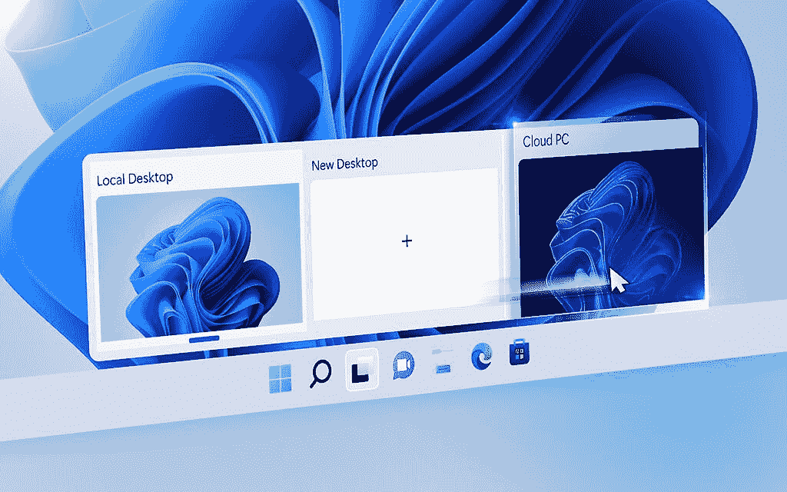

# 微软 365 的 4 月更新包括更容易的帐户切换和新的辅助功能

> 原文：<https://www.xda-developers.com/microsoft-365-april-2022-updates-account-switching-accessibility/>

随着四月底的临近，微软再次强调了过去一个月对微软 365 产品和服务的更新。这包括一些之前宣布的功能，如 Windows 11 文件浏览器中的[标签(实际上还没有推出)，以及新的](https://www.xda-developers.com/microsoft-unveils-tabbed-file-explorer/)[人工智能呼叫功能](https://www.xda-developers.com/windows-11-getting-ai-video-effects-starting-arm-devices/)，这些功能也在路上，如自动取景和语音聚焦。不过，这个月还会有更多。

从可访问性开始，微软在团队中推出了新的通知控件，以帮助用户减少工作中的分心。例如，您现在可以在会议期间静音通知。其他旨在帮助用户集中注意力的团队功能包括隐藏您自己的视频源、更改聊天密度设置等。微软还在其几个应用程序中推出了新的文本预测和语音控制功能，以进一步提高可访问性。Viva Insights 还有一个新的焦点模式，帮助用户在工作中保持专注。

微软在 Windows 上的一个值得注意的更新[To Do](https://todo.microsoft.com/tasks/)也在本月推出，它能够智能识别诸如到期日和任务是否应该重复之类的事情。例如，如果你创建了一个名为“周五提交报告”的任务，待办事项现在会自动设置下一个周五的截止日期。

在网络上，微软 365 应用程序如 Word、PowerPoint 等现在支持无缝账户切换。您不再需要退出一个帐户来切换到另一个帐户，您可以从页面右上角的帐户菜单中看到您所有的活动帐户，以便在它们之间随意切换。

如果你用 Yammer，这个月也做了一些更新。现在可以投票支持你认为有用的回复，让其他人更容易找到它，并且现在可以将帖子加入书签以便以后查看。虽然还没有推出，Yammer 也将很快在网络上支持黑暗模式。

微软在 4 月份也有一些关于 Windows 365 的重大消息，包括将该操作系统作为你个人电脑的默认启动系统，或将你的 Windows 365 云桌面直接引入 Windows 11。还有 Windows 365 Offline，它让你能够在没有互联网连接的情况下使用你的云 PC，一旦你重新连接，事情就会保持同步。再说一次，这还没有全部实现，但是微软这个月已经宣布了。

 <picture></picture> 

A Windows 11 PC showing local and cloud desktops side by side

最后，IT 管理方面有了一些更新。微软推出了 Windows Autopatch，这是一项允许企业自动保持 Windows 和 Office 自动更新的功能，该公司还推出了一种方法，让企业在 Windows 11 上向员工显示自定义消息，从而更容易帮助用户根据公司政策设置他们的设备。微软本月还推出了一款新的远程帮助应用，让员工更容易以安全的方式获得 it 团队的帮助。

* * *

来源:[微软](https://www.microsoft.com/en-us/microsoft-365/blog/2022/04/28/from-intelligent-tools-built-on-inclusivity-to-the-latest-in-windowsheres-whats-new-in-microsoft-365/)