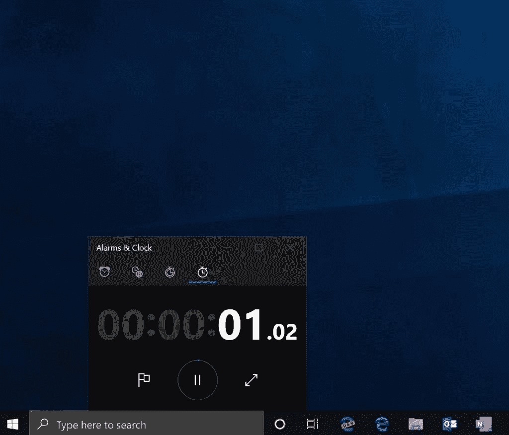

# 微软宣布 Windows 终端，一个新的可定制的带标签的命令行和 WSL 2

> 原文：<https://www.xda-developers.com/microsoft-announces-windows-terminal/>

# 微软宣布 Windows 终端，一个新的可定制的带标签的命令行和 WSL 2

微软宣布了一个新的命令行程序，名为 Windows 终端，目标是成为访问命令行程序的中心位置。

多年来，Windows 用户已经错过了内置于操作系统中的全功能终端程序。命令提示符被用作一种替代方式，虽然它多年来一直为人们提供良好的服务，但 Windows 10 更加重视 Windows PowerShell。他们甚至用 PowerShell 取代了 Windows 10 的右键上下文菜单选项，而不是命令提示符。今天，微软宣布了一个名为 Windows 终端的新命令行程序，其目标是成为访问这些类型的命令行程序的中心位置。

谷歌 I/O 2019 将于本周晚些时候举行，但微软的 Build 2019 开发者大会正在举行。今天，这家总部位于西雅图的科技巨头宣布了一系列面向 Windows 开发者的新工具，包括 Windows 终端、Windows Subsystem for Linux (WSL) 2、XAML 群岛、React Native for Windows 和 MSIX 核心。自从 Windows 终端发布以来，它受到了很多关注，现在它已经可以作为预览版使用了。

微软的 Windows 终端的用户界面提供 GPU 加速的文本呈现、主题支持、标签、分离窗口、快捷方式、完整的 Unicode 支持，包括东亚字体等等。Windows 终端将在 6 月份推出更大范围的版本(按照目前的计划)，面向 PowerShell、Cmd、WSL 和其他命令行应用程序的用户。今天还宣布了 WSL2，据说它基于 Linux 4.19 内核，随最新的 Windows build 一起发布。我们被告知内核使用专门为 Azure 构建的技术，应该有助于减少 Linux 启动时间，同时也简化了内存使用。

 <picture></picture> 

WSL2 on Windows 10\. Source: Microsoft.

在文件系统繁重的操作方面，微软甚至承诺将 WSL2 的速度提高一倍。WSL 的新更新也将支持原生运行 Linux Docker 容器，这是个好消息。您将不再需要运行虚拟机来运行 Docker 容器。WSL2 也计划在 6 月发布。

* * *

[**来源:微软**](https://devblogs.microsoft.com/commandline/announcing-wsl-2/)