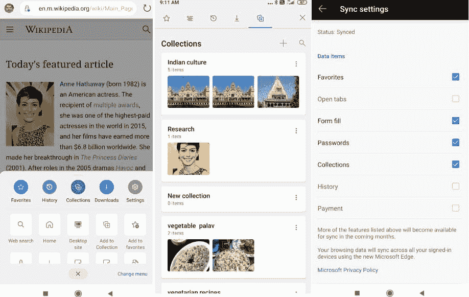

# 微软安卓版 Edge 获得收藏支持

> 原文：<https://www.xda-developers.com/microsoft-edge-android-collections/>

# 微软安卓版 Edge 获得收藏支持

Microsoft Edge for Android 获得了一项名为 Collections 的新功能，允许您按组保存链接和媒体，并在设备之间进行同步。

谷歌在 2008 年推出 Chrome 浏览器后，ie 的辉煌岁月很快就结束了。从那以后，微软试图增加新功能，甚至推出全新的浏览器——Edge——也没能挽救他们的浏览器。直到微软决定使用 Chromium(谷歌 Chrome 和许多其他浏览器，如 Opera、[、Vivaldi](https://www.xda-developers.com/vivaldi-browser-launch-android-duckduckgo-tracker-radar/) 和亚马逊 Silk 的开源框架)重建 Edge，事情都大同小异。与桌面版一样，微软 Android Edge 也基于 Chromium，并在慢慢增加功能，以便与桌面版并驾齐驱。在最新的测试版中，Edge 接收收藏，这是一个旨在提高您的研究能力的功能。

Microsoft Edge 上的收藏允许您将有用的链接、图像/视频和其他信息分组保存。如果您已使用 Microsoft 帐户登录，还可以在不同设备之间同步收藏。 [*Techdows*](https://techdows.com/2020/05/collections-available-edge-android.html) 报道称，微软 Edge 的测试版现在正在添加收藏，允许你在旅途中创建收藏，并与你的帐户同步，以便稍后在更大的屏幕上查看。

 <picture></picture> 

Image via Techdows

要使用收藏，您必须至少安装 Microsoft Edge (beta)版本 45.04.24.4994。这似乎是一个服务器端的开关，因为我看不到这个功能，尽管它与 *Techdows* 报道的版本相同。根据他们的报告，您可以通过点击底部栏中的水平三点按钮来访问集合。您可以点击中间的选项，然后点击“+”图标添加新收藏。在你给它命名后，你可以通过点击菜单中的“添加到收藏”按钮来添加链接或图片。

为了能够查看在其他设备上创建的精选，您可以在同步设置中检查精选。请记住，您需要注册成为 Microsoft Edge 的测试人员才能使用该功能。你可以通过点击此链接申请相同的。

[在 APKMirror 上下载最新的 Android 版微软 Edge 测试版](https://www.apkmirror.com/apk/microsoft-corporation/microsoft-edge/microsoft-edge-45-04-24-4994-release/)