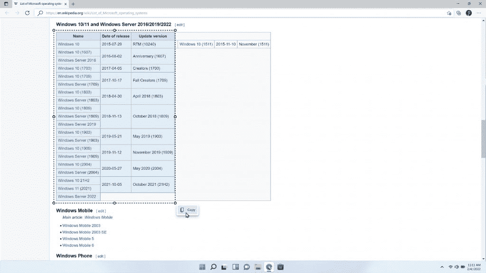

# 微软 Edge 拥有内置的语法编辑器和智能网页选择功能

> 原文：<https://www.xda-developers.com/microsoft-edge-grammar-editor-web-select/>

微软宣布，它将为其 Edge 浏览器推出几个主要的新功能，包括与微软编辑器的集成，这是几个月前宣布的。此外，还有一个新的 web 选择功能，可以轻松复制您在 web 上找到的内容，包括表格。

微软编辑器集成是你所期望的。Editor 是微软 Grammarly 的竞争对手，就像它的竞争对手一样，它通常是一个你可以安装的浏览器扩展。它为用户提供语法和标点符号的更正和建议，使文本更容易阅读。现在，该功能已经内置到 Edge 浏览器中，因此您不必再麻烦地安装扩展。

Microsoft Edge 中的编辑器有 20 多种语言版本，但它仅适用于您的浏览器所使用的主要语言。除了语法纠正，微软表示，它将很快开始推出英语、西班牙语、法语、意大利语和葡萄牙语的文本预测，并承诺将更快地写出你想说的话。

另一个新功能很有趣，是微软两年前宣布的。它被称为 web select，尽管它最初发布时被称为智能复制。从本质上来说，这个特性使得在 web 上选择格式化的内容变得更加容易，比如表格、图像和文本。例如，您可以快速选择原始格式的整个段落，或者仅拷贝表格中您想要拷贝的单元格。例如，您可以在 OneNote 或 Word 文档中粘贴带有原始格式的内容。

 <picture></picture> 

Selecting cells in a table on Wikipedia

Web select/smart copy 最早于 2020 年 11 月开始测试，因此向公众推广需要很长时间。不要把它和网页截图混淆，网页截图可以让你在分享或保存之前直接给网页截图并添加注释。这个特性已经存在很长时间了，而且它也没有那么令人印象深刻，因为它只是一个页面截图。

如果你想尝试这些功能，请确保你运行的是最新版本的 Edge，方法是前往右上角的三点菜单，选择**帮助&反馈** - > **关于微软 Edge** 。这些变化可能需要一段时间才能显现出来，但请放心，它们现在已经推出了。

* * *

来源:[微软](https://blogs.windows.com/windowsexperience/2022/03/31/our-best-features-to-help-you-save-time-stay-organized-and-do-more-of-what-you-love/)