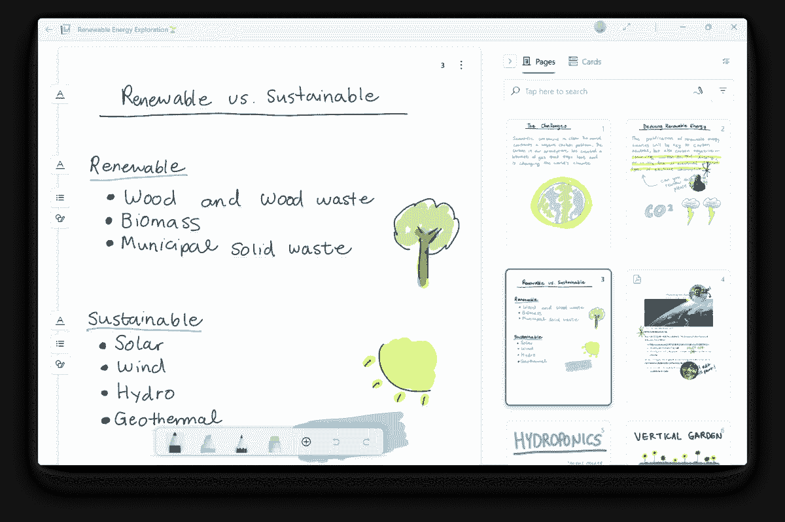

# Microsoft Journal 是一款为 Windows 设备打造的新笔记应用

> 原文：<https://www.xda-developers.com/microsoft-journal-release/>

微软一直以“车库”的名义试验新项目(类似于谷歌的 120 区)。Journal 最初是去年作为一个车库项目发布的，现在微软已经将其升级为一个完全受支持的产品，具有一系列新功能和改进。

Microsoft Journal，正如它现在的名字，是一个主要为手写笔设计的注释和标记应用程序。你可以用任何兼容 Windows Ink 的设备和手写笔写笔记，或者在现有的 PDF 文档上绘图(类似于微软 Edge 最初的卖点之一)。就像其他几个笔记应用一样，它可以基于手势执行操作，而不是为每个操作切换工具——例如，潦草地写下一个单词会将其擦除。

 <picture></picture> 

Source: Microsoft

与早期的 Garage 版本相比，主要的升级是一个全新的外观，它符合现代 Windows 11 设计语言。Microsoft Journal 对 Windows 11 的其他部分感觉很好，但它也适用于 Windows 10，只要你有 2020 年 10 月的更新(20H2，build 19042.xxx)或更新版本。

Microsoft Journal 可以自行组织和存储笔记，但您也可以选择将笔记导出到 PDF、OneDrive 或打印机。如果您订阅了 Microsoft 365，该应用程序还可以访问您的日历，以便更快地获取会议笔记。该应用程序还使用设备上的人工智能来识别标题、列表和其他常见元素，并以可搜索的格式对它们进行索引。

你可以从微软商店免费下载这个应用程序。你需要一台支持手写笔的电脑或输入设备来充分利用日记本，否则，你最好使用 OneNote、Evernote 或其他以打字为主的笔记应用程序。OneNote 不会消失，但微软去年证实，在 UWP OneNote 应用程序为传统桌面版本带来大部分功能后，它计划[将其退役。](https://www.xda-developers.com/microsoft-killing-onenote-uwp-app/)

https://apps.microsoft.com/store/detail/9n318r854rhh