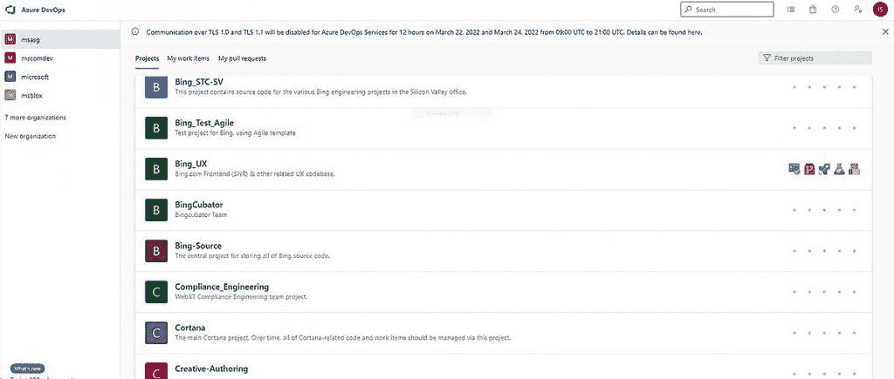

# 黑客组织 Lapsus$泄露了 37GB 微软 Bing 和更多的源代码

> 原文：<https://www.xda-developers.com/microsoft-lapsus-leak-37gb-soure-code/>

微软一直是黑客组织 Lapsus$的攻击目标，价值 37GB 的内部文件现在出现在网上。据黑客称，泄露来自黑客设法进入的 Azure DevOps 服务器，它包含许多微软产品的源代码，包括 Bing 和 Cortana。

黑客组织最初在周日发布了文件的截图，然后在周一分享了包含所有文件的 7-zip 存档。据黑客称，压缩文件只有 9GB 大小，但解压缩后，它为 250 多个微软项目添加了多达 37GB 的源代码。据报道，大多数项目都是基于网络和移动的应用程序，所以如果你希望在这里看到任何与 Windows 相关的东西，你就不走运了。

 <picture></picture> 

Purported Microsoft source code on Azure DevOps

据推测，泄露的内容包含微软必应地图 90%的源代码，以及必应本身和 Cortana 45%的源代码，根据安全研究人员与 BleepingComputer 的谈话，这些文件看起来像是来自微软的合法内部代码。此外，微软工程师用于发布移动应用的电子邮件和文档显然也包括在此次泄露中。

最近几个月，Lapsus$因攻击不同的公司而获得了一些声誉。受害者中，[三星 Galaxy 手机的源代码被盗](https://www.xda-developers.com/samsung-hack-source-code-galaxy-phones/)。英伟达，育碧，和其他公司也包括在内，所以有一些相当大的名字是这个群体的目标。在他们的 Telegram group 上，黑客有一条寻找公司内部人士的消息，表明他们是如何设法进入世界上一些最大公司的安全文件的。他们也有可能利用 Okta，一个 Lapsus$声称侵入的身份管理平台。

微软尚未确认数据泄露是否包含 Bing 和其他服务的合法数据，但它正在调查这些指控。如果数据被证实是真实的，我们可能会收到公司的消息。

* * *

来源: [Lapsus$(电报)](https://t.me/minsaudebr/174)

通过:[放气电脑](https://www.bleepingcomputer.com/news/microsoft/lapsus-hackers-leak-37gb-of-microsofts-alleged-source-code/)