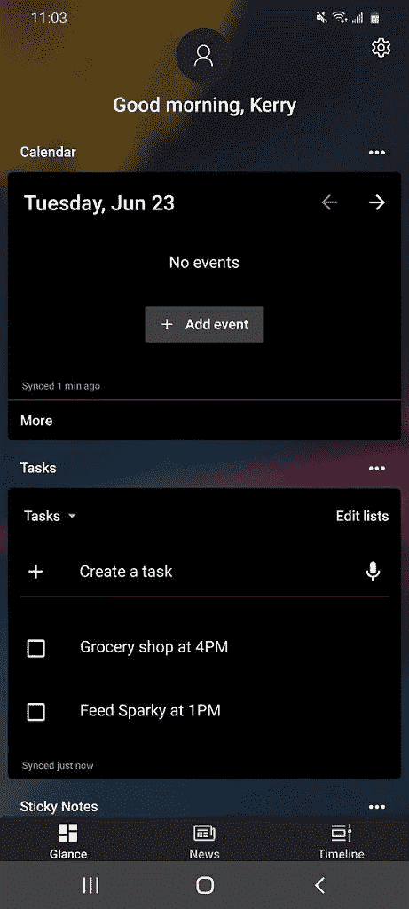

# 微软 Launcher 6 更新增加了横向模式和新的 Feed 设计

> 原文：<https://www.xda-developers.com/microsoft-launcher-v6-beta-update-enables-landscape-mode-and-new-feed-design/>

# Microsoft Launcher v6 更新支持横向模式和新的订阅源设计

新的 Microsoft Launcher 6 稳定版包括对横向模式的支持、重新设计的 Microsoft Feed 和性能改进。

**更新 1(08/24/2020 @ 08:35PM ET):**Microsoft Launcher 6.2 现在推出了我们在测试版中强调的 4 项新功能。滚动到底部了解更多信息。下面保留了 2020 年 6 月 23 日发表的文章。

微软在 Android 应用开发方面的努力并没有被 Android 社区忽视。在过去的几年里，该公司已经为我们最喜爱的平台发布和更新了许多应用程序和服务。微软 Launcher，一个在谷歌 Play 商店上安装了超过 1000 万次的主屏幕启动器替代品，绝对是最值得注意的一个。即将到来的 v6 主要更新的新测试版现已推出(通过 [*AndroidPolice*](https://www.androidpolice.com/2020/06/23/microsoft-launcher-v6-brings-landscape-mode-and-updated-feed-design-to-the-masses/) )，它增加了一些受欢迎的功能。

第一个也是最引人注目的新特性是支持横向模式。老实说，我很少在水平模式下拿手机，但我可以看到很多人可以使用它。许多主要的启动器已经支持横向模式有一段时间了。甚至谷歌的默认像素启动器也可以让你旋转主屏幕。变更日志还暗示启动器现在更节省内存。这两个特性从一月份微软 Launcher v6 的第一个预览版开始就已经存在了。

此次更新还引入了重新设计的 Microsoft Feed。对于那些不熟悉的人来说，Feed 位于主屏幕的负一格上，它显示来自各种微软服务的信息。你可以查看你的日程安排或者浏览新闻。Feed 现在的特点是背景模糊，卡片之间的间距更均匀。您还可以在应用程序抽屉中创建文件夹，并在任意位置连按两次以锁定屏幕。自上一次预览版以来，这两个特性都是可用的。

 <picture></picture> 

Microsoft Launcher's new Microsoft Feed design. Image credits: [Kerry Wan/AndroidPolice](https://www.androidpolice.com/2020/06/23/microsoft-launcher-v6-brings-landscape-mode-and-updated-feed-design-to-the-masses/).

如果你感兴趣，下面是完整的更新日志:

### Microsoft Launcher V6 beta changelog

支持横向模式

更新的 Microsoft Feed 设计

漂亮的壁纸

提高了性能

在此版本中修复:

在 Dock 中最多添加 3 行

用文件夹整理你的应用抽屉

双击以锁定屏幕

改进的应用程序搜索

修复了错误和崩溃

你可以通过[选择](https://play.google.com/apps/testing/com.microsoft.launcher)加入 Play Store 的测试程序来尝试新功能。

## 更新:微软启动器 6.2 稳定版

Microsoft Launcher 6.2.200706 现在正在谷歌 Play 商店上推出，它支持横向模式和更新的 Microsoft Feed 设计。你可以从 [APKMirror](https://www.apkmirror.com/apk/microsoft-corporation/microsoft-launcher/microsoft-launcher-6-2-200706-89871-release/) 下载稳定版。