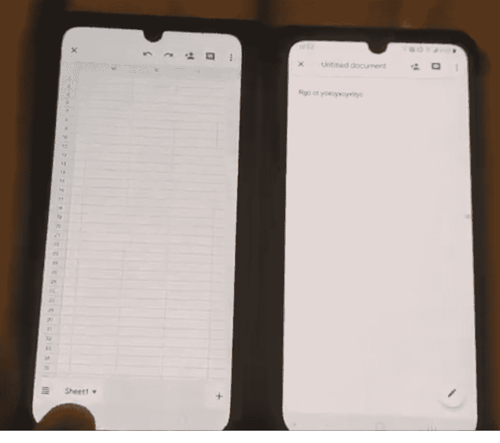

# 安卓版微软 Office 更新增加了 LG 手机的双屏支持

> 原文：<https://www.xda-developers.com/microsoft-office-update-android-adds-dual-screen-support/>

微软移动办公已经有很长的历史了。早在 2000 年代末，Office Mobile 就首次针对已被弃用的 Windows Mobile 操作系统发布。然后，微软将其引入 Windows Phone，但功能非常有限，因为它甚至无法与其他生产力应用程序相提并论。现代办公应用的起源实际上是在 iOS 上，而不是在 Windows Phone 上。该公司在 2015 年 6 月将微软 Word、Excel 和 PowerPoint 应用程序引入安卓系统之前，分别发布了 iOS 版应用程序。这些应用是在当年晚些时候为 Windows 10 和 Windows 10 Mobile 推出的。它们的功能优于谷歌在 Android 上的文档、表格和幻灯片应用，因为它们提供了 Windows 和 macOS 上桌面应用提供的许多高级功能。

2019 年 11 月，微软将三个应用程序[的功能集成到一个单独的 Office 应用程序](https://www.xda-developers.com/microsoft-office-android-combines-word-excel-powerpoint/)中，并将其作为 Android 和 iOS 的测试版发布，并支持该公司的 Fluent 设计语言，它希望第三方 Android 应用程序开发者采用该语言。本月，稳定且一体化的微软办公应用[在 Play Store](https://www.xda-developers.com/microsofts-revamped-office-app-android-released/) 发布。用户不再需要安装来自微软的三个不同的应用程序，该公司在这方面提供了比谷歌的生产力应用程序更多的便利。Android 上的 Office 应用程序现在也支持最近 LG 手机上的双屏附件，包括 [LG V50 ThinQ](https://www.xda-developers.com/lg-v50-dual-screen-review/) 、 [LG G8X ThinQ](https://www.xda-developers.com/lg-g8x-with-dual-screen-first-impressions-a-fun-gimmick/) 和新的 [LG V60 ThinQ](https://www.xda-developers.com/lg-v60-thinq-launch-specifications-5g/) 。这是一个用户在视频[中展示的，链接到这里](https://photos.google.com/share/AF1QipPKB7FeE5mY8fy4fXFssbIv9olxaahy2kfVTkK-dF60nxgQCoOCUIZ28ejQrvaNKg?key=Z0RhZDR3RDlYMVFrYU9GcGlUOFVZc0g1UHdCWndn)。

 <picture></picture> 

Source: William Richardson

双屏支持允许用户将设备上的两个显示器用作不同的显示器。例如，他们可以在主显示器上打开 Word 文档，在第二台显示器上编辑 PowerPoint 演示文稿。这是为了提高生产率。微软可能是为自己的双屏设备 [Surface Duo](https://www.xda-developers.com/microsoft-surface-duo-peek-feature-glance-information/) 增加了这一功能，该设备将于 2020 年秋季发布。在我们等待 Surface Duo 上市的同时，上述 LG 手机上的双屏附件用户可以受益于 Office 应用程序上的双屏支持，并提高他们的工作效率。

感谢威廉·理查森与我们分享这些视频。

[app box Google play com . Microsoft . office . office hubrow & HL = en]