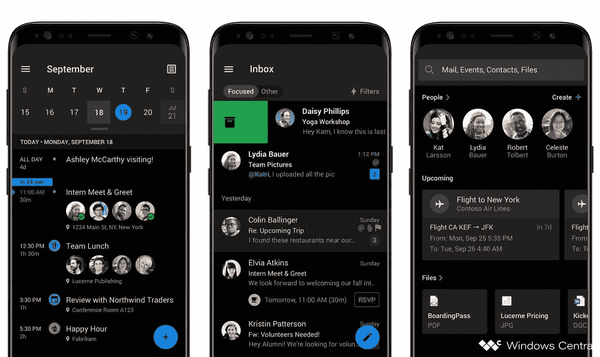

# 微软 Outlook 即将推出的 Android 黑暗模式泄露

> 原文：<https://www.xda-developers.com/microsoft-outlook-dark-mode-android-leak/>

**更新(美国东部时间 8/28/19 @下午 2:20):**微软正式在其 Outlook 电子邮件应用中推出黑暗模式。

黑暗模式让许多人垂涎三尺，因为它给任何应用程序的美学带来了巨大的改进。谷歌一直在构建对全系统黑暗主题的支持，从 [Android Q](https://www.xda-developers.com/tag/android-q/) 开始，以及帮助开发者在第三方应用中集成黑暗模式的 API。许多谷歌自己的应用程序，如 [Google Keep](https://www.xda-developers.com/google-keep-notes-dark-mode/) ，部分[谷歌应用程序](https://www.xda-developers.com/google-app-dark-theme-search-discover/)，[照片](https://www.xda-developers.com/google-photos-dark-theme-roll-out/)，[文件](https://www.xda-developers.com/files-by-google-dark-theme/)，以及最近的 [Google Fit](https://www.xda-developers.com/google-fit-dark-theme/) 也开始接受内置的黑暗主题切换。微软一直在努力通过承诺 Android-Windows 同步来吸引 Android 用户，也一直在研究其应用程序中的黑暗模式，电子邮件客户端 Outlook 应该是最早的一批。

根据 [*Windows Central*](https://www.windowscentral.com/outlook-androids-upcoming-new-dark-mode) ，他们能够挖掘出与微软 Outlook 相关的官方渲染。这些渲染在 Android 和 iOS 的 Outlook 应用程序中的日历功能、收件箱和搜索菜单中显示为黑暗模式。黑暗主题可以使用导航抽屉(汉堡菜单)内的切换按钮或使用应用程序设置中的专用“主题”选项来打开。

 <picture></picture> 

Microsoft Outlook dark mode preview, courtesy of Windows Central

我们不确定 Outlook 应用程序中黑暗模式的可用性。鉴于微软对此还没有官方说法，我们可以期待在该功能真正面向所有用户之前会有一个测试阶段。

值得注意的是，Outlook 的桌面应用和网络应用都已经有了黑暗模式，Windows 10 上的邮件应用也是如此。由于 Windows Phone 界面从一开始就可以在亮暗主题之间切换，我们知道微软倾向于这种灵活性。随着谷歌和苹果都在 Android 和 iOS 中采用固有的黑暗模式，微软似乎有很好的机会通过将黑暗模式作为一个重要功能向用户出售其应用程序。我们也希望这能阻止微软在用户应用程序之外的不寻常的地方向用户发送广告。

* * *

## 更新:推出

在微软的 Outlook 黑暗模式于 7 月泄露后，该公司现在正式推出其 Android 应用程序的更新。事实上，微软将把黑暗模式引入其整个办公移动应用舰队:Word、Excel、PowerPoint、SharePiont、OneDrive 和 Planner。对于 Android 和 iOS 上的 Outlook，这一切都从今天开始。你可以在下面的 Medium 帖子中了解微软历时一年多的设计过程。

**来源:[媒介](https://medium.com/microsoft-design/designing-dark-mode-31400530787a) |途径:[边缘](https://www.theverge.com/2019/8/28/20835008/microsoft-outlook-ios-android-office-dark-mode-launch-ios-13)**