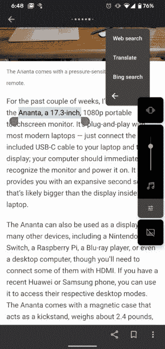

# 微软 Outlook 正在 Android 的长按菜单中插入必应搜索

> 原文：<https://www.xda-developers.com/microsoft-outlook-long-press-menu-bing-search/>

微软开发了一些非常棒的安卓应用，但是该公司发现自己在如何推广他们的应用上一直处于水深火热之中。去年，微软将 OneDrive 的广告插入 Android 的共享表中。最新的策略包括通过 Android 上的 Outlook 推广必应搜索。

一些在 Pixel 社区论坛(via[*AndroidPolice*](https://www.androidpolice.com/2020/07/13/microsoft-caught-sneaking-bing-search-onto-phones-with-the-outlook-app/))上安装了 Outlook 应用程序的 Android 用户[注意到，在长按上下文菜单中有一个新的“必应搜索”选项。令人不安的是，这些用户不仅没有安装 Bing 应用程序，而且只要你长按任何文本，Bing 搜索选项就会出现在整个系统中。点击此选项将在 Outlook 内置浏览器中打开 Bing 搜索。](https://support.google.com/pixelphone/thread/56980989?hl=en)

 <picture></picture> 

Credits: [Ilija](https://support.google.com/pixelphone/profile/56980988?hl=en)

我们对 Outlook 应用程序做了一个简单的分析，以确认这种行为确实源于该应用程序。不过似乎也需要用户安装了微软 Edge 才能触发。Outlook 在其清单文件中有一个意图过滤器，使其能够在突出显示文本时显示在长按上下文菜单中。但是，除非启用特征标志“边集成”，否则此意图过滤器被禁用。

```
 <activity android:configChanges="0x4a0" android:enabled="false" android:label="@string/browser_bing_search" android:name="com.microsoft.emmx.webview.search.SearchBridgeActivity" android:theme="@style/BrowserDefaultLightTheme">
<intent-filter>
<action android:name="android.intent.action.PROCESS_TEXT"/>
<category android:name="android.intent.category.DEFAULT"/>
<data android:mimeType="text/plain"/>
</intent-filter>
</activity> 
```

在安装 Outlook、登录、安装 Edge 并将其设为默认浏览器后，我可以让 Bing 快捷方式显示出来。卸载 Outlook 后，Bing 搜索快捷方式消失了。重新安装 Outlook 后，我无法让它再次显示。因此，我们不能 100%确定如何触发“边缘集成”特征标志。

不管怎样，这是对上下文菜单的公然滥用，也是为必应做广告的不恰当方式。将菜单用于某种 Outlook 功能是没问题的，因为用户是有目的地安装应用程序的。然而，假设一个用户会因为使用 Outlook 和 Edge 而想要阿炳快捷方式就太离谱了。如上所述，微软*的确*有不错的产品，但这不是让人们使用它们的方式。