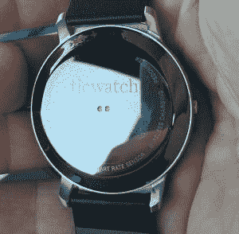

# Mobvoi 从中国走向全球的旅程 Ticwatch 2

> 原文：<https://www.xda-developers.com/mobvois-journey-from-china-to-a-global-ticwatch-2/>

**文章更新:**美国中部时间 2014 年 7 月 7 日上午 11:30

众所周知，谷歌在中国面临着自己的挑战；但是他们的应用程序的替代品一定会出现。 [Mobvoi 由一名前谷歌员工于 2012 年创立](http://www.chumenwenwen.com/en/about/index.html),旨在将中国以外的一些解决方案引入中国。

首先，它为 2013 年中国最大的即时通讯应用微信开发了一个语音搜索引擎。那年晚些时候，他们发布了一款基于语音搜索的独立应用程序，名为 Chumenwenwen。2014 年，他们超越了应用程序，发布了名为 Ticwear 的智能手表定制版 Android。由于谷歌应用程序在中国不可用，他们提供了语音搜索引擎和在中国流行的应用程序，如微信。

2014 年末，他们与 Frog Design 合作实现他们的下一个目标——[一款真正为中国消费者打造的智能手表](http://www.frogdesign.com/work/mobvoi.html)。直到 2015 年 6 月，他们才为 Ticwatch 推出了相当于 Kickstarter 的[。他们的希望是采购额达到大约 15，000 美元。个人级别最低约为 150 美元，可购买一块 Ticwatch。结果令人震惊——目标在发布后几天内就破灭了。Ticwatch 价值超过 120 万美元，拥有超过 15，000 名支持者，是中国有史以来最成功的智能手表。去年与 Android Wear 的战略合作伙伴关系对 Moto 360 在中国推出 Mobvoi 应用程序取代谷歌屏蔽的应用程序产生了影响。谷歌甚至在 2015 年采取了不同寻常的步骤投资 mob voi——金额从未披露，但被定义为少数股权。](http://z.jd.com/project/details/12711.html)

 随着新闻走出中国，Mobvoi 收到了来自中国以外的 Ticwatch 粉丝的请求，希望将其全球化。毕竟，谁不想看到 160 美元的智能手表给市场带来一个挑战者呢？翻译显然是其中的一部分，但是如果翻译没有经过测试，对用户来说不实用，那就没什么用了。因此，4 月份，他们在脸书召集了 100 名测试人员，帮助测试 Ticwear 即将推出的英语支持。当我发现这一点时，我自然很感兴趣。我提出了申请，并被该计划接受，大约 10 天后收到了最初的 Ticwatch。(**撰稿人注意:**我事先向 Mobvoi 透露，我可能想在对潜在测试者的采访过程中写一些关于 Ticwatch 的内容，但没有得到这样做的保证。)

在过去的 3 个月里，我和其他人一直在向 Mobvoi 工程师提供反馈，以帮助他们更好地调整翻译工作，确保发布的版本既稳定又易于英语用户使用。反馈非常好，不仅在 UI 上，而且在一般功能上。Mobvoi 的语音搜索引擎仍在开发中——它可以做像告诉天气和打电话这样的功能，但有时可能会发送到搜索引擎，而不是不同的答案。因为 Ticwatch 没有附带谷歌应用程序，所以它与一个配套应用程序配对。这款配套应用程序有助于为 Mobvoi 的应用程序设置一些更常见的设置，如佩戴者的位置和健康信息。配套应用程序中还有一个 Mobvoi 应用程序商店的界面，其中包含不同的手表表面和应用程序，目前仍然是为中国市场量身定制的。Mobvoi 在讨论中提到，他们正在考虑接触开发者，试图通过邀请应用程序进入他们的应用程序商店来帮助扩大市场。

所有这些都将在 Ticwatch 2 的全球发布中达到高潮。虽然上个月在中国推出，但 Mobvoi 将通过 Kickstarter 进行全球发布，目前估计将于 7 月 19 日~~19 日~~26 日(*今天早些时候由 Mobvoi* 更新)。中国阵容中已经公布了四款车型:一款全白或全黑运动款，硅表带；全黑款，配有钢表带；和一只棕色皮表带的银手表。Mobvoi 的 Sixuan Gong 询问是否有人有兴趣在 Kickstarter 发布之前了解更多信息，以加入他们在脸书的[全球发布页面。他们还提供了将在全球发布的型号的规格和样本照片，下面列出供您查看。虽然 Kickstarter 活动的水平尚未得到确认，但 Mobvoi 已经确认将提供低于 100 美元的水平。](https://www.facebook.com/groups/577584915748399/)

我已经联系了 Mobvoi，希望能在全球发布时进行问答。如果发生这种情况，我们将很高兴在 Kickstarter 上发布 Ticwatch 2 全球发布的详细信息。

## Ticwatch 2(全球)规格:

*   **屏幕:** 1.4 英寸/36 毫米有机发光二极管显示屏，287 ppi
*   **处理器:**联发科 MT2601，2 核@ 1.2GHz
*   **内存:** 512MB 内存，4GB 存储
*   **通信:**蓝牙 4.1 版(低功耗)，802.11 b/g/n
*   **传感器:**动态光学心率传感器、加速度计、陀螺仪、GLONASS/GPS
*   **其他硬件:**线性电机、防噪音麦克风、扬声器
*   **防水:** IP65 等级
*   **表带:**20 毫米(宽)
*   **电池:**300 毫安时，启用 TiCharge(允许在大约 1.3 小时内充满电)
*   [**挠条**](http://www.frogdesign.com/work/mobvoi.html) 藏在壳下。这显然与最初 Ticwatch 的侧面位置不同。

## Ticwatch 2(全球)示例照片:

***那么你觉得 Ticwatch 怎么样？估计价格为 160 美元，这会引起您的兴趣吗？欢迎在下面评论继续讨论！***