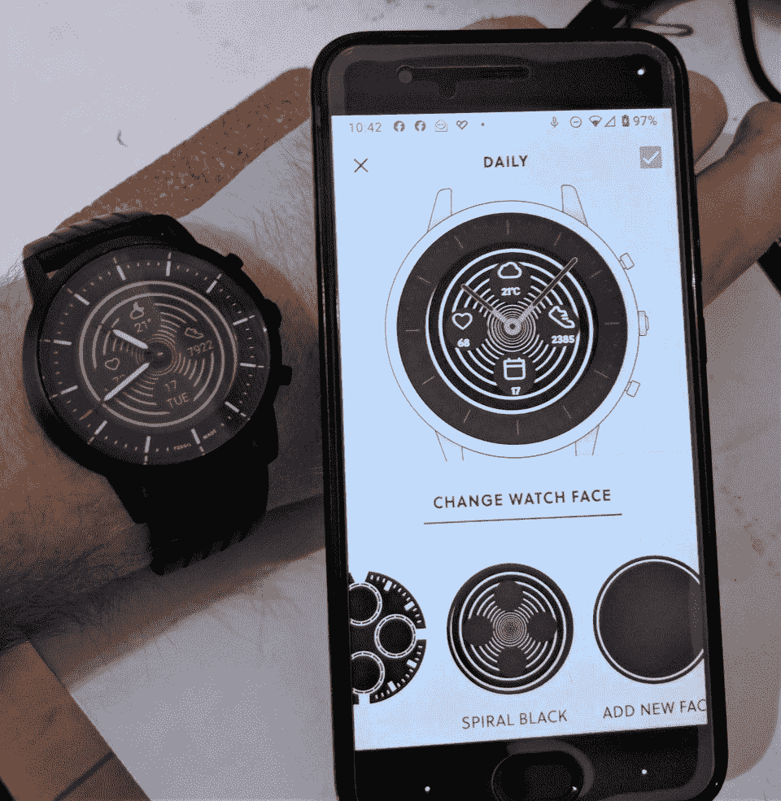

# 修改后的 Fossil 智能手表应用程序将通知支持扩展到 Fossil Hybrid HR 上的更多应用程序

> 原文：<https://www.xda-developers.com/modded-fossil-smartwatches-app-notification-support-hybrid-hr/>

# 修改后的 Fossil 智能手表应用程序将通知支持扩展到 Fossil Hybrid HR 上的更多应用程序

Fossil Hybrid HR 的功能依赖于 Fossil Hybrid 智能手表应用程序，但它们可能会有所欠缺。这个修改的应用程序修复了几个问题。请继续阅读！

化石混合动力 HR 是最有趣的智能手表之一。混合人力资源没有选择 Android Wear 平台上的成熟智能手表，而是选择了传统的手表表盘和物理表针，以及低功耗的单色常亮显示屏。这使得手表始终保持手表的状态，同时提供健身跟踪功能、天气信息和应用程序通知等功能，以及出色的电池续航时间。然而，一些功能是通过[官方 Fossil Hybrid 智能手表应用](https://play.google.com/store/apps/details?id=com.fossil.wearables.fossil&hl=en_IN)处理的，该应用缺少一些功能。如果你希望实现混合智能手表的全部潜力，请查看这个修改后的 Fossil 混合智能手表应用程序。

这个由 Reddit 用户 [/u/coronafire](https://www.reddit.com/user/coronafire/) 修改的 Fossil Hybrid 智能手表应用开始是为了解决官方手表中存在的一些限制。官方应用此前仅支持少数应用的通知，无法显示其他应用的任何通知。因此，修改后的应用程序修复了这个问题，并引入了一种方法来显示发送通知的应用程序的图标。修改后的应用程序还允许手表尊重手机的免打扰设置，这是一个奇怪的功能。开发人员还在为显示使用自定义背景而[工作，但官方应用程序现在已经加入了相同的功能，以及显示更多应用程序通知的能力。](https://www.reddit.com/r/FossilHybrids/comments/ebuwgx/coming_soon_to_a_hacked_app_near_you/)

 <picture></picture> 

The custom background feature as teased by the dev of the mod

官方应用程序仍然不能正确显示这些通知的图标，也没有集成免打扰功能，因此修改后的应用程序仍然保留了实用性。

**[改装化石混合智能手表 app](https://www.reddit.com/r/FossilHybrids/comments/ecb5su/hybrid_hr_patched_android_app_v2401_with_dnd_and/)**

由于这是官方应用程序的一个 mod，你需要卸载官方应用程序来安装这个，因为应用程序签名的签名发生了变化，因为它的非官方性质。如果你担心应用的非官方性质，你可以随时[查看源代码，因为 mod 是开源的](https://gitlab.com/alelec/fossil_smartwatches_alelec_android)。