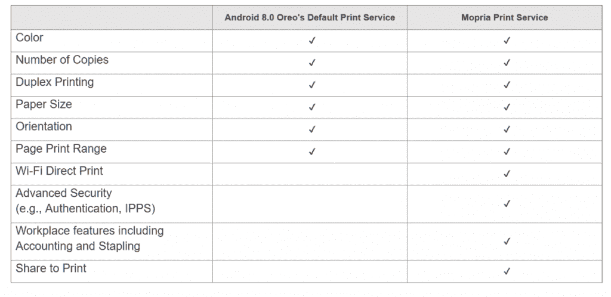

# Mopria 打印服务通过 Android 获得工作支持、整理、输出托盘选择等方面的更新

> 原文：<https://www.xda-developers.com/mopria-print-service-android-for-work-support/>

# Mopria 打印服务通过 Android 获得工作支持、整理、输出托盘选择等方面的更新

Mopria Alliance 的 Mopia Print Serivce 应用程序已更新，支持 Android 工作、整理和许多改进。继续阅读，了解更多信息！

直接从智能手机打印文档是 Android 上一个被低估的功能，但这是有原因的。体验并不是最好的，因为早期版本的 Android 甚至不支持打印。[谷歌的云打印应用](https://www.xda-developers.com/how-to-print-android/)试图给混乱带来一些秩序，而安卓 4.4。Kitkat [以 Android 打印框架](https://www.xda-developers.com/history-of-printing-in-android/)的形式引入了一些准系统 API。这一变化促使最大的打印机制造商走到一起，组成了 [Mopria 联盟](https://mopria.org/)，目标是为移动设备提供简单的无线打印解决方案。Mopria 打印服务就是这种合作的结果。

Mopria 打印服务允许 Android 智能手机在同一无线网络上或通过 WiFi Direct 直接打印到 Mopria 认证的打印机。Mopria 联盟的成员包括兄弟、佳能、爱普生、富士施乐、惠普、京瓷、联想、三星、夏普、东芝、施乐等大牌；因此，您可以放心，有各种各样的产品可以满足您的需求，同时获得 Mopria 认证。您可以[在这里](http://mopria.org/certified-products)查看您的打印机是否经过 Mopria 认证。Mopria Print Services 预装在一些 Android 设备上(并且完全不可卸载),但如果没有，你可以通过谷歌 Play 商店安装该应用程序。

 <picture></picture> 

Feature difference between Android Oreo's Default Print Service and the Mopria app. Source: Mopria.

Mopria Print Service 的[先前更新](https://www.xda-developers.com/mopria-print-service-multi-hole-punch-multiple-finishing-options/)之一带来了对多孔打孔机的支持，以及选择多个装订选项的能力。该应用的最新更新现在带来了一些更关键的功能，如支持 [Android for work](https://www.xda-developers.com/google-announces-android-for-work-devhub-a-collaborative-forum-for-developers/) 、collation 等。

变更日志:

*   将墨水和碳粉量信息添加到打印机信息屏幕
*   支持 Android 工作
*   支持整理和输出托盘选择
*   对某些打印机上的双面打印进行了改进
*   额外的可靠性改进和缺陷修复

[app box Google play org . mop RIA . print plugin]