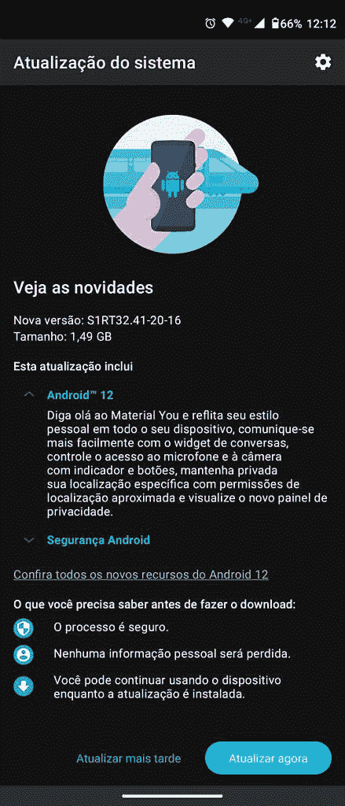

# Moto G100 开始在特定地区接收稳定的 Android 12 更新

> 原文：<https://www.xda-developers.com/moto-g100-android-12-update-rollout/>

# 摩托罗拉开始向摩托 G100 推出稳定的 Android 12

摩托罗拉已经开始为巴西的 Moto G100 推出稳定的 Android 12 更新。请继续阅读，了解更多关于更新的信息。

上周，摩托罗拉开始为摩托罗拉 Edge (2021 年)和摩托罗拉 Edge Plus(T1)推出稳定的 Android 12 更新。该公司现在给了 Moto G100 同样的待遇，根据我们论坛上最近的一篇帖子，更新已经开始向巴西用户推出。

Moto G100(型号 XT2125-4-DS)的 Android 12 更新正在向巴西用户推出。它的内部版本号为 S1RT32.41-20-16，大小约为 1.5GB。此次更新介绍了谷歌在 [Android 12](https://www.xda-developers.com/android-12/) 中引入的所有新功能以及 2022 年 3 月的 Android 安全补丁。虽然摩托罗拉到目前为止还没有分享任何关于推出的官方信息，但我们预计该公司将在未来几周内在其他地区发布类似的更新。

 <picture></picture> 

Credit: XDA MEmber hOtttBRA

如果您尚未收到更新，您可以转至设备设置中的“软件更新”部分来手动检查更新。您可能不会立即看到 OTA 通知，因为更新可能会分阶段进行。这意味着它最初应该只覆盖少数用户，接下来的几天将会有更大范围的推广。这种分阶段的首次展示允许摩托罗拉分析更新的稳定性，避免同时向所有用户推送潜在的错误更新。

如果你不知道摩托罗拉的 Android 12 版本会带来什么，这里有一个简短的回顾。此次更新包括一系列新的 Android 12 功能，从你设计美学的全新材料，基于壁纸的主题化，改进的小工具和隐私仪表板。此外，摩托罗拉还在其定制的 Android 皮肤 My UX 中加入了一些附加功能，包括新的相机功能和新的“就绪”体验。

你的 Moto G100 收到 Android 12 更新了吗？请在下面的评论区告诉我们。

* * *

**资料来源:** [摩托车 G100 XDA 论坛](https://forum.xda-developers.com/t/android-12-for-g100-retail-brazil.4436909/)