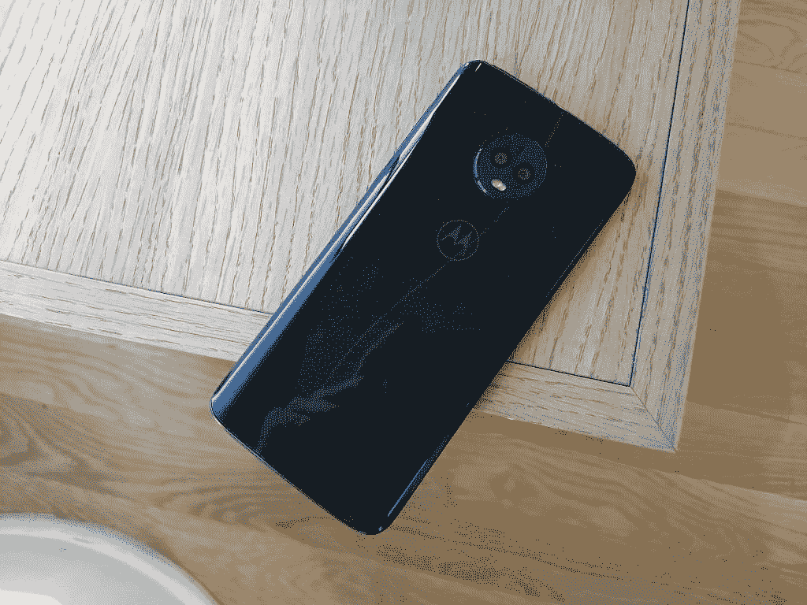
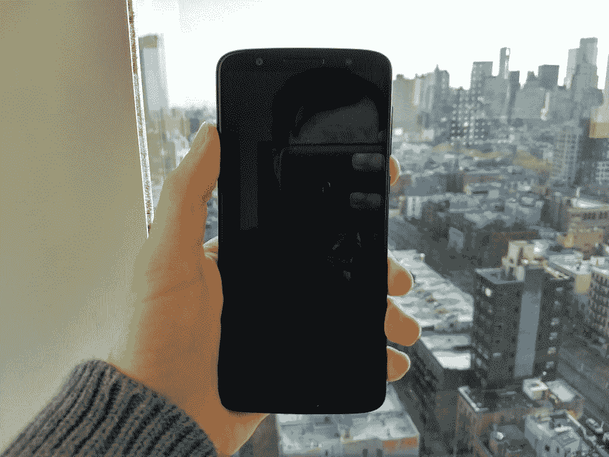
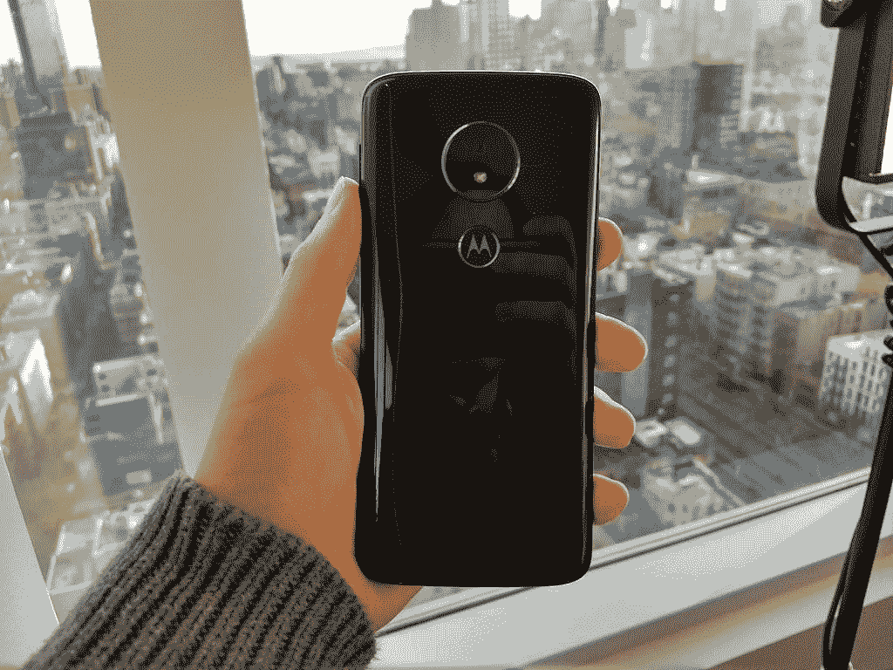
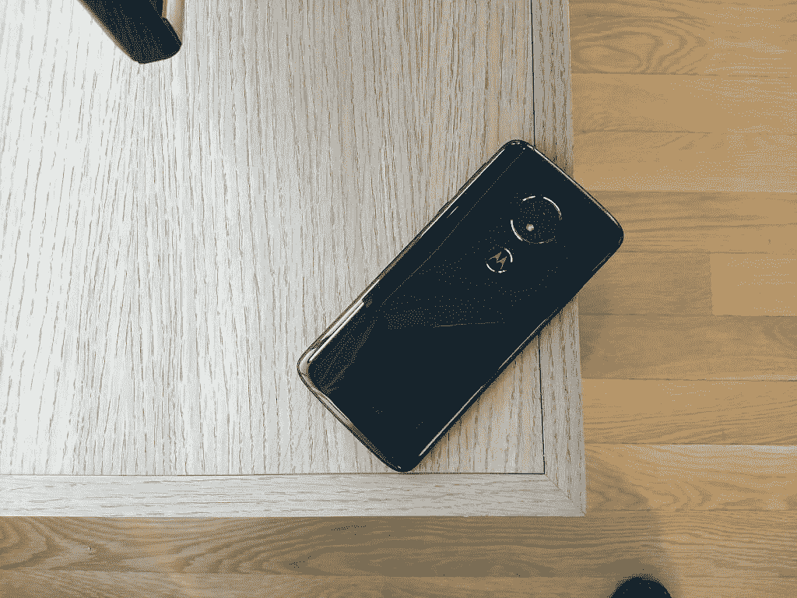
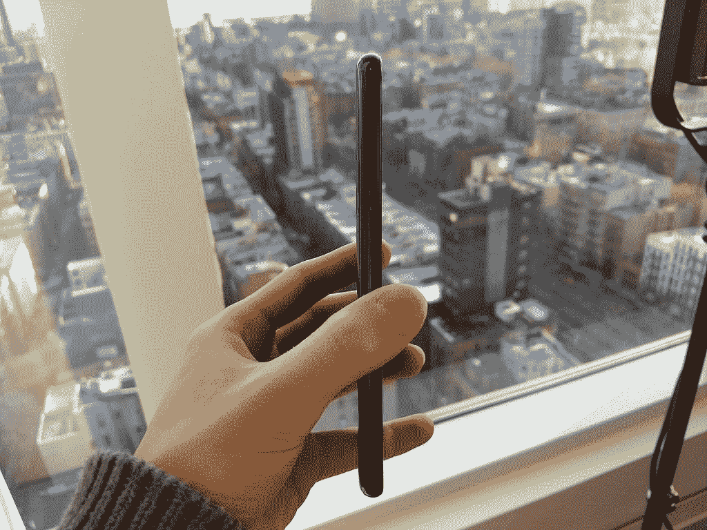
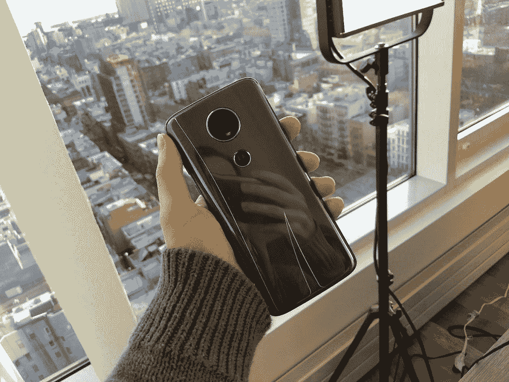
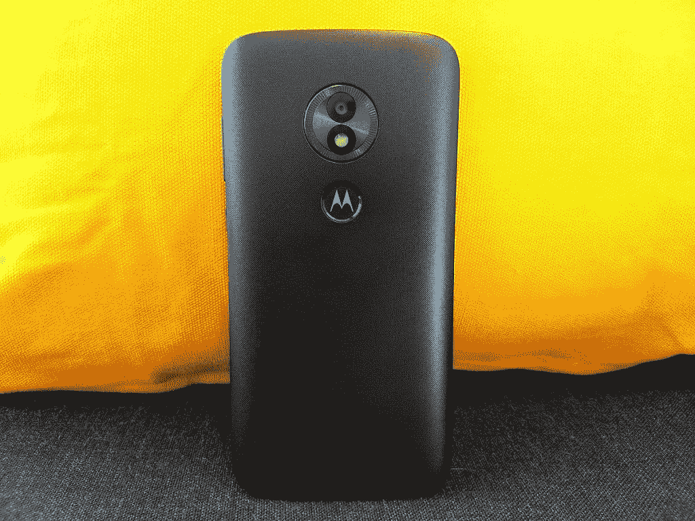

# Moto G6、Moto G6 Play、Moto E5 Play 和 Moto E5 Plus hand-on

> 原文：<https://www.xda-developers.com/moto-g6-play-moto-e5-play-hands-on/>

[摩托罗拉](http://xda-developers.com/tag/motorola)，芝加哥[联想](http://xda-developers.com/tag/lenovo)的子公司，偶然发现了一个成功的战略，推出了 [Moto E](http://xda-developers.com/tag/moto-e) 和 [Moto G](http://xda-developers.com/tag/moto-g) 系列。中低端智能手机在印度等发展中市场仍然非常受欢迎，该公司迄今在印度的出货量已超过 600 万部。但它们在美国也是最畅销的，在美国，它们受到预付费运营商和亚马逊等零售商的补贴(例如，作为 [Prime 独家智能手机](https://www.xda-developers.com/amazon-prime-exclusive-smartphones-will-no-longer-have-lockscreen-ads/)的一部分)。从某种意义上来说，摩托罗拉只是让其 2018 年的钱包友好型设备系列 Moto G6、Moto G6 Play、Moto G6 Plus、Moto E5 Plus 和 Moto E5 Play 保持运转。

但这不仅仅是一成不变。这一次，该公司做出了真正的尝试，既(1)解决去年设备的缺点，又(2)使 Moto G 和 Moto E 系列符合行业趋势。在今天发布之前的新闻发布会上，我们有机会试用了 Moto G6、Moto G6 Play、Moto E5 Plus 和 Moto E5 Play，并留下了深刻的印象。

* * *

## 摩托罗拉 Moto G6 和 Moto G6 Play

 <picture></picture> 

Moto G6.

## Moto G6

| 

Moto G6

 | 

规范

 |
| --- | --- |
| 尺寸和重量 | 153.8 x 72.3 x 8.3 毫米，167 克 |
| 软件 | 安卓 8.0 奥利奥 |
| 中央处理器 | 八核高通骁龙 450(4 个主频为 1.8GHz 的 ARM Cortex-A53+4 个主频为 1.8GHz 的 Cortex-A53) |
| 国家政治保卫局。参见 OGPU | Adreno 506 的时钟频率为 600MHz |
| RAM 和存储 | 3GB 内存和 32GB 存储空间/ 4GB 内存和 64GB 存储空间，最高支持 128GB 的可扩展 microSD 卡 |
| 电池 | 3000mAh，15W 涡轮动力充电 |
| 显示 | 5.7 英寸全高清+ (2160x1080) MaxVision IPS 液晶屏，宽高比为 18:9 |
| 无线保真 | 802.11a/b/g/n 2.4 GHz + 5 GHz |
| 蓝牙 | 蓝牙 4.2 EDR 和 BLE |
| 连通性 | USB 类端口，Nano SIM |
| 后置摄像头 | 1200 万像素和 500 万像素双后置摄像头 f/1.8 光圈地标识别、物体识别、文本扫描仪、人像模式、专色、面部滤镜、全景、手动模式最高 1080p (60 fps)延时视频、慢动作视频 |
| 前置摄像头 | 8mp 多人自拍模式、手动模式、高达 1080p (30 fps)的面部滤镜、延时视频、慢动作视频 |
| 拒水的 | 防水涂料(p2i) |
| 扬声器 | 前端口扬声器 |
| 网络波段 | LTE: B1、2 (1900)、3 (1800)、4 (1700/2100)、5 (850)、7 (2600)、8、12(下 700 abc)、13(上 700)、17(下 700 bc)、20(漫游)、25 (1900+)、26 (850+)、28 (700 APT)、29、30、38、41(完整)、66(AWS 3+4)ums |
| 传感器 | 指纹读取器、加速度计、陀螺仪、环境光、接近度、磁力计(电子罗盘)、超声波 |

与往年不同，今年摩托罗拉将在美国发布两款 G 系列智能手机:Moto G6 和 Moto G6 Play。(加强版的 Moto G6 Plus 不会在美国上市。Moto G6 拥有八核高通片上系统(SoC)，而 Moto G6 Play 拥有四核 SoC；一个 3000 毫安的电池和 G6 Play 的 4000 毫安的电池；高清+ (720p)屏幕，而不是全高清+ (1080p)屏幕；和 USB-C 端口而不是微型 USB 端口。稍后将详细介绍。

### 设计和展示

Moto G6 是 G 系列中第一款采用 18:9 宽高比的显示屏，非常华丽。5.7 英寸全高清+“Max Vision”LCD 有多层层压，与玻璃相当接近；虽然 Moto G5 的玻璃屏蔽和屏幕之间有一个间隙，但 Moto G6 的触摸屏和数字化仪几乎直接位于表面下方。色彩明亮，视角明显改善。在我的测试中，我没有观察到任何失真，甚至远远超过了 120 度的标记。

Moto G6 解决的另一个 Moto G5 痛点是背板:它是玻璃而不是塑料。摩托罗拉选择了厚且明显比 Moto G5 的塑料聚合物更重的[大猩猩玻璃](http://xda-developers.com/tag/gorilla-glass) 3 保护罩，这给手机带来了高级感，但没有增加太多重量。

 <picture></picture> 

Moto G6.

更大的显示屏需要 G6 上更宽的指纹传感器。它与 Moto G5、G5 Plus 和 [G5S Plus](http://xda-developers.com/tag/g5s-plus) 的位置相同，也就是说，靠近底部挡板，在浮雕摩托罗拉标志下方。在我的测试中，它快速、准确、相当宽容——即使是部分指纹扫描也足以解锁手机并召唤主屏幕。与之前的 Moto G 系列手机一样，G6 通过 Moto Actions 支持手势。例如，“一键导航”模式取消了 Android 的软件导航键，用向左滑动取代了后退按钮，用向右滑动取代了多任务菜单，用轻触取代了主页按钮。

当然，指纹传感器不是强制性的。G6 和 G6 Play 的前置 800 万像素摄像头(带 LED 闪光灯)支持基本的[面部识别](http://xda-developers.com/tag/face-unlock)的那种[华为](http://xda-developers.com/tag/huawei)、[小米](http://xda-developers.com/tag/xiaomi)、 [LG](http://xda-developers.com/tag/lg) 、[一加](http://xda-developers.com/tag/oneplus)，其他原始设备制造商(OEM)最近都落后了。这在紧要关头很方便——只需几分之一秒就能鉴定一张脸——但显然不如指纹扫描安全。

在引擎盖下，Moto G6 采用了 14 纳米高通[骁龙 450](https://www.xda-developers.com/qualcomm-snapdragon-450-wear-fingerprint-sensors/) (和 3GB/4GB 内存)芯片，搭配 600MHz Adreno 506 图形处理器(GPU)和 32GB/64GB 内部存储(通过 microSD 卡可扩展至 128GB)。高通于 2017 年 6 月发布的这款 SoC 由两组四个 Cortex-A53 内核组成，主频为 1.8GHz，据称整体性能比其前身骁龙 435 提高了 25%。

 <picture></picture> 

Moto G6 Play.

## Moto G6 Play

| 

Moto G6 Play

 | 

规范

 |
| --- | --- |
| 尺寸和重量 | 154.4 x 72.2 x 9 毫米，175 克 |
| 软件 | 安卓 8.0 奥利奥 |
| 中央处理器 | 四核高通骁龙 427(4 个 ARM Cortex-A53，主频 1.4GHz) |
| 国家政治保卫局。参见 OGPU | 肾上腺素 308 |
| RAM 和存储 | 2GB 内存和 16GB 存储空间/ 3GB 内存和 32GB 存储空间，最高支持 128GB 的可扩展 microSD 卡 |
| 电池 | 4000mAh，10W 充电 |
| 显示 | 5.7 英寸高清+ (1440x720) MaxVision IPS 液晶屏，宽高比为 18:9 |
| 无线保真 | 802.11a/b/g/n 2.4 GHz + 5 GHz |
| 蓝牙 | 蓝牙 4.2 EDR 和 BLE |
| 连通性 | microUSB 端口，Nano SIM |
| 后置摄像头 | 1300 万像素相位检测自动对焦(PDAF)f/2.0 光圈全景模式，手动模式高达 1080p (30 fps)慢动作视频 |
| 前置摄像头 | 8mp 手动模式高达 1080p (30 fps)慢速运动视频前置闪光灯 |
| 拒水的 | 防水涂层(p2i) |
| 扬声器 | 前端口扬声器 |
| 网络波段 | GSM/GPRS/EDGE: (850、900、1800、1900 MHz)UMTS/HSPA+: (B1、2、4、5、8)TDD LTE: B38/41(全 HPUE)FDD LTE:B1/2/3/4/5/7/8/12/13/14/17/25/26/29/30/66 CDMA:BC0/BC1/BC10 |
| 传感器 | 指纹读取器、加速度计、陀螺仪、环境光、接近度、磁力计(电子罗盘) |

另一方面，Moto G6 Play 采用 1.4Ghz 高通[骁龙 427](https://www.xda-developers.com/introducing-qualcomm-snapdragon-653-626-427-qualcomm-announces-successors-popular-mid-range-socs/) SoC(搭配 2GB/3GB 内存)，配有 Adreno 308 和 16GB/32GB 内部存储(可通过 microSD 卡扩展至 128GB)。这与去年的 [Moto E4 Plus](https://www.xda-developers.com/moto-e4-plus-india/) 的美国版本中的芯片相同，但我们采访的摩托罗拉代表淡化了性能和电池效率的差异。我们被告知，Moto G6 和 Moto G6 Play 的 CPU 调节器针对能效进行了优化——它尽可能地提升处理器内核。事实上，除了要求特别高的应用程序和视频游戏之外，Moto G6 和 Moto G6 Play 内核全速运行的少数时间之一是在启动时。

在做出判断之前，我们必须测试一下 Moto G6 和 Moto G6 Play 的性能，但这两款手机看起来都非常迅速。在切换应用程序或启动手机摄像头时，我们没有发现任何卡顿或反应迟钝的情况，骁龙 450 相对于骁龙 427 的优势也没有立即显现出来。不过，一个明显的区别是 G6 Play 芯片组不支持 15W TurboPower。它的快速充电输出功率为 10W。

### 照相机

Moto G6 的后置摄像头是一个双传感器模块:一个 1200 万像素的传感器和一个 500 万像素的传感器(f/1.8 光圈和 1.25 微米像素大小)。它以每秒 60 帧的速度拍摄分辨率高达 1080p 的视频，当它检测到运动时，它会拍摄像剪辑一样的短[运动静止图像，但真正的亮点是新的实时照片效果。摩托罗拉重新设计的相机应用程序最近以无线更新的形式出现在 Moto G5 系列中，它提供了一种类似于](https://www.xda-developers.com/motion-stills-stabilizing-live-photos-android/)[的人像模式](http://xda-developers.com/tag/portrait-mode)，可以模糊照片的背景，同时保持前景清晰，以及一种单色模式，可以为照片中的一个对象着色，而将其余部分渲染为黑白。

 <picture></picture> 

Moto G6 Play.

还有一种新的“单一色调”模式，可以将色谱的一部分与图像的其余部分隔离开来。例如，在我使用 Moto G6 的时间里，我拍了一张纽约市天际线的照片，并挑出了明亮的蓝天，这突出了框架中所有其他蓝色建筑、广告牌和物体，并耗尽了它们的其余颜色。取景器中的实时增强现实预览效果非常漂亮。

不幸的是，你不会在 Moto G6 Play 上找到任何选择性对焦或“单一色调”模式，它装有一个单个 1300 万像素的 f/2.0 光圈相机。但这两款手机都配备了摩托罗拉的 Snapchat [Snap Lens](https://www.xda-developers.com/snaps-lens-studio-lets-anyone-design-custom-snapchat-lenses/) 风格的增强现实贴纸，包括兔子耳朵和胡须以及其他有趣的数字面具，可以与 [Facebook Messenger](http://xda-developers.com/tag/facebook-messenger) 、 [Hangouts](http://xda-developers.com/tag/hangouts) 以及 Android 上的任何其他消息应用程序配合使用。我为摩托罗拉的克制鼓掌，在这里-你不会在 G6 和 G6 游戏中找到类似的东西。[注意，三星](https://www.xda-developers.com/samsung-galaxy-s9-s9-plus-hands-on/)。

Moto G6 还具有摩托罗拉的人工智能辅助物体和地标识别技术，该技术于 2017 年 8 月在 [Moto X4](http://xda-developers.com/tag/moto-x4) 上首次亮相。相机应用程序结合使用 GPS 定位和机器学习，尽最大努力找出你正在看的东西，无论是帝国大厦、条形码还是餐盘。(由于光学字符识别(OCR)，它还可以识别名片，并将其扫描到您的联系人中。)我看到一位摩托罗拉代表给一个装满钢笔的酒杯拍了张照片，Moto G6 就在眼前，返回了“无柄酒杯”的搜索结果。

 <picture></picture> 

Moto G6 Play.

有人可能会说[谷歌镜头](http://xda-developers.com/tag/google-lens)消除了其中一些功能，但摩托罗拉坚持认为它们是为了补充而不是取代镜头。例证:一名摩托罗拉代表告诉 *XDA 开发者，该公司放弃了它已经开始建立的内部地标数据库，并开始将这些搜索卸载给谷歌助手和镜头。*

但该公司不愿放弃自己开发的语音助手 Moto Voice。在 G6 和 G6 Play 上，它是通过一句话“演示给我看”来召唤的，它与谷歌助手一起工作。你可以让它显示你的日历、下次会议、日程安排和天气，或者让它绕过锁屏。

Moto G6 Plus 和 Moto G6 的硬件还包括单前置扬声器、蓝牙 4.2、双频 Wi-Fi (2.4 GHz + 5 GHz)，并支持美国所有主要的 LTE 频段。Moto G6 Plus 的起价为 199 美元，Moto G6 的起价为 249 美元。

* * *

# 摩托罗拉 Moto E5 Plus 和 E5 Play

 <picture></picture> 

Moto E5 Plus.

## 摩托车 E5 Plus

| 

摩托车 E5 Plus

 | 

规范

 |
| --- | --- |
| 尺寸和重量 | 161.9 x 75.3 x 9.35 毫米(摄像头凸起 0.4 毫米)，200 克 |
| 软件 | 安卓 8.0 奥利奥 |
| 中央处理器 | 八核高通骁龙 435(4 个时钟为 1.4GHz 的 ARM Cortex-A53+4 个时钟为 1.4GHz 的 ARM Cortex-A53) |
| 国家政治保卫局。参见 OGPU | 肾上腺素 505 |
| RAM 和存储 | 3GB 内存和 32GB 存储空间，最高支持 128GB 的可扩展 microSD 卡 |
| 电池 | 5000mAh，15W 涡轮动力充电 |
| 显示 | 6 英寸高清+ (1440x720) MaxVision IPS 液晶屏，宽高比为 18:9 |
| 无线保真 | Wi-Fi 802.11 a/b/g/n |
| 蓝牙 | 蓝牙 4.2 EDR 和 BLE |
| 连通性 | microUSB USB 2.0 端口，单个 Nano SIM 卡，3.5 毫米耳机插孔 |
| 国家足球联盟 | 不 |
| 后置摄像头 | 12MP，f2.0，1.25um 大像素，LED 闪光灯，PDAF(相位检测自动对焦)，激光自动对焦，HDR，全景，手动模式，连拍，最佳拍摄，二维码/条形码扫描仪，慢动作模式，视频稳定，1080p 视频，30fps |
| 前置摄像头 | 800 万像素，f2.2 光圈，1.12um 像素大小，自拍闪光灯/光 |
| 拒水的 | 防水涂层(p2i) |
| 扬声器 | 前置扬声器，双麦克风 |
| 网络波段 | 4G LTE (Cat6)、CDMA / EVDO Rev A、UMTS / HSPA+、GSM / EDGE4G: TDD LTE 频段 41(全)FDD LTE 频段 1/2/3/4/5/7/8/12/13/14/17/25/26/29/30/38/66 3G:WCDMA 频段 1/2/4/5/8 2G: GSM 频段 2/3/5/8 CDMA BC0/BC1/BC10 |
| 传感器 | 指纹读取器、接近度、加速度计、环境光、传感器集线器、陀螺仪、磁力计(电子罗盘) |

Moto E 系列的两款新手机不甘落后于 Moto G6 和 G6 Plus，它们自带强大的硬件，包括后置指纹传感器和防水 p2i 涂层。以 Moto E5 Plus 为例:它拥有一个巨大的 6 英寸屏幕 HD+(1440 x 720 像素)IPS 屏幕，1.4 GHz 高通骁龙 435 处理器(搭配 3GB)，以及一个 5000 毫安时的电池，充电可持续一天半。

Moto E5 Plus 的屏幕不如 Moto G6 或 G6 Play 的屏幕明亮，而且与 G6 的 Gorilla Glass 3 相比，这款手机由聚合物塑料制成的外壳感觉很薄。虽然在我们的测试中，这款手机在 Chrome 标签之间切换和快速启动应用程序没有问题，但我们预计 2016 年上市的老化的骁龙 435 在 G6 和 G6 Play 的 SOC 上表现不佳。但是很难找到大电池的缺点，摩托罗拉设法将它挤在 9.35 毫米厚的框架内，有一个抓地力，纹理塑料背。

Moto E5 Plus 的摄像头也是如此。它缺少 Moto G6 上的辅助传感器，但 12MP 拍摄器(f/2.0 光圈，1.25um 像素大小)具有激光自动对焦和相位检测自动对焦功能，并支持上述条形码扫描功能，高动态范围，以及电子稳定的 1080p 视频，最高可达每秒 30 帧。同时，前置 800 万像素摄像头(f/2.2 光圈，1.2 微米像素大小)，有一个 LED 闪光灯。

Moto E5 Plus 的其他硬件亮点包括蓝牙 4.2、3.5 毫米耳机插孔和双频 Wi-Fi (2.4GHz 和 5GHz)。

 <picture></picture> 

Moto E5 Play.

## Moto E5 Play

| 

Moto E5 Play

 | 

规范

 |
| --- | --- |
| 尺寸和重量 | 151 x 74 x 8.85 毫米，150 克 |
| 软件 | 安卓 8.0 奥利奥 |
| 中央处理器 | 四核高通骁龙 425 或 427(4 个 ARM Cortex-A53，主频 1.4GHz) |
| 国家政治保卫局。参见 OGPU | 肾上腺素 308 |
| RAM 和存储 | 2GB 内存和 16GB 存储空间，最高支持 128GB 的可扩展 microSD 卡 |
| 电池 | 2800mAh 可更换电池，5W 或 10W 充电 |
| 显示 | 5.2 英寸高清 IPS 液晶屏 |
| 无线保真 | Wi-Fi 802.11 a/b/g/n，2.4GHz + 5GHz |
| 蓝牙 | 蓝牙 4.2 LE |
| 连通性 | microUSB USB 2.0 端口，单个 Nano SIM 卡，3.5 毫米耳机插孔 |
| 国家足球联盟 | 不 |
| 后置摄像头 | 800 万像素，f2.0 光圈，1.12 微米像素，LED 闪光灯，慢动作模式，连拍，手动模式，HDR，全景，自动夜间模式 |
| 前置摄像头 | 500 万像素，自拍闪光灯/灯 |
| 拒水的 | 防水涂层(p2i) |
| 扬声器 | 2 合 1 前置扬声器，2 个麦克风 |
| 网络波段 | 4G LTE (Cat 4/Cat 5/Cat6/Cat13)、CDMA / EVDO Rev A、UMTS / HSPA+、GSM / EDGE2G: GSM 频段 2/3/5/8 CDMA BC 0/1/10、3G: WCDMA 频段 1/2/4/5/8、4G: FDD LTE 频段 1/2/3/4/5/7/8/12/13/17/25/26/66/71 TDD LTE 频段 38/41 |
| 传感器 | 指纹读取器、接近度、加速度计、环境光、磁力计(电子罗盘)、传感器集线器 |

Plus 的低端产品 Moto E5 Play 将骁龙 435 换成了骁龙 425 或 427(取决于型号)以及配备 2GB 内存的 Adreno 308。高清显示屏略小，只有 5.2 英寸，800 万像素的后置摄像头(800 万像素，f/2.0 光圈，1.12 微米像素大小)省略了 E5 Plus 的激光自动对焦和相位检测自动对焦。也不支持摩托罗拉的 15W TurboPower 充电；你被 5W 或者 10W 快充卡住了。

但公平地说，摩托罗拉并没有将 Moto E5 Play *或*Moto E5 Plus 定位为顶级设备。事实上，它推迟宣布解锁价格，而是先将这两款手机运送给运营商，在那里它们将有各种配置、捆绑和计划。一名摩托罗拉代表告诉 *XDA 开发者*他们最终将在美国出售，但预计大部分销售将来自预付购买。

* * *

## 结论

在推出 G6 和 E5 系列的同时，摩托罗拉宣布了对其软件更新政策的修改。展望未来，该公司承诺在 60 - 90 天内提供安全更新，而不是以前的 90 天。还承诺在今年晚些时候最终确定时将 Moto G6 和 Moto G6 Play 升级到 [Android P](http://xda-developers.com/tag/android-p) (可惜 Moto E5 Plus 和 E5 Play 会被奥利奥卡住)。最后，它证实了所有四款手机都支持 [Project Treble](http://xda-developers.com/tag/project-treble) ，这是谷歌的模块化升级框架，允许设备[启动通用的 Android 开源项目映像](https://www.xda-developers.com/oneplus-5-oneplus-5t-project-treble/)。

抛开不合格不谈，摩托罗拉的举措是正确的。如果我们对 2018 年 G 系列和 E 系列的第一印象是什么的话，它是今年最佳预算手机的有力竞争者。竞争非常激烈，小米 Note 5 Pro 和 T2 Honor 7X T3 在平价智能手机市场掀起波澜。但是摩托罗拉看起来有一对赢家。