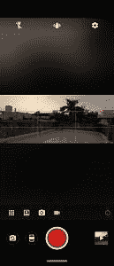

# 摩托罗拉 One Action 评论:小米 Mi A3 的有力竞争对手

> 原文：<https://www.xda-developers.com/motorola-one-action-review/>

摩托罗拉去年宣布了其新的 One 系列，摩托罗拉 One 和摩托罗拉 One Power 是代表新产品线的第一批设备。今年晚些时候，该公司继续推出了[摩托罗拉 One Vision](https://www.xda-developers.com/motorola-one-vision-hands-on-review/) ，定位于中高档市场。虽然该设备因其硬件而受到称赞，但由于其高昂的价格，它未能在印度市场获得太多关注。意识到这个错误后，该公司带着名为[摩托罗拉 One Action](https://www.xda-developers.com/motorola-one-action-gopro-action-cam-android-one-india/) 的新设备再次回归，该设备保留了其兄弟的 DNA，同时也带来了一些自己的新技巧。凭借 21:9 的高显示屏、创新的广角摄像头和海量闪存存储，摩托罗拉 One Action 在竞争中脱颖而出。但是，在现实世界中，整个软件包的表现如何呢？更重要的是，与其他中端智能手机相比，它是否值得考虑？我们在这篇综述中找到答案。

## 设计与展示

摩托罗拉 One Action 保留了摩托罗拉 One Vision 的设计线索，具有弯曲的背部和正面的打孔显示屏。不过，这个设备是由塑料制成的；尽管如此，它看起来相当高级(当你触摸它时就不那么高级了)。光滑的背面侧面弯曲，边缘周围有细微的交叉图案，在直射光下可见。然而，该设计的主要亮点是 21:9 的显示屏，这使得该设备看起来更长。该设备的狭窄宽度将单手舒适度提升到了一个全新的水平，并且在某种程度上宠坏了你，在使用该设备后，你真的很难回到 18:9 或 19:9。在不利方面，当试图用一只手够到位于顶部的控制和开关时，设备的高度造成了一些困难。

在正面，我们有一个 6.3 英寸的显示屏，左侧有一个自拍相机打孔。顶部边缘容纳听筒和接近传感器。通知 LED 不见了，这是一种令人失望的设备没有一个小下巴来容纳它。麦克风、USB-C 端口和单声道扬声器排列在底部。同时，3.5 毫米插孔和用于消除噪音的辅助麦克风位于顶部。

回到后面，三个摄像头垂直排列在右上角，双音 LED 闪光灯位于它们的正下方。摩托罗拉标志性的蝙蝠翼标志印在凹进的指纹扫描仪上，而 Android One 品牌可以在底部看到。

移动到显示器上，摩托罗拉 One Action 使用了分辨率为 1080 x 2520p 的液晶 LTPS 面板。这款显示器色彩鲜明，视角极佳。最大亮度对于户外使用来说相当亮，但是我们发现最低亮度设置对于夜间阅读来说太亮了。该设备提供三种标准颜色模式，根据您的喜好定制颜色饱和度。

Standard color modes

我们喜欢在 21:9 的宽屏上观看电影和视频。虽然 YouTube 和 MX Player 和 VLC 等流行的视频播放器原生支持 21:9 视频，并允许将 16:9 视频扩展到全屏，但并非所有应用程序都能很好地实现全屏体验。例如，当你全屏显示时，网飞会显示一个黑色的状态栏，阻止视频填充打孔机周围的区域。

大多数现代应用适应高显示屏没有问题，但我们测试的一些旧应用没有正确缩放，在底部留下了一大块空白屏幕。请注意，只有少数应用程序出现了这种情况，但由于该软件没有提供类似于 MIUI 和 EMUI 的内置应用程序扩展功能，因此除了等待应用程序开发者更新他们的应用程序，你对此无能为力。

我对打孔机没有什么强烈的意见。它并不像我想象的那样令人分心，而且和其他类型的刻痕相似，你会习惯的。虽然不可否认，当垂直拿着设备时，它会引起注意，但在横向模式下，它不太明显，因为它被埋在底部角落。作为打孔器的一个副作用，状态栏也异常的高——几乎是普通状态栏的两倍。这是 Android Pie 中实现的关于显示剪切的改变的结果，现在需要状态栏延伸到切口的高度。

总的来说，我们对显示器的性能感到满意，虽然打孔可能会分散一些人的注意力，但它提供了一种身临其境的视频观看体验。

## 软件

作为 Android One 家族的一部分，摩托罗拉 One Action 保证在长达两年的时间内接收 Android 平台更新，并在 3 年内每月接收安全更新。开箱后，摩托罗拉 One Action 附带了一个纯版本的 Android Pie，上面有一些摩托罗拉独有的功能。这些增强功能不仅进一步扩展了平淡无奇的 Android 的实用性，还为整体软件体验增添了独特性，以区别于竞争对手的 Android One 设备。

所有摩托罗拉独有的功能都很好地捆绑在 Moto 应用程序中。分为两类:Moto Action 和 Moto Display。Moto Actions 是一系列有用的手势，可以简化我们日常的日常活动，如在设备上导航、启动相机或拍摄截图。例如，你可以通过连续两次快速扭转手腕来启动相机应用程序，或者在空中做空手道式的劈砍来打开手电筒。

默认情况下，该设备使用安卓派的标准导航系统，但你可以用摩托罗拉的一键导航来代替。摩托罗拉对导航手势的接受非常直接。对于后退功能，您将药丸向左滑动，只需按一下按钮，您就会回到主屏幕，同时向右滑动会打开上次使用的应用程序。从按钮上向上滑动会显示最近的屏幕，长按按钮会触发谷歌助手。

Peek Display 是 Google Pixel 环境显示的近亲。当你拿起显示屏或收到新通知时，它会显示时间、日期、电池电量和应用程序通知图标。您可以自定义屏幕上允许的通知内容级别，甚至可以将您不想看到任何通知的应用程序列入黑名单。专注的展示是我个人的最爱之一。当我们在阅读或看东西的时候进入睡眠状态是我们经常经历的一个非常常见的场景。有了专注的显示屏，只要你盯着它，屏幕就不会变暗或休眠。

除了这些摩托罗拉的经验，我们正在寻找一个非常熟悉的股票 Android 馅饼的经验。这包括一个新的丰富多彩的设置应用程序，改进的通知面板，数字福利工具，以抑制您的过度智能手机使用，以及跨 SystemUI 和谷歌应用程序的材料设计更新。

如果你是最纯粹形式的 Android 的粉丝，摩托罗拉 One Action 正好提供了 Moto 有用定制的额外好处。

## 照相机

摩托罗拉 One Action 的三摄像头设置包括一个 12MP 主摄像头、5MP 深度传感器和一个 16MP 广角摄像头。

与我们在 Redmi 和其他中国智能手机上看到的常见 iPhone 风格的相机用户界面相比，Moto camera 应用程序令人耳目一新。向右滑动可以切换到视频模式，而人像模式、慢镜头和其他相机模式可以从左侧的网格菜单中访问。取景器屏幕的顶部有快速开关。同时，右上角的齿轮图标可以进入相机设置菜单。从那里，你可以自定义图像和视频质量，启用水印功能，控制人工智能相关的设置等等。

就相机性能而言，摩托罗拉 One Action 在光天化日之下拍出了令人赏心悦目的照片。对于中档手机来说，动态范围非常出色，图像保留了大量细节，色彩再现准确。在我们与运行 Gcam 的 Redmi Note 5 Pro 的简单比较中，One Action 的拍摄在色彩还原和动态范围捕捉方面多次接近——尽管前者的细节保留明显更好。虽然日光下的表现令人钦佩，但弱光下的表现却是另一回事。在光线较暗的情况下，图像看起来模糊不清，带有大量噪声。细节保留直线下降，动态范围也非常有限。不幸的是，没有专门的夜间模式来帮助糟糕的弱光性能。坦率地说，摩托罗拉 One Action 未能达到红米 Note 7 Pro 设定的低光摄影标准，红米 Note 7 Pro 仍然是这一领域的领导者。

肖像表演遵循同样的故事；当光线条件良好时，这是相当好的，但在弱光下无法实现。如果你表现出一些耐心，给相机一些时间来估计深度，主体分离是相当准确的。您还可以控制散景的强度，并在拍照前实时应用不同的灯光效果。肖像模式似乎不是很稳定，尽管我们在拍摄肖像时多次面临相机崩溃和强制关闭的情况。这个问题只在使用肖像模式时出现，因为我们在拍摄普通照片或视频时从未遇到任何相机崩溃。

自拍由 1200 万像素的前置摄像头处理，它可以提供最自然的照片，而没有应用任何不自然的皮肤平滑。焦点是固定的，但这是市场上大多数前置相机的交易——包括旗舰机。就质量而言，图像清晰，具有点曝光和非常自然的肤色渲染。低光结果不是最清晰的，但仍然是有用的。前置摄像头有人像模式，但它完全是基于软件的，所以结果有点不确定。有趣的是，前置摄像头还可以拍摄 4K 视频。

## 视频性能

视频部门是事情变得令人兴奋的地方。主摄像头和动作摄像头都可以以 30/60fps 的速度录制 1080p 的视频。但是只有主摄像头支持录制 4K 分辨率的视频。

动作摄像头是该设备的亮点。它使用了一个 117 度视野的超宽镜头，摩托罗拉说，与标准镜头相比，它可以让你在框架中容纳 4 倍多的视野。广角传感器本身非常独特，它以 90 度角安装。这意味着您可以在垂直模式下舒适地手持设备拍摄风景视频。这是一项聪明的技术，完全改变了你通常录制视频的方式。奇怪的是，它只用于拍摄视频——你不能用它拍照。

Action camera interface

车载电子图像稳定在稳定握手和行走动作方面做得非常好。视频看起来清晰、流畅，没有任何不均匀的抖动。自动对焦跟踪也非常稳定，平移时我们没有遇到任何不必要的重新对焦。

如果你是一个在手机上录制大量视频的人，你会体会到单手拍摄风景的轻松和舒适。另一方面，对于我们这些很少拍摄视频的人来说，使用广角传感器拍摄静态图像的能力将会非常受欢迎。很遗憾，你不能使用传感器拍照(你只能在录制视频时拍摄低质量的 300 万像素照片)。在目前的实施情况下，行动摄像机因其有限的使用案例而具有独特的吸引力。我们希望摩托罗拉考虑采取一种更通用的方法，并在未来的更新中允许拍摄广角照片。

主摄像头的视频性能在稳定度和流畅度方面略落后。我们还观察到一些抖动，而摇摄和过度锐化的水和树叶。我们建议您坚持使用动作摄像机来满足您的大多数视频需求，仅在拍摄 4K 或垂直视频时切换到主传感器。

## 表演

摩托罗拉 One Action 由三星的 Exynos 9609 八核芯片组提供支持——与摩托罗拉 One Vision 相同——基于 10 毫米 FinFET 工艺构建。芯片组本身能力相当强，拥有 4 个主频为 2.2GHz 的 Cortext-A73 性能核心和 4 个 Cortext-A53 效率核心，搭配 ARM 的 Mali GPU。

在日常使用中，性能令人钦佩。一次启动多个应用程序并在打开的应用程序之间跳转似乎不会降低设备的速度。在整个审查期间，我们没有遇到任何严重的口吃或反应迟钝的情况。在长时间的大量使用中，该设备保持了其快速的性能，没有任何节流或波动的迹象。

由于快速的 UFS 2.1 存储解决方案，应用程序打开时间明显加快。这种差异在启动 PUBG 等重度游戏时尤为明显，与采用 eMMC 5.1 存储的设备相比，PUBG 进入主屏幕的时间要短得多。UI 性能令人印象深刻，是我们在这个价位的设备上看到的最流畅的界面之一。在我们的简短测试中，通过 Play Store、Gmail 和 YouTube 观察到的非常低的丢帧数量，应用内 UI 性能也非常令人印象深刻。

内存管理即使不是最好的，也是很好的。系统最多只能在内存中容纳 8 到 9 个应用程序——引入任何超过这个限制的新应用程序都会导致最初打开的应用程序被踢出内存。在一些情况下，我们还注意到，当你切换到一个新的应用程序时，应用程序会意外重启，导致未保存的数据和进度丢失。我们对运行普通 Android 的设备有更高的期望，因为我们已经看到在使用 MIUI 等自定义 UI 的设备上有更好的 RAM 管理。

为了评估图形功能，我们测试了 PUBG 和 Asphalt 9，对整体游戏性能感到满意。PUBG 默认使用高清显卡作为推荐设置，但即使我们最大限度地提高了显卡(HDR)和帧率(Ultra)，游戏仍然出奇地流畅。虽然当你长时间玩游戏时，设备会变热，但游戏仍然流畅，没有任何过热的迹象。我们没有机会尝试其他游戏，但看到它在 PUBG 和 Asphalt 中的表现，我们非常肯定该设备在播放其他图形密集型游戏时不会让你失望。

## 电池

摩托罗拉 One Action 配备了 3500 毫安时的电池，低于既定标准，该价格范围内的大多数设备至少提供 4000 毫安时的电池。该设备支持通过兼容的充电器进行快速充电，但在盒子里，你仍然可以看到相同的旧 5V / 2A 砖。使用捆绑充电器，设备需要两个小时才能从休眠状态充满电。

摩托罗拉 One Action 的电池性能一般。在中度到重度使用的情况下，它让我舒服地度过了一整天。这涉及 Instagram、WhatsApp 和 Twitter 等社交媒体应用的常见组合，以及大量的 Chrome 网页浏览和流媒体 Spotify 和 YouTube。在上述使用模式下，平均屏幕打开时间接近 5 小时。

## 音频、连接和解锁速度

摩托罗拉 One Action 使用一个由杜比音频驱动的底部安装扬声器。它变得相当响亮，即使在高音量下也不会出现任何失真。您可以使用捆绑的杜比音频应用程序，根据您正在收听的内容类型自动调节音频。

通话质量是我们在中档手机上看到的最好的之一，即使在非常嘈杂的环境中，通话也听起来响亮而清晰。有趣的是，该设备还带有 NFC 连接功能。在印度进行非接触式支付没有用，因为大多数商店和商店都接受通过二维码支付。然而，如果你拥有支持 on tap NFC 配对的耳机或扬声器，它会非常方便。就解锁速度而言，后置指纹扫描仪不是我们测试过的最快的，但也算快了。除非你的手指是湿的，否则它很少会识别不出你的指纹。为了更方便，还有面部解锁。没有红外传感器或点投影仪，所以它完全依赖于前置摄像头。它非常快速可靠，你还可以将它与解除锁定功能配对，这样你就不必按下电源按钮来启动面部解锁。

## 结论

摩托罗拉 One Action 凭借其独特的外形和创新的动作摄像机从竞争对手中脱颖而出。这也标志着摩托罗拉在 Moto G7 系列未能与 Redmi Note 阵容进行良好斗争后的稳健回归。该公司似乎已经从以前的错误中吸取了教训，这一次为这款设备定价非常有竞争力。

摩托罗拉 One 行动可能不是最终的中端国王，但它仍然有很多骑在它身上。身临其境的 21:9 显示屏为疯狂观看提供了出色的观看体验，而 128GB 的超大存储空间则提供了足够的空间来存储海量视频库、照片收藏和游戏。多媒体功能使该设备非常适合重度媒体消费者。此外，有保证的软件支持使该设备在面向未来方面比竞争对手更具优势。

然而，与 Redmi Note 7 Pro 和 Realme 5 Pro 等设备相比，低光相机的性能并不达标。我们还认为，电池性能是该设备的一个薄弱环节，尤其是对于一个以多媒体体验为主要优势的设备来说。如果你能忽略这些缺点，这款设备还是有很多让人喜欢的地方。

摩托罗拉 One Action 将面临来自小米 A3 的激烈竞争。这两款设备的零售价格相同，这让购买者的决定更加混乱。One Action 在显示和存储领域比其竞争对手占据上风，但在电池和低光摄像头方面却输了。很难预测一个明显的赢家，因为这两种设备都有自己的优势和劣势，因此我们会建议你在做决定时记住你的个人需求和优先事项。

[**摩托罗拉 One Action 论坛**](https://forum.xda-developers.com/one-action)| |[|**在 Flipkart 上购买摩托罗拉 One Action**](https://www.flipkart.com/motorola-one-action-denim-blue-128-gb/p/itm638ad5520b66f)