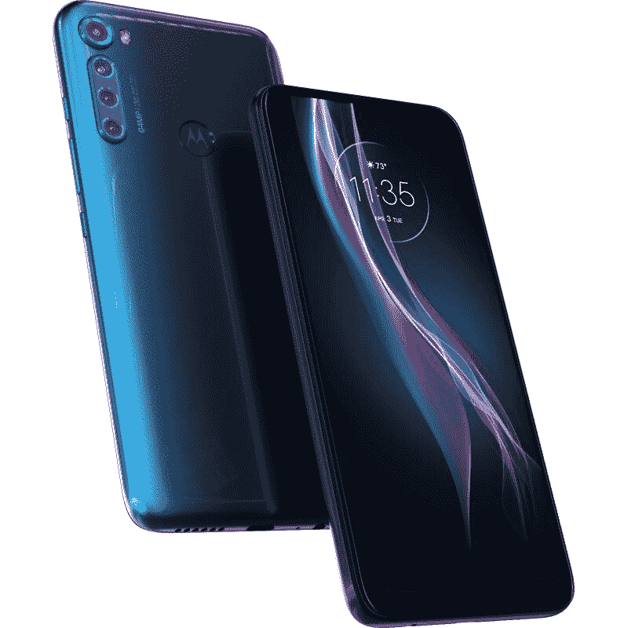

# 摩托罗拉一融合+泄漏揭示高通骁龙 730 处理器

> 原文：<https://www.xda-developers.com/motorola-one-fusion-plus-leak/>

早在 4 月，摩托罗拉[发布了 Edge 和 Edge+](https://www.xda-developers.com/motorola-edge-edge-plus-announced/) ，标志着联想自有品牌回归旗舰智能手机。这两款设备都采用了高通去年 12 月发布的最新芯片组、多摄像头阵列、大电池和相同的 90Hz 曲面有机发光二极管显示器。虽然 [Edge+相当昂贵](https://www.xda-developers.com/motorola-edge-plus-90hz-waterfall-display-snapdragon-865-108mp-camera-launch-india/)，但今年晚些时候推出的普通 Edge 应该会便宜得多。然而，Edge 可能会加入摩托罗拉 one 系列中更便宜的中档智能手机。如果谷歌的新清单可信的话，摩托罗拉 One Fusion+最早可能在下个月推出。

今天早些时候，我注意到 YouTube 设备报告页面更新了几个新列表，尽管我不知道页面更新这些列表的确切时间。新列表中的一个是尚未发布的摩托罗拉 One Fusion+，这是上个月由埃文·布拉斯首次泄露给[的名字。根据清单，One Fusion+拥有 6.5 英寸 1080p 显示屏，运行 Android 10，拥有 5,000mAh 大电池，并由](https://twitter.com/evleaks/status/1251740600766005248)[高通骁龙 730 处理器](https://www.xda-developers.com/qualcomm-snapdragon-665-snapdragon-730g/)提供动力。发布日期被列为“2020 年 6 月”，所以手机可能会在下个月的某个时候推出。

列表中包含的摩托罗拉 One Fusion+渲染与官方媒体渲染的摩托罗拉 Edge 的太阳能黑色渲染相同，因此 YouTube 上传的图像很可能只是一个占位符。另一方面，YouTube 上传的摩托罗拉 Edge 的图像显然不是该设备的图像，所以下面显示的图像很可能是摩托罗拉 One Fusion+的图像。摩托罗拉唯一一款配有 6400 万像素摄像头的智能手机是摩托罗拉 One Hyper，但这绝对不是下图所示的设备。

 <picture></picture> 

This is likely the Motorola One Fusion+. YouTube likely mistakenly swapped this image with the render for the Motorola Edge.

根据渲染图，我们可以看到 One Fusion+有一个平板显示器，四个后置摄像头，一个 64MP 主传感器，一个 USB Type-C 端口，一个 3.5 毫米耳机插孔和一个后置指纹传感器。我们无法判断这款设备是否有一个被壁纸巧妙地隐藏的打孔显示屏，或者它是否有一个像 One Hyper 一样的弹出式摄像头。

感谢消息人士，我们有一些关于摩托罗拉 One Fusion+的更多细节可以分享。该设备代号为“liberty”，型号为 XT2067-1 和 XT2067-2。这款设备拥有 6.53 英寸显示屏，分辨率为 2340x1080，高通骁龙 730 处理器，4/6GB 内存，64/128GB 内部存储，5000 毫安时电池，运行 Android 10。这款手机有多个摄像头，包括三星的 64MP ISOCELL Bright GW1 作为主摄像头。虽然我有其他相机的细节，但我不知道它们是如何排列的，所以这是我在设备发布前继续研究的事情。型号为 XT2067-1 的设备已经通过了 FCC 的[认证，支持 GSM850/1900、WCDMA 频段 II/V 和 LTE 频段 2/5/7/38/41。该设备预计将推出两种颜色:云和糖霜。它应该在多个地区上市，包括拉丁美洲、亚太地区、东欧、中东和印度。](https://fccid.io/IHDT56YR1/)

预计摩托罗拉还将在+车型的同时推出更便宜的摩托罗拉 One Fusion。代号为“泰坦”的常规 One Fusion 的型号为 XT2073-1 和 XT2073-2。这款设备拥有 6.52 英寸显示屏，分辨率为 1600x720，[高通骁龙 710 处理器](https://www.xda-developers.com/qualcomm-snapdragon-710-announcement/)，4/6GB 内存，64/128GB 内部存储，5000 毫安时电池，安卓 10 系统。这款手机将拥有四个后置摄像头，包括[三星的 48MP ISOCELL Bright GM1](https://www.xda-developers.com/samsung-32mp-48mp-isocell-camera-sensors/) 作为主摄像头，并加入了 5MP、8MP 和 2MP 摄像头传感器。在正面，该设备应该有一个 800 万像素的摄像头。One Fusion 将以黑色和蓝色登陆巴西、拉丁美洲和几个亚洲国家。

我们不知道摩托罗拉 One Fusion 的整体设计或 One Fusion 或 One Fusion+的定价，但鉴于 YouTube 泄露的据称 2020 年 6 月的发布日期，我们很快就会知道。

这篇文章在美国东部时间 2020 年 5 月 22 日下午 7:15 更新，很可能是摩托罗拉 One Fusion+的渲染图。