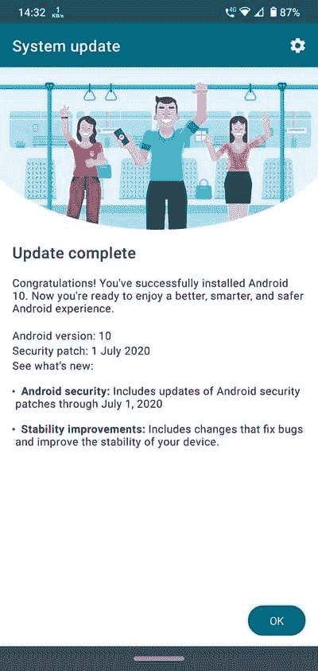

# 【更新:稳定】摩托罗拉 One Zoom 和 Moto G8 Plus 在巴西获得 Android 10 浸泡测试更新

> 原文：<https://www.xda-developers.com/motorola-one-zoom-moto-g8-plus-android-10-soak-test-update-brazil/>

**更新 1(****09/07/2020****@****05:51AM****ET):**摩托罗拉已经将浸泡测试版本推为稳定版本，用于摩托罗拉 One Zoom 和 Moto G8 Plus。滚动到底部了解更多信息。下面保留了 2020 年 7 月 31 日发表的文章。

谈到 Android 更新，不同的智能手机 OEM 厂商都有自己的时间表。例如，摩托罗拉更喜欢在通过稳定渠道实际发布主要 Android 版本更新之前，进行有限的邀请式公开测试(通常称为“浸泡测试”)。最终的 beta 固件通常足够成熟，可以被视为稳定版本，这意味着浸泡测试阶段是稳定更新到来的一个很好的标志。现在，摩托罗拉 One Zoom(也被称为摩托罗拉 One Pro)和 Moto G8 Plus 已经开始接收这样的 Android 10 浸泡测试版本。

**[摩托罗拉一变焦 XDA 论坛](https://forum.xda-developers.com/motorola-one-pro) || [Moto G8 加 XDA 论坛](https://forum.xda-developers.com/moto-g8-plus)**

## 摩托罗拉一变焦

尽管有“One”的标签，摩托罗拉 One Zoom(代号“帕克”)并不是 Android One 计划的一部分。搭载安卓 Pie 的高通骁龙 675 手机在 2019 年 IFA 发布。这款设备的 Android 10 浸泡测试目前正在巴西进行，到目前为止，该公司已经在巴西[推出了几个测试版](https://forum.xda-developers.com/showpost.php?p=83175567)。最新的浸泡测试版本号是 **QPH30.29-Q3-28-13** ，并且附带了【2020 年 7 月的安全补丁。

## G8+摩托车

[Moto G8 Plus](https://www.xda-developers.com/motorola-moto-g8-plus-g8-play-e6-play/) (代号“多哈”)封装在高通骁龙 665 SoC 中，还有 4GB 内存和 64GB 存储空间。这款手机运行的是现成的 Android Pie 版本，而 Android 10 的浸泡测试正在巴西的 T2 进行。那些将他们的设备注册到摩托罗拉反馈网络(MFN)的人已经收到了多个测试版，最新的一个是 2020 年 7 月的安全补丁。

 <picture></picture> 

Thanks to Reddit user [u/karanpatils](https://www.reddit.com/user/karanpatils/) for the screenshot!

值得注意的是，浸泡测试 beta 版本有时会包含严重的错误。因此，我们建议您不要在日常驱动程序中加载这些测试版本。一旦所有已知问题被解决，摩托罗拉将向所有用户推送稳定更新，包括测试版测试人员。

* * *

## 更新:摩托罗拉 One Zoom 和 Moto G8 Plus 的 Android 10 正式稳定推出

摩托罗拉已经开始为摩托罗拉 One Zoom 和 Moto G8 Plus 推出官方 Android 10 稳定更新。两个设备 [的](https://twitter.com/larryawae/status/1301961913362939904)[用户报告他们已经在稳定分支中接收到更新](https://forum.xda-developers.com/showpost.php?p=83354131&postcount=29)，该更新与浸泡测试中测试的版本相同。单倍变焦的制造编号为 QPH30.29-Q3-28-13，G8 Plus 的制造编号为 QPI30.28-Q3-28-26。这些版本可能会逐渐推出，所以随着时间的推移，它应该会接触到更多的用户。