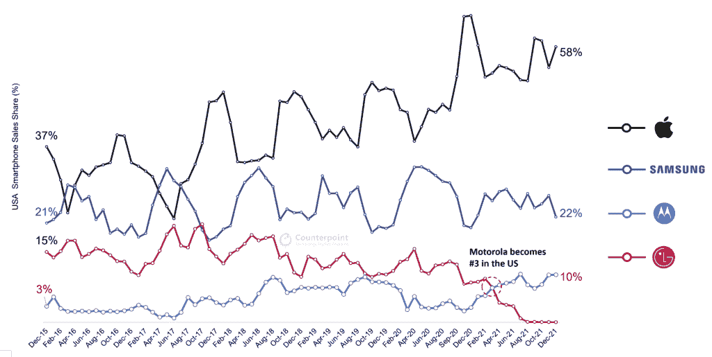

# 据报道，摩托罗拉在美国的智能手机销量翻了一倍多

> 原文：<https://www.xda-developers.com/motorola-us-smartphone-sales-2021/>

摩托罗拉在拉丁美洲和其他一些地区非常受欢迎，但该公司一直难以在美国保持可观的市场份额，三星和苹果等竞争对手在美国的智能手机销售中占据主导地位。然而，如果一份新的报告是准确的，摩托罗拉去年可能卖出了足够多的智能手机，在穆里卡排名第三。

分析移动设备、物联网产品和其他电子产品销售趋势的公司 Counterpoint Research 报告称，摩托罗拉在美国的销售额在 2021 年翻了一番多。据称，该公司在此期间的年同比增长率为 131%，使其在美国智能手机销量中排名第三，仅次于三星和苹果。

 <picture></picture> 

USA smartphone sales by brand (Source: Counterpoint Research)

更高的市场份额主要是由于 [LG 在 2021 年初](https://www.xda-developers.com/lg-exits-smartphone-business/)退出智能手机业务——一旦零售商售出 LG 的大部分剩余库存，摩托罗拉的廉价设备就填补了这一空白。换句话说，摩托罗拉的增长实际上并不是受欢迎程度或产品质量提高的指标，而只是市场整合的结果。

摩托罗拉在 2021 年发布了一系列智能手机，包括该公司常见的 Moto G、E 和“One”产品线中的几款机型。摩托罗拉 Edge 在 2021 年底获得了 144Hz 屏幕和骁龙 778G 的更新，该公司还发布了几年来的第一款平板电脑 Moto Tab G20。

最近在 2022 年，新版本的摩托罗拉 Edge Plus 成为美国首批使用高通骁龙 8 代 1 芯片组的智能手机之一——查看我们完整的[摩托罗拉 Edge Plus 2022 评论](https://www.xda-developers.com/motorola-edge-plus-2022-review/)以了解更多信息。

三星也在继续在美国发布新的廉价手机。Galaxy A53 5G 和 Galaxy A33 5G 于两周前发布，尽管较低功率的 Exynos 芯片组和缺少耳机插孔使它们不如去年的产品有竞争力。

**来源:** [对位法研究](https://www.counterpointresearch.com/motorola-us-3-smartphone-oem-2021/)