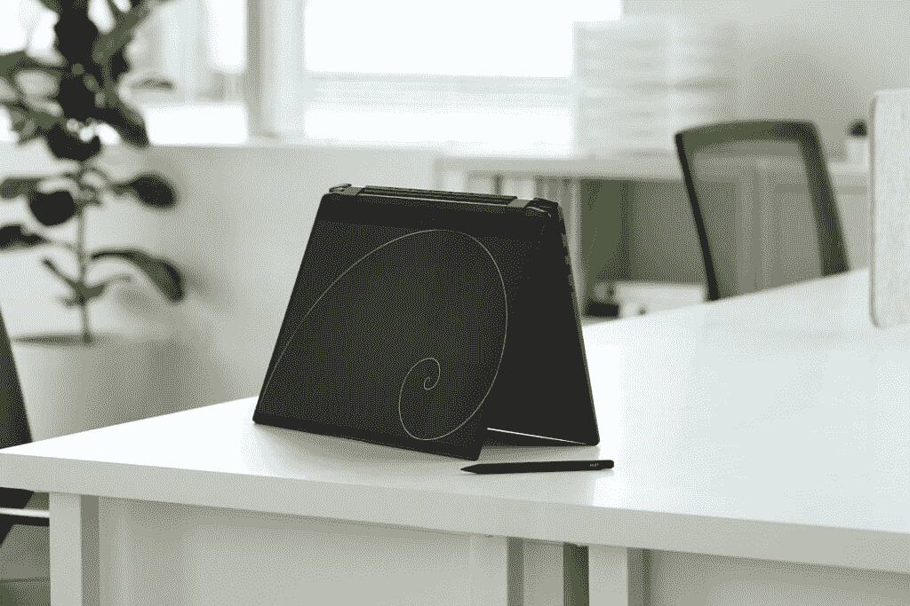

# 微星用第 12 代英特尔处理器更新其 Prestige 和 Summit 笔记本电脑

> 原文：<https://www.xda-developers.com/msi-refreshes-prestige-summit-laptops-intel-12h-gen/>

微星公司宣布了 Prestige 和 Summit 系列的高级商务笔记本电脑的新版本，现在采用英特尔的第 12 代 P 系列处理器。它们还配有 NVIDIA 独立显卡。微星现代系列也更新了第 12 代处理器，但来自英特尔的 U 系列。这些都是商务笔记本电脑，对 MSI 来说是一个相对较新的领域，但这些都是外观坚固的笔记本电脑。

## 微星峰会系列

谈到商用笔记本电脑，Summit 系列是微星的精华。2022 款包括 MSI Summit E16 Flip、E14 Flip、E14、E13 Flip，大部分都是可转换的笔记本电脑。它们大多采用最高可达 12 核(4P + 8E)和 16 线程的英特尔酷睿 i7-1260P 处理器，外加 32GB 内存和 1TB 固态硬盘存储。Summit E13 FLip 还具有采用英特尔酷睿 7-1280P 的配置。此外，如果您希望为一些轻度游戏或其他任务提供额外的图形处理能力，Summit E16 Flip 最高可配 NVIDIA GeForce RTX 3050 Ti。所有型号都配有 72 瓦时的电池，除了 Summit E16 Flip，它可以达到 82 瓦时。

 <picture></picture> 

MSI Summit E16

这三种型号的显示器都具有 16:10 的宽高比，是提高工作效率的理想选择。尽管如此，还是有一些不同。Summit E16 Flip 拥有 16 英寸显示屏，具有 Quad HD+ (2560 x 1600)分辨率，165Hz 刷新率，100%覆盖 DCI-P3。MSI Summit E14 Flip 拥有 14 英寸显示屏，分辨率为 2880 x 1800，100% DCI-P3，刷新率为 60Hz，Summit E13 Flip 拥有全高清+ (1920 x 1200)显示屏，刷新率为 120Hz，100%覆盖 sRGB。这三款敞篷车都支持触控功能，而且盒子里还包括一支微星笔。Summit 型号中较弱的是 Summit E14，它有一个 60Hz 的全高清+显示屏，不支持触摸。

峰会笔记本电脑都包括带 Windows Hello 面部识别的全高清网络摄像头，以及指纹读取器(如果你想以这种方式登录的话)。至于端口，它们配有两个 Thunderbolt 4 端口、一个 USB Type-A 端口(两个在 Summit E16 Flip 上)、HDMI、一个耳机插孔和一个 microSD 读卡器，因此它是你在商务笔记本电脑中期望的一切。它们甚至集成了磁贴，因此即使在关机状态下，您也可以轻松找到您的笔记本电脑。

根据您的配置，MSI Summit E16 Flip 的价格在 1，549 美元到 2，199 美元之间。Summit E14 Flip 的价格在 1，499 美元到 1，799 美元之间，Summit E13 Flip 的价格在 1，399 美元到 1，699 美元之间。最后，翻盖式 Summit E14 的价格将在 1249 美元至 1349 美元之间，并且只有两种配置可供选择。

## 微星威望系列

转到 MSI Prestige 系列，我们有新的 Prestige 14 和 Prestige 15。它们配备了最高英特尔酷睿 i7-1280P 处理器、32GB 内存和 1TB 固态硬盘存储。这两款机型都有 NVIDIA 显卡，MSI Prestige 15 上的 GeForce RTX 3050 Ti，Prestige 14 上的 GeForce RTX 3050。一些型号还提供 GeForce GTX 1650，Prestige 14 可以选择只有集成显卡，如果你想延长电池寿命。

 <picture></picture> 

MSI Prestige 14

这两款笔记本电脑配备了 16:9 宽高比的全高清(1920 x 1080)显示屏，运行频率为 60Hz，因此它们不像 Summit 系列那样花哨，但仍然很坚固。威望 15 覆盖 72%的 NTSC 制式，而威望 14 可以达到 100%的 sRGB。它们还配备了带有 Windows Hello 面部识别功能的 720p 高清网络摄像头，以及用于相同目的的指纹读取器。

端口方面，MSI Prestige 14 有两个 Thunderbolt 4 端口，一个 USB Type-A 端口，一个 microSD 读卡器和一个耳机插孔。Prestige 15 增加了另一个 USB 型端口和 HDMI 接口。所有 Prestige 14 型号都有一个 52 瓦时的电池，而 Prestige 15 有一个更大的 82 瓦时电池。

微星 Prestige 14 的起价为 929 美元，根据您选择的配置，最高可达 1549 美元。微星 Prestige 15 起价 1399 美元，最高价 1899 美元。

## 微星现代系列

除了 Summit 和 Prestige 系列，我们还有 MSI Modern 系列，这是唯一一款仍在使用英特尔 U 系列处理器的产品，但现在已经是第 12 代产品了。MSI Modern 15 最高配有英特尔酷睿 i7-1255U，这是一款 10 核/12 线程处理器，但 MSI Modern 14 最高配有英特尔酷睿 i5-1235U。你可以获得高达 16GB 的内存(仅在 MSI Modern 15 上)，两种型号都包括 512GB 的固态硬盘。

对于显示器，两种型号都有一个全高清面板，刷新率为 60Hz，NTSC 覆盖率为 45%。网络摄像头是高清分辨率，不支持 Windows Hello，但你可以使用指纹识别器解锁电脑。

端口方面，所有型号都配有一个 USB Type-C 端口(无 Thunderbolt)、两个 USB Type-A 端口、HDMI、一个耳机插孔和一个 microSD 读卡器。

微星现代 14 售价 699 美元或 799 美元，取决于你是想要酷睿 i3 还是酷睿 i5 型号。微星现代 15 配酷睿 i5 售价 849 美元，如果你想要酷睿 i7 售价 999 美元。

* * *

新的 MSI 峰会，威望，和现代笔记本电脑应该出现在零售商从今天开始。如果您想探索其他选择，您可以随时查看您可以购买的[最佳商务笔记本电脑](https://www.xda-developers.com/best-business-laptops/)。