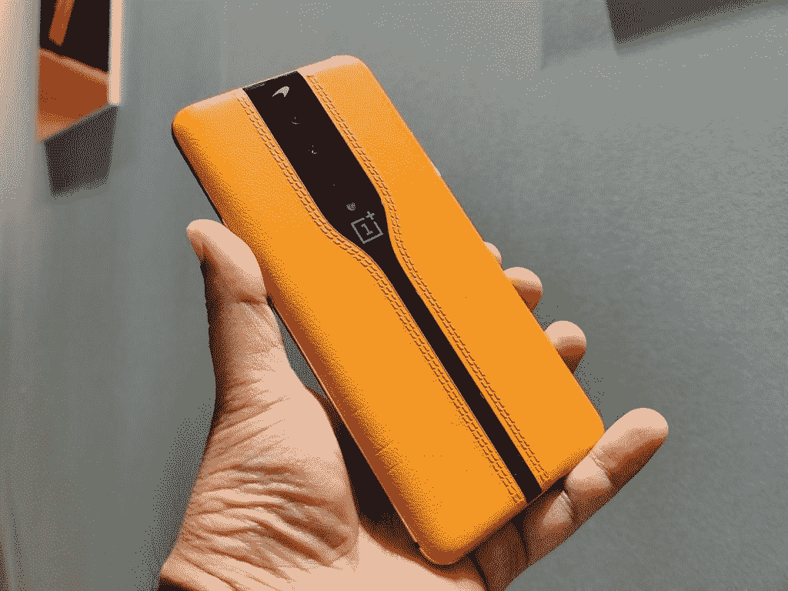

# MWC 2020 预展:我们对这个拥挤的活动的所有期待

> 原文：<https://www.xda-developers.com/mwc-2020-preview-lg-sony-motorola-oppo/>

**更新 2 (02/10/2020 @ 03:55 AM ET):** 文章已经更新，注意到 Moto G Power 和 Moto G Stylus 已经公布，而索尼已经宣布退出 MWC。

**更新 1 (02/07/2020 @ 08:30 AM ET):** 文章已更新，注意到 LG 已退出 MWC 2020，而中兴将只有一个展位，但不会透露任何新手机。

MWC，简称移动世界大会，是 GSM 联盟在西班牙巴塞罗纳举办的年度活动。MWC 是世界上展示移动技术的最大盛会，这正是每年都会发生的事情。每年，世界各地的原始设备制造商都将 MWC 作为一个平台，宣布他们最新的消费产品，让我们智能手机爱好者在接下来的几个月里垂涎三尺。在定于 2 月 24 日至 27 日举行的 MWC 2020 展会上，我们期待着一系列产品的发布，主要的发布活动将在展会前和展会期间举行。在这里，我们给你一个期待 MWC 2020 的内幕。

* * *

## HMD 全球

HMD Global 过去曾利用 MWC 的舞台发布诺基亚品牌的智能手机，该公司今年也将出席，因此我们可以期待看到一些诺基亚品牌的手机。[诺基亚也将出席今年的活动](https://www.nokia.com/mwc-2020/)，但其会谈围绕 5G 展开，因此诺基亚的会谈可能更多地围绕基础设施，而不是电话。

我们不太了解 HMD Global 在 2020 年 MWC 奥运会上为其诺基亚品牌智能手机制定的计划。HMD Global 此前在高通骁龙科技峰会期间证实，他们将推出使用[骁龙 765 和骁龙 865 平台](https://www.xda-developers.com/qualcomm-snapdragon-765-processor-specifications-features/)的手机。该公司可能会在活动中推出这些手机。我们也可能会看到更多廉价和中档手机，因为 HMD Global 是众所周知的。不幸的是，虽然我们还没有看到任何可靠的泄漏设备可能会在展会上，但早期未经证实的传言表明，诺基亚 8.2 5G，诺基亚 5.2 和诺基亚 1.3 今年的事件。

一个王牌可能是[诺基亚 400](https://www.xda-developers.com/hmd-global-nokia-400-4g-feature-phone-android/) ，这可能是第一款搭载安卓系统的功能手机。这个神秘的设备已经传闻了一段时间，我们已经看到[暗示 Android 运行在功能手机](https://ww.9to5google.com/2019/07/18/image-leak-purported-android-feature-phone-nokia/#)上。我们真的不太了解这款手机，这让我们相信它不会在 MWC，但它是一种可能性。

* * *

## 华为

 <picture></picture> 

Huawei P40 leaked renders - Don't expect to see this at MWC

华为也将带着“新产品和解决方案”出席 2020 年 MWC 奥运会虽然措辞非常宽泛，但华为肯定会上台谈论 5G，正如[在他们自己的网站](https://carrier.huawei.com/en/events/mwc2020)上透露的那样。这可能与 5G 基础设施有关，因为华为在该领域有很大的影响力，所以我们对是否会在 2020 年 MWC 展会上看到新手机或平板电脑并不完全有信心。[华为 P40 系列预计将于 2020 年 3 月](https://www.xda-developers.com/huawei-p40-launch-march-2020-huaweis-version-google-mobile-services/)在一个单独的活动中亮相，因此这款手机不太可能在 2020 年 MWC 发布，因为那将使单独的 3 月发布会变得毫无意义。当然，计划是可以改变的，所以我们敞开大门迎接惊喜。

**[华为 P40 - XDA 篇](https://www.xda-developers.com/tag/huaweip40/) || [华为 P40-XDA 篇](https://www.xda-developers.com/tag/huawei-p40-pro/)**

* * *

## 荣耀

对于荣誉，我们有一个更好的预期，即使一些产品的具体细节是模糊的。Honor 发出媒体邀请，宣布该公司将展示将在欧洲推出的设备，包括 Honor 9X Pro 和 View 30 Pro。Honor 表示，他们还将在 MWC 推出 MagicWatch 2 智能手表和无线耳塞的“特别版”。

### Honor 9X Pro

Honor 9X Pro 已经出现有一段时间了，但 Honor 在所有市场发布还需要一段时间。早在 10 月份，[公司宣布](https://www.xda-developers.com/honor-9x-pro-to-launch-in-europe-with-a-different-fingerprint-placement/)他们将在欧洲发布不同版本的 Honor 9X Pro。它确实进入了一些欧洲国家，但在 MWC，Honor 将宣布更广泛的全球发售。Honor 9X Pro 配备 6.59 英寸显示屏、麒麟 810 处理器、8GB 内存、高达 256GB 的存储空间，并配有 4000 毫安时电池。该设备具有三个后置摄像头:48MP，8MP 广角和 2MP 深度传感器。前置 1600 万像素摄像头位于弹出式装置中，该设备有紫色和黑色两种颜色。

[**荣誉 9X 亲 XDA 文章**](https://www.xda-developers.com/tag/honor-9xpro/)

### 荣誉视图 30 专业版

Honor View 30 Pro 预计将成为 2019 年 11 月在中国推出的[Honor v 30 Pro 的全球更名。我们很大程度上预计手机会有相同的规格，但我们不能排除不同地区的较小变化。Honor V30 Pro 配备了一个 6.57 英寸 FHD+ LCD，带有双打孔前置摄像头，](https://www.xda-developers.com/honor-announces-v30-view30-dual-hole-punch-display-kirin-990-android-10/)[海思麒麟 990](https://www.xda-developers.com/huawei-hisilicon-kirin-990-5g-integrated-modem/) ，一个由 40MP 主摄像头、12MP 广角摄像头和 8MP 长焦摄像头组成的三摄像头设置。V30 Pro 的前置设置包括一个 32MP 主摄像头和一个 8MP 长焦摄像头。V30 Pro 支持双模 5G，因此我们希望 View 30 Pro 也能支持双模 5G。

**[荣誉查看 30 篇亲 XDA 文章](https://www.xda-developers.com/tag/honor-view30pro/)**

* * *

## 水平规ˌ水准仪(Level Gauge)

几年来，LG 一直是 MWC 的常客，因为它将登台宣布其最新旗舰产品，与其他顶级原始设备制造商的旗舰产品竞争。今年，我们预计至少会在活动上看到配备双屏配件的 [LG V60 ThinQ 和](https://www.xda-developers.com/lg-v60-thinq-dual-screen-5g-possible-launch-mwc-2020/) [LG G9 ThinQ](https://www.xda-developers.com/lg-g9-renders-leaked/) 。

### LG V60 ThinQ

 <picture></picture> 

Something like this?

LG V 系列过去常常在下半年发布，但 LG 打破了传统，在 2019 年 MWC 奥运会上与 LG G8 一起推出了 LG V50，然后在下半年推出了 LG G8X。因此，我们预计今年会看到 V60 ThinQ，预计该设备将通过配套的第二屏幕附件[专注于双屏体验，非常像 LG G8X](https://www.xda-developers.com/lg-g8x-dual-screen-announced/) 。折叠结构[有望看到升级](https://www.xda-developers.com/lg-v60-thinq-dual-screen-5g-possible-launch-mwc-2020/)——尽管确切的升级仍然是个谜。当然，还有 5G。

[LG v60 thinq-xd 文章](https://www.xda-developers.com/tag/lgv60/)T3]

### LG G9 ThinQ

虽然 LG V60 ThinQ 还没有出现渲染泄露，但 LG G9 ThinQ 已经出现了，这让我们对即将到来的 LG 旗舰有了一个公平的想法。LG G9 将为单个前置摄像头提供水滴凹槽，这表明这一次将不会有基于手势的噱头。泄露的渲染图展示了一个四后置摄像头设置以及底部的 3.5 毫米耳机插孔，使这款 LG 手机成为 2020 年仍保留该端口的手机之一。预计这款手机还将在平板显示器上有最小的边框，以及显示器内的指纹扫描仪。

**[LG g9 thinq-xd 文章](https://www.xda-developers.com/tag/lgg9/)**

* * *

## 摩托罗拉

在[骁龙科技峰会](https://www.xda-developers.com/snapdragon-tech-summit-2019-summary/)上，摩托罗拉宣布将推出至少一款带有[高通骁龙 765](https://www.xda-developers.com/qualcomm-snapdragon-765-processor-specifications-features/) 的手机和至少一款带有[骁龙 865](https://www.xda-developers.com/qualcomm-snapdragon-865-processor-specifications-features/) 的手机。AndroidHeadlines 报道称摩托罗拉已经发出了 2020 年 MWC 活动的媒体邀请，预计该公司将在那里发布这款旗舰手机。除了旗舰，其他三款摩托罗拉设备也在过去几天泄露-[Moto G8、Moto G8 Power](https://www.xda-developers.com/motorola-moto-g8-power-leaked-specifications/) 和[Moto G Stylus](https://www.xda-developers.com/moto-g8-power-renders-motorola-stylus-phone/)。所以这三款手机也有可能在 MWC 亮相。

### Moto G8

预计 Moto G8 将配备 6.39 英寸高清液晶显示屏，可能会有一个用于前置摄像头的单孔。指纹传感器将嵌入手机背面的摩托罗拉蝙蝠翼标志，因为[泄露的渲染证实了](https://www.xda-developers.com/motorola-moto-g8-leak-render-hole-punch-display-triple-camera/)。这款手机预计将由骁龙 665 驱动，并可能配备 4000 毫安时的 10W 充电电池。这款手机可能会配备一个 1600 万像素的主摄像头、800 万像素的广角摄像头和 200 万像素的微距摄像头；以及一个 800 万像素的前置摄像头。

**[摩托罗拉摩托车 G8 - XDA 物品](https://www.xda-developers.com/tag/motorola-moto-g8/)**

### Moto G8 动力

Moto G8 动力的亮点预计是其 5,000 mAh 电池和 18W 快速充电支持。Moto G8 Power 预计也将配备 6.36 英寸 FHD+ LCD，背面的蝙蝠翼标志将容纳指纹扫描仪。相机的设置预计将类似于 Moto G8 -但在后面有一个额外的 800 万像素传感器，前面有一个升级到 2500 万像素的摄像头。

**[摩托罗拉摩托 G8 动力- XDA 篇](https://www.xda-developers.com/tag/motorola-moto-g8-power/)**

### Moto G 手写笔

预计摩托罗拉还将推出一款内置手写笔的 G 系列手机，尽管我们不认为手写笔会在功能上与三星的 S-Pen 竞争。[我们最近刚刚了解了这个神秘装置](https://www.xda-developers.com/motorola-moto-g-stylus-specifications-stylus-features/)。它有 6.36 英寸的显示屏，高通骁龙 665 处理器，4GB 的内存，64/128GB 的存储空间和 4000 毫安时的电池。在背面，有一个 48MP 主摄像头，2MP 微距摄像头，和 16MP 广角摄像头。摩托罗拉也将为手写笔提供一些基本的软件功能。

**[摩托车 g stylus-xd 物品](https://www.xda-developers.com/tag/motorola-moto-g-stylus/)**

* * *

## 一加

 <picture></picture> 

OnePlus Concept One

一加还没有确认任何 MWC 2020 的计划。一加通常不会在发布会上宣布新产品，但他们仍然有可能做些什么。例如，在 CES 2020 上，他们展示了 [Concept One](https://www.xda-developers.com/qualcomm-snapdragon-x55-5g-modem-2019-android-smartphones/) 智能手机。我们可能会在活动中看到一加展示其 [120Hz 显示技术](https://www.xda-developers.com/oneplus-confirms-120hz-display-refresh-rate-tech/)，但我怀疑我们会看到[一加 8 系列](https://www.xda-developers.com/tag/oneplus8/)的全面发布。一加是一家试图尽可能多地抓住头条新闻的公司，所以我们肯定期待从这次事件中得到一些新闻。

* * *

## OPPO

OPPO 已经确认[将出席 MWC 2020](https://www.mwcbarcelona.com/session/oppo-5g-talk/) 并谈论 5G 技术，因此我们可以期待中国 OEM 厂商以某种方式进一步展示其存在。虽然该公司尚未正式确认或宣布任何手机发布，但他们有可能揭开 OPPO Find X2 和 OPPO Find X2 Pro 的面纱。MWC 2020 也是宣布全球推出 Reno3 系列的好时机。

### OPPO Find X2/X2 Pro

在 2019 年 1 2 月的 OPPO Inno Day 上，OPPO 确认其下一款高端旗舰产品 Find X2 将于 2020 年在 Q1 发布。另一方面，Find X2 Pro 没有收到这样的评论，但该设备最近在 NBTC 认证文件中被发现。它们将采用新技术，如高通骁龙 865，索尼新的 2x2 片上镜头解决方案，以及更好的显示器，重点是显示分辨率，刷新率，颜色和动态范围。OPPO 还宣布他们已经[与 Pixelworks](https://www.xda-developers.com/oppo-smartphone-pixelworks-visual-processor-multi-year-collaboration-agreement/) 签署了多年合作协议，因此我们可以期待在这些设备中看到 Iris 5 视觉处理器。

**[OPPO 找 X2 - XDA 文章](https://www.xda-developers.com/tag/oppo-find-x2/)**

### OPPO Reno3 系列

OPPO Reno3 系列于上个月在中国发布，我们知道它最终将在全球发布。OPPO 的新闻稿对“*保持关注*”说，毕竟 Reno3 系列将“*冲击全球其他市场*”。概括地说，Reno3 有 6.4 英寸的平板显示器，联发科天玑 100L 处理器，8/12GB 的内存，128GB 的存储空间和 4，025mAh 的电池。后置摄像头为 64MP、8MP 广角、单色和人像。Reno3 Pro 拥有 6.5 英寸曲面显示屏、骁龙 765G SoC、8/12GB 内存、128/256GB 存储空间和 4，025mAh 电池。后置摄像头为 4800 万像素、1300 万像素长焦、800 万像素广角和 200 万像素单色。

Reno3 的 8GB+128GB 版本的价格约为 485 美元，12GB/128GB 版本的价格约为 530 美元。Reno3 Pro 的 8GB+128GB 型号价格为 570 美元，12GB/256GB 型号价格为 640 美元。

**[杨树 3 系列-xd 项](https://www.xda-developers.com/tag/opporeno3/)**

* * *

## 高通公司

高通[将在 MWC](https://www.qualcomm.com/company/events/mwc-barcelona) 举办一场活动，但不知道该公司是否会推出任何新的 SOC。他们可以宣布邻近的产品，如对他们的 WiFi 和蓝牙技术的改进。我们还不太了解他们的计划。去年，该公司在 MWC 发布前几天发布了 X55 5G 调制解调器[。我们将密切关注类似的公告。](https://www.xda-developers.com/qualcomm-snapdragon-x55-5g-modem-2019-android-smartphones/)

* * *

## 真我

Realme 已经证实他们将出席 2020 年 MWC 奥运会，预计至少有一款 5G 手机将作为其全球发布的一部分展示。这款 5G 手机可能是最近在中国发布的带有骁龙 765G 的 [Realme X50 5G](https://www.xda-developers.com/realme-x50-5g-snapdragon-765g-120hz-master-edition-ui/) ，或者根据最近的报道，骁龙 865(可能被称为 Realme X50 Pro)作为[的新智能手机，或者更好，两者兼而有之。](https://www.xda-developers.com/realmes-next-flagship-phone-qualcomm-snapdragon-865-could-launch-soon/)

### Realme X50 5G

Realme X50 5G 已经在中国推出，所以我们知道会发生什么，除非有任何变化。这款设备的一大亮点是 120Hz 刷新率的 6.57 英寸 FHD+ LCD，带有一个细长的摄像头切口，用于双前置摄像头。这款手机配备了骁龙 765G，4200 毫安时电池，支持 30W VOOC 4.0 快速充电，四后置摄像头设置，包括 64MP 主摄像头，8MP 广角，12MP 长焦和 2MP 微距摄像头，以及前置的 16MP 主摄像头和 8MP 广角摄像头。还有一个侧面安装的指纹扫描仪。

**[实物 x50-xd 项](https://www.xda-developers.com/tag/realmex50/)**

* * *

## 三星电子

三星已经有了自己的 [Galaxy Unpacked](https://www.xda-developers.com/samsung-unpacked-2020-promo-galaxy-s20-launch/) 活动，预计将推出新的 [Galaxy S20 系列](https://www.xda-developers.com/samsung-galaxy-s20-plus-ultra-5g-leaks-rumors-specs-features/)和 [Galaxy Z Flip](https://www.xda-developers.com/samsung-galaxy-z-flip-renders-specs/) 。Galaxy Unpacked 2020 与 MWC 2020 并不重合，因为它比 MWC 早了整整两周。因此，我们不希望三星在 2020 年 MWC 展会上展示任何旗舰手机，而是利用这个机会展示届时已经推出的新手机。不过，三星确实有可能在其 A 系列产品中推出新产品。

* * *

## 索尼

索尼公司已经确认将在 2020 年 MWC 举办[新闻发布会。我们期待看到 21:9 的宽高比](https://www.xda-developers.com/sony-mwc-2020-invites/)[索尼 Xperia 5 Plus](https://www.xda-developers.com/sony-xperia-5-plus-leak-headphone-jack-triple-cameras/) (或者它最终的营销名称会是什么)在活动中宣布。

### 索尼 Xperia 5 Plus

索尼 Xperia 5 Plus 预计将延续索尼 21:9 的趋势，采用 6.6 英寸高有机发光二极管显示屏，薄边框，双前置立体声扬声器和 800 万像素前置摄像头。预计这款手机还将保留索尼近期旗舰产品的矩形盒子外观。这款手机预计还将配备一个三后置摄像头，带有一个额外的 ToF 传感器，以及一个 3.5 毫米耳机插孔。泄露的渲染图也暗示了侧装指纹传感器，这表明索尼还没有准备好跳到显示器内指纹传感器。

**[索尼体验 5 加-xd 项](https://www.xda-developers.com/tag/sony-xperia5/)**

* * *

## TCL 集团股份有限公司（TCL Corporation 的缩写）

TCL 在今年早些时候的 CES 上发布了其自主品牌智能手机:[TCL 10 5G、TCL 10L 和 TCL 10 Pro](https://www.xda-developers.com/tcl-10-5g-10l-and-10-pro-affordable-mid-range-smartphones/) 。CES 公告展示了该设备的设计和一些初步的细节，TCL 提到他们将在 2020 年 MWC 上宣布完整的产品阵容细节。

由于采用了骁龙 7 系列 SoC(可能是骁龙 765)，TCL 10 5G 提供了低于 6GHz 的 5G 连接。这款手机的官方渲染图展示了一款具有薄边框和四摄像头模块(带 6400 万主摄像头)的手机，位于背面的物理指纹扫描仪上方。该设备的亮点将是其价格，因为 TCL 10 5G 预计价格将低于 500 美元，这应该使其成为美国市场上更实惠的 5G 智能手机之一。

* * *

## 活泼的

Vivo 也宣布参加 MWC 2020 年奥运会。但和去年一样，预计该公司将利用此次活动展示一款概念智能手机，可能是 APEX 系列中的一款。

 <picture></picture> 

Vivo Apex 2019

去年， [Vivo Apex 2019](https://www.xda-developers.com/vivo-apex-2019-no-ports-full-screen-fingerprint-scanner/) 展示了一款由玻璃一体式机身制成的 5G 概念手机，侧面有三个压敏电容按钮，取代了传统的电源和音量按钮。这种玻璃一体式设计引领了消除设备上所有端口的方式——因此 Vivo Apex 2019 没有 USB 端口，没有扬声器格栅，没有 SIM 卡托盘，当然，也没有耳机插孔。这款手机还配备了全显示屏指纹扫描仪，这意味着显示屏内的指纹扫描仪可以识别放在显示屏上任何地方的手指。当然，作为一款概念智能手机，这款手机并不打算量产，所以 Vivo 也取消了前置摄像头，因为为什么不呢。已经冒了这些风险，我们非常好奇 Vivo 今年将带领我们走向何方。

* * *

## 小米

小米还没有被列入 2020 年 MWC 奥运会的新闻发布会，但他们确实有一个展位。小米已经证实，中国 OEM 厂商将于 2020 年在 Q1 与骁龙 865 一起发布小米 10，因此这是我们在他们的展位上看到的最有可能的可能性——尽管他们将如何处理公告仍有待观察。我们可能还会看到 Mi 10 Pro，其[的存在最近才得到证实](https://www.xda-developers.com/xiaomi-mi-10-pro-confirmed-miui-11-66w-fast-charging/)。

### 米 10/米 10 Pro

Mi 10 系列中至少有两款手机,传统的命名技术表明它们将是 Mi 10 和 Mi 10 Pro。米 10 Pro 将支持 66W 快充。随着活动的临近，我们希望获得更多关于这些设备的质量泄漏。

[小米 10-xd 项](https://www.xda-developers.com/tag/xiaomi-mi-10/)

* * *

## 中兴通讯股份有限公司（Zhongxing Telecommunication Equipment Corporation 的缩写）

**更新:** [由于对冠状病毒的担忧，中兴通讯降低了其在 2020 年 MWC 奥运会上的出席率](https://www.xda-developers.com/zte-lg-cancel-mwc-2020-events-citing-coronavirus-concerns/)。早些时候，该公司预计将在活动中推出新手机；但现在，中兴通讯将只有展台存在，其中你可能会看到也可能不会看到新的中兴 Axon 10s Pro 5G。

中兴通讯[确认将参加 2020 年 MWC 奥运会，届时将举办一场聚焦 5G 的活动](https://www.mwcbarcelona.com/session/5g-summit-2020-the-road-to-5g-success/)。当然，对话将围绕 5G 展开，但我们也有可能看到该公司与骁龙 865 一起宣布[中兴 Axon 10s Pro 5G](https://www.xda-developers.com/zte-axon-10s-pro-5g-tenaa-snapdragon-865/) 。这款手机已经通过了 TENAA 认证，所以如果它真的在 MWC 上市，我们对这款手机会有什么样的期待有了一个合理的想法。

### 中兴 Axon 天机 10s Pro 5G

中兴 Axon 10s Pro 5G 看起来与 Axon 10 Pro 几乎相同，但有几个关键的更新。首先，顾名思义，这款设备将支持 5G 连接。这将是 MWC 的一个主要关注点，中兴通讯也将参与其中。中兴通讯透露，该设备将采用 WiFi 6，支持双 WiFi 加速，LPDDR5 内存和 UFS 3.0 闪存。

中兴通讯也泄露了 SoC 的秘密，这将是骁龙 865。进一步的泄露也填补了一些其他的细节。这款手机将有 6GB、8GB 和 12GB 内存版本，以及 128GB、256GB 和 512GB 的存储选项。它有一个 48MP 的主传感器，我们预计是一个 20MP 的广角和 8MP 的长焦传感器。电池应该是 3900。

**[中兴 Axon 10s Pro 5G——XDA 篇](https://www.xda-developers.com/tag/zte-axon-10s-pro-5g/)**

* * *

MWC 2020 将成为移动行业的又一场盛会。虽然我们已经有了一个很好的想法，我们会在活动中看到什么，绝对会比这一页上列出的更多。关注我们的 **[MWC 2020](https://www.xda-developers.com/tag/MWC2020/)** 标签，您会想了解巴塞罗纳发生的一切。谁对一场大型表演感到兴奋？