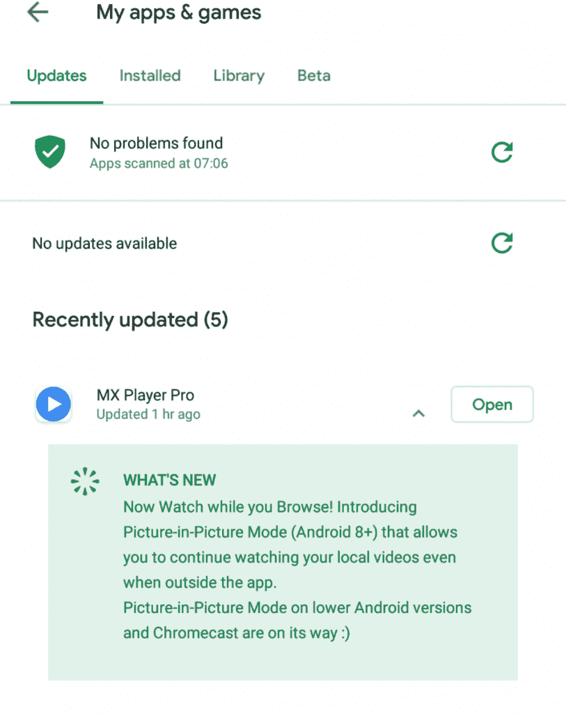

# MX 播放器现在支持画中画模式

> 原文：<https://www.xda-developers.com/mx-player-picture-in-picture-mode/>

# MX 播放器现在支持画中画模式

MX Player 更新包括对 Android 8.0 设备的画中画(PiP)支持，我们了解到 Chromecast 支持也在开发中。

现在有很多很棒的 Android 视频播放器应用可供选择。然而，情况并非总是如此。在 Plex 适应视频播放支持之前，在 VLC 应用程序的[开发开始之前，社区中的一个流行选择是 MX 播放器。由于多年来的持续支持，该应用程序仍然拥有大量用户，并且开发不会很快停止。刚刚发布了一个更新，包括对 Android 8.0 设备的画中画(PiP)支持，我们了解到 Chromecast 支持也在开发中。](https://www.xda-developers.com/vlc-3-1-bandroid-auto-otg-device-support-app-shortcuts/)

正如我提到的，MX 播放器已经存在很长时间了，它是几年来为数不多的提供各种功能的视频播放器之一。我们现在有更多的选择，但这使他们能够建立一个庞大的用户群。一个如此之大的应用程序在去年以 1 . 4 亿美元的价格卖给了印度媒体巨头时代互联网有限公司。新的所有者表示，他们致力于应用程序，并计划随着时间的推移扩大其功能集。几个月后，当重新设计的新用户界面[发布时，该公司信守了自己的诺言。](https://www.xda-developers.com/mx-player-ui-revamp-netflix-hotstar-amazon/)

MX Player 的一些粉丝表达了他们对该应用程序在某些新的 Android 功能方面落后的沮丧。其中包括 Chromecast 支持和画中画模式。该应用程序刚刚通过 Play Store 推出了一个全新的更新，为 Android 8.0 设备带来了对 PiP 模式的支持。在下面显示的 changelog 中，你可以看到开发人员也在努力将 PiP 模式引入到运行较低版本 Android 的设备中。

不仅如此，他们还致力于在未来的更新中最终将 Chromecast 支持(用户高度要求的另一个功能)引入 MX Player。遗憾的是，我们还没有得到这两个新特性的时间表，但我们会密切关注它们。

 <picture></picture> 

Credit: MarblesinthePan

https://play.google.com/store/apps/details?id=com.mxtech.videoplayer.ad

* * *

Via: [Reddit](https://www.reddit.com/r/androidapps/comments/c1p2fw/mx_player_pro_beta_adds_picture_in_picture_mode/)