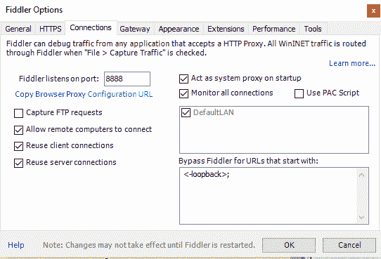

# 网络监控:如何开始以及为什么考虑它

> 原文：<https://www.xda-developers.com/network-monitoring-how-to-get-started-and-why-you-should-consider-it/>

当修改您的设备或从第三方经销商处购买时，安全性和隐私是最重要的。当然，没有什么比只从可信来源购买或下载更好的了，但是如果你认为你的设备正在向/从第三方发送或接收信息，有几种方法可以检查。

 我们要看的方法主要是为 Windows 开发的；然而，通过 mono，OSX 和 Linux 的官方版本确实存在，替代软件选项如 Wireshark 也在那里，但我们将看看 [Fiddler，这是一个免费的 web 调试代理](http://www.telerik.com/fiddler)。首先，你需要从[这里](https://www.telerik.com/download/fiddler)和(Mac 和 linux 用户可以从[这里](http://fiddler.wikidot.com/mono)下载客户端)。一旦安装完毕，我们就可以开始设置了，进入工具>拨号器选项>连接，确保勾选了“允许远程计算机连接”。

然后前往“HTTPs”标签，勾选“解密 HTTPS 流量”，如果你想看到加密的流量。退出设置，悬停在屏幕右上角的“在线”指示器上，记下出现的 IP 地址。

根据你的 ROM 或 Android 版本的不同，下面的说明会稍有不同，但是大部分应该是相似的，容易理解。在手机上打开 WiFi 设置，确保连接到与电脑相同的网络，连接后长按连接名称并选择修改网络，然后点击显示高级选项。

将您的代理设置设置为手动，在主机名下键入您之前复制下来的 IP 地址，然后在代理端口下输入 8888，除非您在 Fiddler 的连接菜单中更改了它。点击保存，然后在你的手机浏览器前往[http://ipv4.fiddler:8888/](http://ipv4.fiddler:8888/)，这应该会显示提琴手回声服务网页。如果您之前选择了启用解密 HTTPS 流量，那么现在您还需要单击手机浏览器中的 FiddlerRoot 证书链接并安装。完成测试后，您可以通过返回 WiFi 设置并移除代理设置来恢复手机的 WiFi 连接。

你现在已经设置好了，应该开始注意到来自你手机的流量出现在 Fiddler 中。如果你正在使用你的电脑在同一时间你可以停止交通从那里显示在 Fiddler 右键点击交通你知道是从你的电脑，然后过滤，其次是隐藏过程；您应该只需要为您的浏览器和其他任何主动连接到互联网的设备执行此操作。从这里您可以开始测试您的设备，如果您计划测试您的 rom，您可能希望在您正常使用手机时让程序运行一段时间，这将允许您在以后查看整个日志，以检查任何零星的恶意连接。但是，如果您想要检查某个应用程序，只需使用该应用程序并监控在此期间建立的连接，就可以快速完成。Fiddler 不会阻止这些连接，但它会向您显示正在发送或接收的内容以及来自哪里，这就让我们开始研究单个连接。

在 Fiddler 客户端的右侧，您会看到几个选项卡，包括但不限于 Composer、Log、Filters 和 Inspectors。在主面板中单击要检查的任何流量，然后在下面出现的新选项中单击检查器，确保您位于标题中。这应该会显示一些信息，比如你运行的 Android 版本，你运行的手机的品牌和型号。这下面会是主持人。

主面板中的条目(左上)显示了 URL、主机、文件大小和内容类型，例如。当我打开 [ES 文件管理器 Pro，这位没落的文件管理器之王](http://www.xda-developers.com/es-file-explorer-a-short-story-of-a-fallen-king/)时，百度的 PNG 文件就出现了。客户端的右侧更加深入，从顶部面板可以看到，我使用的是运行棉花糖的华为-AL10，目前正在连接 Baidu.com。底部面板显示正在发送的数据，在这种情况下可以在 WebView 选项卡中查看，正如您在这种情况下可以看到的，ES File Explorer Pro 正在下载圣诞图像，(Estrongs，如果您正在阅读此信息，感谢您在四月份浪费我的圣诞图像数据...).然后，可以对这些日志进行分析，以确定有关该应用的许多信息。在这种情况下，来自 ES file explorer 的数据和其他流量的累积表明:

a)尽管专业版没有广告，但仍有数兆字节的内容被下载，只是没有显示出来。

b)应用程序的构建很差，没有考虑效率。

app 在不断和百度沟通。

这种方法可以用来监控你的手机通过 WiFi 连接处理的任何数据，从而相对容易地发现某个应用程序或 ROM 是否将你的数据发送到了不该发送的地方，或者下载了可能是恶意的东西。有时试一试，你会对你的发现感到惊讶。

###### 脚注:

###### 只是在网络监控过程中从 ES 文件浏览器中发现的一些纯粹的垃圾