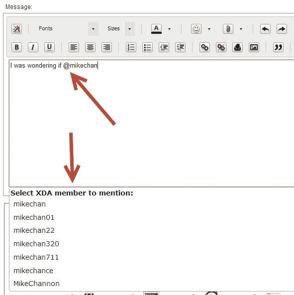

# 论坛的新功能:提及和报价跟踪！

> 原文：<https://www.xda-developers.com/new-feature-for-the-forums-mention-and-quote-tracking/>

有时很难记住谁引用了你关于 XDA 的话，也没有办法知道在讨论过程中是否有人“提到”你。今天，我们推出了一个功能，其运作方式很像 Twitter 和其他社交网络上的@mentions。默认情况下，只要有人在您的用户名旁边放上“@”符号，您就会收到电子邮件通知(您可以关闭它)和 vBulletin 通知(您也可以关闭它)。它是这样工作的。

**引用**的工作原理和现在一样。在帖子中使用引用或多引用按钮将自动向被引用人发送电子邮件和通知(在通知通常发生的右上角)。

**提及**工作与他们在 Twitter 上做的一样。若要提及某人，只需键入“@[用户]...”当你开始输入时，你会看到一个弹出窗口，点击 XDA 用户数据库，这样你就不必输入完整的名字。当您找到正确的名称时，只需从下拉列表中点击它。

然后，当您登录时，您可以在右上方的下拉列表中看到您的所有提及和报价通知。

如果您进入用户控制面板中的[提及系统设置](http://forum.xda-developers.com/usertag.php?do=profile&action=options)，您可以更改一些设置。首先，你可以指定只提醒你朋友列表中的人的提及或引用。这将有助于受欢迎的开发人员，他们可能不想被电子邮件和通知伏击。要将某人添加到您的好友列表中，请点击他们的名字并选择“添加为联系人”,然后在下一个屏幕中勾选“发送好友请求”。

然后，您可以指定是否收到电子邮件通知。最后，您可以打开/关闭下拉通知，并选择它是否出现。

我们计划在未来增加新功能。现在，如果您有任何问题、顾虑或反馈，请点击[提及系统反馈](http://forum.xda-developers.com/showthread.php?p=40427311)线程。尽情享受吧！

注意:要使用提及系统，你必须在 XDA 上有 10 个以上的帖子。

注意 2:和 XDA 上的任何新功能一样，即使是最仔细的测试也无法模拟这个功能上线后的大量使用。因此，在我们确保其正常运行时，提及系统有时可能不可用。