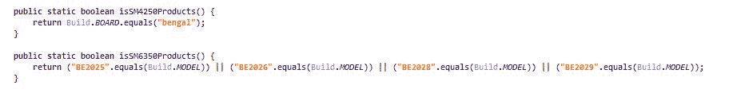
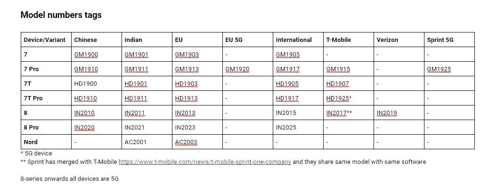

# 未来的一加诺德智能手机可能拥有 5G 骁龙 690

> 原文：<https://www.xda-developers.com/next-oneplus-nord-5g-qualcomm-snapdragon-690/>

一加终于[再次以他们的新“Nord”品牌生产更实惠的智能手机](https://www.xda-developers.com/oneplus-confirms-making-affordable-smartphones-again/)，他们上周刚刚在欧洲和印度推出了[第一款一加 Nord 设备](https://www.xda-developers.com/oneplus-nord-announced-snapdragon-765g-90hz-display-quad-cameras/)，并可能进入我们的[最佳安卓手机](https://www.xda-developers.com/best-android-phones/)名单。新的 OnePlus Nord 拥有 6.44 英寸 FHD+ OLED 显示屏，刷新率为 90Hz，高通 Snapdragon 765G 在印度和欧洲的起价分别为₹27,999 或€399 英镑。如果这个价格对你来说仍然太贵，那么你会很高兴地知道，一加已经在开发更实惠的智能手机。我们现在有证据表明，至少有一款这样的设备将采用高通新的 5G 骁龙 690 芯片组。

**XDA 评论:** [一加诺德评论:性价比高](https://www.xda-developers.com/oneplus-nord-review/)

上个月，高通[发布了骁龙 690](https://www.xda-developers.com/qualcomm-snapdragon-690-5g-chip/) ，这是一款旨在普及 5G 接入的新型中端芯片。它是高通骁龙 675 的继任者，具有更新的 CPU 和 GPU 设计，甚至比更高层的骁龙 720G 和骁龙 730G SoCs 都要新。该 SoC 由三星基于该公司的 8 纳米 LPP 工艺制造，采用 2+6 核配置的八核 CPU2 个主频高达 2.0GHz 的 ARM Cortex-A77 CPU 内核与 6 个主频高达 1.7GHz 的 ARM Cortex-A55 CPU 内核相结合。GPU 是 Adreno 619L，高通声称它比骁龙 675 中的 Adreno 612 GPU 快 60%。最重要的是，骁龙 690 具有集成的骁龙 X51 5G 调制解调器，支持全球 6GHz 以下的 5G 网络。到目前为止，HMD Global、夏普、Wingtech、摩托罗拉、TCL 和 LG 已经确认了在未来智能手机中使用新骁龙 690 的计划，但包括一加在内的步步高电子智能手机品牌没有宣布任何此类计划。

深入研究一加北部最新版本的 OxygenOS 10.5，我们发现了几个关于即将发布的代号为“Billie”的一加智能手机的参考资料在 OxygenOS 设置 APK 中，我们发现了对名为“isSM6350Products”的方法的多次调用此方法检查设备的型号，如果型号名称匹配“BE2025”、“BE2026”、“BE2028”或“BE2029”，则返回 true

 <picture></picture> 

Interestingly, there are also several calls to a method named isSM4250Products, which returns true if the board name is "bengal," the code-name for the [Qualcomm Snapdragon 460 mobile platform](https://www.xda-developers.com/qualcomm-snapdragon-720g-662-460-navic/). We don't have any direct evidence that OnePlus is making a budget smartphone with this SoC, though we'll keep an eye out for more details.

这些可能是新一加设备的型号名称，尽管这 4 个型号名称不太可能指 4 个独立的设备。与此同时,“SM6350”是高通骁龙 690 的零件号，高通自己的网站也证实了这一点。作为参考，下面的图表显示了一加 7、一加 7 专业版、一加 7T、一加 7T 专业版、一加 8、一加 8 专业版和一加诺德的所有型号名称。

 <picture></picture> 

Credits: Oxygen Updater team. (H/T XDA Member [Some_Random_Username](https://forum.xda-developers.com/member.php?u=8234677).)

当前一加诺德的“AC2001”和“AC2003”型号名称中的“AC”是指该设备的内部代号“Avicii”，他是一位著名的瑞典 DJ。同样，“BE2025”、“BE2026”、“BE2028”、“BE2029”中的“BE”很可能指的是“Billie Eilish”，美国著名歌手兼词曲作者。最新的一加发射器 APK 的代码显示，可能有两种不同的设备正在开发中:Billie2T 和 Billie8T。

虽然我们无法确认新一加设备的名称，但我们怀疑它们将成为一加诺德品牌的一部分。一加已经证实[未来的 Nord 品牌设备将于今年晚些时候进入美国](https://www.xda-developers.com/oneplus-nord-coming-to-the-us/)，未来的 Nord 设备也有可能在欧洲和印度推出。如果即将推出的设备确实由高通 Snapdragon 690 移动平台驱动，那么它们的价格甚至会低于目前在英国/欧洲/印度 379/€399/₹27,999 开始销售的 OnePlus Nord。

当我要求一加对这些发现发表评论时，一位发言人告诉我们，该公司不对谣言或猜测发表评论。鉴于一加对当前 Nord 的大肆宣传，我们很有可能在这款设备发布前听到很多关于它的消息。

*感谢 PNF 软件为我们提供了使用* *[JEB 反编译](https://www.pnfsoftware.com/?aid=xdadev)* *的许可，这是一款针对 Android 应用的专业级逆向工程工具。*