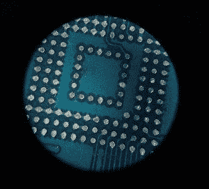

# Nexus 5 被修改为将内部存储增加到 64GB！

> 原文：<https://www.xda-developers.com/nexus-5-hardware-modded-to-64gb-internal-storage-by-replacing-emmc/>

Nexus 5 是一款很棒的手机，绝大多数人都会同意这一点。Nexus 5 以非常好的价格包装了一个体面的硬件，使 Nexus 更加主流，增加了它在普通消费者中的受欢迎程度。

但尽管 Nexus 5 很好，但它确实有一个问题:存储空间有限。诚然，这个问题影响了所有的 Nexus 手机，Nexus 5 也是如此。您可以选择 16GB 的存储版本，也可以选择 32GB 的存储版本。再加上没有任何存储扩展选项，您的存储灾难可能永远不会结束。

XDA 的一名成员，卡皮特兹显然对他手机有限的存储空间感到非常沮丧，于是 T2 决定自己处理这件事。也是字面上的意思。

KApetz2 在网上花 30 美元买了一个 64GB 的 eMMC 5.0 芯片。然后，他将芯片焊接到主板上。他确实坚持认为新芯片是更大的存储选择，因为他的 Nexus 5 仍然显示 32GB 的存储空间。最终，他设法修复了分区表以支持 64GB 的存储。

结果呢？

那么，普通人如何将 Nexus 5 上微不足道的 16GB 换成强大的 64GB，甚至传说中的 128GB 呢？

> 简而言之，你不会...除非你知道你在做什么！

 看似轻松又“15 分钟周日”的工作，实际上是制造业供应链中通常由自动化机械机械臂完成的流程。这不是普通的焊接，它需要精确的定位和专门的工具。eMMC 使用的表面贴装被称为 BGA(球栅阵列),如果你要修复 PCB 上基于 BGA 的元件，这是一个非常困难和漫长的过程，因为你必须完美地排列焊球。这些小零件的不对准或处理不当会给你留下有缺陷且经常无法工作的硬件。

尽管如此，这是一个很好的硬件模型，您可以在备用设备上尝试。有了 Nexus 5，你不仅可以获得更大的内部存储，还可以获得更快的读写性能，因为 eMMC 芯片将从设备中使用的较低版本升级到 5.0。

为了跟进接下来的讨论，请前往[论坛主题](http://forum.xda-developers.com/google-nexus-5/help/nexus-5-64gb-t3350533)。我们请求读者不要因为反复要求一步一步的教程而阻塞了思路。

**你对这个硬件 mod 有什么想法？你认为存储容量是榨取消费者金钱的手段吗？请在下面的评论中告诉我们你的想法！**