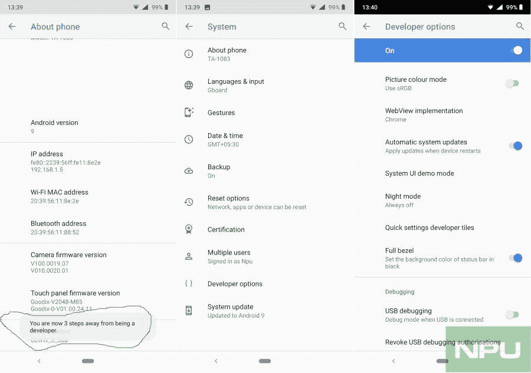

# 诺基亚 6.1 Plus 在 Android Pie 更新中重新获得了隐藏功能

> 原文：<https://www.xda-developers.com/nokia-6-1-plus-notch-hiding-feature-android-pie-update/>

# 诺基亚 6.1 Plus 在 Android Pie 更新中重新获得了隐藏功能

随着诺基亚 6.1 Plus 的 Android Pie 更新，您现在可以通过进入开发者设置再次隐藏显示凹槽。

诺基亚 6.1 Plus 是 HMD Global 手机阵容中的一只奇怪的野兽。这无疑是一款中端手机，而且是一款非常坚固的手机，配备了高通骁龙 636 芯片组，最高可达 6GB 内存，FHD+ IPS 液晶 5.8 英寸显示屏，16 MP + 5 MP 双后置摄像头传感器，以及大小适中的 3，060 mAh 电池。但这款中端设备的两极分化之处在于它的显示屏缺口。这是一个相当小的手机，可以与 OnePlus 6 上的手机相媲美，但它有一个带有诺基亚标志的厚底部挡板。像大多数手机一样，你可以选择隐藏它，至少直到它在一次更新中被莫名其妙地删除。然而，随着最近发布的[稳定 Android Pie 更新](https://www.xda-developers.com/nokia-6-1-plus-stable-android-pie/)，正如 HMD Global [曾承诺的](https://twitter.com/sarvikas/status/1037996835187511296)，该选项又回来了——但不是以你预期的方式。实际上这次是藏起来了。

要在 Android Pie 更新后隐藏 Nokia 6.1 Plus 上的缺口，您实际上需要进入开发者设置。然而，这个过程非常简单:

1.  进入设置应用，向下滚动到系统>关于手机。
2.  在“关于电话”菜单中，寻找“建立号码”选项。
3.  点击内部版本号七次。如果您有密码或 PIN，它可能会要求您解锁。
4.  在弹出一句“你现在是开发者了！”出现时，您将成功启用开发者设置。
5.  进入开发者设置菜单，寻找“全边框”选项。
6.  启用它。状态栏现在应该是黑色的。

 <picture></picture> 

Hiding the Nokia 6.1 Plus' notch on Android Pie. Credits: NokiaPowerUser

这个过程非常类似于如何隐藏谷歌 Pixel 3 XL 中的凹口。然而，在我们看来，HMD Global 应该让这成为一个面向用户的选项，因为许多人都认为显示凹槽在美学上不令人愉快，并转向像我们的 [Nacho Notch](https://www.xda-developers.com/hide-notch-huawei-p20-essential-phone-oneplus-6-asus-zenfone-5/) 这样的应用程序来隐藏它们。

[**Via:Nokia power user**](https://nokiapoweruser.com/again-hide-notch-on-nokia-6-1-plus-running-android-pie-how-to/)