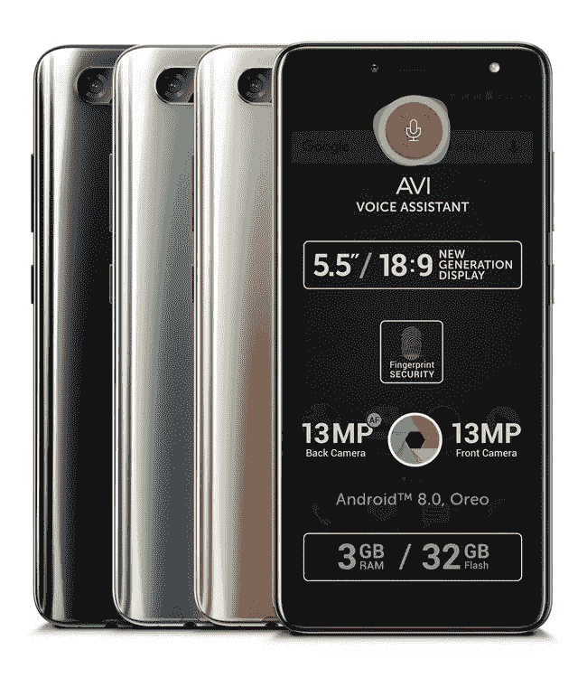

# 多亏了 Treble 项目，一部没有内核源代码的不起眼的联发科手机可以运行 AOSP 的 Android Oreo

> 原文：<https://www.xda-developers.com/obscure-mediatek-phone-kernel-source-android-oreo-project-treble/>

在过去的几周里，我们发布了很多关于谷歌的三倍项目的帖子。它最重要的后果之一(至少对我们来说)是 Treble 认证的设备必须能够[启动一个通用版本的 Android](https://www.xda-developers.com/how-project-treble-revolutionizes-custom-roms-android-oreo/) ，称为通用系统映像(GSI)。它已经使在像 [Honor 8 Pro、Honor 9](https://www.xda-developers.com/honor-8-pro-honor-9-aosp-android-oreo-rom-project-treble/) 或[华为 Mate 10 Pro](https://www.xda-developers.com/project-treble-aosp-android-oreo-huawei-mate-10-pro/) 这样的设备上运行 AOSP 成为现实，尽管三重兼容性本身并不意味着这些受欢迎的设备不会获得 AOSP rom。但是那些不太可能得到像样的开发者支持的设备怎么办——更不用说官方支持了？考虑相对模糊的[all view V3 Viper](https://www.allviewmobile.com/v3-viper.html)——如果没有 Project Treble 兼容性，让 AOSP 在这个设备上运行将是一个**噩梦**。

 <picture></picture> 

The Allview Viper V3\. Source: [Allview Electronics](https://www.allviewmobile.com/v3-viper.html).

你可能从来没有听说过这款手机。它实际上是上个月发布的，配备了 5.5 英寸 18:9 1440x720 显示屏，1300 万像素后置和 1300 万像素前置摄像头，指纹传感器，3gb 内存，32GBs 内置存储，带 microSD 卡插槽，3.5 毫米耳机插孔和 3000 毫安时电池。

在 219.00€，市场上肯定有更好的选择。再花 10 欧元，你就可以购买 [Honor 9 Lite](https://www.xda-developers.com/honor-9-lite-western-europe/) 或者等几天再进口新发布的[小米 Redmi Note 5 或者 Note 5 Pro](https://www.xda-developers.com/xiaomi-redmi-note-5-redmi-note-5-pro-hands-on/) 。在我们的脑海中，Allview V3 Viper 没有什么特别有趣的，除了一件事:它由**联发科** (MT6737) SoC 驱动，并运行 **Android 8.0 Oreo 开箱即用**。

由于它运行 Android Oreo 并通过了谷歌的 CTS，这意味着它也必须满足兼容[Project Treble](https://www.xda-developers.com/googles-project-treble-modularize-android-so-oems-can-update-devices-faster/)的要求。对我们来说最重要的是，这意味着该设备能够启动 AOSP 奥利奥 GSI，而不需要开发人员从其他手机移植专有组件，为缺少符号的库创建[垫片](https://www.xda-developers.com/cameras-custom-roms-developers-make-hardware-work-without-source-code/)，使用包装器，十六进制编辑二进制文件来修复不匹配的名称，以及更多的黑客方法来让基本硬件在 AOSP ROM 上工作。

当然，这是假设，任何开发者甚至会*希望*在这个设备上工作。开发者就像用户一样——他们涌向他们负担得起或满足其基本需求的最好、最受欢迎的设备。我非常怀疑一个相当大的开发者社区会关注 Allview V3 Viper，但是多亏了 Project Treble，为了让用户将 AOSP 引导到他们的设备上，不需要有一个**。此外，即使*有*开发者对这款设备感兴趣，这最终也无关紧要——如果没有内核源代码，你甚至可以幸运地获得[半功能 rom](https://www.xda-developers.com/lineageos-14-xiaomi-mi-a1-kernel-sources/)。**

但是一个 Treble 兼容设备不需要任何内核修改来启动 AOSP，所以这意味着你不需要 Allview V3 Viper 的内核源代码来运行一个基本的 AOSP ROM。为了证明这一点，XDA 的高级成员 phhusson T1 出去买了一台这样的设备，因为一位用户在 T2/r/Android T3 上询问是否可以在这种设备上运行 AOSP。phhusson 前几天才收到这款设备，他不仅能启动 AOSP 的安卓 8.0 奥利奥，还能启动 AOSP **的安卓 8.1 奥利奥**！

根据 phhusson 的说法，**当他使用 Play Store 的“测试你的 Android”应用程序进行测试时，所有的硬件功能都工作正常。**

他说他到目前为止遇到的唯一一个错误是该设备很难对他的 ROM 中的 HEVC 1080p 视频进行硬件解码——考虑到他没有花时间开发 8.0 版奥利奥，也没有花时间开发 8.1 版，这是一个很短的错误列表。

### 为什么这很重要

到目前为止，我们一直在引导所谓的“Treble ROMs”的所有设备通常都是高端华为或 Honor 设备。大多数用户可能不会尝试在这些设备上运行 AOSP，因为他们可以依赖 OEM 的官方支持，也因为 OEM ROM 提供了许多 AOSP 所没有的独家功能。

然而，并不是每个用户都从主要的 OEM 厂商购买最新的高端旗舰。事实上，大多数用户倾向于中低端设备，有数百万这样的用户从没有资源更新设备的品牌那里购买手机。但多亏了 Treble，这些手机仍然可以启动更新版本的 Android，而不需要专门的开发者社区，也不需要访问内核源代码。

我们无意挑 V3 Viper 的毛病，但它是证明这种可能性的完美测试设备。我们可以想象这样一个未来，大量没有名字的低端联发科设备发布时只有微不足道的软件支持，但有了三倍的兼容性，这些设备可以长期存在，超过制造商预期的到期日期。

### 一个小小的警告

现在，有一件事我应该提一下。正如我之前提到的，Android 8.0 Oreo 发布时，Project Treble [并没有真正完成](https://twitter.com/MishaalRahman/status/958769338391187456)。我被告知，供应商 NDK (VNDK)直到 Android 8.1 奥利奥才完成。这意味着 phhusson *不得不做一些黑客工作来让 8.1 在 V3 毒蛇上工作。据他说:*

> #### 有一个 SELinux 问题(MediaTek 在供应商 8.0 中所做的和 Google 在系统 8.1 中所做的冲突，我还不知道如何正确解决)，然后，我需要向 VNDK 添加库。

不幸的是，这种问题目前很常见，因为少数开发三倍兼容 rom 的开发人员正在研究如何在现有的 8.0 设备上正确启动新版本的 Android。

然而，一旦有更多搭载安卓 8.1 奥利奥的设备上市，升级到 T2 安卓 P T3 应该是小菜一碟——至少谷歌是这么认为的。如果所有这些消息让您兴奋，那么请考虑订阅我们的三重设备开发论坛。

[**访问我们的高音设备开发论坛**](https://forum.xda-developers.com/project-treble/trebleenabled-device-development)