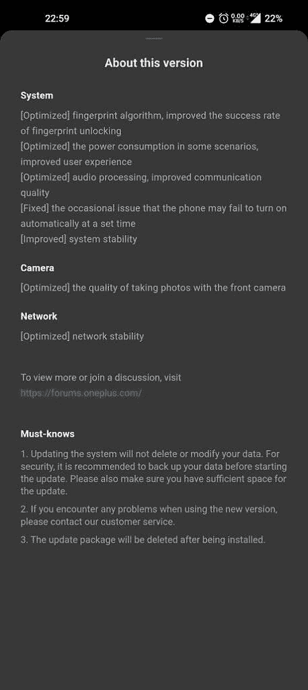

# 一加 10 Pro 更新带来了一堆优化和漏洞修复

> 原文：<https://www.xda-developers.com/oneplus-10-pro-update-optimizations-bug-fixes/>

在本月早些时候推出 OxygenOS A.11 到其旗舰[一加 10 Pro](https://www.xda-developers.com/oneplus-10-pro-review/) 之后，一加现在推出了另一个更新，进行了各种优化和漏洞修复。最新的更新 OxygenOS A.13 已经开始向印度和北美用户推出，应该会在未来几天内覆盖所有设备。

根据一加社区论坛最近的一篇帖子，一加 10 Pro 版的 OxygenOS A.13 对指纹算法进行了优化，提高了指纹解锁的成功率。它还优化了某些场景下的功耗，改善了音频处理以获得更好的通信质量，并修复了阻止手机在设定时间自动开机的偶尔错误。

 <picture></picture> 

Credit: anujthakurece

此外，适用于一加 10 Pro 的 OxygenOS A.13 优化了该设备 32MP 自拍相机的相机质量，并提高了网络稳定性。不幸的是，它不包括 2022 年 4 月的 [Android 安全补丁，设备仍然停留在 2022 年 3 月的补丁上。相比之下，三星已经](https://www.xda-developers.com/april-2022-android-security-update/)[开始为其旗舰 Galaxy S22 系列](https://www.xda-developers.com/samsung-galaxy-s22-may-2022-security-patch/)推出 2022 年 5 月的安全补丁。你可以在下面的部分查看完整的变更日志。

*   **系统**
    *   【优化】指纹算法，提高指纹解锁成功率
    *   [优化]某些场景下的功耗，改善用户体验
    *   [优化]音频处理，提高通信质量
    *   [修正]偶尔的问题，手机可能无法在设定的时间自动开机
    *   [改进的]系统稳定性
*   **摄像机**
    *   [优化]使用前置摄像头拍摄照片的质量
*   **网络**
    *   [优化的]网络稳定性

一如既往，OxygenOS A.13 正在分阶段推出。今天，它将覆盖一加 10 Pro 用户的一小部分，几天后将进行更广泛的推广。如果您的设备上没有收到更新，您可以转至设备设置中的“软件更新”部分来手动检查更新。或者，您可以从下面的链接下载固件包，并手动刷新更新。

## 为一加 10 专业版下载 OxygenOS A.13

我们目前只能在印度地区使用 OxygenOS A.13 全 OTA。我们将在其他地区的增量版和完整版 OTA 发布后尽快更新这篇文章。

*   一加 10 专业版
    *   印度(NE2211_11。答 13)
    *   页:1。页:1
    *   全局(NE2215_11。答 13)

* * *

**来源:** [一加社区论坛](https://forums.oneplus.com/threads/oxygenos-12-a-13-for-oneplus-10-pro.1574292/)

*感谢 XDA 公认开发者 [mlgmxyysd](https://forum.xda-developers.com/m/mlgmxyysd.8430637/) 提供的下载链接！*