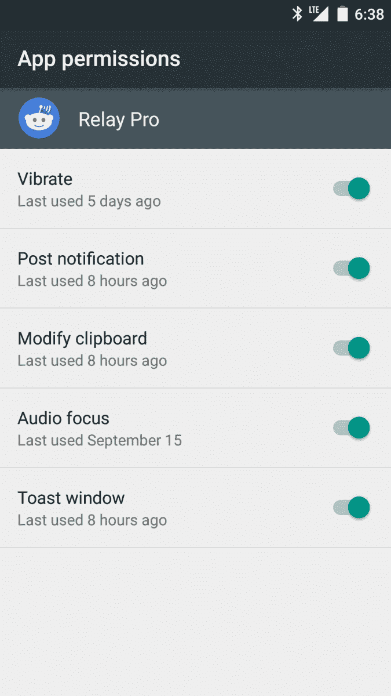
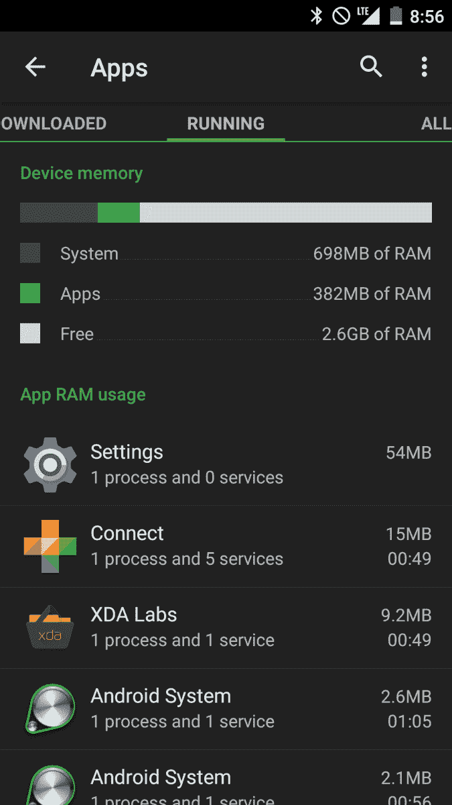
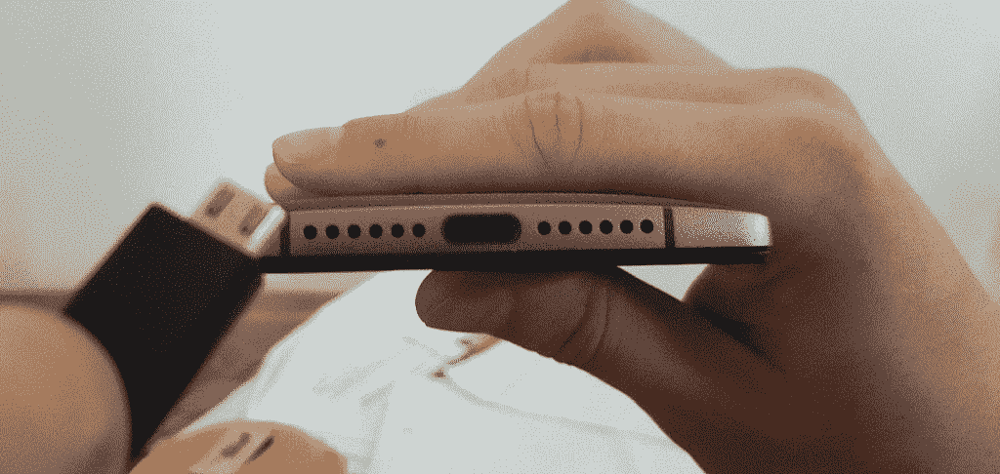

# OnePlus 2 XDA 评论

> 原文：<https://www.xda-developers.com/oneplus-2-xda-review/>

一加终于为我们带来了广受好评的 OnePlus One 的续集。现在，是时候看看 OnePlus 2 是否有能力重燃战火，夺回平价旗舰的桂冠了。

在本次评测中，我们将深入探讨 OnePlus 2。该功能试图提供与我们的读者群相关的内容，而不是列出规格和谈论体验感受。在 XDA，我们的评论不是为了告诉用户一部手机是否值得购买——相反，我们试图通过我们的话语把手机借给你，并帮助你自己做出决定。开始之前，让我们先看看规格表:

| 

Android 版本:

 | 

棒棒糖

 | 

型号名称:

 | 

一加 2 (ONE A2005)

 |
| --- | --- | --- | --- |
| **尺寸:** | 151.8 x 74.9 x 9.9 毫米(5.98 x 2.95 x 0.39 英寸) | **屏幕尺寸&屏幕比例:** | 5.5 英寸(屏幕与机身的比例约为 73.3%) |
| **主摄像头:** | 1300 万 | **辅助摄像头:** | 5MP |
| **屏幕类型&分辨率:** | 液晶显示器，1080 x 1920，401 ppi | **芯片组:** | 骁龙 810 |
| **内部存储:** | 64 GB/16 GB | **CPU:** | 四核 1.56 GHz Cortex-a53 四核 1.82 GHz Cortex-A57 |
| **卡槽:** | 没有人 | **GPU:** | 肾上腺素 430 |
| **内存:** | 4GB/3GB | **电池:** | Li-Po 3300 mah |
| **NFC:** | 不 | **USB:** | USB 类型 C 2.0 |

## 索引

## 设计

OnePlus 2 在设计方面打破了这种模式，因为它的特点只能被描述为粗糙的外观，试图看起来坚固而不易碎，坚固而不圆滑。OnePlus 2 在这方面非常出色，我相信任何持有它的人都会惊讶于它与智能手机的不同之处——在好的方面。让我们从谈论手机的美学开始，然后我们将转移到手感上。

[段落 _ 左侧]

该设备的正面是光滑的黑色，普通的边框既不太薄也不太大，它们允许对设备的屏幕进行良好的、严肃的处理。从正面看，这款设备的形状在一定程度上让人想起了 Nexus 5，一加略微淡化了设备顶部和底部的拱形，以降低屏幕与机身的比例，使设备稍微更加严肃和有吸引力。前面的指纹传感器沉在一个奇怪的 home 键式凹坑中，实际上没有任何用途，因为它不能被按下，而且按键是电容性的。也就是说，我实际上更喜欢它的存在，而不是希望它在使用一周后消失。[/paragraph_left]

前端的指纹传感器陷入了一个奇怪的 home 键式凹坑中，实际上没有任何用途

黑色的正面可能看起来有点太典型，乍一看，它似乎并不真正匹配设备的其余部分，但我马上就会解释为什么这是一个明智的决定。该设备的边缘是一种光滑而难以置信的坚固镁合金，它的质量令人惊叹，它看起来和感觉上都比其他手机的铝框架更坚固。我不想对它进行测试，但就外观而言，它强化了手机的坚定主题。我非常喜欢金属边缘在许多不同照明条件下发光的方式，这让设备看起来非常独特，即使在光线较暗的情况下，边缘也很明显。

按钮发出咔嗒声，但缺少一些移动和高度。我不太喜欢一加把音量键和电源键放得这么近，放在同一边，放在特定高度的决定，但过一段时间后就会习惯了。“提醒”滑动条的触感和令人满意的点击感觉完全达到了它的目标。该设备的顶部有 3 毫米耳机插孔和一个天线带，而底部有两个和两个扬声器格栅……但按照典型的 OEM 技巧，只有正确的一个实际上可以作为扬声器。

真正的展示是砂岩背面，它给人的感觉与外面的一切都非常不同

[paragraph_right]设备的背面是事情变得更有趣的地方:背面的金属强调在其边缘具有反射性，非常像框架，相机模块位于中心附近，而不是大多数镜头的典型顶部对齐。你会发现激光自动对焦以及双色闪光灯。真正的展示是砂岩背面，这感觉与除了最初的 OnePlus One 之外的任何东西都非常非常不同。这种背部更坚固，感觉更像它试图模仿的砂岩，给它一种粗糙的感觉，使它有很大的抓地力。到目前为止，当其他人看到我手中的设备时，这似乎是他们指出的主要问题，这绝对是人们越来越喜欢这款手机的原因。然而，如果你不喜欢它，你还有其他选择。[/paragraph_right]

OnePlus 2 还有其他后盖选项，宣传为风格互换盖，有竹子、木头、碳纤维和黑灰四种材质。这款手机的所有这些看起来都很好，正是因为它的设计方式:金属口音，边缘和黑色玻璃板正面流动良好，将所有变体都涵盖在内，这真的感觉这款手机在设计时考虑了各种设计。结果是一个高度可定制的手机，拥有许多时尚的产品。背面也很容易拆卸，并显示了两个 4G LTE nano-SIM 的双 SIM 卡插槽。

关于设计，我还想提一些其他的事情，第一个是关于屏幕的。自从最早的测试以来，我觉得 OnePlus 2 变得比它应该的更模糊，并且缺乏其他屏幕所具有的那种旅行。我将此归因于所选择的涂层解决方案。没有真正标签的电容式按键可以双向使用——很高兴一加没有强迫人们使用它们，它们也给了你修改布局的选项，所以按键确实可以工作。但是给他们蓝光破折号是奇怪的，特别是因为你可以让手机有口音和物理外观与灯的颜色完全不相干，这是选择红色口音时最讨厌的事情。我个人禁用了按键的背光，我也在这些按键和软键之间切换。

最后一点，OnePlus 2 的构造是非凡的，它的重量和一般构造让它看起来气势磅礴、坚固和高档。原始设备制造商很少能制造出不仅设计新颖，而且既有昂贵感 *又有* 坚固耐用的设备。对我来说，OnePlus 2 符合所有这些要求，在这方面，它确实感觉非常独特。

## 软件用户界面 [^](#Index)

[段落 _ 左侧]

OnePlus 2 运行氧气操作系统，这与 OnePlus One 的 CyanogenMod S 和现在流行的 Cyanogen OS 略有不同。这个 ROM 背后的团队——包括来自偏执的 Android 的著名开发人员——设定了一个简单的目标:使软件快速、轻量级，并且只添加合理的软件附件。在很大程度上，他们成功了，这一切都始于这里的 Android 皮肤…或者说缺乏。[/paragraph_left]

这一切都始于这里的 Android 皮肤…或者说缺乏。

Oxygen OS 在许多方面都非常接近于 stock Android，包括 UI 的基本外观和大多数设置，以及所有的关键导航界面。有一些明智的补充，如搜索栏和多任务菜单中的“关闭所有”按钮。你会发现默认产品的另一个不同之处是启动器，因为氧气操作系统启动器虽然接近库存，但允许更好的项目重新排列，也可以从你为手机选择的全球主题中看到轻微的主题化。

> 您可以为 UI 外观选择各种颜色，包括切换和状态栏亮度滑块

这就是主题化的用武之地:虽然用户界面通常是你所期望的普通 Android，但也有一些小而简洁的定制选项，可以让手机更好地符合你的偏好。第一个来自全系统主题选择，但这仅限于常规和黑暗主题。虽然这不是一个巨大的进步，但许多用户喜欢黑色主题，这延伸到了手机的启动器和其他重要区域，但不像其他 rom 那样以股票应用程序闻名。除此之外，您还可以选择各种 UI 颜色，包括切换和状态栏亮度滑块。这是一个小变化，但它确实有助于使手机与你的交换风格(如果有的话)和主屏幕的选择相匹配。但是，必须注意的是，电容式按键是静态颜色，这可能会使它们与某些重音冲突，并且重音选择仅适用于深色主题。

在主题方面没有太多，但是你可以选择电池图标，并将其更改为圆形或文本。不过，用户界面定制有一点让人喜欢，那就是导航键:一加不会强迫你使用大容量键，就像 OnePlus One 一样，你可以选择软键。更重要的是，你可以自定义按键的顺序，它们的动作有 *和* 长按动作。这使得从三星设备切换到 OnePlus 2 更加方便。您还可以关闭 capactive keys 背光，并且即使使用 capactive keys，也始终启用主屏幕按钮。拥有最后的应用程序切换选项可用于映射是定制 ROM 爱好者会发现非常有吸引力的事情。

OnePlus 2 的 UI 没有更多的了，那就是 **好东西** 。这仍然接近库存，同时仍然给你一些很好的定制选项。那些正在寻找更加个性化的皮肤或爱情主题引擎的人现在可以去别处看看。但是如果你想改变的事情不多，Oxygen OS 会让你做得很好。

## 软件特性和用户体验 [^](#Index)

与 UI 一样，Oxygen OS 也将附加功能最小化。但是这种方法的伟大之处不在于变化很小，而在于它们在执行过程中不会增加混乱。像切换重排这样的小事情变得很直观，就像上面提到的，许多小的改进使得导航和一般的多任务处理变得更加容易。但这还不是全部:一加想尽办法加入了大多数 OEM 棒棒糖产品所不具备的各种功能，在安卓棉花糖发布之前不会成为主流。

 首先，你有了进入 M 开发者预览版的黑暗模式。虽然这是一个小功能，但它是 XDA 用户特别喜欢的东西，他们通常会不厌其烦地在手机上安装。另一个这样的东西是 **粒度权限控制。您可以从应用程序中切换单独的权限，也可以查看特定权限最后一次被触发的时间。这个功能本身的价值是巨大的，它可以帮助你节省电池寿命，保护你的隐私，而不需要曝光或其他模块。从我的测试来看，它工作得很好，阻止应用程序唤醒手机或访问录音非常有效。值得注意的是，应该明智地使用这个特性，因为它 * 可能会破坏某些功能。***

棉花糖势必要普及的另一个功能是指纹扫描。OnePlus 2 配备了速度惊人的指纹扫描仪，据我所知，在从头解锁手机方面，它实际上比 Note5 还要快。事实上，它不是一个你必须按下的按钮，这有利于它和它的 home 键位置。不过，我确实注意到，由于增加了指纹，该设备的解锁速度似乎慢了一点，这一点你可能需要记住。不管是不是安慰剂，感觉差别不大。

OnePlus 2 的另一个令人喜欢的地方是它的 3 阶段“提醒滑块”。这是一种快捷的静音方式，无需通过屏幕操作用户界面。一开始我以为这是个噱头，但是很有用。如果你经常走进教室，或者你的日程安排让你经常把手机调成振动，那么你会喜欢这个。无论哪种方式，它都是那种你不知道你想要什么，直到你尝试过。我相信顺序应该是不同的，向下滑动应该会使手机静音。但撇开个人偏好不谈，这是一个我希望更多 OEM 厂商实现的硬件功能，由于按钮的质量和感觉，这已经成为我最喜欢的 Android 专属 OP2 功能。顺便说一句，当与 Wear 的通知设置结合使用时，它似乎会出错，并且其中一个的变化可能不会转换到另一个。我建议专门使用提醒滑块，而不是 Wear 的设置，如果你想避免在课堂或会议上收到通知，请注意(从经验上讲)。

屏下手势在这里也卷土重来，而且一如既往的辉煌。打开相机或切换手电筒只需简单的滑动，但即使是双击屏幕解锁也是一种乐趣。它也比我测试过的其他设备(如 ZenFone 2)运行得更好，再加上 Lollipop 的锁屏通知，这使它成为办公室和教室的一个有用的补充。

一加还有一个“货架”功能，在某种程度上可以替代 Google Now。它存在于抽屉的同一个位置，到目前为止，它是非常基本的。它主要是一个美化了的小工具主屏幕，有一个文件夹，里面有最常用的应用程序、最喜欢的联系人、天气等等。这里没有什么是不能用第三方解决方案巧妙复制的，它也不是那么好。这是我觉得 Oxygen OS 试图更像三星而不是谷歌的一个方面，这一点也很明显。幸运的是，你可以选择退出。无可否认，这项服务还在发展中，并且随着时间的推移一定会变得更好，但是目前还没有什么特别值得关注的地方。

我想提到的最后一件事是，虽然 Oxygen OS 提供了一些可定制性，但它缺少一些基本设置，这些设置存在于它试图模仿的定制 rom 中。感觉软件团队既不想模仿 CyanogenMod 也不想模仿 Cyanogen OS，结果很多自定义的 ROM 收藏夹都不见了，从主题到设置。我个人对 Oxygen OS 的一个看法是，没有办法禁用右侧快速下拉功能——这在任何有这种功能的 ROM 上都是显而易见的事情。

总的来说，OnePlus 2 的软件令人愉快。像提醒滑块这样的独家功能使用起来令人惊讶，总的来说，手机的 UX 在一般功能方面感觉比股票高一步。然而，我确实觉得它的许多附加功能并没有进入你的日常生活，而且即使它们进入了你的日常生活，也不是很大。但即便如此，考虑到这种方法的最低限度的精神，OnePlus 2 的软件是沉重的制造商皮肤海洋中的一股新鲜空气。不过，还有优化改进的空间，我将在下面进一步讨论。

## 表现 [^](#Index)

OnePlus 2 采用了臭名昭著的 Snapdragon 810，这种东西在发布时，立即赶走了热切的粉丝。毕竟，由于其骁龙 801 和高效的软件，OnePlus One 是一个性能强大的设备，价格只会让它更好。不仅如此，在现实世界和理论性能方面，OnePlus One 通常都比其他骁龙 801 设备表现更好。对于一款搭载 Snapdragon 810、4GB 内存和普通 ROM 的设备，我们能期待什么呢？最重要的是，设备会变热吗？下面就来了解一下。

## CPU &系统^

Snapdragon 810 听起来像是一种妥协…虽然它能够提供良好的性能，但一致性仍然是一个很大的问题。OnePlus 2 也对其默认使用的臭名昭著的芯片版本进行了修改。例如，该器件的时钟频率为 1.8GHz，而不是默认的 2GHz。就基准而言，这实际上似乎没什么大不了的。该设备在大多数 CPU 受限的基准测试中仍然表现非常好，并且它也显示出与其他 Snapdragon 810 设备相当的性能。在下面以现实世界为中心的基准测试套件中，你可以看到 OnePlus 2 实际上与顶级产品竞争，与三星的 Galaxy Note5 和 S6 旗舰产品进行了交易。

然而，这并不罕见，许多采用一年前的处理器的设备都可以在这些整体测试中获得不错的分数。今年的 ZenFone 2 也接近 PCMark 和 Basemark OS II，尽管更抽象的基准测试使处理器更接近骁龙 801。OnePlus 2 也是如此，它提供的 GeekBench 和 AnTuTu 评分与其他 Snapdragon 810 设备一致。这不足为奇，就实际利益而言，意义不大。如果 OnePlus 2 能够像这些芯片组中的一些一样稳定，那将是一个重大的解脱，但遗憾的是，情况并非如此。

OnePlus 2 不会过热，但它肯定会减速。当这种情况发生时，基准分数会突然下降，在游戏中也会发生类似的情况(下面会详细介绍)。在实际的系统使用过程中，这种情况不会像在密集型任务中那样频繁发生。在应用程序加载方面，Snapdragon 810 提供了与 ZenFone 2 和 Note 4 相当的性能(运行轻量级 CM ROM)。它的速度确实超过了 Note 3 和 Note 4 上更重的 TouchWiz，但没有 Note5 及其疯狂的应用程序打开速度。必须指出的是，为了最大化应用程序打开时间，必须使用第三方启动器，因为默认启动器在触发应用程序动画之前会有轻微的延迟。关于热火的信息将在 GPU &游戏部分跟进。

## GPU &游戏^

adre no 430 是 OnePlus 2 的救赎因素之一，因为它提供了极具竞争力的性能，可以在屏幕外和理论结果上与 Exynos 的 Mali-T760 相抗衡。OnePlus 2 配备的较低屏幕分辨率使其更容易在屏幕效果方面超越竞争对手，在我的 GFXBench 测试中，这款设备的平均得分高于其他 Snapdragon 810 设备。这确实让我想知道，如果 OnePlus 2 不得不承受 1440p 屏幕的额外负担，那么它的性能输出以及稳定性**都会怎么样。**

 **这些性能指标评测还可以转化为现实世界的游戏环境和高性能图形任务，但时间有限。在我的测试中，我注意到 OnePlus 2 有两种情况:要么它保持稳定的 FPS 数，但变得相当热(在 Asphalt 8 上最明显)，要么它到达一个点，设备开始自我调节，每秒帧数变得完全不同。下面你可以找到一些记录在 Gamebench 上的例子，以及适当的 GPU 和 CPU 使用概述。很容易发现这个装置节流的时刻。

这让我想到了 heat，我也将在真实世界的用法一节中展开讨论。在玩游戏时，设备通常会超过 40 摄氏度，在这个温度下，手的热度会变得很明显。一旦设备的表面达到 43 至 44 摄氏度，OnePlus 2 就会变得有点不舒服，因为金属边缘和重音明显比设备的其他部分更热，顶部也比底部更热。下面是一些描述死亡触发器 2 10 分钟后温度的图片。

简而言之，我今年评测的之前的设备在性能和散热管理方面要稳定得多。Zenfone 2 的 Atom Z3850 即使在经过无数次背靠背的基准测试后仍保持凉爽，Note5 的最小热量和高效分布使我将其命名为*“随时握在手中的热快感”*。OnePlus 2 绝不是这样，光是使用就可以让它达到 38 摄氏度，这是更高效的 SOC 的高端。也就是说，它很少成为轻任务的真正重大烦恼，它通常会在游戏等重任务中变得不舒服。

## 存储和内存 [^](#Index)

OnePlus 2 拥有 16GB 或 64GB 的存储空间，3GB 或 4GB 的内存，具体取决于您选择的型号。我的版本是 64GB 的变体，具有 4GB 的 RAM，开箱后，手机有大约 52.7GB 的可用存储空间(在更新到 Oxygen OS v2.0.2 之后)。这款设备的存储速度相当快，比去年的一些旗舰产品如 Note 4 还要快。下面你可以找到列出的速度，以及它们与 Note 4 和 Note5 的比较，Note 4 和 Note 5 是 2014 年和 2015 年的两款更大的旗舰。

就多任务处理而言，OnePlus 2 在将应用程序保留在内存中方面做得非常好，比今年推出的其他手机好得多——这可能是因为它们有 3GB 的内存，也可能是因为它们的内存管理解决方案有缺陷。这款手机与 ZenFone 2 正面竞争，在测试大型应用程序时，它提供几乎相同的内存管理。在正常使用过程中，很少会发生重绘的情况，而且对这款手机的内存管理也没有什么抱怨——至少在我的使用过程中没有出现过。

## 真实世界的 UX [^](#Index)

就现实世界的 UX 而言，OnePlus 2 是一头怪异的野兽。在该设备处于最佳状态的时候，也有一些辉煌的表现。然而，如上所述，性能的一致性并不是你应该从 OnePlus 2 中期待的。我敢打赌，这其中很大一部分是由于内部发现的 Snapdragon 810，以及防止它做它最出名的事情的变通办法。但不是全部。

首先，我想再次强调加热:设备 **不会过热** ，但这并不意味着它不会变热。这款手机在日常任务中很容易变得温暖，包括持续的背景数据使用、导航和热点。我每天做所有这些事情总共至少一个小时，所以我注意到在这些任务中设备的温度超过了 38 摄氏度。这并不意味着性能会在这些点上受到影响。上面我展示了一些严重的节流，但是**这并不是在每个用例下每天都会发生的**。在具有繁重背景和活跃进程的 3D 游戏多任务处理过程中，繁重的节流最为明显。

但是有一些事情阻碍了这款设备的卓越性能。尽管运行了一个很轻的 UI，但感觉并没有想象中那么流畅。我想再次强调一下 *快速* 和 *平滑* 的区别。该设备可以相当快地打开应用程序，甚至像打开相机这样的事情也比平均速度快。但是这里和那里有一些口吃，感觉就像设备自己的速度。OnePlus One 的性能是一个亮点，但 OnePlus 2 的性能并不特别令人印象深刻，特别是与 Note5 等功能更强大的设备的速度和 ZenFone 2 等功能较弱的版本的流畅性相比。

尽管如此，OnePlus 2 有一点做得非常好，那就是多任务处理。该设备在清理时可以很容易地看到 2.6GB 的空闲内存，这大大优于 Note5 典型的 1.7GB 至 1.4GB 的开放内存，几乎没有应用程序。该设备没有膨胀软件，这使得日常性能有所不同。在手机上进行多任务处理是一种幸福，你可以轻松地运行 10 个左右的应用程序，甚至 5 或 6 个重度游戏(我能够毫不费力地同时运行上面列出的所有游戏)。虽然有些人认为 4GB 手机不是必要的，2015 年手机带来的额外 1gb 内存是多余的，但与三星虚幻的内存巨头相比，OnePlus 2 使它成为一种明显的便利和一股新鲜空气。

 如果我必须对 OnePlus 2 性能的个人问题吹毛求疵，我会在玩重度游戏时将责任归咎于 Snapdragon 810，并在次要软件问题上归咎于 Oxygen OS。OnePlus 2 有时会在降低通知阴影时跳过帧，第三方应用程序甚至像 Chrome 这样的谷歌应用程序也存在一些性能错误和不稳定。该芯片组对于持续的大量使用(如游戏、大量流媒体和/或多任务处理)来说并不出色，一旦设备开始节流，你就会注意到这一点。有时，设备变得 * 不舒服 * 热，特别是因为热量集中在设备的顶部和侧面(如上图所示)。该设备每天会加热到 38 摄氏度(外部温度)，而效率更高的设备在类似或更高的工作负载下很少会这样，达到 44 摄氏度也是大量使用的典型结果。

总体来说， *再考虑价格* ，一加 2 的表现还算不错。但默认软件仍有改进的空间(例如，launcher 在应用程序启动和返回时有明显的延迟，但你可以替换它)，这是一款最有可能由于定制 ROM 开发而出现这种情况的设备。我将在下面的开发部分讨论更多这方面的内容，但我相信 OnePlus 2 将会有很好的发展，当前的定制软件看起来非常有前途。

## 摄像机 [^](#Index)

OnePlus 2 的主摄像头可能不符合 16MP 的新标准，但我一直认为 13MP 已经足够好了。然而，最容易注意到的是，在这种设置下，照片的比例为 4:3。抛开图像大小和比例不谈，硬件并没有止步于此——还有 OIS，更好的是，激光自动对焦也出现了。这两者通常构成了一个值得兴奋的包....但可悲的是，OnePlus 2 的摄像头并没有很好地利用它。

 <picture></picture> 

That's all you get without swiping or tapping.

让我们从相机应用程序开始:OnePlus 2 的取景器 UI 是准系统，几乎没有设置(在我测试的版本中没有手动模式，也没有 RAW，但据称它即将到来)，而且它是 **笨重的** 。我相信这是最好的方式，因为在视频和图片之间切换需要滑动和缓慢的切换，HDR 也隐藏在一个按钮后面，用于预览的图库简直糟糕透了:默认情况下，它不与任何应用程序绑定，不允许你缩放，而且它往往会给图像预览添加怪异的伪像。

OnePlus 2 的实际拍照能力很好，但我所说的能力是指潜力——总的来说，这款设备的照片在曝光、色彩和噪音方面落后于大多数竞争对手。下面会有更多的介绍，但我想说的另一个问题是拍照体验:它很慢，下面的视频演示了原因。OnePlus 2 的激光自动对焦仍然无法实现极快的对焦，曝光有疯狂的变化，取景器倾向于跳过帧(特别是在弱光下)，拍照本身就很慢 **。** 非常缓慢。尤其是 HDR——它非常慢，因为处理图像至少需要整整一秒钟。顶级智能手机相机可以 *在取景器中给你 HDR 预览* ，但 OnePlus 2 需要大量时间才能获得更差的结果。我用这款手机的相机错过了许多精彩的照片。

这款相机的细节实际上并不差，而且它很好地利用了它在图像中提供的 1300 万像素。我想重申，它能够拍出非常好的照片，只是不像其他手机那样容易。曝光通常会使图像看起来褪色，某些焦点会将天空变成压倒性的大量光线。更重要的是，我拍出了令人惊讶的模糊照片，我不得不养成为同一主题拍摄多张照片的习惯——考虑到相机的速度，这很烦人，在长时间拍摄后，当设备变热时，这个问题会变得更加严重。我在光天化日下拍摄的一些照片也显示出奇怪的噪音，即使是在白色背景下。低光照片是偶然的，但我设法从一些室内照片中获得了一些好的细节。自拍摄像头在白天工作，但在光线较暗的情况下也会看到糟糕的噪声。

视频是一个不同的故事，实际上我对 4K 视频(遗憾的是没有 60fps1080p)在这款设备上的表现很满意。曝光仍然有一些不一致，这似乎是在错误的时间调整。但除此之外，细节很好，颜色看起来比普通照片略好。

## 显示 [^](#Index)

OnePlus 2 拥有 1080p 显示屏，而大多数制造商至少已经尝试了 1440p。虽然对一些人来说是一个大胆的举动，但我认为考虑到手头的芯片组，这是明智的。从整体来看，OnePlus 2 的显示屏看起来很舒服，但称赞仅限于此。就我个人而言，增加的像素密度在 1440p 面板上并没有引起我的注意，因此排除这一点，该设备的其他单个方面与其价格范围内的中端设备具有竞争力，但不是最高口径的旗舰产品。

对于这个价位的 IPS 液晶面板来说，OnePlus 2 的亮度相当不错。AMOLED 屏幕最近在这一类别中名列前茅，OnePlus 2 确实落后于今年的三星巨头，特别是当它们在自动亮度方面达到最大值时。在极端的阳光条件下，OnePlus 2 是可见的，但不足以像最近采用 AMOLED 屏幕的其他更亮的手机一样工作。在强烈的日光下拍摄时，这一点尤其明显。OnePlus 2 的面板也无法与最好的面板相比。但是在日常使用中，我只是偶尔注意到不足之处。不过，屏幕不会太暗，除了普通的黑色和视角，这使得手机在晚上被短信吵醒时使用起来很烦人。

> OnePlus 2 的自动亮度可能需要一些工作，最后我决定简单地禁用它

至于白色的准确性，我很早就注意到 OnePlus 2 的白色对眼睛来说是平衡的，但与 Note5 基本模式的白色(6588K)相比，它可能会因为更冷而困扰最挑剔的用户，这在渐变中更明显。这种 IPS 液晶面板产生的黑色很不错，但漆黑的边框以一种不讨好的方式突出了它们，在某些角度上，这些确实比它们应该的要亮得多——特别是从角落看的时候。然而，大多数真实世界图像和情况的视角都是你对 IPS 显示器的预期，这个问题似乎主要是黑人和白人的问题。

红色、绿色和蓝色看起来很舒服，但与基本模式下的 Note5(目前颜色最准确的面板之一)相比，OnePlus 2 的颜色看起来有点褪色，特别是红色和绿色，后者与准确的绿色相比看起来非常奇怪，我在口音和内置绿色壁纸中也注意到了这一点。手机的色彩渐变效果很好，显示出平滑的过渡，没有许多 AMOLED 面板的典型灰色和较暗色调的损失。

在我看来，OnePlus 2 的屏幕是该设备更好的方面之一，**但前提是要记住价格点**。如果我必须吹毛求疵，我也会说 OnePlus 2 的自动亮度可以做一些工作-它是自适应的，而不是规定亮度，它可以根据你的滑块位置有效地调整它。我发现自己对它的修改超出了我的意愿，最后我决定干脆禁用它。除去这个小烦恼，OnePlus 2 的屏幕提供了不错的观看体验，只是没有什么壮观的。哦，我没有任何黄色也没有触摸屏问题，或任何其他臭名昭著的一加问题，所以这是一个加号。

## 电池寿命和充电 [^](#Index)

OnePlus 2 配备了一个相当大的 3300 毫安时电池，这让人相信它的续航能力已经超出了图表。毕竟，OnePlus One 以其续航能力而闻名，它和 Xperia Z3 等其他设备可以使用较小的电池包持续几天。然而，我的测试表明，OnePlus 2 并非如此。它的电池寿命还不错，但明显比 OnePlus One 差，尤其是在规格方面。线索测试和结果:

我在 PCMark(中等亮度，非自适应)上获得的最佳工作电池寿命分数略低于 6 小时 50 分钟，在中等亮度下的一次糟糕运行给了我 5 小时 26 分钟的不同结果，这是我在任何其他设备上从未见过的变化。这也不是一个特别有压力的基准，我通常运行它来估计组件的实际效率。相比之下，3000 毫安时的 Note5 在更高分辨率的显示屏下平均续航时间为 8 小时。不过，与其他设备相比，它仍然表现得很好，即使它的效率不如其组件。其他个别测试显示，OnePlus 2 在 GeekBench 电池寿命基准方面也落后于 OnePlus 1，而且一般真实世界的电池寿命也相对较差。

在开始我的更主观的真实世界结果之前，请记住不同用户的使用情况不同，我是智能手机的重度用户。我通常使用 LTE，并且每天至少有一个小时使用热点。也就是说，OnePlus 2 从未让我的屏幕显示时间超过 4 小时，这一点我实际上可以在 Note5 上以非常相似的方式完成。在一个 14 小时的工作日中，我通常有 2 小时 45 分钟到 3 小时 30 分钟的屏幕时间，包括一小时的音乐流和/或热点。考虑到我在 LTE 上花了这么多时间，这实际上不是 *太* 差，但它肯定证明比我希望它提供给我的少，比我预期的少得多……而且它不方便有几个与充电有关的好理由。

 <picture></picture> 

Do you C this? It's a nuisance.

该设备从 0 到充满大约需要 3 个小时

OnePlus 2 没有无线充电功能，因为一加认为它太慢了(幸运的是，我们现在有快速无线充电)。该设备还自豪地炫耀其 USB Type C 电缆，但这是一个误导性的营销伎俩，因为它不会产生更快的充电速度。

说实话，OnePlus 2 有一个 USB 2.0 端口，不支持快速充电，这使得它的充电速度没有竞争力。该设备从 0 充电到充满需要大约 3 个小时，和大多数智能手机一样，超过最后 20%的速度非常慢。如果你已经习惯了 QC2.0，这是一个很大的转变。即使你在 QC2.0 设备上没有主动注意到这一点，但 OnePlus 2 充电非常慢，无论如何都是显而易见的:有一次，我在插电的情况下使用它，电池条在 20 分钟内几乎没有移动。即使考虑到手机在使用时往往接收较少的功率输入，加上消耗，这也是一个关闭。

另一件值得注意的事情是，OnePlus 2 中的 USB Type C 电缆并不是随处可见的——事实上，我敢打赌，你很难在任何地方找到备用电缆——所以你会想随身携带它。有两次，我想给手机充电或传输数据，但我把特制的雪花线忘在家里了，我为此付出了惨痛的代价。一旦 USB Type C 被广泛采用，这就不是问题了。还有 **是** 对它的可逆性有合理的用处，但它没有足够的实用性来保证这样的牺牲；关掉灯插上 OnePlus 2 是令人满意的，但如果你忘记了电缆，在大多数地方都无法插上它肯定不是。在我看来，这真的不像是未来的证明。

## 音频 [^](#Index)

OnePlus 2 的音频在耳机上非常好，但在扬声器上非常差。底部的两个扬声器只是一个扬声器，这是许多 OEM 厂商最近采用的一个技巧。扬声器不会太大声的事实进一步放大了这种欺骗——我个人在做家务和决定让手机通过扬声器播放音频时一直对此感到沮丧。你和手机之间几米的距离会让音频处于劣势。实际的音频质量不算太差，但也不是非凡的。然而，OnePlus 2 似乎确实有一个很好的 DAC，这在耳机中可以看出。

与去年的手机相比，通过耳机播放的音频相当不错，具有竞争力(不过今年，高保真音频似乎是各种原始设备制造商的更大关注点)，这款设备上的流媒体音乐在音频和性能方面都没有问题。默认情况下，该设备也带有 MaxxAudio，并且有许多声音选项集成到 ROM 中。例如，召唤音量清除器可以让您访问预设的声音模式，如“游戏”、“电影”和“音乐”，这稍微改变了输出。

这些确实会产生微小而适当的差异，但它们的价值主要在于方便随时取用。它还自带软件均衡器和配置音频输出的方法，但如果你是 XDA 用户，你可能会想要 viper4android。即便如此，纯粹主义者也可以享受原声音乐。

[audio wav = " http://www . xda-developers . com/WP-content/uploads/2015/09/op 2 vsnote 5 recording . wav "][/audio]

至于通话质量，我没有任何抱怨，除了在外面时麦克风可能有点软。下面你会看到 OnePlus 2 和 Note5(分别)的麦克风样品，以供比较。

[audio wav = " http://www . xda-developers . com/WP-content/uploads/2015/09/oneplus 2 vsnote 5 audio . wav "][/audio]

## 发展思路 [^](#Index)

OnePlus One 成为传统 OEM 领域之外最具发展潜力的设备之一，在许多方面，其发展成就令人瞩目。OnePlus One 的内核令人惊叹，其硬件超越了传统智能手机的限制。这款设备的用户很可能对他们的 rom 所提供的优化感到满意，因为他们建立在已经非常好的用户体验之上。OnePlus 2 看起来也很有前景。

尽管它糟糕的发布充斥着低效和延迟，甚至尽管有糟糕的邀请系统，该设备已经有了健康的选择[rom](http://forum.xda-developers.com/oneplus-2/development)包括流行的名字，如淡马锡、复活混音和非官方版本的偏执安卓。这在一定程度上是因为在 OnePlus 2 上安装和更新 rom 和以前一样容易，也是因为一加和 Oxygen OS 团队鼓励这些开发。

如果这些还不够的话，一些来自 OnePlus One 的开发者也很活跃，他们也从中获得了许多伟大的东西。Exodus ROM 已经存在，流行的 AK 内核也正在为这款设备开发。OnePlus 2 不仅充满了良好发展的承诺，而且阅读论坛显示了满意和兴奋的用户群。

今年，许多设备都为 XDA 的发展设置了几个障碍。最新的 Galaxy 手机，LG G4，ZenFone 2 和其他各种手机在实现 root 或 bootloader 解锁方面遇到了早期障碍，但年轻的 OnePlus 2 再次成功提供了更友好的 flash 体验。OnePlus 2 的许多问题都可以通过智能调整、改装和高质量的 rom 来解决。在采用 AK 内核的 Oxygen 操作系统上，性能和电池寿命等方面已经有所改善。如果你喜欢调整和闪烁以最大化手机，OnePlus 2 打开了大量的潜力。

## 最终想法^

为了不影响对个人方面的客观判断，我有意将许多事情排除在评估之外。你们很多人都知道 OnePlus 2 背后的营销水平和类型，承诺它不仅是 2015 年手机的“旗舰杀手”，也是 2016 年手机的“旗舰杀手”。我在这个设备上花了足够多的时间来说，这根本不是真的，这是我个人听到过的一家公司对他们产品的最不合理的说法之一。我之前说过，现在我再说一遍:*这不可能是 2016 年的旗舰杀手，因为从很多方面来说，它都杀不死 2014 年的旗舰。*

**但是**当看到包装，然后考虑价格时，人们确实对 OnePlus 2 稍微更积极一些。64GB 的 OnePlus 2 售价 389 美元，是一款有竞争力的产品。然而，自从 OnePlus One 上市以来，市场已经发生了变化，现在人们可以找到低于 400 美元的手机，可以与 OnePlus 2 竞争。例如，Moto X Pure 的规格具有竞争力，早期评论称赞其用户体验、设计和总体质量。即将推出的 Nexus 5X 也是一个值得关注的竞争对手，但即使没有新手机，Nexus 6 也通常会以 350 美元或更低的价格出售，它不仅有令人惊叹的价格规格，还拥有良好的开发者社区，并保证支持 Android Marshmallow 和未来的更新。

OnePlus 2 当然也有很棒的方面。首先，构建质量是来自传统旗舰材料、构建和适合的新鲜空气。像警告滑块这样的东西比乍看起来更有价值，即使它们并不可靠。软件体验就是我所说的库存 *加上一个* ，它肯定比我们看到的 OEM 厂商(尤其是中国的 OEM 厂商)推出的许多可怕的制造商皮肤更舒服。

但是每一件好事都有不太好的一面。毫无疑问，这款手机仍然值得购买，但它的吸引力不如 OnePlus One 那样普遍。妥协是明显而清晰的，由于 Android Pay ，诸如缺乏 NFC 之类的事情现在比以往任何时候都更加明显(但从积极的一面来看，XDA 用户不会为此而疯狂)。就性能而言，指纹扫描仪是最好的之一，但功能有限，因为这款设备不能像其他 Android 手机一样进行移动支付，这进一步阻碍了它的发展。Snapdragon 810 也在硬件层面上带来了一些性能不稳定，尽管自定义内核和优化的 rom 可以改善体验，但硬件的潜力仍然存在妥协。

## 结论 [^](#Index)

OnePlus 2 在任何领域都不出色。如果要我总结一下经历，我会说是平庸或者一般。除了提醒滑块，OnePlus 2 似乎没有比市场上其他手机提供的更多。相机可以产生很好的效果，但比最好的手机相机工作量更大，频率更低。该屏幕在价格上是不错的，但它在高口径面板上也没有任何优势。扬声器是 meh，性能是体面的(但有很大的潜力)。电池比它的尺寸、分辨率和处理器更差，而且对于 2015 年的旗舰来说，充电速度非常慢。我想说，让这款手机脱颖而出的是**价格、设计和开发场景。**

这让我想到了 XDA，以及为什么超级用户会想要这款手机。OnePlus 2 已经为 also 爱好者提供了一种修复方法，当前的开发也显示了有希望的结果和对该设备一些缺点的修复。随着时间的推移，特别是在一加的适当支持下，开发者社区可能会进一步发展。价格点也很好，国际可用性也很好，如果你能完好无损地通过邀请系统的话。

这些都不意味着 OnePlus 2 是一款旗舰杀手。只是一部好的智能手机和一部平庸的旗舰，价格好，营销差。**