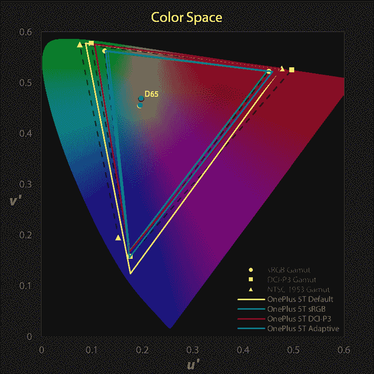
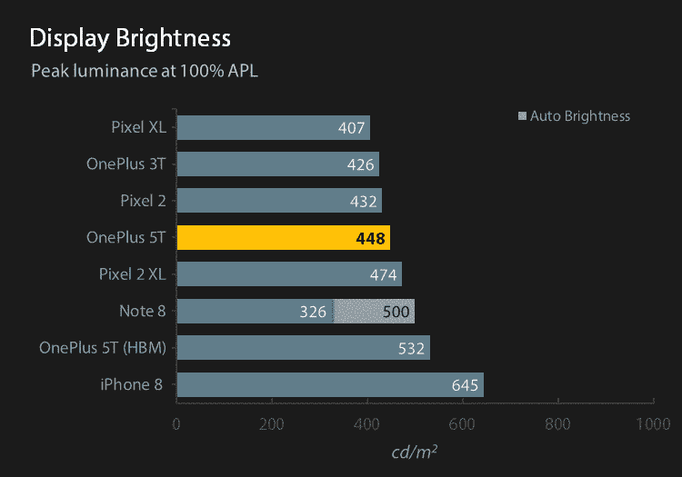
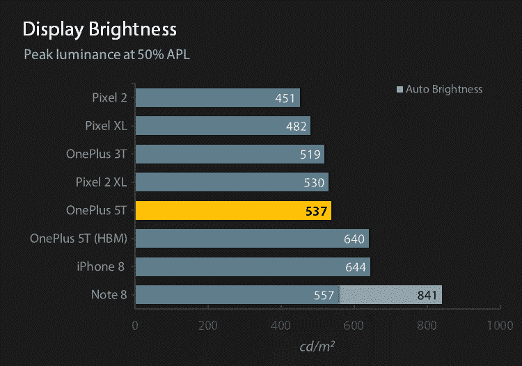
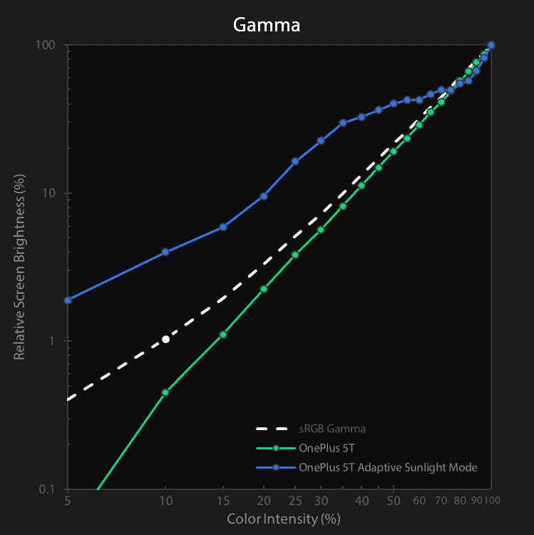
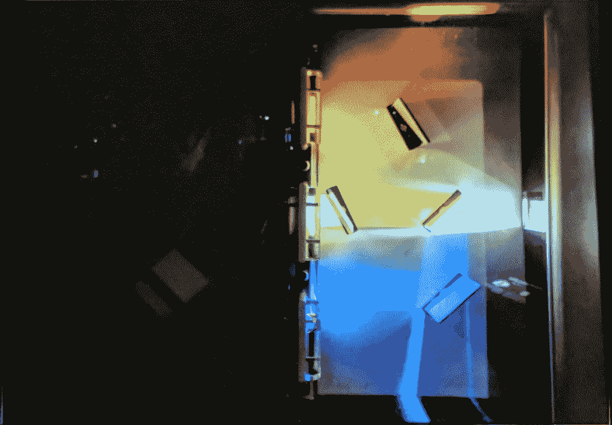
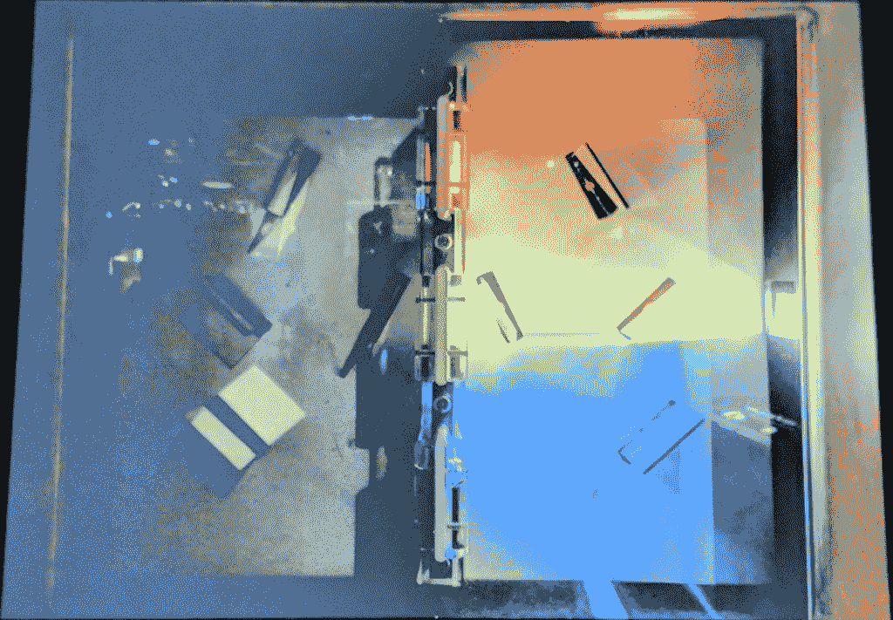
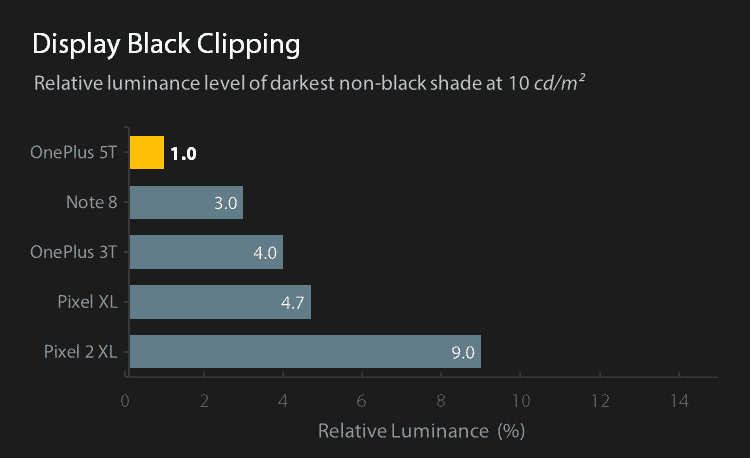
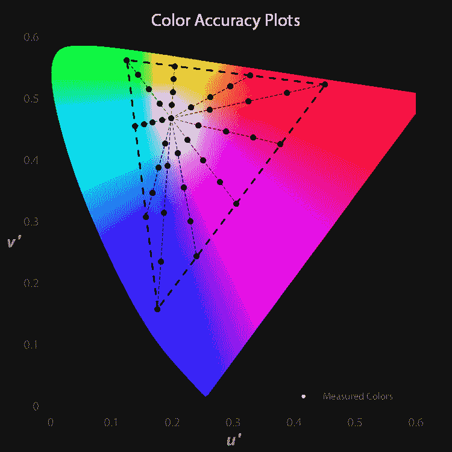

# OnePlus 5T 显示器分析:一加时代的到来

> 原文：<https://www.xda-developers.com/oneplus-5t-display-analysis/>

自从这次分析以来，我们已经升级了我们的测量仪器，这篇文章中的许多声明和准确性数据都已经过时了。请查看我们最新文章的参考图表，了解最新数据。

当 OnePlus 3 在 2016 年发布时，一加收到了[相当大的反弹](https://www.anandtech.com/show/10411/the-oneplus-3-review/4)，因为该手机配备了非常不准确的“*光学 AMOLED* ”显示屏(相对于行业标准 sRGB 色域)，并且没有提供更准确的显示屏校准选项。尽管大多数消费者对手机的默认色彩配置文件感到满意，但许多摄影师和设计师希望显示器配置文件精确到 sRGB 色域[，这对于显示器之间的标准化色彩再现](https://www.xda-developers.com/color-rendering-android-why-all-oems-must-offer-an-srgb-mode/)是必要的。一加很快解决了这个问题，并且[发布了一个软件更新](https://www.xda-developers.com/oneplus-3-reviewer-ota-brings-srgb-mode-and-ram-adjustments/)，允许用户启用一个选项来调整显示器以适应 sRGB 色域。尽管需要切换一个选项来应用 sRGB 色彩配置文件违背了色彩标准化的目的，但正如 Anandtech 指出的那样，[一加在将配置文件校准到 sRGB 色域方面做得非常出色。我们期待 OnePlus 5T 的校准和显示性能更加出色。](https://www.anandtech.com/show/10445/revisiting-the-oneplus-3/2)

5T 是一加的首次亮相，它采用了由**三星制造的 **6.01 英寸 AMOLED 显示屏**，顺应了最近更小的边框和更高的显示屏宽高比的趋势。**屏幕的分辨率为 **2160×1080 PenTile 菱形像素**(但由于其略微圆角而损失了一些像素)，导致 **18:9 的屏幕纵横比**和每英寸约 **401 像素的像素密度**。

**PenTile 菱形像素**阵列通过其菱形像素形状提供内在的子像素平滑，并通过包含更少的蓝色子像素来延长面板寿命，蓝色子像素比红色和绿色子像素退化得更快。因此，具有五边形子像素布局的显示器的子像素总数比大多数 LCD 上具有常规条纹 RGB 像素模式的显示器少三分之一。然而，通过保持一对一的绿色子像素对像素的比率，五边形子像素排列利用了人眼对绿色更大的颜色敏感度，绿色看起来比红色和蓝色更亮，以及对亮度比颜色更大的敏感度。这导致 PenTile 显示器具有与更常用的条纹 RGB 显示器大致相同的*亮度*分辨率，但作为一种折衷，可能会引入彩色条纹。

虽然 5T 显示器的像素分辨率低于同代大多数其他有机发光二极管 PenTile 显示器，但在典型的观看距离(约 1 英尺或 0.3 米)下，屏幕看起来大多清晰，但它仍然可以从更高的像素密度中受益。我们计算出，对于 20/20 的视觉，显示器的消色差图像在超过 8.6 英寸时是不可分辨的，这对于大多数人来说通常是足够清晰的。然而，由于较少的红色和蓝色子像素以及它们在五边形菱形像素排列中的位置，在敏锐的观察下(取决于观察者的视觉敏锐度),彩色边缘仍然是可见的。对于全彩色图像，对于 20/20 视力来说，像素完全无法解析超过 12.1 英寸，这在大多数智能手机用户的典型观看距离范围内。请注意，20/20 的视力被认为是正常的，许多用户可能有更好的视力。

 ** * *

# 色差度量

我们将主要使用色差测量 ***CIEDE2000*** (简称为***δE***)，补偿亮度误差，作为色度准确度的度量。CIEDE2000 是由[国际照明委员会(CIE)](http://www.cie.co.at/) 提出的行业标准色差度量，它最好地描述了颜色之间在感知上一致的差异。也存在其他色差度量，例如 CIE 1976*u’v’*色度图上的色差*δu’v’*——我们确实将在我们的颜色准确度图中使用它——但是当评估视觉显著性时，这些度量在感知均匀性方面较差，因为测量的颜色和目标颜色之间的视觉显著性阈值可能变化很大。例如，0.010 的色差*δu’v’*对于蓝色来说在视觉上是不明显的，但是对于黄色来说，相同的测量色差一眼就可以看出。

CIEDE2000 通常在其计算中考虑亮度误差，因为亮度是完全描述颜色的必要成分。在*δE*中包含亮度误差有助于将显示器校准到特定的白色水平，但其合计值不应用于评估显示器性能；为此，色度和亮度必须独立测量。这是因为人类视觉系统分别解释色度和亮度。

一般情况下，当测得的色差***δE*****在 3.0 以上时，色差一眼就能在视觉上察觉**。当测得的色差***δE*****在 1.0 和 2.3 之间时，色差仅在诊断条件**下才明显(例如，当测得的颜色和目标颜色在被测显示器上紧挨着出现时)，否则色差在视觉上不明显，看起来是准确的。1.0 或更小的测量色差***δE*****被认为是察觉不到的**，并且即使与目标颜色相邻，看起来也无法区分。

* * *

# 彩色空间

我们的色彩空间图为读者提供了一种观察显示器目标色域的简单方法。下面的彩色舌形图代表了人眼能看到的所有可见颜色。请注意，该图的颜色梯度不是按比例绘制的，并且被夸大了，这是由于我们的限制，即不能以当前的技术状态及其标准显示整个可见色谱。图中的实心三角形表示显示器可以输出的与其显示配置文件相对应的颜色区域。黑色虚线三角形代表不同的标准色域以供参考。三角形内的彩色点代表显示器配置文件的白点，而黑点代表 sRGB 和 DCI-P3 色域的标准白点，标记为 D65。

 <picture></picture> 

OnePlus 5T colorspace chart

OnePlus 5T 自带四种显示配置:*默认*、 *DCI-P3* 、 *sRGB* 和*自适应模式*。

OnePlus 5T 的**默认**显示配置文件是一个*故意过饱和的*颜色配置文件，不符合任何标准色域，甚至不符合过时的 NTSC 1953 色域，而其他人可能会相信这一点。默认校准是一加用于 OnePlus 3、OnePlus 3T 和 OnePlus 5 的相同颜色配置文件，它基于三星 Galaxy S7 在其自适应显示配置文件中目标的相同颜色空间。该配置文件非常鲜明和冷，它最接近 NTSC 红色色度、Adobe RGB 绿色色度和 Rec.2020 蓝色色度的颜色空间。

**sRGB** 显示器配置文件非常适合标准 sRGB 色域，具有精确的 D65 白点。

**DCI-P3** 显示配置文件是另一个*故意过饱和的*颜色配置文件，它与 DCI-P3 色域非常接近，但在图表中它缺少红色。它正确地共享与 sRGB 显示器配置文件相同的白点。

**自适应模式**显示配置文件也非常适合标准 sRGB 色域。它的绿色和蓝色色度比 OnePlus 5T 的 sRGB 显示配置文件中的相应值更接近 sRGB 色域，但稍微超过了红色。此外，该显示器简档的白点明显更冷，但是没有默认简档的白点冷。校准配置文件还提供了一个**日光显示**，当环境光传感器注意到强光时，它会在某些应用程序中触发。这些应用程序包括(但不限于)游戏、股票一加相机应用程序、股票一加画廊应用程序(在谷歌照片中不可用)，以及在 Chrome 中查看的独立图像。这种模式大大降低了显示器的对比度，以获得更好的阴影和中间色调可视性，并将白点改变为略冷，以抵消温暖的环境光源。我们预计这种模式还会增加显示器的最大亮度，但不幸的是，即使面板能够过驱动到高亮度模式，也不会增加显示器的最大亮度(稍后将详细介绍)。

还存在一个 ***自定义颜色*** 显示设置，它启用一个滑块来改变默认显示配置文件的色温/白点，从冷到暖。

请注意，在撰写本文时，**我们在 Android Oreo 上的 OnePlus 5T 不支持其显示模式**的 ***中的任何*** **中的色彩管理，而这是在色彩空间之间提供准确色彩所必需的。无论 OnePlus 5T 的 DCI-P3 显示器配置文件对标准 DCI-P3 色域有多准确，如果它不是色彩管理的，它在使用中都会不准确，因为它会将 sRGB 定义(或未定义)的颜色扩展到 DCI-P3。这也意味着 OnePlus 5T 的 sRGB 显示配置文件无法显示 DCI-P3 或其他宽颜色，即使 Android 8.0 Oreo 中引入了[颜色管理。](https://medium.com/google-design/android-color-management-what-developers-and-designers-need-to-know-4fdd8054557e)**

* * *

# 聪明

在测量 OLED 面板的显示性能时，了解该技术与传统 LCD 面板有何不同非常重要。液晶显示器(LCD)需要背光来透过液晶层产生我们看到的颜色，而 OLED 面板能够让每个单独的子像素发出自己的光。这意味着 OLED 面板必须从其最大分配中为每个点亮的像素分配一定量的功率。因此，需要点亮的子像素越多，面板需要分配的功率就越多，每个子像素接收的功率就越少。

显示器上图像的 ***APL*** ( *平均像素等级*或*平均画面等级*)是显示器上每个子像素相对于设定显示器亮度的平均亮度百分比。例如，完全红色、绿色或蓝色图像的 APL 为 33%，而完全混合色青色(绿色和蓝色)、品红色(红色和蓝色)或黄色(红色和绿色)的 APL 为 67%，全白色图像的 APL 为 100%。最后，对于有机发光二极管面板，显示器 APL 越高，每个点亮像素的亮度越低。LCD 面板没有这种特性，因此，在较高的 APL 下，它们比有机发光二极管面板更亮。

 <picture></picture> 

Reference display brightness chart at 100% APL (higher is better)

 <picture></picture> 

Reference display brightness chart at 50% APL (higher is better)

在 **100% APL** ，这是一个全屏白色图像，我们的 OnePlus 5T 在最大亮度下测得的白色水平为 448 *cd/m* 。虽然完全白色的屏幕可能看起来不像是一个实际的测量场景，但许多应用程序和网站往往都是以白色组件和大量白色空间设计的，这可能会使屏幕上的 APL 超过 80%的范围，因此 100% APL 亮度读数有助于推测最糟糕的情况。在较高的 APL 下，OnePlus 5T 在休闲的户外环境中应该清晰可见，但强烈的阳光直射可能会使手机不切实际，需要巧妙地使用手遮荫策略。

在 **50% APL** 时，这通常是对 OLED 面板实用亮度水平的可靠衡量，OnePlus 5T 在 537 *cd/m* 时亮度增加了约 20%。根据经验，显示器在加州夏天的太阳下大约 500 *cd/m* 才开始变得清晰，虽然 OnePlus 5T 在 50% APL 时略微超过了这个阈值，但如果面板能够获得稍微多一点的功率，以帮助在阳光充足的条件下照亮图像，这将是有益的。

进入*高亮度模式* ( *HBM* )。**高亮度模式**是大多数三星面板的内部名称，它可以为显示器提供额外的电力，使图像变亮，通常幅度很大。请注意，OnePlus 5T 在上面的参考显示器亮度图表中列出了两次，并附加了“(HBM)”后缀。OnePlus 5T 本身无法切换 HBM，但可以通过 ADB 或终端执行“echo 1>/sys/devices/virtual/graphics/fb0/HBM ”,或使用第三方应用程序(仍需要 root 权限)来启用 root 访问。有了 HBM，OnePlus 5T 变得明显更亮，进入了三星的领地，甚至在 100% APL 的亮度下超过了我们的 Note 8。在这些亮度下，OnePlus 5T 在阳光下更加清晰，但不幸的是，一加并没有将这种模式融入他们的软件中。

OnePlus 5T 的最低亮度达到 2 *cd/m* ，这是标准亮度，对大多数智能手机来说都差不多。

* * *

# 伽玛和亮度

显示器的灰度系数决定了屏幕上颜色的整体对比度。假设非 S 形(“S”形)伽马传递函数，较高的显示器伽马将导致较高的图像对比度和较暗的颜色混合(就颜色亮度而言，不一定是感知的亮度)。请注意，gamma power 不会影响强度为 0%(黑色)或 100%(纯红色、纯绿色、纯蓝色和 100%白色)的颜色，因为 0 或 1 的任意正实数的幂就是它本身。Gamma 也会影响颜色混合的饱和度，但工厂校准通常会保持颜色的目标 gamma 一致，并与结果亮度(gamma 校正后的颜色亮度)分开。这就是为什么一些面板可以保持准确的 sRGB 色彩，同时具有非标准的测量显示伽玛。在 sRGB 规范中描述了标准伽马曲线，其近似为 2.2 的幂函数。

 <picture></picture> 

OnePlus 5T intensity vs. relative luma chart. Steeper slopes indicate higher image contrast. Ideally, the gamma curve should appear mostly straight between 10% and 100% color intensity with a slightly shallower slope below 10%.

OnePlus 5T 的伽马曲线在所有显示配置文件之间都是相似的，除了从自适应模式显示配置文件触发的阳光显示。伽马曲线看起来基本上是直的，但总体上比 sRGB 参考伽马曲线更陡，平均总体伽马为 2.43，这意味着 OnePlus 5T 的显示对比度高于标准。低于 10%强度的颜色会有更大的对比度，看起来更暗，这通常是不可取的，因为它会降低阴影细节的可见性。

如果 OnePlus 5T 显示器配置文件设置为自适应模式，当环境光传感器检测到亮光时，显示器的伽马值可能会在某些应用程序中发生变化。图像的整体对比度大大降低，显著提高了阴影和中间色调，并略微降低了高光。这大大降低了图像的保真度，但使图像细节在阳光下更加清晰可见。

 <picture></picture> 

Sunlight Display off

 <picture></picture> 

Sunlight Display on

* * *

# 黑色剪裁

剪裁或“粉碎”的黑色是一个术语，指图像上较暗阴影的不正确渲染，使特定亮度下的所有颜色都显示为黑色。这通常是一个校准问题，但这也是当代有机发光二极管显示器固有的硬件限制，因为它们可以发出的绝对最小非黑色水平通常不够暗，无法在较低的屏幕亮度下提供完整的 8 位深度强度。虽然显示器理论上可以显示的绝对最暗的非黑色阴影可归结为 OLED 面板的质量，但在实践中，错误的显示器校准通常会导致大量的黑色削波，这仍然是大多数显示器校准人员即使在 LCD 面板上也会遇到的问题。

 <picture></picture> 

Reference display black clipping chart (lower is better)

尽管 OnePlus 5T 的伽马值高于标准值，但它在显示较暗的颜色时表现非常出色。在这方面，它的表现优于 Note 8，也明显优于 Pixel 2 和 Pixel 2 XL，因为它正确地显示了电影胶片的较暗颜色。这是一加出色的显示质量和出色的屏幕校准的标志。

* * *

# 灰度等级

准确的白点和灰度是产生准确色彩的基础。灰度误差会将误差传播到整个色域(100%原色除外，即红色、蓝色和绿色)，因此在测量总色彩准确度时，分析显示器的灰度以评估误差的主要来源绝对至关重要。

 <picture></picture> 

OnePlus 5T correlated color temperature chart (ideally straight)

在其**默认**显示配置文件中，OnePlus 5T 异常寒冷，白色的相关色温为 7756K，整个灰度的平均相关色温为 7742K。白点温度与 OnePlus 3T 相似，这并不奇怪，因为一加希望它们共享相同的默认显示配置文件。然而，OnePlus 5T 在保持色温一致方面做得更好；它的相关色温曲线非常平滑，并保持其平均相关色温接近白点的平均相关色温，而不像 3T 那样平均值(7342K)明显偏离白点(7738K)。通常选择更冷、更蓝的白点，因为它具有生动和人工的外观，对人眼来说更有感觉。这是一加的装饰性选择，它远远偏离了 D65 标准。

另一方面， **sRGB** 和 **DCI-P3** 显示器配置文件上的灰度绝对出色，白色的相关色温为 6467K，整个灰度的平均相关色温为 6543K。它为整个灰度设置了一个**不易察觉的白点色差*****δE*****= 0.8**和一个**不易察觉的平均灰度色差*****δE*****= 0.4**。这是对 OnePlus 3T 上已经精确的灰度的重大改进，一加在 5T 上的灰度校准值得称赞。

**自适应模式**显示轮廓与 sRGB 显示轮廓非常相似，但自适应轮廓明显更冷。相对于白色的相关色温为 7126K 并且整个灰度的平均相关色温为 7274K 的 sRGB 显示配置文件(平均值:7162K ),它大约是默认显示配置文件的一半冷。对于那些想要更冷外形的人来说，这是 sRGB 展示外形的一个很好的选择。当日光显示被触发时，屏幕上的图像变得更冷，白点和灰度相关色温分别跃升至 7595K 和 7564K。

* * *

# 颜色准确度

我们的色彩准确度图为读者提供了对显示器色彩性能的粗略评估。下面显示的是颜色准确度目标的基础，实线点代表目标颜色(从 DisplayMate 借用)，虚线代表参考色域。色域边界上的目标颜色包括原色和二次色以及它们之间的颜色，这些颜色相对于图表在整个色域中大致均匀分布。内部点代表周界上相应颜色和白点的 75%、50%和 25%饱和度。目标颜色的半径为 0.004，这是一个误差，被认为是一个可察觉的差异。触及图表上目标颜色的测量颜色(用纯白点表示)看起来是准确的。如果测得的颜色没有触及其目标颜色，它仍然可以根据其色差*δE*来准确显示，在这种情况下，请参考下面的色差图表。

 <picture></picture> 

Base color accuracy target plots

**默认**显示轮廓非常鲜明，几乎所有颜色都明显过饱和。如果颜色准确性是最重要的，那么应该避免使用这种显示配置文件。此显示配置文件中的颜色非常随意，其目的纯粹是装饰性的。

**sRGB** 显示配置文件延续了其灰度精确度的性能，而且非常精确。就像它的灰度一样，它创下了 sRGB 色彩准确度的记录，在 100%青色时，**不易察觉的平均色差*****δE*****= 0.7**，**视觉上不易察觉的最大色差*****δE*****= 1.7**。没有经过单独工厂校准的显示器很少会出现视觉上不明显的最大色差，我们也不知道一加是否单独校准了他们的显示器，但尽管如此，一加的这一壮举还是令人印象深刻。一加因其感知完美的工厂校准而受到我们的称赞。

**DCI-P3** 显示器配置文件非常精确地符合 DCI-P3 色域**，但它不是色彩管理的**。此模式下的所有颜色将从图像的预期色域扩展到 DCI-P3，这将导致所有不打算在 DCI-P3 色彩空间中显示的图像的错误色彩再现。然而，当正确地查看 DCI-P3 内容时，颜色将看起来最完美，在 100%青色-蓝色时，**察觉不到的平均色差*****δE*****= 0.9**以及*****δE*****= 2.9**。**

**自适应**显示轮廓实质上是向蓝色移动的 sRGB 轮廓，红色的饱和度略有增加，以补偿来自太阳的环境光。即使有这些偏差，该简档看起来也是最准确的，具有**视觉上不明显的平均色差*****δE*****= 1.8**，其中大约 22%的颜色*至少*可能是明显的，并且在 50%黄红色时具有**最大色差*****= 4.9**。在自适应配置文件的**日光显示**中，颜色更加偏向蓝色，将其平均色差*δE*提高到 2.7，在这种情况下，大多数颜色都可能是显而易见的——也就是说，在零光照的情况下。*

 *重要的是要注意，显示器上颜色的感知饱和度和色调会因屏幕反射率而在环境光下发生变化，这取决于光源的亮度和色温。发光体通常会将显示器上的感知颜色向该发光体的颜色偏移，并且该发光体的亮度会影响该偏移的强度。因此，OnePlus 5T 的阳光模式在阳光(一种明亮温暖的光源)下向蓝色转变是有意义的。然而，一加没有补偿明亮光源的屏幕反射造成的饱和度损失(更不用说变化的太阳色温了)，因此在阳光下，显示器的感知饱和度仍然被有效地降低了。这整个概念也是苹果在他们的新设备上显示 True Tone 的基础，它考虑了光源的真实色温和亮度，并相应地调整显示器上的颜色。

* * *

# 概观

| 种类 | 一加 5T | 笔记 |
| --- | --- | --- |
| 显示方式 | AMOLED，PenTile 钻石像素 |  |
| 制造商 | 三星电子 |  |
| 显示尺寸 | 对角线长 5.4 英寸宽 2.7 英寸宽 6.0 英寸 |  |
| 显示分辨率 | 2160×1080 像素 | 由于圆角，总像素数略少 |
| 显示纵横比 | 18:9 | “那不就是 2:1 吗？”当然可以。 |
| 像素密度 | 每英寸 401 像素 | 由于五边形菱形像素，子像素密度更低 |
| 子像素密度 | 每英寸 283 个红色子像素 401 个绿色子像素 283 个蓝色子像素 | 与绿色子像素相比，五边形菱形像素显示器具有较少的红色和蓝色子像素 |
| 像素灵敏度的距离 | 彩色图像< 12.1 英寸，非彩色图像< 8.6 英寸 | 视力为 20/20 的可分辨像素的距离。典型的智能手机观看距离约为 12 英寸 |
| 伽马范围 | 日光显示中的 2.45–2 . 421 . 37 | Gamma 根据设定的显示器亮度而变化 |

| 种类 | 默认 | sRGB | P3 保卫儿童国际 | 适应的 | 笔记 |
| --- | --- | --- | --- | --- | --- |
| 微克 | 2.43 略微过高 | 2.43 略微过高 | 2.43 略微过高 | 2.43 略微过高 | 理想情况下在 2.20-2.40 之间 |
| 白色的温度 | 7756 千伏设计非常冷 | 6467K | 6482K | 7126KColder 设计 | 标准是 6504K |
| 白色的色差 | e= 9.3 | δE= 0.8 看起来很完美 | δE= 0.8 看起来很完美 | e= 5.8 | 理想情况下低于 2.3 |
| 平均相关色温 | 7742KVery 设计非常冷 | 6543K | 6561K | 7274 设计更冷 | 标准是 6504K |
| 平均灰度色差 | e= 5.6 | δE= 0.4 看起来很完美 | δE= 0.4 看起来很完美 | e= 3.7 | 理想情况下低于 2.3 |
| 平均色差 | *δE*= 5.3 到 sRGB 色彩设计的色域 | δE= 0.7 对 sRGB 来说，颜色看起来大多是完美的 | *δE*= 0.9 到 DCI-P3 色彩 gamutNot 色彩管理；设计过饱和 | δE= 1.8 对 sRGB 色度来说，最准确 | 理想情况下低于 2.3 |
| 最大色差 | *δE*= 8.1，100%蓝绿色设计过饱和 | 在 100% cyan 最大误差时，δE= 1.7 看起来是准确的 | *δE*= 2.9，100%蓝绿色 | 50%黄红色时δE= 4.9 | 理想情况下低于 5.0 |

* * *

# 关于 OnePlus 5T 显示器的最终想法

如果说一加只是改进了他们的显示器，那是轻描淡写的——他们的基本校准绝对是一流的，显示性能几乎从头到尾都优于其前辈。显示屏足够亮，有改进的空间，可能通过实施高亮度模式来实现，并且配备了充满活力的显示屏配置文件，旨在以其强烈的色彩和高图像对比度给人留下深刻印象。屏幕灰度从黑到白非常一致，亮度控制包含*一千*步，而安卓默认只有 256 步。该显示器提供了适当的电影体验，其更高的显示伽玛和几乎为零的黑色剪辑——因拒绝在网飞上为高清电影提供适当的 Widevine 认证而被扣除[分数。虽然屏幕分辨率可能对许多人来说都很满意，但 OnePlus 5T 的像素密度确实处于下限，在大约 12 英寸的 20/20 视力下，像素刚刚无法解析，这是在典型的观看距离内。如果一加这次包括一个更高分辨率的面板，这将仍然是有利的和更受赞赏的。](https://www.xda-developers.com/oneplus-5t-netflix-amazon-prime-video-hd/)

此外，我们的 OnePlus 5T 上的 sRGB 色彩再现在 sRGB 显示配置文件下感觉完美，针对 DCI-P3(电影院的标准色域)优化的内容在 DCI-P3 显示配置文件下将非常准确。sRGB 和 P3 总督察的档案是我们见过的最准确的档案之一。然而，令人失望的是，注意到该设备不包括色彩管理，这降低了其准确的 DCI-P3 色彩再现的重要性。

从经验上看，该面板在小到中等角度时颜色变化很小，但当从极端角度观看手机时，仍然会出现“彩虹出”现象，这是大多数三星采购的有机发光二极管面板都存在的问题，而最近的三星设备自己的面板则没有。在低亮度下，OnePlus 5T 上的“黑色拖影”也很少。色彩偏移和“黑色拖影”都是我们希望在未来能够量化和测量的显示特性，并且具有控制和一致性。

最后要注意的是一加对他们的“光学 AMOLED”显示器的品牌推广，这最初是由一加在发布 OnePlus 3 时创造的。据他们的首席执行官说，一加“采用了超级 AMOLED，并增加了对比度和色温，试图让它更真实。”一加还“设计了在户外明亮条件下工作良好的性能配置文件”，我们可以通过默认显示器校准增加的饱和度、图像对比度和色温来理解这一点。一加仍然在 OnePlus 5T 上使用相同的品牌，但从那以后，它作为他们设备营销策略的目的已经大部分贬值。

我们希望一加继续追求展示性能。这次展示有许多重要的方面需要考虑，但是我们相信一加仍然需要更多的进步来巩固他们的进步。他们的想法是正确的，但他们遇到了一些根本性的错误，例如在 Android 版本中没有包括预期的色彩管理，没有包括原生高亮度模式，没有包括对可以提供出色媒体体验的屏幕的适当 Widevine 认证(真是遗憾)。同样令人印象深刻的是，一加在自适应模式上的扩展，也许是通过实现像苹果 True Tone display 那样的自动色温改变解决方案，这需要在设备上安装额外的传感器。然而，所有这些只是在已经令人印象深刻的展示上的额外润色；这是一个“问题”列表，我们希望在下一次一加展览的报道中能够缩短，但如果没有，我们也不会完全失望。

* * *

[**查看 XDA 的 OnePlus 5T 论坛！>>**](https://forum.xda-developers.com/oneplus-5t)**