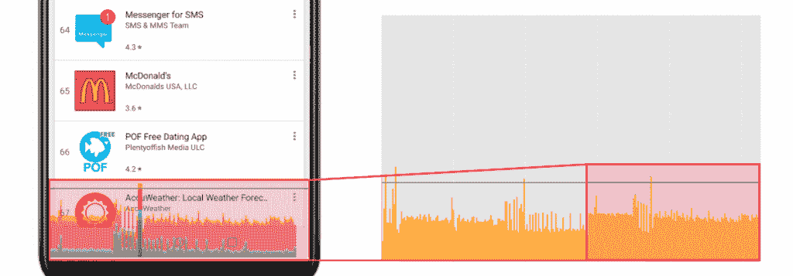

# OnePlus 6 速度、流畅度和游戏 XDA 评论

> 原文：<https://www.xda-developers.com/oneplus-6-speed-gaming-review/>

*看看大牛对这篇文章的视频总结吧！*

OnePlus 6 ( [你很快就可以预订](https://onepluscom.pxf.io/c/2233363/916678/12532?subId1=UUxdaUeUpU21048&subId2=exda&u=https%3A%2F%2Fwww.oneplus.com%2Fus%2Flaunch-6%3Futm_medium%3Darticle%26utm_source%3DXDA%26utm_campaign%3DOneplus%2B6-na%26utm_content%3Dtraffic%26utm_term%3Dspeed-test%2Bbenchmarking&ourl=https%3A%2F%2Fwww.oneplus.com%2Flaunch-6%3Futm_medium%3Darticle%26amp%3Butm_source%3DXDA%26amp%3Butm_campaign%3DOneplus%2B6-na%26amp%3Butm_content%3Dtraffic%26amp%3Butm_term%3Dspeed-test%2Bbenchmarking))于上周在[发布，按照预期包装了最新的硬件。众所周知，一加的设备速度极快，以至于新手机的营销口号反映了这一声誉。凭借来自高通的](https://www.xda-developers.com/oneplus-6-specifications-pricing-availability/)[最快芯片组](https://www.xda-developers.com/qualcomm-2018-snapdragon-tech-summit-roundup/)以及与去年型号相同的大量快速内存和存储，OnePlus 6 的速度和流畅程度到底有多高？

在 XDA，我们痴迷于绩效，而我个人是最挑剔的人之一。在这次 XDA 分析中，我们将展示我们对 OnePlus 6 性能的想法和发现，这些想法和发现来自经验测试和日常使用的混合。虽然我们无法解释每一个用例，但我们希望这是一个关于 OnePlus 6 现实世界性能的有用入门，其中有相关的例子和 UI 流畅度和游戏帧率的量化概述，我们很少在评论中找到。

本文将分为三个部分，涵盖 UX 速度，用户界面流畅度和游戏性能。您可以通过单击下面的快捷方式来访问每个部分或它们各自的裁决。事不宜迟，我们来看看 OnePlus 6 的表现如何。

[**【UX 速度】**](#1) [**UI 流畅度**](#2) [**游戏**](#3)

[**结论**](#7)

* * *

# 真实世界性能

## UX 速度

* * *

**App 启动次数& UI 速度**

一加 6 的新座右铭是*“你需要的速度”*，你肯定会期望他们提供比竞争对手更快的手机。事实上，他们已经在这样做了，OnePlus 5 和 5T 是 Android 上非正式的 YouTube 速度测试冠军也不是什么秘密。他们过去在我们自己的测试中也展示了[出色的性能](https://www.xda-developers.com/oneplus-3t-gaming-analysis-review-the-phone-to-beat-in-2017/)，OnePlus 6 也不例外。同时，速度不仅仅是打开速度的问题。事实上，这是 *尤其是* 真实的，现在几乎每个相关的手机都有 4GB 或更多的 RAM，至少有可接受的 RAM 管理。这意味着你真的不需要经常启动应用程序，而且对缓存的应用程序的访问几乎是即时的，这是一个需要考虑的重要问题。最后，我个人认为在讨论手机速度时应该考虑的一点当然是它的解锁速度，以及它与用户体验的关系。出于这些原因，我们将看看一加的应用程序启动功能，以及它的内存管理和解锁方法的速度。 **剧透:都是非常非常快的。**

* * *

**方法:** 我们在 Pixel 2 XL、OnePlus 5T 和 OnePlus 6 上测量了 Gmail、Play Store 和 YouTube 的冷启动启动时性能。请记住，我们*不是*在测量一个应用程序在所有元素都绘制在屏幕上的情况下完全渲染所需的时间。相反，我们通过记录应用程序创建应用程序的主要活动所花费的时间来使用代理。我们包括的时间度量包括启动应用程序流程、初始化其对象、创建和初始化活动、展开活动的布局以及第一次绘制应用程序。它忽略了不会阻止应用程序初始显示的内联进程，这反过来意味着记录的时间不会真正受到外部变量的影响，例如获取繁重资产的网络速度。还要记住，无论何时启动应用程序，被测试的手机要么倾向于要么被迫立即提高它们的 CPU 频率，从而最大限度地减少 CPU 瓶颈。我们对这三个应用程序进行了循环测试，并分别打开了 150 次，以观察这些手机的应用程序启动功能随着时间的推移表现如何。这种使用场景是非传统的，我们已经推动手机超越了你在现实世界使用场景中会遇到的限制(至少就应用程序打开而言)，但即使如此，在整个测试中，没有一个受到严重性能下降的影响。

* * *

一加在他们的 OnePlus 6 live 主题演讲中自豪地提到，他们已经为他们的设备添加了 200 多项优化，其中一项是在应用程序启动时将 CPU 频率提升到各自核心的最大值。这实际上不是新的，也不是一加独有的，因为[它已经出现在 OnePlus 3/3T](https://www.xda-developers.com/dissecting-speed-how-oneplus-leveraged-excellent-real-world-performance/) 中，并且自骁龙 821 以来，高通为原始设备制造商[提供类似的功能。也就是说，它确实最大限度地减少了 CPU 瓶颈，使闪存在这些测试中非常重要，软件也是如此。在我的测试中，OnePlus 6 比 OnePlus 5T 有明显的改进，可以提高几十个百分点，如下图所示。另外要记住的是，一加声称他们将缓存他们检测到你经常启动的应用程序的资源，这意味着 OnePlus 6 在使用中也应该表现更好，因为繁重资产的访问时间会减少。](https://www.xda-developers.com/a-look-at-what-has-changed-from-the-snapdragon-820-to-the-snapdragon-821-in-the-google-pixel-phones/)

| 装置 | 一加 5T | 一加 6 | 像素 2 XL |
| YouTube(平均。ms) | 882.8 | 553.6 | 999.3 |
| Gmail(平均。ms) | 405.5 | 270.7 | 450.9 |
| 播放商店(平均。ms) | 519.3 | 337.1 | 524.0 |

然而，上面显示的运行情况代表了我能记录的所有这些设备的最佳运行情况。同样值得注意的是，这里显示的增益肯定比你在速度测试中看到的要大(百分比方面)。我们已经写了一整篇文章,讲述在 YouTube 上观看速度测试时应该记住的事情，但是很明显，如果应用程序的启动时间减少了一定的百分比，而花在与设备交互上的时间保持不变，速度测试结果将会低估性能的提升。不过，正如我们所说，速度测试本身和应用程序启动速度通常并不太相关，因为越来越多的手机获得了标准的 4GB 或更高的 RAM，通常在这些测试中遭受最大损失的手机要么是那些规格更差的手机(旧芯片，存储速度更慢)，要么是 RAM 管理不善。

[video width = " 1920 " height = " 1080 " webm = " https://static 1 . xdaimages . com/WordPress/WP-content/uploads/2018/05/O2 . webm "]

我发现一个非常明显但速度提升很小的地方是游戏加载，这是有意义的，因为游戏加载时间是几秒钟而不是几毫秒。在这里，差异更加明显，上面的剪辑显示沥青 8 打开得稍微快一点，PUBG 也能够更快地到达主游戏屏幕(不是剪辑中的计时器运行到主加载屏幕，而是游戏在那一点之前完成加载)。我个人并不认为这很重要，而且这是一个比我们在前几代产品中看到的小得多的速度提升，或者是一加设备上短暂的 [F2FS 实现。在这一点上，一加声称他们的目标是确保他们的手机从第一次开机起一年内保持同样的速度。为此，他们添加了上述的一些特性，以及我们将在以后的文章中讨论的其他特性。](https://www.xda-developers.com/clearing-up-misconceptions-regarding-op3-and-op3t-storage-speed-differences-and-f2fs/)

[video width = " 1920 " height = " 1080 " MP4 = " https://static 1 . xdaimages . com/WordPress/WP-content/uploads/2018/05/op 5 tvop 6 _ 4 . MP4 "]

[video width = " 1920 " height = " 1080 " MP4 = " https://static 1 . xdaimages . com/WordPress/WP-content/uploads/2018/05/op 5 tvop 6 _ 3 . MP4 "]

最后，人们在过去已经注意到的并且我们已经[在文章](https://www.xda-developers.com/dissecting-speed-how-oneplus-leveraged-excellent-real-world-performance/)中记录的一点是，一加的手机动画与竞争对手的不同。为了让他们的手机看起来更快地执行动作，该公司默认缩短了动画的完成时间。例如，当涉及到某些应用程序过渡时，一加还为动作添加了透明度，使其看起来好像动画正在完整地完成，尽管实际上不是。这些设计决策最终会带来更快的用户体验，给用户一种其他手机无法传达的即时感。

* * *

**解锁速度**

OnePlus 6 的指纹扫描仪和之前的一样快，可以在 0.2 秒内解锁设备。然而，目前指纹扫描仪手势还没有出现在 OnePlus 6 的 OxygenOS 中，所以指纹扫描仪的体验可能会比以前稍微差一些。另一种解锁方法是面部解锁，它允许更无缝的身份验证，但速度较慢(也不安全)0.4 秒。也就是说，它在很大程度上更容易依赖，因为根据我的经验，它被证明是非常准确的，而且它能够识别面部解锁手机的范围惊人地广。它还可以在弱光下工作，尽管我戴着眼镜，但我的 Surface book 的面部扫描拒绝工作。

在过去的一年里，我逐渐意识到解锁速度是快速 UX 不可或缺的一部分，因为我们大部分时间都在短时间内使用手机。我发现自己经常需要解锁来回复一封即时消息或电子邮件，而类似面部解锁的功能使它变得非常无缝，特别是在与双击唤醒相结合的情况下，随着生物认证的出现，这种功能变得不那么重要了。我仍然更喜欢三星解锁机制的多功能性，因为它们提供面部解锁、虹膜扫描和指纹扫描仪，所有这些都有其用途(特别是如果漫长的冬天迫使你戴上围巾和手套)。也就是说，我还发现 OnePlus 6 的面部解锁比三星的面部解锁更快。虽然不如 iPhone X 的 faceID 安全，但一加提供了一些功能，如应用程序锁和安全盒，以防止人们轻松访问你的数据， *即使* (对我们大多数人来说，这是一个 *大如果* )他们骗过面部解锁，以通过你的锁屏

* * *

**RAM 管理**

我没想到一加会大幅改变他们新手机的内存管理，事实上，在这方面，它的表现似乎和 OnePlus 5T 一样好。这是快速 UX 的一个非常重要的方面，因为从 RAM 启动应用程序比冷启动快得多。我对此的标准测试(公认有缺陷)是简单地用相同的预装应用程序和几个手机游戏设置两个 8GB RAM 的设备，然后打开应用程序并循环返回，直到第一个应用程序被踢出内存。在我的测试中，这两款设备在同一个分界点开始杀死第一个应用，尽管这不一定代表所有的用例。在日常使用中，我设置了所有的应用程序，我还没有遇到过我需要访问的应用程序死在我身上的情况，所以在现实世界的使用中，我既没有看到巨大的改进，也没有后退。我仍然能够加载四个移动游戏并将其保留在内存中(特别是沥青 8、天堂二:革命、PUBG 和现代战斗 5)，因此游戏玩家应该感谢额外的 RAM，即使在任何给定时间可以容纳的应用程序数量有限。

* * *

### UX 速度裁决

OnePlus 6 确实感觉非常快，当你试图测量它的速度以进行改进时，你也可以发现一些小的进步。我每年都要使用多部手机，并且经常在任何特定时间携带两部手机——我每天都注意到速度优势，尽管它并不总是那么显著。例如，虽然我越来越喜欢我的 Galaxy Note 8(它带来了相当大的改进)，但在我换手机的那一刻，它和 OnePlus 6 之间的差异是显而易见的。我在这里不只是说应用程序的启动速度，这也是一个渗透在用户体验中的优势。这是一个一加一直在超越竞争对手的领域，这几乎已经成为流行的知识，评论、YouTube 速度测试和用户反馈都同意这一点。

* * *

## UI 平滑度

流畅的用户体验不仅仅是原始硬件的潜力，这一点在 Android 的历史上已经一次又一次地展示过。臃肿的 OEM rom[通常被批评](https://www.xda-developers.com/with-the-note-7-samsung-still-delivers-embarrassing-real-world-performance/)提供低于标准的性能，无论是缓慢的应用程序启动速度还是滚动和过渡的严重口吃。如今，我们拥有极其强大的硬件，Android 版本在核心方面不断得到优化，但我们仍然能够在各种设备之间对智能手机的“真实性能”进行排名。最大的竞争者肯定是 Pixel 2 XL，它不仅在所有测试中都非常流畅，就像去年我们测试它的时候它的前任回到了[一样，而且非常稳定。事实上，我所有的 Pixel 2 XL 结果都令人满意地重复到了荒谬的程度，测试中的帧时间更加稳定。](https://www.xda-developers.com/note-8-real-world-analysis-performance/)

* * *

**方法:** 为了测试真实世界的流畅性，我们将不仅仅展示显示 GPU 性能分析条的 gif 或截图，相反，我们将向您展示在完全相同的使用场景下跨设备绘制的直方图中提取的帧时间。我们整合了一个工具来提取和解析帧数据，以及一个 UI 自动化系统，该系统允许我们通过模拟触摸输入(滚动、加载新活动或窗口，以及使用复杂的 UI 导航进行复合测试)来构建模拟现实世界用例的宏。这些测试是在 Pixel 2 XL、OnePlus 5T (8GB)和 OnePlus 6 (8GB)的默认分辨率下进行的；这确实意味着 Pixel 2 XL 比其他两个设备渲染更多的像素， *潜在地* 降低性能，尽管我们的测试校准表明事实并非如此。我们确保测试在不同设备间完美同步，同时测量相同的动作，并在每台设备上进行多次测试来验证我们的结果。重复测试持续显示捕获的帧数差异极小，尽管每次测试捕获的总帧数因设备而异。这是因为这些设备在滚动加速度/最终速度方面表现不同，并且为许多动作和过渡设置不同的基线速度(即使在相同的 1x 设置下)。

 <picture></picture> 

How to interpret the graphs shown below.

* * *

随着黄金像素 2 XL 标准的到位，我们将看看 OnePlus 6 如何与谷歌手机及其前身相媲美。在评论最终的性能之前，我们应该记住两件事。首先，与竞争对手提供的相比，OxygenOS 是一个相当“精简”的 ROM，虽然我认为它被错误地标记为“股票 Android”的情况比它应该的要多，但它确实提供了一个“股票式”的体验。此外，一加特别注意 Android 社区对其手机性能的看法，竭尽全力确保这种声誉得到保持。特别是 OnePlus 6，他们将其作为一个营销口号:“你需要的速度”。该公司还建立了一个专门的团队来提高他们手机的性能、效率和稳定性，并提到他们已经在幕后进行了 200 多项优化，以确保他们的手机能够像粉丝们期望的那样运行。我们已经深入研究了[过去的一些此类优化](https://www.xda-developers.com/dissecting-speed-how-oneplus-leveraged-excellent-real-world-performance/)，OnePlus 6 进一步受益于其芯片组的性能提升以及 OEM 厂商可获得的新高通骁龙。

要记住的第二件事是，OxygenOS 随着时间的推移已经得到了快速的改进，这是由于它的测试版模型，粉丝们可以尝试新的功能和调整，并在这些变化进入主发布渠道之前提供反馈。我个人已经注意到并测量了 OnePlus 5 和 5T 自发布以来的性能改善，除非偶尔更新(例如，许多用户报告了最新 Android 8.1 版本的 Oxygen 的性能问题)。这意味着我们可以也应该期待 OnePlus 6 的性能会随着时间的推移而改变，并且几乎肯定会在更新过程中有所改善，特别是考虑到一加已经开始着手进行的重大操作系统修订。出于这些原因，以及过去几个月的应用更新，你可能会注意到，在我们的 Note 8 性能分析中，OnePlus 5T 比 5 在类似测试中表现得更好[。](https://www.xda-developers.com/note-8-real-world-analysis-performance/) **剧透:OnePlus 6 很平滑，但明显不是像素平滑** 。

我开始测试的第一件事是滚动性能，因为滚动列表时的口吃是 Android 用户多年来抱怨的最常见的头痛问题之一。加载文本和图像的列表可能会特别麻烦，但 OnePlus 6 在我们的 Play Store 和 Gmail 滚动测试中表现相当好，这两项测试的特点是三次长时间控制滑动，分别快速滚动“排行榜”和主收件箱。还要记住，测试确保预加载列表，这样缩略图或条目不会阻止流体加载和滚动。虽然 Pixel 2 XL 管理这些滑动的帧时间甚至不接近我们看到的 16.6 毫秒线，但 OnePlus 5T 和 OnePlus 6 在模拟用户输入后会出现一些口吃，这可能是因为它们的 CPU 频率在与 UI 交互时会发生变化。从这个意义上说，我们看到了运行 Android Oreo 的 5T 的小改进，以及运行 Nougat 的 OnePlus 5 在之前文章中测试的明确改进。

我还测试了用户界面的另外两个部分，这两个部分给手机带来了麻烦，用户很快就会注意到口吃，其中包括打开应用列表时 Play Store 的动画，以及 Gmail 中的侧面板(通常作为侧面板的代理)。下面你会发现这些设备之间的孤立重复比较的结果-我个人注意到在这两个方面口吃最多，测试清楚地展示了这一点。

在扩展 Facebook Messenger 的应用列表方面，OnePlus 6 做得和其他产品一样好。这种过渡是 Android 上材料设计动画的主要例子之一，但遗憾的是，几乎在每个实例中都有大量帧丢失(它似乎在未来也会被删除，A/B 测试人员已经看到了一个新的 UI)。

侧面板是一个不同的故事，在这项涉及 Gmail 侧面板的测试中，OnePlus 6 的表现比 OnePlus 5T 差。这有点令人失望，但它并不能完全代表所有的侧面板，即使这样，动作也非常快(与上面显示的相比)，大多数人可能不会注意到它(尽管对我来说是这样)。

OnePlus 6 的一个明显改进的地方也是我最常发现口吃的地方，那就是启动程序抽屉。我无法告诉你在三星手机上这是多么可怕的体验，甚至在一些一加的设备上，我也发现它不那么出色。不过，在这里，我们看到 OnePlus 6 的表现非常好，比 5T 更好，尽管仍然不如 immaculate Pixel 2 XL。在这一点上，我还没有能够衡量，但我相信已经看到了一个提升是 **系统动画** ，因为过渡看起来非常流畅，几乎在任何情况下。

然而，在综合测试中，我们看不到太多的改进。这些是我设计的模拟用户体验循环的更长的测试，它们导航用户界面来做各种各样的动作，例如打开各种设置菜单，播放 YouTube 视频或浏览 YouTube 的频道，打开窗口来编写电子邮件，等等。这些包括上面显示的测试实例，如打开侧面板和滚动列表，因此正如预期的那样，OnePlus 6 的表现与 5T 一样好，或者最好略好，或者明显更差。同样，我们应该记住，5T 和 5 已经获得了半年到近一年的支持，但看到这款手机开箱后不再流畅仍然令人失望，特别是当 Pixel 2 XL 优雅地展示了原始设备制造商有多大的潜力时。

* * *

### 平稳性判定

我不禁感到失望，总而言之，OnePlus 6 的性能仍然比不上去年的 Pixel 2 XL，甚至普通 Pixel XL 在其中一些测试中提供了更令人印象深刻的结果( [参见此处找到的数据](https://www.xda-developers.com/note-8-real-world-analysis-performance/) )。同时，有两件事我想提醒读者。首先，上面显示的分析仅限于一大部分 Android 用户可能经常打开的几个最常见的应用程序，但仍然不能代表整个用户体验。不过，我必须说，在很大程度上，我个人可以看到这些结果转化为我经常使用的其他应用程序。第二，我上面展示的是公认的强迫性偷窥，虽然一加手机和 Pixel 设备之间的差异是可以测量的，但对绝大多数用户来说，这种差异很可能是无法察觉的。

说实话，在几秒钟的交互中，少量的掉帧仍然是非常好的，甚至在综合测试中的掉帧也应该被正确看待。帧捕获只代表 UI 更新，这就是为什么我从来没有在这一节谈到帧率。这意味着它们显示了手机主动绘制对象和执行过渡的 UI 使用的一小部分，因此即使您在一次测试中看到 10%的丢帧，也不一定意味着手机在整个样本中实际上看起来好像以每秒 55 帧的速度运行。同样，所有这些都仅限于应用内的性能，系统动画最终看起来非常流畅和清晰，没有显示这些测试中出现的口吃，无论如何都是最小的。

由于新的硬件，我也期望有更好的结果，但我们必须再次记住，UI 流畅性通常是软件优化、内核管理器/调度器的功能，而不是硬件的功能。尽管采用了最新的芯片组，但一些原始设备制造商在这方面一直表现不佳，有时甚至领先于竞争对手。因此，OnePlus 6 在性能上与 Pixel 2 XL 不匹配并不奇怪(尽管如果我诚实的话，我对搬到 schedutil 州长感到兴奋，希望它能进一步缩小差距)。我相信一加将通过软件支持提高设备的性能，正如我在他们以前的一些设备上看到的那样，性能似乎是他们对新一代设备的主要承诺。

* * *

## 游戏性能

*用 GameBench 记录的帧率和电池消耗数据，这是一项出色的服务，可以帮助您分析 Android 和 iOS 上的游戏性能*

OnePlus 6 的骁龙 845 配备的 Adreno 630 实际上是这款新旗舰带来的最强大的规格升级之一。这款 GPU 采用了改进的架构，高通声称图形性能提高了 30%，功耗降低了 30%(与去年 2017 年的 Snapdragon 835 处于同一水平)，这一点我们在今年早些时候的[骁龙 845 实践](https://www.xda-developers.com/qualcomm-snapdragon-845-hands-on-benchmarks-first-impressions/)中得以验证。我们已经检查了 GPU 基准测试，这些测试显示 845 以及 OnePlus 6 的图形性能有了显著提升，但这些都是孤立、离散的测试场景，仅试图模拟真实世界的游戏性能。因此，我们尝试用 OnePlus 6 玩游戏，在这一部分，我们将提供一些我们的发现。 **剧透:这是一款出色的游戏手机。**

*PUBG 运行在 OnePlus 6 上。请注意凹槽排除。*

移动游戏现在有点令人兴奋，Epic Games 等主要公司带来了《堡垒之夜》等流行的[游戏，以及最近在 Android 上发布的 PUBG，Lineage 和](https://www.xda-developers.com/fortnite-battle-royale-android/) [Runescape 等著名的 MMO 特许经营商进入移动平台](https://www.xda-developers.com/runescape-mobile-client-is-coming-to-android-and-ios-in-2018/)，以及在最新游戏中普遍采用 Unity 和 Unreal Engine 4。话虽如此，许多游戏公司已经舒舒服服地坐在他们最新大型手机游戏的改造版本上，比如《柏油 8》，现在它以盈利的微交易为特色。不仅 Android 上的移动图形在某种程度上停滞不前，因为像 Dead Trigger 2 和其他宝石一样，手机也足够强大，足以达到许多“顶级图形游戏”的帧率上限。这是我在过去几年的评论和游戏分析中发现的一些东西，所以在这次游戏测试中，我选择了两个非常受欢迎和耗电的手机游戏:玩家未知的战场和天堂 2:革命。

*PUBG - Framerate over time (T2)*

前者是一个大家都应该知道的标题，而轰动一时的 PC 游戏通过腾讯游戏的作品在一个 *令人惊讶的例外* 端口进入 Android。PUBG 的特点是巨大的地图和多重地图遍历机制，快速的交通工具迫使手机跟上渲染。地图如此巨大意味着绘制距离和分辨率很重要，令人遗憾的是，OnePlus 6 没有提供可能影响用户体验的高像素密度。也就是说，正如下面的统计数据所示，PUBG 在 OnePlus 6 上运行得非常好，达到了 30FPS 的上限，帧速率稳定度达到了 99%。无论您是要从产卵平面下降，参与多人交火，在屏幕上显示整个地图的情况下远距离拍摄，驾驶(或试图驾驶)摩托车全速穿过山丘，等等，都将达到帧速率上限。它还可以持续一段时间，这对于 PUBG 比赛来说特别有用，可以轻松持续几十分钟。鉴于这是一个快节奏的游戏，反应时间非常重要，不丢失一帧可能会导致你非常希望在那次 *鸡肉晚餐* 中拥有的竞争优势。

*PUBG-其他统计*

正如本文前面所讨论的，一加手机的内存管理通常无法最大限度地发挥日常应用的应用存储能力。这绝对不是游戏性能的情况，这是 6GB 和 8GB RAM 变体的亮点，能够毫不犹豫地将游戏一次保存在内存中几天。鉴于 PUBG 平均使用接近 900MB 的 RAM，在整个游戏过程中达到 950MB 以上，这一点尤其有用。PUBG 还展示了 OnePlus 6 上相当可接受的游戏时间，估计这款 3300 毫安时电池的使用时间约为 5 小时(尽管保守，我会说高达 5 小时)。数据消耗也不差，一个小时的会话发送和接收的数据包数量级为几十兆字节(外推上面给出的 15 分钟样本，尽管这必然会因各种条件而有所不同)。借助游戏模式的网络增强功能，您也不太可能面临延迟问题，从而进一步帮助您取得胜利。

*血统二:革命——帧率随时间变化*

我们展示的第二个游戏是天堂二:革命。这款游戏运行在虚幻 4 引擎上，并恰当地利用了它的特性，锐利而复杂的几何图形涂在灯光和效果上，使它看起来很出众。这也是高通用来在各种活动中展示其骁龙 845 平台的一款游戏，并且理由充分。这是著名的天堂二 MMO 的一个有趣的移动改编，有大型的 PvP 战斗和一个有趣的“自动任务”系统，消除了游戏中较小部分的麻烦。这是一款庞大且外观壮观的游戏，OnePlus 6 轻松达到了每秒 60 帧的上限，并在 15 分钟的游戏时间内保持一致。

*血统二:革命-其他统计*

这也是我一天中玩了几次的一个游戏，所以让它一整周都存在内存里也很有用。其他规格显示它比 PUBG 更耗费电池，但相对来说不太需要网络——这主要是因为我正在通过单人任务准备一个新角色，没有其他原因。如果你确实想为这个游戏节省电池寿命，你可以使用游戏模式的性能配置文件(这可以降低白名单游戏的分辨率和/或帧率)，或者通过调整这个特定游戏的相当广泛的图形选项(当然，所有设置在测试时都是最大的)。

* * *

### 游戏裁决

本节的要点是，OnePlus 6 对于移动游戏来说是非凡的。虽然我在这里只展示了几款游戏的性能，但我要重申，去年的手机已经能够在旧游戏上达到 FPS 上限，鉴于移动游戏的帧率几乎完全由硬件决定，我不认为会有更差的结果。OnePlus 6 上的额外 RAM 确实使其成为专注于手机游戏玩家的绝佳手机，游戏模式功能也是如此，但与此同时，Razer 和三星等公司提供了更彻底的游戏专用调谐和盒子的生活质量功能。

对于手机游戏玩家来说，Dash Charge 也是一项不错的福利，因为它不仅充电速度极快，还能让你在充电的同时玩图形要求高的游戏，而不会出现明显的节流或难以忍受的高温。还值得指出的是，与去年的游戏和基准测试提升不同，OnePlus 6 没有在我们尝试的游戏中设置不寻常的 CPU 频率下限或最大时钟速度。总的来说，这是一款非常棒的手机游戏，我肯定会成为我的“日常司机”，充分利用即将到来的[Runescape Mobile](https://www.xda-developers.com/runescape-mobile-client-is-coming-to-android-and-ios-in-2018/)。

* * *

# 最终结果:一加 6 超越测试&数字

随着芯片组越来越快，Android 越来越成熟，我们开始看到越来越少的情况下，一些手机在现实世界中提供低于标准的性能。即使当我们看到一些设备推出时出现一些奇怪的性能问题，如去年的 Essential Phone，如果 OEM 愿意倾听，这些问题也可以而且经常得到迅速纠正。对一加来说幸运的是，自从 OnePlus 2(以及 OnePlus 3 发布前的)以来，人们还没有批评过他们手机的性能。这并不意味着他们在各个方面都无可挑剔；我仍然认为对于大多数客户来说，获得 8GB RAM 型号是不必要的，Pixel 2 XL 表明在流畅度方面仍有改进的空间。但 Pixel 2 XL 是黄金标准，事实是 OnePlus 5T(在这个时间点上)和 OnePlus 6 都相当接近，以至于绝大多数用户很难发现差异。

OnePlus 6 的速度丝毫不亚于你对一加最新旗舰产品的预期，而且它很好地利用了它所配备的硬件。几年来，人们一直在抱怨智能手机性能的回报递减，但这种差异和改善是可以衡量的，即使很小。对于超级用户和那些痴迷于智能手机性能的人来说，这种差异也是非常明显的，我个人很欣赏有一家 OEM 厂商将性能关注到这种程度。我们将深入挖掘一加是如何让他们的最新手机如此快速的，但潜在客户应该放心，因为这款手机在这一特定领域有所贡献。从 UI 设计到底层优化，一系列细节和因素结合在一起，提供了一种快速响应的用户体验，提供了一种持续的即时感。因此，浏览用户界面是一件轻而易举的事情，应用程序对命令做出即时反应，手机可以在任务之间优雅地转换，让用户在更短的时间内做更多的事情。

游戏 the OnePlus 6 也非常出色，能够以出色的稳定性最大化任何游戏的帧率。这主要是因为高通最新的 Adreno 630 GPU 仍然遥遥领先。OxygenOS 有一些简洁的游戏模式功能，Dash Charge 和额外的 RAM 都提供了一些其他手机无法提供的额外功能。这款手机的指纹扫描仪和面部解锁也从未让我等待过，所有这一切都意味着我与 OnePlus 6 的时间主要用于享受手机，而不是摆弄锁屏或挂在墙上充值。尤其是 OnePlus 5 和 5T 用户已经知道拥有一部具有这种功能集和速度的手机的好处——出于这个原因，仅仅根据速度向 5 和 5T 用户推荐这款新设备基本上是不可能的。即使考虑到所有其他改进，OnePlus 6 对上一代一加用户来说也很难销售，这在一定程度上证明了这些手机过去和现在都是多么坚固。最终，OnePlus 6 的性能提升将主要吸引那些从另一个品牌转换或从老化设备升级的人。我相信，那些成功购买了 OnePlus 6 的人会立即注意到手机的速度和响应能力，因为这是一加尚未让我失望的地方。

* * *

[button link = forum.xda-developers.com/oneplus-6/ Icon = "选择一个图标" side = " left " target = " " color = " f 85050 " text color = " ffffff "]查看 XDA 的 OnePlus 6 论坛！> > >[/button]