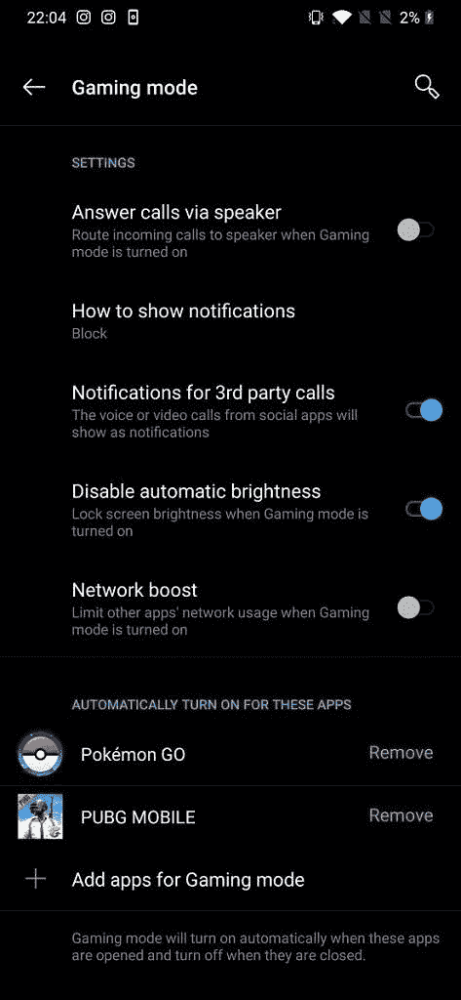
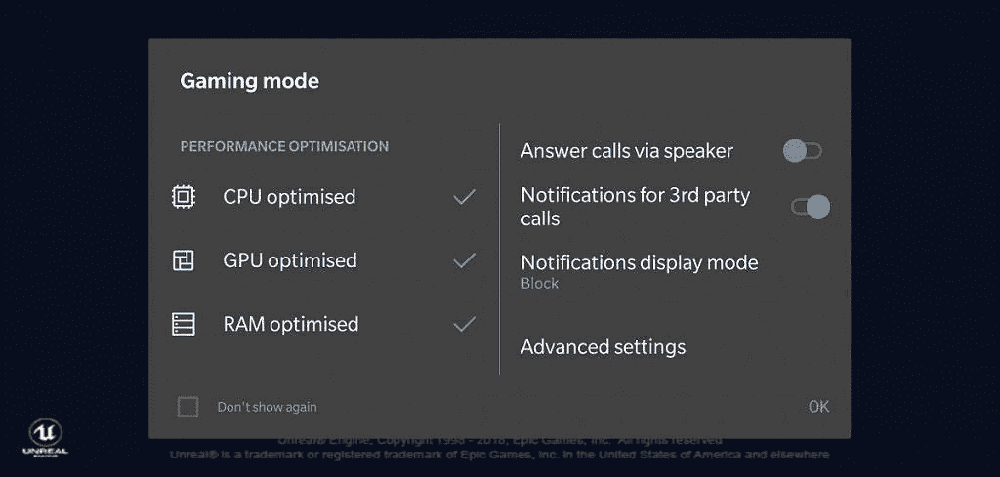

# 一加 6T 即使不是“游戏手机”，也是游戏冠军

> 原文：<https://www.xda-developers.com/oneplus-6t-gaming-performance-review/>

一加一直对他们的智能手机的速度感到特别自豪，从各方面来说都应该如此。自 OnePlus 3T T1 以来，该公司一直将速度作为他们的首要任务，这一理念一直伴随着他们从 T2 到 OnePlus 6。一加 6T 于 2018 年 11 月初上市，有一些变化，比如取消了耳机插孔，改用了更大的电池，并增加了一个显示指纹扫描仪，尽管这些都不会真正影响其前身的性能。它仍然采用相同的高通骁龙 845 芯片组，6GB/8GB 内存和 1080p 凹口显示屏。尽管如此，自 OnePlus 3 以来，一加的每款设备都表现出色，所以我们认为他们会在一加 6T 上再次取得成功。

[**一加 6T 论坛**](https://forum.xda-developers.com/oneplus-6t)

免责声明:一加将这款设备送给 XDA 用于审查目的。本文中的观点是我们自己的。

* * *

## 一加 6T 规格

| 

种类

 | 

规格

 | 

种类

 | 

规格

 |
| --- | --- | --- | --- |
| 尺寸和重量 | 157.5 x 74.8 x 8.2mm 毫米 185 克 | 随机存取存储 | 6GB/8GB LPDDR4X |
| 设计和颜色 | 玻璃(康宁大猩猩玻璃 6)午夜黑，镜面黑 | 储存；储备 | 128GB/256GB UFS 2.1 双通道 |
| 显示 | 6.41 英寸 2340 x 1080 (19.5:9)光学 AMOLED 显示屏。每英寸 402 像素。支持 sRGB 和 P3 保卫儿童国际。86%的屏幕与机身比例。显示指纹扫描仪。 | 电池 | 3，700 毫安时(不可拆卸) |
| 相机(图像) | 正面:带 EIS 的索尼 IMX 371 (16MP，f/2.0，1.0μm)。后置(主):索尼 IMX 519 (16MP，f/1.7，1.22μm)，带 OIS 和 EIS。后置(辅助):索尼 IMX 376K (20MP，f/1.7，1.0μm)。双 LED 闪光灯 | 充电 | 快速充电(5V 4A) |
| 摄像机(视频) | 前置:1080p@30、720p@30 后置:4k@30/60、1080p@30/60、720p@30 后置(慢动作):1080p@240、720p@480 | 港口 | USB 2.0，Type-C 双 nano-SIM 插槽(国际型号)单 nano-SIM 插槽(T-Mobile 型号) |
| 软件 | 基于 Android 9 Pie 的 OxygenOS 9 | 声音的 | 面向底部的扬声器。由 Dirac HD Sound 调谐的音频。迪拉克动力声。 |
| 片上系统 | 采用 Adreno 630 GPU 的高通骁龙 845 CPU(4 个 2.8 GHz Kryo 385+4 个 1.8GHz Kryo 385) | 多媒体编解码器支持 | 音频播放:MP3、AAC、AAC+、WMA、AMR-NB、AMR-WB、WAV、FLAC、APE、OGG、MID、M4A、IMY 音频录制:WAV、AAC、AMR 视频播放:MKV、MOV、MP4、H.265(HEVC)、AVI、WMV、TS、3GP、FLV、WEBM 视频录制:MP4 图像查看:JPEG、PNG、BMP、GIF 图像输出:JPEG |

## 高通骁龙 845 和 Adreno 630 GPU

一加 6T 的大部分原始功率来自其片上系统，这就是为什么它应该与 OnePlus 6 具有几乎相同的性能。两款设备之间的任何差异都纯粹是因为测试中的细微变化，以及该公司可能随着时间的推移而进行的任何软件优化。骁龙 845 拥有增强的 Adreno 630 GPU，其性能比上一代产品提高了 30%，效率也提高了 30%。移动游戏现在处于一个很好的位置，像 PUBG 和堡垒之夜这样的游戏正在崛起，像 Dolphin Emulator 这样的模拟器是他们有史以来最好的。其他游戏，如沥青，死亡触发，和新的[使命召唤:战争传说](https://www.xda-developers.com/download-call-of-duty-mobile-android-beta/)也在你的口袋里提供一些有趣的游戏体验，一加 6T 应该像冠军一样处理它们。一加 6T 拥有 1080p 显示屏，有助于减轻游戏负载，但少数游戏的图形保真度略有下降。

## 第一印象

由于电池更大，一加 6T 比 OnePlus 6 重得多。很重，但不算太重*。这实际上是我比 OnePlus 6 更喜欢的东西，OnePlus 6 有时感觉太轻了，我担心它会从我手中飞出。一加 6T 的重量使它感觉更强，更高档。这是一个小东西，但它是我把它从盒子里拿出来时首先注意到的东西之一。*

 *一加 6T 在顶部有一个水滴凹槽，几乎不妨碍屏幕显示。底部边框也进一步缩小，使手机的屏幕与机身的比例达到令人震惊的 86%。宽屏显示器非常适合玩游戏，尽管长时间在横向模式下使用会有点长。这样握着时，很难点击屏幕的中心。

一加显然对一加 6T 的设计感到自豪，就像他们对 OnePlus 6 一样。一加 6T 在背面底部具有相同的“一加设计”品牌。这款设备外观时尚，拿在手中感觉很舒服。我对这个设计唯一的问题是它的长度。这是我仅有的几部手机之一，我真的觉得有必要使用像[可达性光标](https://www.xda-developers.com/use-tall-android-phone-one-handed/)这样的应用。有了 Razer Phone 2 和小米 Mix 2S，我不需要额外的帮助。这是一个伟大的设计，但我只是觉得它对我来说有点太高了。

## 游戏性能

*使用 [GameBench](https://gamebench.net) 记录的游戏帧率数据，这是一项出色的服务，可以帮助您分析 Android 和 iOS 上的游戏性能。GameBench 有桌面客户端和移动客户端。我们使用 Android 手机客户端进行审查。*

### PUBG 移动

PUBG 是 Android 上最具竞争力的游戏之一。对于一个技术决定一切的游戏来说，高性能是必须的，因为你不想让任何东西妨碍你玩游戏。这些游戏对于一个公司来说是最重要的，而一加 6T 几乎达到了完美。

*一加 6T PUBG 帧速率随时间变化*

一加 6T 在我的 PUBG 游戏中保持了令人难以置信的稳定的 FPS。只有在地图加载的时候，我才看到丢帧，以及我最后死去的时候。在实际播放时，没有明显的帧丢失，似乎低于 39 FPS。PUBG Mobile 的性能比我用 Razer Phone 2 得到的要好，这是一款面向手机游戏玩家的手机。**一加 6T 在 PUBG 的表现给我留下了难以置信的印象。**

然而，这些结果应该有所保留。请记住，Razer Phone 2 的分辨率为 1440p，这意味着它比一加 6T 的像素高得多。这对一加有利，因为较低分辨率的显示器对 GPU 的负担会更轻，从而提供更稳定的帧速率。

### 沥青 9

*沥青 9 帧速率随时间变化*

沥青 9 不是一个我非常喜欢的游戏，但它是一个图形密集型游戏，一加 6T 可以轻松应对。你在上面看到的丢帧是在地图加载期间，FPS 自然坦克。一旦地图被加载，你可以看到帧速率非常一致。表现是一流的，我在这里没有任何抱怨。

### 海豚模拟器

我在一加 6T 上测试了任天堂 Wii 上的*超级粉碎兄弟之争*，它运行得非常完美。几乎所有的丢帧都与地图加载有关，尽管游戏整体上有一两个下降。尽管如此，它的效果还是令人惊讶的好，通过 Xbox 控制器(或其他控制器)在一加 6T 上模拟游戏是非常可能的。我还尝试了 GameCube 游戏*辛普森一家:打了就跑*，它运行得几乎完美。有时会有很多速度变慢的情况，但是我从来没有努力去优化 Dolphin Emulator，如果仿真游戏让你的设备很累的话，你应该做点什么。因此，一加 6T 应该很少甚至没有任何针对 Android 优化的现代仿真器的问题。

在一加 6T 上玩游戏是一种很棒的体验，它实际上可以运行一些游戏手机，如 Razer Phone 2，至少在 PUBG Mobile 上是这样。有了 Dolphin Emulator，两者更加势均力敌，尽管当两个设备在整个游戏过程中保持稳定的帧率时，这几乎无关紧要。一加 6T 是一款功能强大的设备，基本上可以运行你扔给它的任何安卓游戏，这是最重要的。它与市场上的任何其他旗舰产品一样具有旗舰处理器，Adreno 630 GPU 仅次于新推出的[高通骁龙 855](https://www.xda-developers.com/qualcomm-snapdragon-855-performance-gaming-ai-improvements-explained/) 中的 Adreno 640。

## 内存管理

由于积极的内存优化，一加从 OnePlus 3 开始就有内存管理问题，但我个人可以说**我在我的一加 6T 上获得通知或保持打开的应用程序和游戏**没有问题。打开一个游戏，切换到网页浏览器，稍后再回到游戏，这是完全可能的。在应用程序之间切换轻而易举，对于 8GB 内存的设备来说也是如此。即使在玩游戏的时候，我也可以听音乐、在 Facebook Messenger 上聊天以及在应用程序之间切换，没有任何问题。不可否认，对于任何 8GB 内存的旗舰手机来说，这不是一个很高的标准，但糟糕的内存管理绝对会破坏用户体验，所以一加 6T 必须做到这一点。

## 存储速度

存储速度是性能最重要的方面之一。它与原始处理能力一样重要，因为缓慢的存储将妨碍应用程序和文件加载时间，并将使游戏在试图获取游戏资产时断断续续。这显然是**一加在制造一加 6T** 时关心的另一件事，因为 AndroBench 的结果显示该设备优于 Razer Phone 2 *。*

* * *

## 电池寿命和温度

与 OnePlus 6 相比，一加 6T 的主要升级之一是电池容量增加了 400mAh。由于内置指纹传感器，一加 6T 比 OnePlus 6 略厚，这意味着该公司还[移除了耳机插孔，并增加了电池尺寸](https://www.xda-developers.com/oneplus-6t-no-headphone-jack-type-c-bullets/)以进行补偿。我不确定这是否值得，因为我更喜欢耳机插孔和普通的指纹传感器。尽管有这些权衡，我还是承认一加 6T 的电池续航时间非常出色——至少在基准测试中是这样。首先，看看下面的 PCMark 基准测试。

对于 PCMark 的基准测试来说，这是一个非常好的结果，因为设备可以与之斗争。Razer Phone 2 在切换到 60Hz 模式时，达到了 7 小时 32 分钟，尽管有更大的电池，但仍略落后于一加 6T。然而，基准并不是一切，真实世界的使用才是最重要的。那么，我的情况怎么样？

一加 6T 的电池续航时间非常好，我也听 XDA 门户团队的很多成员说过同样的话。我们的主编米莎尔·拉赫曼写道，在他使用的第一周，他就能按时获得 9 到 10 个小时的屏幕。我没有达到那样的高度，但我是手机的重度用户，所以这并不奇怪。看看下面我的电池状态，我会带你看看我一天的使用情况。

对我来说，典型的一天使用情况可能与其他人定义的典型情况相去甚远，尤其是我经常通勤。那天我并没有特别频繁地使用我的手机*，但是在基本上没有任何信号的情况下，我还是会偶尔使用它。我没有信号的事实有点奇怪，因为**我有过比一加 6T** 保留信号更好的设备，但[这份爱尔兰报告](https://www.xda-developers.com/report-best-worst-smartphones-call-reception/)似乎同意我的观点，即一加 6T 可能是最大的问题。*

我在 Facebook Messenger、Snapchat 和 Reddit 上花了很多时间。我也做一些简单的网页浏览，偶尔看看 YouTube，大部分时间 Spotify 都在后台播放。从各方面考虑，一加 6T 在这里的表现相当不错，因为它的电池续航时间为 13 个小时。这与我被告知的 9 到 10 小时的屏幕时间相差甚远，但这仍然是可以接受的，坦率地说，高于许多竞争对手提供的平均水平。市场上仍有电池续航时间更长的设备，比如小米 Mix 2S，但不可否认的是，这些设备很少。一加 6T 确实有很好的电池寿命，我刚刚得到了更好的。除非你像我一样是一个手机重度用户，否则你可能会对典型的日常使用感到满意。

但对于一部我可能想用来玩游戏的手机来说，电池寿命是我关心的一个问题。就像 Razer Phone 2 的情况一样，如果我想在玩的时候给手机充电，并戴上耳机，会发生什么情况？鉴于一加 6T 不是作为游戏手机销售的，它在某种程度上得到了认可，但它似乎仍然有点像是一个疏忽。一加显然正在推动他们的智能手机向游戏/性能方向发展，特别是他们已经推出了游戏模式。在没有耳机插孔的情况下向那个方向推它对我来说似乎很奇怪，但至少一加 6T 充电很快。一加的快速充电(以前被称为 Dash Charge)在这里，它在大约半小时内充电到 60%。曲速充电 30 是镇上的新话题，但它只适用于高级[迈凯轮版](https://www.xda-developers.com/oneplus-6t-mclaren-edition-warp-charge-30-10gb-ram/)。

## 一加游戏模式

 <picture></picture> 

OnePlus Gaming Mode options

一加的游戏模式没有竞争对手提供的那么好，因为没有那么多功能。以下是它目前可以做的事情:

*   通过扬声器接听电话
*   自定义通知(这样您就可以在播放时阻止通知标题)
*   来自 WhatsApp 等第三方应用的来电可以显示为通知
*   可以禁用自动亮度
*   限制其他应用程序的网络使用

这里没有什么真正独特的，但这些功能仍然会受到手机游戏玩家的赞赏。话虽如此，游戏智能手机通常有更多的选择，最明显的是选择智能手机在玩游戏时的时钟速度。来自其他原始设备制造商的一些游戏调谐器也让你选择分辨率或限制帧率，这是我们希望在一加的游戏模式中看到的。

 <picture></picture> 

When launching a game, you're greeted with this screen.

该公司继续完善和更新他们的游戏模式，所以这些功能可能会在未来添加。说一加游戏模式是一个糟糕的功能是很苛刻的——它比什么都没有好得多**，这是 Android/Pixel 软件所提供的。我只是认为一加的竞争对手在这方面更胜一筹。**

 **## 一加 6T 不是一款游戏手机，但它的性能却很像

一加 6T 对我来说有点奇怪。这是一部日常使用的智能手机，而不是一部游戏智能手机，然而该公司在营销中显然将速度放在了首位。该公司过去在营销他们的设备时喜欢提到智能手机上的游戏，他们甚至为此建立了一个游戏模式。一加 6T 在几个方面比 Razer Phone 2 性能更好，但成本更低，那么为什么要选择一款价格接近两倍的设备呢？

嗯，一加 6T 拥有游戏所需的原始性能、电池寿命、内存和存储速度，但它不提供其他游戏智能手机的所有功能。你没有得到高刷新率显示器，你没有得到两个大的前置扬声器，你没有得到第一方游戏手柄配件。相反，你得到的是一部**全能的智能手机**——一个万金油，一个无所不能的大师。一加 6T 不是革命性的智能手机，但也不是坏事。仅仅因为一加 6T 不是革命性的，并不意味着你应该忽略它，它只是一部价格低于竞争对手的好手机。可以说， [OnePlus 6 是比一加 6T](https://www.xda-developers.com/oneplus-6t-vs-oneplus-6-which-to-buy/) 更好的选择，选择前者不会以任何方式牺牲性能。这些基本上是相同的设备。

有很多我不喜欢的东西让 Razer Phone 2 成为我心目中的游戏手机，但这是因为一加 6T 首先是手机，其次是游戏手机。首先，在玩游戏时，单个向下发射的扬声器太容易被我的手盖住。最重要的是，圆角也不错——只要它们不是太圆。可悲的是，一加 6T 的边角太圆了，经常会切入游戏和应用程序的 UI 元素。这似乎是一个奇怪的设计选择，因为圆角比 OnePlus 6 更具戏剧性。

一加 6T 在玩游戏时也会因为长时间的显示而受到影响。很难触及显示器的中心，这可能会使一些游戏令人沮丧。当在人像模式下使用手机玩动物穿越口袋营地或口袋妖怪 Go 等游戏时，单手使用可能会很困难，因为它是一个非常高的设备。在我的评论中，我指出 Razer Phone 2 的正面设计看起来很丑[，但它对游戏很有用。当谈到游戏时，我对一加 6T 没有什么可说的。它有一个很好的整体设计，但在一些涉及游戏的情况下，它的功能就不那么好了。](https://www.xda-developers.com/razer-phone-2-review-testing-the-battery-life-and-performance-of-the-gaming-powerhouse/)

如果将一台零售价为 549 美元的设备与一台零售价为 899 美元的设备进行比较似乎有些苛刻，那么这更多地是对一加 6T 的证明，而不是对它的诋毁。这不是一个来自一加的糟糕的设备，而是表明当一个设备成本更高时，它提供更多-这只是一个多多少的问题。一加在这方面走了捷径，以保持低成本，因为一加 6T 肯定不是专门作为游戏手机营销的。

一加 6T 是一款适合所有人的手机，而且它运行游戏的性能非常好。***