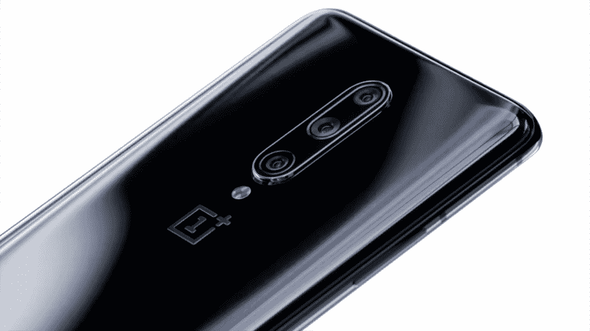

# 一加 7、一加 7 Pro、一加 7 Pro 5G 支持谷歌 ARCore

> 原文：<https://www.xda-developers.com/oneplus-7-oneplus-7-pro-google-arcore/>

# 一加 7，一加 7 Pro，一加 7 Pro 5G 现在支持谷歌 ARCore

谷歌已经正式将新推出的一加 7，一加 7 Pro 和一加 7 Pro 5G 列为其 ARCore 项目的支持。

谷歌的 ARCore 是一个漂亮的小型增强现实平台，于 2017 年发布[。ARCore 主要旨在以一种清晰统一的方式将 AR 引入 Android 设备，自推出以来，它迅速获得了关注。我们看到](https://www.xda-developers.com/project-tango-dead-google-arcore/)[的新设备](https://www.xda-developers.com/tag/arcore/)越来越频繁地被添加到[“支持的设备”列表](https://developers.google.com/ar/discover/supported-devices)中。谷歌最初的 AR 项目 Project Tango 受到硬件限制的严重限制，而 ARCore 则成功摆脱了这些束缚，无疑为其在这一过程中的成功做出了巨大贡献。

 <picture></picture> 

OnePlus 7 Pro

最近，我们已经看到像[华为 P30 和 P30 Pro](https://www.xda-developers.com/huawei-p30-pro-moto-one-vision-google-arcore-supported-device/) 、[谷歌 Pixel 3a/3aXL](https://www.xda-developers.com/google-pixel-3a-xl-arcore-android-enterprise-recommended/) 和 [LG G8 和 LG V50](https://www.xda-developers.com/arcore-1-9-lg-g8-lg-v50-scene-viewer/) 这样的设备被添加到不断扩大的支持列表中。现在，一加 7、一加 7 Pro 和一加 7 Pro 5G 也已加入。这并不奇怪，因为之前的一加设备——早在 OnePlus 3T 之前——已经在支持列表上有一段时间了。但是看到新设备继续支持总是好的。

**[一加 7 场职业 XDA 论坛](https://forum.xda-developers.com/oneplus-7-pro) | [一加 7 场 XDA 论坛](https://forum.xda-developers.com/oneplus-7)**

随着越来越多的设备得到支持，我们看到 ARCore 本身也在快速更新。增强的 Faces API 和场景查看器等新功能很可能需要一点额外的计算能力，根据我们的[性能评估](https://www.xda-developers.com/oneplus-7-pro-review-gamecube-wii-emulation/)，一加 7 和一加 7 Pro 应该可以胜任这项任务。下载 ARCore 应用程序并尝试一下，看看您可以用增强现实做些什么。

* * *

**来源:[谷歌](https://developers.google.com/ar/discover/supported-devices)**