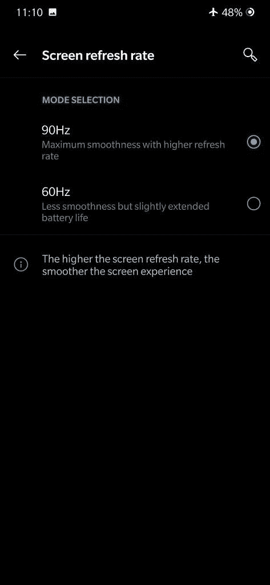

# 一加 7 专业版 90Hz 模式不是在每个应用程序中都工作-如何修复它

> 原文：<https://www.xda-developers.com/oneplus-7-pro-true-90hz-display-mode/>

我们已经将一加 7 Pro 评为 2019 年迄今为止最好的智能手机，这在很大程度上归功于它大而漂亮的 6.67 英寸 QHD+ 90Hz 有机发光二极管显示屏。虽然它的相机质量可以[肯定会提高](https://www.xda-developers.com/oneplus-7-pro-oxygenos-camera-improvements/)，新的一加旗舰肯定有最好的显示。在显示设置中，你可以选择 60Hz 和 90Hz 的刷新率，但对于视频、相机应用和电话，90Hz 模式实际上[会变为 60Hz](https://www.xda-developers.com/oneplus-7-pro-usb-pd-hdmi-variable-refresh-rate/) 。此外，/r/一加的 Redditors[发现](https://www.reddit.com/r/oneplus/comments/bvihgq/oneplus_7_pro_changes_to_60hz_when_using_another/eppgotw/)并非所有的网络浏览器都以 90Hz 运行，这表明可能存在某种内部白名单。幸运的是，似乎有一个隐藏的设置，强制一加 7 Pro 上的每个应用程序都以 90Hz 运行。它是这样工作的。

XDA 公认的贡献者 [C3C076](https://forum.xda-developers.com/member.php?u=5008415) ，广受欢迎的 GravityBox 曝光模块的开发者，正在开发一个快速设置磁贴来切换屏幕刷新率，这时[发现](https://forum.xda-developers.com/oneplus-7-pro/how-to/screen-refresh-rate-t3938576)oxygen OS 中实际上有 3 种——而不是 2 种——刷新率模式。屏幕刷新率设置中的 60Hz 模式使设备像大多数其他智能手机一样以恒定的 60Hz 运行，但 90Hz 模式实际上是内部的“自动”模式。最后，还有第三个隐藏的*真* 90Hz 模式，在所有应用程序中始终启用 90Hz。

 *一加 7 Pro 上的屏幕刷新率设置。*

要将刷新率模式更改为这种隐藏的全时 90Hz 模式，只需输入以下 ADB 命令:

```
 adb shell settings put global oneplus_screen_refresh_rate 0 
```

一旦启用，屏幕刷新率设置中的两个切换将变为未选中，显示设置中的选项摘要文本将显示“60Hz”——但这只是一个错误，因为 OxygenOS 不希望用户能够选择这种隐藏的刷新率模式。要恢复到官方支持的模式之一，只需更改显示设置中的切换。

我们通过比较在一加 7 Pro 上不支持 90Hz 的两种浏览器上进行的 [UFO 测试](https://testufo.com/)的结果，确认了这一技巧的有效性:勇敢浏览器和三星互联网。当启用“90Hz”的屏幕刷新率切换时，UFO 测试报告勇敢浏览器和三星互联网以 60Hz 运行。然而，通过 ADB 启用隐藏的真正的 90Hz 模式，两个浏览器都报告运行在 90Hz。有趣的是，像脸书和 Twitter 这样的应用程序在滚动视频时似乎不会降到 60Hz。

## 一加 7 专业版的自动 90Hz 模式是如何工作的

我们向一加寻求对这种隐藏刷新率模式的评论，以及为什么不是所有的应用程序都使用 90Hz。虽然该公司没有给我们一个官方声明，但他们告诉我们，他们不建议一直使用 90Hz，因为它带来的好处有限，但代价是更高的电池使用。他们还告诉我们他们如何决定何时在 60Hz 和 90Hz 之间切换。

根据一加的说法，大型游戏(带有 SurfaceView)、视频和摄像头将使用 60Hz，而其他场景将使用 90Hz。如果一个应用程序使用 [SurfaceView](https://developer.android.com/reference/android/view/SurfaceView) 、 [TextureView](https://developer.android.com/reference/android/view/TextureView) 或 [NativeActivity](https://developer.android.com/reference/android/app/NativeActivity) ，那么一加 7 Pro 将以 60Hz 运行。然而，也有一些特殊情况，比如谷歌 Chrome 浏览器使用了 SurfaceView，但仍然可以在 90Hz 下查看。此外，有一些游戏兼容 90Hz 刷新率，尽管我们没有这类游戏的列表。