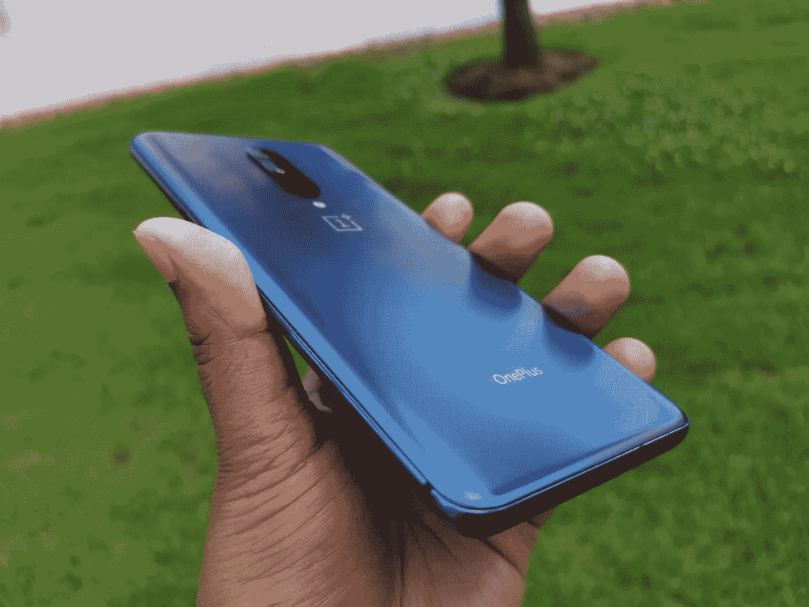

# 一加 7 Pro 最新的 HydrogenOS 测试版增加了新的返回按钮手势

> 原文：<https://www.xda-developers.com/oneplus-7-pros-hydrogenos-beta-back-gesture/>

# 一加 7 Pro 最新的 HydrogenOS 测试版增加了新的返回按钮手势

一加 7 Pro 上的 HydrogenOS beta 有一个新的手势，可以通过从屏幕侧面滑动来返回，类似于 Android Q

 <picture></picture> 

Mass Image Compressor Compressed this image. https://sourceforge.net/projects/icompress/ with Quality:95

继最近推出[一加 7](https://www.xda-developers.com/oneplus-7-update-dc-dimming-fnatic-mode/) 和[一加 7 专业版](https://www.xda-developers.com/oneplus-7-pro-review/)之后，一加一直忙于发布软件更新，修复新版本带来的各种漏洞。虽然其中一些被直接推向 oxygen OS——一加的 Android 风格——更多的实验性变化被送到 HydrogenOS。

**[一加 7 Pro XDA 论坛](https://forum.xda-developers.com/oneplus-7-pro)**

HydrogenOS 本质上是 OxygenOS 的中国版。像现在的许多程序一样，它为用户提供了一个测试通道，让他们可以提前接触到最新的功能，尽管版本可能不完全稳定。这是一个相当标准的测试程序。JelleZon 在一加论坛上提到，其中一个功能是一个新的手势，允许你通过从屏幕一侧滑动来返回。你可以在 3:30 的视频中看到这个动作。

这项功能实际上已经包含在 Android Q Beta 甚至 iOS 中，将是 OxygenOS 的一个受欢迎的新功能。一加 7 Pro 是一加迄今为止最大的手机，6.67 英寸，因此在整个屏幕上导航有时会很困难，尤其是对那些手较小的人来说。这使得某些软件按钮有时很难使用，所以像这样的快捷手势变得更加重要。

然而，有趣的是，这项功能可能很快就会变得毫无用处。上面视频中显示的手机运行的是 Android Pie，前面提到过，Android Q 默认包含了这种手势。一加已经选择在他们的测试版中包含该功能，但如果它在今年某个时候 Android Q 发布后被取代，我不会感到惊讶。

* * *

**来源:[一加论坛](https://forums.oneplus.com/threads/new-android-q-back-gesture-in-newest-hydrogen-os.1050069/)**