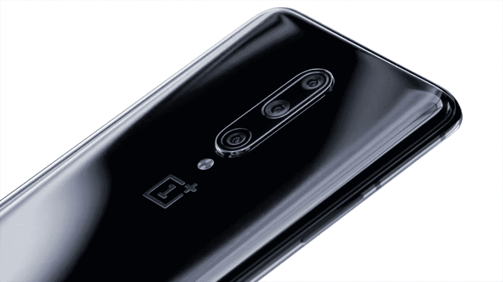

# 一加 7T -所有你可能错过的小细节！

> 原文：<https://www.xda-developers.com/oneplus-7t-verizon-support-hdmi-out-usb-pd-charging/>

一加今天在美国和印度发布了一加 7T，欧洲发布日期定在 10 月 10 日。新款一加智能手机比一加 7 Pro 便宜，预计将与谷歌的非 XL Pixel 4 竞争。与即将推出的 Pixel 4 一样，7T 也有 90Hz 的 AMOLED 显示屏，但它有另一个摄像头(广角镜头)，更大的内存(多 2GB)，更快的充电速度(Warp Charge 30T)，以及更新的高通骁龙 855 Plus。当然，规格表并不能说明全部，尤其是在用户体验方面。规格表甚至不一定列出新设备的每个细节，这就是为什么我们在今天的一加 7T 新闻中总结了一些你可能想知道的小细节和问题。

[**一加 7T 论坛**](https://forum.xda-developers.com/oneplus-7t)

* * *

## 一加 7T 软件公司

一加 7T 会在 Android 10 中支持桌面模式吗？

Android 10 中一个鲜为人知的功能是[原生支持桌面模式](https://www.xda-developers.com/android-q-desktop-mode/)。谷歌所做的是增加了当连接到辅助显示器时启动股票启动器的特殊版本的支持。谷歌也在鼓励开发者为辅助显示器优化他们的应用程序。虽然一加 7T(和一加 7 Pro)支持桌面模式，可以通过 DisplayPort 适配器镜像显示器，但 [OxygenOS 10](https://www.xda-developers.com/oxygenos-android-10-oneplus-7-pro/) 不提供自己的桌面界面。因此，桌面模式支持原则上是有的，但是它的功能还有很多需要改进的地方。

**手机会更新多少次？**

一加 7T 推出了基于 Android 10 的 OxygenOS 10，并附带谷歌应用和服务。看看[一加软件维护时间表](https://www.xda-developers.com/oneplus-software-maintenance-schedule/)，一加 7T 将获得至少 2 年的主要 Android 操作系统更新和 3 年的安全补丁更新。稳定更新每 2 个月推出一次，而测试版每几周更新一次。当然，在我们的论坛上会有来自自定义开发者社区的支持。

* * *

## 一加 7T 相机

三摄像头与一加 7 Pro 相比如何？

从视觉上看，一加 7 Pro 和一加 7T 的设计截然不同。在特色图片中，您可以看到一加 7T，其圆形摄像头凸起容纳了三个摄像头。下面，你可以看到垂直排列的三摄像头设置的一加 7 Pro。

 <picture></picture> 

OnePlus 7 Pro

然而，除了设计之外，这两款相机非常相似。以下是两款智能手机的摄像头的详细总结:

*   一加 7 专业版
    *   前面
        *   主要:带 EIS 的索尼 IMX 471 (16MP，f/2.0，1.0μm)
        *   视频:1080p@30，延时
    *   后面的
        *   主要:索尼 IMX 586 (48MP，f/1.6，1.6μm)，带 OIS 和 EIS。
        *   辅助:长焦为[3 倍无损变焦/2.2 倍光学变焦](https://www.xda-developers.com/oneplus-7-pro-telephoto-lens-3x-lossless-zoom/)，8MP，f/2.4，1.0μm，带 OIS
        *   第三代:广角，16MP，f/2.2，117
        *   视频:4k@30/60，1080p@30/60
        *   慢动作:1080p@240，720p@480
    *   双 LED 闪光灯
    *   PDAF，LAF，咖啡馆
*   一加 7T
    *   前面
        *   主要:带 EIS 的索尼 IMX 471 (16MP，f/2.0，1.0μm)
        *   视频:1080p@30，延时
    *   后面的
        *   主要:索尼 IMX 586 (48MP，f/1.6，1.6μm)，带 OIS 和 EIS。
        *   辅助:2 倍光学变焦的远摄，12MP，f/2.2，1.0μm，带 EIS
        *   第三级:广角，1600 万像素，f/2.2，117，4k@30 视频录制，通过发布后更新
        *   视频:4k@30/60，1080p@30/60
        *   慢动作:1080p@240，720p@480，720p@960 通过发布后更新
    *   双 LED 闪光灯
    *   PDAF 咖啡馆

正如你所看到的，前置摄像头、48MP 主后置摄像头和 16MP 超广角摄像头在一加 7 Pro 和一加 7T 之间是相同的。然而，7T 拍摄的照片可能会比 7 Pro 在发布日拍摄的照片看起来更好，因为一加在 7 Pro 发布后的几个月里已经[完善了图像调整](https://www.xda-developers.com/oneplus-camera-lab-tour-taiwan/)。然而，7T 有 2 倍的光学变焦，而一加 7 Pro 是 2.2 倍，7T 也没有长焦镜头的 OIS。然而，7T 将通过发布后的更新获得 720p@960 慢动作和 4k@30 广角视频录制。我们联系了一加，以确认这些功能是否将在未来的更新中用于一加 7 Pro，一旦我们得到明确的答复，我们会让你知道。

在发布会上，你可能已经看到了两个新的相机功能:超级稳定模式和 T2 微距模式。这两个功能都已经可以在一加 7 Pro 上使用，一加相机应用程序随 [OxygenOS 10 更新](https://www.xda-developers.com/oxygenos-android-10-oneplus-7-pro/)一起提供。第一个减少了你拿着手机时不必要的碰撞、摇晃和颠簸；通过广角镜头以高达 1080p 的分辨率录制视频。后者可以让你近距离拍摄 2.5 厘米-8 厘米远的物体；7T 没有专用的微距镜头，该功能在广角镜头上使用自动对焦。

一加 7T 上的超级微距模式。资料来源:一加。

夜景有什么变化吗？

一加在一加 6T 上引入了 Nightscape，让用户能够在弱光下拍摄更好的照片。随着时间的推移，算法已经被调整，但最大的变化是你可以在一加 7T 上使用广角镜头来拍摄夜景。一加 7 Pro 发布时不支持这一功能，但在后来的更新中添加了这一功能。不过，你还不能用长焦镜头捕捉夜景。

你能使用长焦或广角相机录制视频吗？

是的，这是支持的。事实上，你可以在三个镜头之间互换拍摄。这是对一加 7 专业版的增强。

* * *

## 显示

显示屏有多亮？还有其他值得注意的显示变化吗？

一加 7 Pro [在使用自动亮度时达到了 600 尼特](https://www.xda-developers.com/oneplus-7-pro-review/)的峰值亮度水平，尽管[在我们的显示器评测](https://www.xda-developers.com/oneplus-7-pro-display-review-finally-flagship-quality/)中，我们测得的峰值水平约为 570 尼特。一加表示，一加 7T 在阳光直射下的亮度高达 1000 尼特。该显示器也通过了 HDR10+认证，尽管像网飞这样的[服务有自己的设备认证流程。有趣的是，阅读模式现在支持通过“优化”饱和度、色域和对比度来显示“全色内容”您可以在单色(灰度)滤镜或新的彩色滤镜之间进行选择。](https://www.xda-developers.com/netflix-certifies-pixel-4-hd-hdr10-video-playback/)

该设备还获得了莱茵 TV 的“眼部舒适”认证，一加表示，这款手机的新“内部发光材料”可以阻挡 40%的蓝光投射，以减少夜间的眼睛疲劳。

手机支持可变刷新率吗？

一加[表示](https://www.xda-developers.com/oneplus-7-pro-usb-pd-hdmi-variable-refresh-rate/)7 Pro 和 7T 支持可变刷新率，在观看视频、使用相机应用程序或打电话时，刷新率会自动变为 60Hz。更具体地说，使用 SurfaceView、TextureView 或 NativeActivity 的应用程序会强制手机以 60Hz 的频率运行。可能会像 7 Pro 一样强制 7T 以 90Hz [运行，但我们尚未证实这一点。](https://www.xda-developers.com/oneplus-7-pro-true-90hz-display-mode/)

**有哪些游戏支持一加 7T 的高刷新率？**

据华硕称，[超过 120 款 Android 游戏](https://www.xda-developers.com/asus-rog-phone-ii-120hz-display-game-list/)可以以超过 60fps 的速度运行。这个列表并不全面，但它是我们目前最好的列表。

**显示内指纹扫描仪有改进吗？**

是的，一加说他们调整了 7T 上使用的显示指纹扫描仪，以提高识别能力。他们使用的是 Goodix 最新一代的光学传感器。据说 7 Pro 上的传感器和物理电容扫描仪一样快，所以 7T 上的传感器至少一样好，如果不是更好的话。

* * *

## 充电

他们是如何让一加 7T 的充电速度快于一加 7 Pro 的？

一加 6T 迈凯轮版推出了 Warp Charge 30，后来被一加 7 Pro 采用。Warp Charge 30 提供 5V 的 6A，实现 30W 的快速有线充电，使一加 7 Pro 的 4,000mAh 电池在 20 分钟内从 0-50%充电，在不到一个小时内从 0-100%充电成为可能。相比之下， [Warp Charge 30T](https://www.xda-developers.com/oneplus-7t-warp-charge-30t/) 为一加 7T 的 3800 毫安时电池充电的速度要快 23%。尽管曲速充电 30T 仍然在 6A/5V 下充电 30W，并且与来自一加 7 Pro 的曲速充电 30 砖块和电缆兼容。然而，速度更快的原因是因为一加降低了手机充电芯片的电阻。

一加 7T 的 Warp Charge 30T 可以让你在使用手机时保持凉爽。

**手机支持 USB 供电吗？**

可以，但是只能 5V/3A (15W)充电。7T 支持 USB 3.1 Type-C 电源。您还可以使用旧的 Dash 充电线进行 20W 充电。

**一加 7T 支持无线充电吗？**

不，7T 或任何其他一加手机都没有无线充电功能。

* * *

## 声音的

一加 7T 有双扬声器吗？

是的，它有双立体声扬声器，像一加 7 和一加 7 专业版。7T 的音频由杜比 Atmos 增强，而 6T 则由 Dirac 增强。

*在一加 7T 上，两个扬声器位于顶部挡板和右下角。*

这款手机是否配有 3.5 毫米耳机插孔转 USB Type-C 适配器？

没有。一加 6T 附带了一个加密狗，但从那以后，一加就没有加密狗了。如果你已经有一个适配器，手机支持音频直通，这意味着它使用自己的 DAC 连接音频配件。

* * *

## 保护

**它提供什么样的玻璃保护，有 IP 等级吗？**

背面玻璃由一层 Gorilla Glass 5 保护。一加表示，7T 拥有“光滑的哑光表面，散发出明亮的金属光泽。”冰川蓝和磨砂银颜色在渲染时看起来都很棒，所以希望大猩猩玻璃 5 层可以保护手机免受轻微的摔落和撞击。

与一加 7 Pro 一样，一加 7T 也没有 IP 等级。这并不意味着这款手机没有防水防尘功能，但是缺乏 IP 等级意味着你无法确定这款手机在损坏前能承受多少水或颗粒。如果少量的水溅到手机上或者手机被短暂淹没，你的手机应该没有问题，但不能保证。此外，水渍不在保修范围内，这是所有主要智能手机品牌的情况，即使是那些在其设备上宣传 IP 评级的品牌。

* * *

## 连通性

你能用威瑞森的电话吗？

是的，像一加 6T 和一加 7 Pro 一样，你可以在威瑞森的 LTE 网络上使用(未锁定的)一加 7T。只要确保你打电话给威瑞森，告诉他们你想要“无 CDMA 供应”没有它，你的短信会有问题。

**7T 支持双 sim 卡吗？**

是的，但不是在 T-Mobile 型号上。

* * *

*免责声明:一加是 XDA 的赞助商，但他们没有提供或提供任何关于本文内容的意见。*