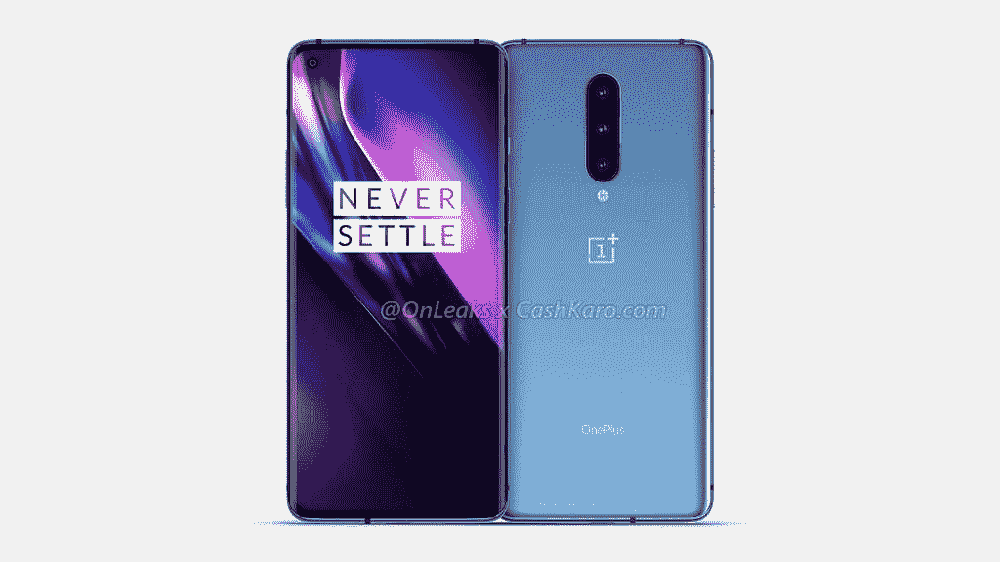

# 一加 8、8 Pro 和 8 Lite 可能在下个月推出

> 原文：<https://www.xda-developers.com/oneplus-8-8-pro-8-lite-could-launch-next-month/>

就在去年一加 7T ( [评测](https://www.xda-developers.com/oneplus-7t-review-premium-practical-smartphone/))和[一加 7T Pro](https://www.xda-developers.com/oneplus-7t-pro-launch-snapdragon-855-plus-warp-charge-30t/) ( [评测](https://www.xda-developers.com/oneplus-7t-pro-xda-review/))发布几天后，我们[开始看到关于一加下一款旗舰产品的泄露](https://www.xda-developers.com/oneplus-8-punch-hole-display-triple-cameras-leak/)——一加 8 和一加 8 Pro。当时，泄露的设备渲染图显示，该公司也在走三星的路线，并在其下一款旗舰产品中添加自拍相机的[打孔切口。我们还了解到，一加 8 Pro 将采用四摄像头设置，并且这些设备](https://www.xda-developers.com/oneplus-8-pro-leaked-renders-show-quad-camera-setup-punch-hole-display/)[可能会在威瑞森](https://www.xda-developers.com/oneplus-8-verizon-5g-ultra-wideband/)推出，支持其 5G 超宽带网络。消息不断泄露，我们还得知一加 8 系列可能是该公司第一款配备无线充电功能的智能手机，因为该公司加入了无线电力联盟。虽然该公司尚未透露其即将推出的设备的任何细节，但最近来自 *TechRadar* 的一份报告透露，一加 8 系列可能会在下个月推出。

该报道援引了一位接近该公司的消息人士的话，他透露,[一加 8](https://www.xda-developers.com/tag/oneplus8/) 系列将于 4 月的第二周亮相。消息人士表示，这将是一个全球性的公告，所以很有可能该设备将在全球同时发布。虽然消息人士没有证实将推出的设备的名称或规格，但一些消息透露，一加将在 2020 年推出三条产品线。该公司的下一个旗舰系列预计将[包括一个“精简”模型](https://www.xda-developers.com/oneplus-8-lite-leaked-renders-mid-range-phone/)，这将最有可能是一个高级中档。

 <picture></picture> 

OnePlus 8 Lite

知名泄密者 *@OnLeaks* 此前曾在分享的渲染图中发现一加 8 Lite，这表明它将采用更具棱角的设计，配备 6.4 英寸的打孔自拍相机显示屏。由于一加已经确认其未来的所有设备都将采用高刷新率显示屏，我们预计一加 8 Lite 至少会配备 90Hz 的显示屏。渲染还显示了一个三摄像头设置，一个高分辨率的主摄像头，一个超宽摄像头和一个用于人像照片的 ToF 传感器。在规格方面，据传一加 8 Lite 将采用联发科的新 Dimensity 1000 芯片组。

 <picture></picture> 

OnePlus 8

就标准的一加 8 而言，泄露的消息表明，它将采用 6.6 英寸的曲面显示屏，在左上角有一个打孔的切口，用于自拍相机。虽然一加预计将坚持 FHD+的设备分辨率，但它可能会转向更平滑的 120Hz 显示屏。该设备预计将采用三摄像头设置，包括高分辨率主摄像头、超宽摄像头和长焦摄像头。

 <picture></picture> 

OnePlus 8 Pro

最后，顶级的 Pro 版本据说将采用 120Hz 刷新率的 QHD+显示屏。一加 8 和 8 Pro 都很可能采用高通的骁龙 865 芯片，并支持 5G。这款高端设备预计将采用四摄像头设置，配有高分辨率主摄像头、超宽摄像头、长焦摄像头和 ToF 传感器。我们还预计一加将为这三款设备配备更大的电池和更快的充电速度。

* * *

**来源:[TechRadar](https://www.techradar.com/news/exclusive-oneplus-8-series-to-launch-in-mid-april)**