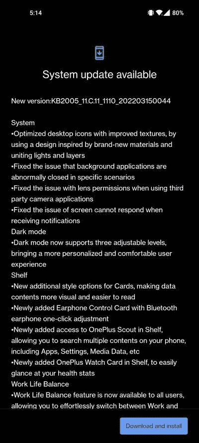

# 针对一加 8、8 Pro、8T 和 9R 的稳定 OxygenOS 12 更新正式上线

> 原文：<https://www.xda-developers.com/oneplus-8-8t-9r-stable-android-12-oxygenos-12-update/>

一加正在为一加 10 Pro 的全球发布做准备。虽然这是值得期待的事情，但现有的一加 9R 和一加 8 系车主也有值得庆幸的事情。在[为这些设备发布了基于 Android 12 的单一开放测试版](https://www.xda-developers.com/oneplus-8-8-pro-8t-android-12-oxygenos-12-open-beta-1/)之后，OEM 现在正在为一加 8、8 Pro、8T 和一加 9R 推出稳定的 OxygenOS 12 更新。

 <picture></picture> 

Thanks to OnePlus Community member [Jeff Alamo](https://forums.oneplus.com/members/jeff-alamo.851277/) for the screenshot!

稳定版的构建号为 **C.11** (针对一加 8 系)/ **C.14** (针对一加 9R)。除了 Android 12 基础，OxygneOS 12 更新的第一个明显变化是重新想象的用户界面。还有一些新的生活质量的功能和改进，如画布 AOD 和一加手表卡在货架上。不过，Android 安全补丁级别(SPL)有点老，因为一加将在 2022 年 2 月发布这些版本的安全补丁。

以下是更新的完整变更日志:

### 适用于一加 8、8 Pro、8T 和 9R 的 OxygenOS 12 稳定更新的变更日志

*   **系统**
    *   通过使用受全新材料启发的设计，并结合灯光和图层，优化了桌面图标的纹理
    *   修复了后台应用程序在特定场景下异常关闭的问题
    *   修复了使用第三方相机应用程序时的镜头权限问题
    *   修正了接收通知时屏幕无法响应的问题
*   **黑暗模式**
    *   黑暗模式现在支持三个可调级别，带来更加个性化和舒适的用户体验
*   **货架**
    *   卡片新的附加样式选项，使数据内容更直观、更易读
    *   新增耳机控制卡，带蓝牙耳机一键调节
    *   新增加的访问一加童军在货架上，允许您搜索多个内容在您的手机上，包括应用程序，设置，媒体数据等
    *   新增加的一加观察卡在架子上，可以很容易地看到你的健康状况
*   **工作生活平衡**
    *   所有用户现在都可以使用工作生活平衡功能，通过快速设置，您可以毫不费力地在工作和生活模式之间切换
    *   WLB 2.0 现在支持根据具体位置、Wi-Fi 网络和时间自动切换工作/生活模式，还根据个性化设置提供定制的应用程序通知配置文件
*   **画廊**
    *   画廊现在允许您用两个手指的挤压手势在不同的布局之间切换，智能地识别最佳质量的图片，并根据内容裁剪缩略图，使画廊布局更令人满意
*   **画布 AOD**
    *   画布 AOD 为您带来新的不同风格的线条和颜色，更个性化的锁屏体验与鼓舞人心的视觉效果
    *   新增加的多重画笔和笔触，并支持颜色调整
    *   优化的软件算法和改进的人脸识别，以更好地识别不同人物的特征和肤色
*   **网络**
    *   修正了不能自动连接无线网络的问题
*   **蓝牙**
    *   修复了在特定场景下连接蓝牙时无线耳机无法播放声音的问题

尽管这是一个稳定的版本，但是这个版本目前仅限于现有的公测参与者。此外，对于一加 8 系列，由于额外的验证要求，欧洲版本的更新还没有准备好。我们预计，稳定的 OxygenOS 12 OTA 将在未来一周向所有用户推出，除非发现任何 showstopper bugs。

**XDA 论坛:[一加 8](https://forum.xda-developers.com/c/oneplus-8.10349/) || [一加 8 Pro](https://forum.xda-developers.com/c/oneplus-8-pro.10363/) || [一加 8T](https://forum.xda-developers.com/c/oneplus-8t.11579/) || [一加 9R](https://forum.xda-developers.com/f/oneplus-9r.12183/)**

* * *

## 下载:适用于一加 8、8 Pro、8T 和 9R 的稳定 OxygenOS 12

您可以等待您的设备出现在分阶段部署中，也可以使用下面提供的下载链接下载更新。当我们得到更多的下载链接时，我们将继续更新这篇文章。

*   **一加 8**
    *   印度(2011_11 年。C.11):
    *   全球(2015_11 年。C.11):
*   **一加 8 Pro**
    *   印度(2021_11 年。C.11):
    *   全球(2025_11 年。C.11):
*   **一加 8T**
    *   印度(KB2001_11。C.11):
    *   全球(KB2005_11。C.11):
*   一加 9R

如果您希望在任何时候降级到 OxygenOS 11 版本，您可以从下面的链接下载回滚包。请记住，这将擦除您的所有数据，因此您应该在继续之前进行备份。

*   **一加 8**
*   **一加 8 Pro**
*   **一加 8T**
*   一加 9R

*感谢 XDA 公认开发者 [mlgmxyysd](https://forum.xda-developers.com/m/mlgmxyysd.8430637/) 和 XDA 资深会员 [Some_Random_Username](https://forum.xda-developers.com/m/some_random_username.8234677/) 的下载链接！*

* * *

**来源:**一加社区论坛( [1](https://forums.oneplus.com/threads/oxygenos-12-for-the-oneplus-8-series.1555055/) 、 [2](https://forums.oneplus.com/threads/oxygenos-12-for-the-oneplus-8t.1555060/) 、 [3](https://forums.oneplus.com/threads/oxygenos-12-for-the-oneplus-9r.1555039/) )