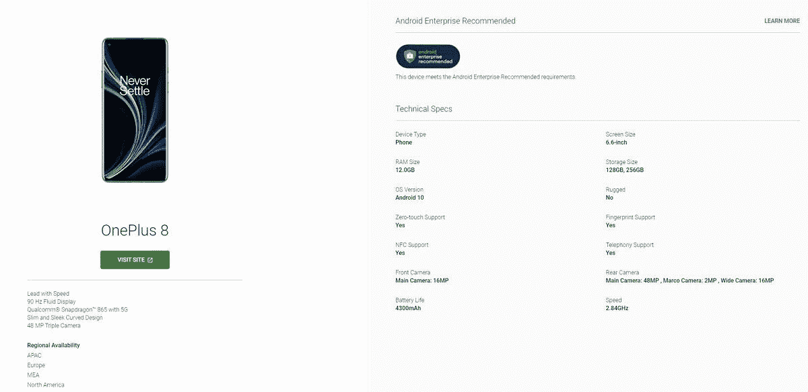

# 一加 8 是一加首款安卓企业推荐手机

> 原文：<https://www.xda-developers.com/oneplus-8-first-smartphone-android-enterprise-recommended/>

**更新 2(****09/11/2020****@****07:23AM****ET):**一加诺德也获得了 Android 企业推荐认证。

**更新 1(****08/19/2020****@****01:04AM****ET):**一加向我们确认，8 Pro 也应该获得认证，Nord 也将很快获得认证。滚动到底部了解更多信息。下面保留了 2020 年 8 月 14 日发表的文章。

今年早些时候，一加[设定了一个目标](https://www.xda-developers.com/oneplus-aims-devices-android-enterprise-recommended-this-year/),让其设备成为安卓企业推荐产品(AER)。在设定这个目标几个月后，谷歌已经[正式](https://androidenterprisepartners.withgoogle.com/device/#!/Nw4j0GG8UlfdBlscDtNG)指定一加 8 作为该计划的一部分。

谷歌[在 2018 年 2 月推出了](https://www.xda-developers.com/google-introduce-android-enterprise-recommended-program/)Android 企业推荐计划，作为创建认证设备列表的一种方式，推荐给企业向其员工推广。

截至本文撰写之时，已有 189 台设备获得了 AER 认证，一加 8 也加入了这一行列。要被纳入该计划，AER 设备必须满足[特定的软件更新要求](https://www.xda-developers.com/google-android-enterprise-recommended-security-updates-relax/)基于它们运行的任何 Android 操作系统。还必须满足某些硬件要求，包括提供 8 小时以上的电池寿命，至少 2GB 的 RAM，以及最少 32GB 的存储空间。

[一加 8](https://forum.xda-developers.com/oneplus-8) 比那些[更符合硬件要求](https://www.xda-developers.com/oneplus-8-pro-specifications-features-pricing-availability/)；这款旗舰设备的内存高达 12GB，存储容量高达 256GB，电池容量为 4，300 毫安时，电池续航时间充足。一加还承诺提供三年的双月安全更新以及两年的主要操作系统更新。

截至目前，只有一加 8 似乎是 AER 认证。我们已经联系了一加，看看一加 8 Pro 和 T2 一加 Nord 未来是否也会获得 AER 认证。

*感谢 XDA 会员 [Some_Random_Username](https://forum.xda-developers.com/member.php?u=8234677) 的提示！*

* * *

## 更新:一加 8 专业版和一加诺德也是安卓企业版推荐产品

据一加美国公关公司称，一加 8 Pro 也是 Android 企业推荐的产品，而一加 Nord 将在不久的将来获得认证。AER 设备必须满足[特定的软件更新要求](https://www.xda-developers.com/google-android-enterprise-recommended-security-updates-relax/)基于它们运行的任何 Android 操作系统。到目前为止，2020 年一加的三款手机似乎都符合这些要求。

* * *

## 更新 2:一加诺德获得安卓企业推荐认证

一加诺德公司[也获得了](https://androidenterprisepartners.withgoogle.com/device/#!/q70eFx4pYkO7lL4ja9xs) Android 企业推荐认证。

*感谢 XDA 会员 [Some_Random_Username](https://forum.xda-developers.com/member.php?u=8234677) 的提示！*