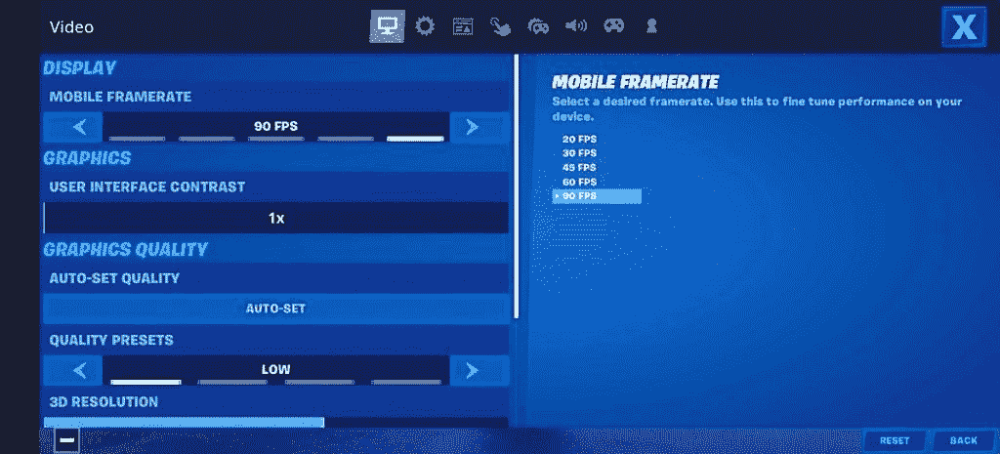

# 一加 8 和一加 8 专业版获得堡垒之夜 90fps 游戏

> 原文：<https://www.xda-developers.com/oneplus-8-pro-fortnite-90hz-fps-graphics/>

《堡垒之夜》是一款皇家对战游戏，有着特殊的障碍和挑战，大大增加了游戏的难度。最重要的是，如果你是游戏新手，它生动的视觉效果不仅能刺激你，还能让你不知所措。但与其他移植到手机上的游戏不同，堡垒之夜的手机版几乎是桌面/游戏机版的完美翻版。虽然这可能会让堡垒之夜爱好者感到兴奋，但这使得游戏对智能手机的硬件要求非常高，这也是为什么大多数设备的游戏速度都被限制在 30fps。对于少数功能强大的设备，包括三星旗舰产品 T1、一加 7T、T2 小米的米 9 T3、iPhones 等，堡垒之夜开发商 Epic Games 允许高达 60fps 的帧速率。但是 Epic Games 第一次增加了 90fps 游戏的选项，它将只适用于[一加 8(评测)](https://www.xda-developers.com/oneplus-8-xda-review/)和[一加 8 专业版(评测)](https://www.xda-developers.com/oneplus-8-pro-review-never-settle-on-hardware/)。

**[一加八大论坛](https://forum.xda-developers.com/oneplus-8)**| |**|[一加八大论坛](https://forum.xda-developers.com/oneplus-8-pro)**

Epic Games 与一加建立了特殊的合作伙伴关系，让这一切成为可能。尽管这种骁龙 865 和 90Hz(或更高)刷新率的组合并不是一加 8 系列独有的，但该公司的声明明确表示，这是唯一支持 90fps 堡垒之夜游戏的手机。该公司聪明地选择了“第一次在手机上以 90 帧/秒的速度运行”这个词，因为苹果的 iPad Pro 已经可以以 120 帧/秒的速度运行堡垒之夜了。今年晚些时候，当苹果推出据称具有 120 赫兹显示屏的 iPhone 12 系列时，这种说法可能不会成立，但在那之前，它确实成立——而且表现非常好。

然而, [*Gamespot*](https://www.gamespot.com/articles/fortnites-new-90-fps-feature-on-oneplus-phones-off/1100-6477692/) 指出了在一加旗舰上以 90fps 运行游戏的注意事项，这是图形方面的限制。如果您在一加 8/8 专业版上选取 90fps 作为帧速率，显示质量将默认恢复为低。因此，虽然这意味着你有一个更流畅的体验，但游戏场景中的细节只会在你靠近它们时才会呈现。有 100%的分辨率缩放，这意味着当你在那个设置下玩堡垒之夜时，你会看到山脊线。

 <picture></picture> 

Fortnite settings on OnePlus 8 Pro. Image by Max Weinbach/XDA-Developers

老实说，与 60fps 相比，更流畅的游戏可能会更悦目，但在提高技能方面却没那么有用。也就是说，你绝对可以尝试一下这个特性，看看它是否适合你。

**[预购一加 8/8 Pro](https://www.amazon.in/b/?node=21439725031&tag=xdaportalin-21)**

Epic Games 最终做出了让步，[最近在谷歌 Play 商店](https://www.xda-developers.com/epic-games-gives-in-and-finally-puts-fortnite-on-the-google-play-store/)上推出了堡垒之夜，此前两年它一直不为人知(并且只限于 Epic 自己的应用程序)。但与一加的合作意味着拥有这两款旗舰机的用户将少一步下载游戏。你将在一加的游戏空间中获得一个存根，允许一键安装过程。在与一加的一份联合新闻简报中，Epic Games 的创始人兼首席执行官蒂姆·斯维尼表示，“*一键轻松安装确实简化了安装软件的过程，并消除了其他 Android 设备上通常存在的摩擦。*

你认为 90fps 的游戏在其他设备上也应该可用吗？请在下面的评论中告诉我们。